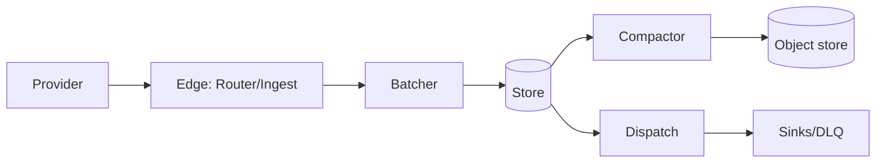

# Agent notes

Ankusa is a self-hosted webhook receiver (Elixir/OTP): write every hook to a
durable local store before answering `2xx`, then dispatch it to
HTTP/RabbitMQ/Kafka/NATS sinks with retries, DLQ, and replay. Full pipeline and
guarantees: [`docs/architecture.md`](docs/architecture.md).

## Repo map

| Path | What |
| --- | --- |
| `packages/ankusa` | Core Mix project: edge/store/storage/dispatch machinery + every zero-external-dep default adapter. No adapter deps (`bandit`, `plug`, `cidr`, `req`, `aws_signature`, `rocksdb`, `telemetry_metrics`/`telemetry_metrics_prometheus_core`, `nebulex`/`nebulex_local`, `async_api_spex` only). |
| `packages/ankusa_rabbitmq`, `ankusa_kafka`, `ankusa_nats` | One sink adapter each (`Sink.RabbitMQ`/`Kafka`/`NATS`), path-depend on `ankusa` + one broker client (`amqp`/`brod`/`gnat`). Own `docker-compose.yml` for local broker infra. |
| `packages/ankusa_redis` | Redis adapters: the route store (`Ankusa.Routes.Store.Redis` — definitions in Redis, shared by every edge node) and the pub/sub sink (`Ankusa.Sink.Redis`). Path-depends on `ankusa` + one client (`redix`). Own `docker-compose.yml` (Redis on `:6399`). |
| `packages/async_api_spex` | Generic AsyncAPI 3.0 library, no Ankusa code (structs, `use AsyncApiSpex.Schema`/`Message`/`Channel`/`Spec` — the last three decorate an app's existing structs and publishing modules into a document — validator, `AsyncApiSpex.Plug.RenderSpec`, `mix async_api_spex.gen`). Core depends on it for `Ankusa.AsyncApi`; every project that path-depends on core and builds in `:prod` (the adapters, `ankusa_server`, the examples) pins it by path with `override: true`. Publish it to Hex before core. |
| `conformance/` | Language-neutral SDK vectors (`features.json`, `cases/*.json`) and the checker (`check.mjs`) every `packages/sdk-*` must pass; `mise run check:conformance`. |
| `packages/ankusa_server` | The `jamescarr/ankusa` Docker image: core + every adapter, driven entirely by YAML (`config.ex` is the loader). Not published to Hex. |
| `packages/sdk-typescript`, `sdk-python`, `sdk-rust`, `sdk-ruby`, `sdk-go`, `sdk-php`, `sdk-elixir`, `sdk-java`, `sdk-clojure` | Published client SDKs (npm `ankusa`, PyPI `ankusa`, crates.io `ankusa`, RubyGems `ankusa-sdk`, Go module `github.com/jamescarr/ankusa/packages/sdk-go`, Packagist `jamescarr/ankusa`, Hex `ankusa_sdk`, Maven Central `io.github.jamescarr:ankusa-sdk`, Clojars `io.github.jamescarr/ankusa-clj`) for writing worker consumers. |
| `examples/*` | Runnable Docker-composed demos, one per delivery transport; see [`examples/README.md`](examples/README.md). |
| `tools/loadgen` | Load generator used by the `oban-consumer` example. |
| `docs/*` | Prose docs, see table below. Index: [`docs/README.md`](docs/README.md). |
| `.mise/tasks/*` | Every CI/dev task, one file each (see Commands below). |

Why the package split (and when a new adapter earns its own package):
[`docs/packaging.md`](docs/packaging.md).

### `packages/ankusa/lib/ankusa` — core module map

| Stage | Modules |
| --- | --- |
| Edge (ingress) | `edge/router.ex`, `edge/ingest.ex`, `edge/batcher.ex` + `batcher_supervisor.ex`, `edge/publish.ex`, `edge/quarantine.ex`, `edge/rate_limiter.ex`, `edge/route_guard.ex`, `dedupe.ex`, `route.ex`, `route_resolver.ex`, `verifier.ex` + `verifier/{hmac,none,schemes}.ex` |
| Queue / store (durability) | `queue.ex`, `queue/writer.ex`, `queue/{deliveries,reclaim,archive}.ex`, `store.ex`, `store/{keys,migrate}.ex`, `store/backup.ex` (checkpoint upload + boot restore), `fsync.ex` |
| Storage (compaction + blobs) | `storage.ex`, `storage/compactor.ex`, `blob_store.ex`, `blob_store/{local_fs,s3,gcs,azure,oci}.ex`, `blob_store/azure/managed_identity.ex` |
| Dispatch (sinks, retries, DLQ) | `dispatch/pipeline.ex`, `dispatch/replayer.ex`, `replay.ex`, `sink.ex`, `sink/{log,http,message,description,sqs,google_pubsub}.ex`, `retry_policy.ex`, `retry_policy/exponential.ex` |
| Claim check (large payloads) | `claim_check.ex`, `claim_check/{pack,ref,router,sweeper}.ex` |
| Route management | `routes.ex`, `routes/{route,matcher,snapshot,cache,router,store}.ex`, `routes/store/ets.ex`, `net.ex`, `net/client_ip.ex` |
| Ops / cross-cutting | `application.ex`, `config.ex`, `instance.ex` + `instance/{isolated,registry_watch}.ex` (failure domains, registry watch), `source.ex`, `source_store.ex` + `source_store/persistent.ex`, `lifecycle.ex` + `lifecycle/publisher.ex`, `async_api.ex` + `async_api/schemas.ex`, `envelope.ex`, `codec.ex` + `codec/raw.ex`, `admin/router.ex`, `admin/redact.ex`, `telemetry.ex`, `metrics.ex`, `http.ex`, `http_client.ex`, `aws/credentials.ex` (AWS credential chain for S3 and SQS), `ulid.ex`, `uuid_v7.ex` |

`packages/ankusa_server/lib/ankusa_server`: `application.ex`, `cli.ex`,
`config.ex` (YAML → core config), `config_error.ex`, `gcp_token.ex`.

### Docs index

| Doc | Read it when |
| --- | --- |
| [`quickstart.md`](docs/quickstart.md) | run it with a worker, break the worker, replay |
| [`configuration.md`](docs/configuration.md) | every YAML key, and the Elixir config |
| [`deployment.md`](docs/deployment.md) | roles, the container, fleets |
| [`architecture.md`](docs/architecture.md) | the guarantees, the request path |
| [`delivery.md`](docs/delivery.md) | sinks, retries, DLQ, quarantine |
| [`storage.md`](docs/storage.md) | the node's store and the object stores |
| [`claim-check.md`](docs/claim-check.md) | large payloads to queue workers |
| [`multi-tenancy.md`](docs/multi-tenancy.md) | catch URLs per customer |
| [`integrations.md`](docs/integrations.md) | Oban, Celery, queues |
| [`asyncapi.md`](docs/asyncapi.md) | the AsyncAPI document an instance serves, and lifecycle events (endpoint/route created, updated, deleted) |
| [`elixir.md`](docs/elixir.md) | embed the library in your own app |
| [`testing.md`](docs/testing.md) | running the suites, local infra, what each one covers |
| [`packaging.md`](docs/packaging.md) | why adapters are separate packages, and how to add one |
| [`critical-review.md`](docs/critical-review.md) | the 2026-10 end-to-end review: findings by root cause, and which are fixed |
| [`releasing.md`](docs/releasing.md) | releasing any package: Hex (core, adapters, and the Elixir SDK), the server image, npm, PyPI, crates.io, RubyGems, Go, Packagist, Maven Central, or Clojars |

Exact callback signatures and options: module docs on [HexDocs](https://hexdocs.pm/ankusa).

## Commands

`mise install` once for the pinned toolchain: repo-wide tools in `.mise.toml`,
each SDK's own toolchain in `.mise/conf.d/<package>.toml`. A new SDK adds its
fragment and leaves `.mise.toml` alone, so parallel SDK PRs don't conflict.
All tasks live in `.mise/tasks/` (one file each); `mise tasks ls` lists every
one; CI runs the same tasks this table does.

| Task | What |
| --- | --- |
| `mise run check` | everything CI checks, every package/example/tool |
| `mise run check:package <pkg>` | one package: format, warnings-as-errors, tests, docs; starts/stops that package's own `docker-compose.yml` |
| `mise run check:examples` | `examples/*` |
| `mise run check:tools` | `tools/*` |
| `mise run check:conformance` | validate `conformance/` and run every `packages/sdk-*` against its vectors |
| `mise run test:integration` | `ankusa` core's object-store adapters vs. the floci emulators |
| `mise run e2e` | kind + Oban end-to-end gate (needs `docker`; `kind`/`kubectl` from `.mise.toml`) |
| `mise run format` | `mix format`, `gofmt`, google-java-format, and cljfmt across every package — run before pushing, not after CI complains |
| `mise run deps` | refresh every `mix.lock` after adding/removing a core dependency |
| `mise run new:adapter <name>` | scaffold `packages/ankusa_<name>/` |
| `mise run status` | every package's version, last tag, published or not |
| `mise run docker:smoke` | build `jamescarr/ankusa:dev`, run `packages/ankusa_server/scripts/smoke.sh` against it |

## Run the checks before calling work done

Format, warnings-as-errors, and tests — for **every** package the change
touches, not just the one you edited. Every adapter package and
`ankusa_server` path-depend on `ankusa` core, so a core change isn't finished
until they pass too.

| What changed | Run |
| --- | --- |
| a package under `packages/` | `mise run check:package <pkg>` for every touched package (all of them for a core change) |
| `examples/*` | `mise run check:examples` |
| `tools/*` | `mise run check:tools` |
| an SDK (`packages/sdk-*`) or `conformance/` | `mise run check:conformance` (also part of `mise run check`) |
| core's object-store adapters | `mise run test:integration` |
| anything, before tagging a release | `mise run e2e` |
| everything | `mise run check` |

Changing core's dependencies touches every package that path-depends on it, so
after adding or removing one, run `mise run deps` and commit every `mix.lock`
it changes. CI runs `mix deps.get --check-locked` and
`mix deps.unlock --check-unused` everywhere — including the examples — so a
`deps.get` that rewrites a stale lock, or a lock entry for a dependency nobody
declares, fails the build instead of passing quietly. `mix hex.audit` runs
beside them, so a locked version with a published advisory fails it too.

What each suite covers: [`docs/testing.md`](docs/testing.md).

Working on something that needs a browser or a running system? Exercise the
real thing (or a throwaway script against it) — see the verification
requirements in the project brief.

Two rules that follow from all of the above:

- **Never report a check as passing unless it ran in this session.** "It
  should work", "the code looks right", and a hand-written log line are not
  evidence.
- **Never mark a task done while its own acceptance criteria fail** — a
  step that crashed, or a drill that was never run, is not done. Say what
  failed and what's still open.

## Dependencies

**Take the dependency when it is the right tool.** Judge it on merit: is the
library more correct, better tested, and less surface for us to own and be wrong
about than the code it replaces? Then use it. "Zero dependencies" is not a goal,
and refusing a good library to keep a count at zero is not a principle — it is
how you end up maintaining hand-rolled SigV4 signing.

The rule that *does* hold is about placement: a dependency only some deployments
need goes in its own adapter package, so nobody else's `mix deps.get` compiles
it. A dependency every user benefits from belongs in `ankusa` core. Full decision
rule, and the worked examples: [`docs/packaging.md`](docs/packaging.md).
