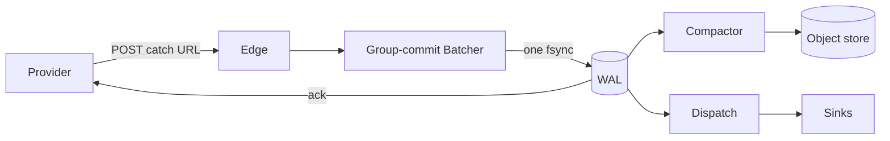

# Ankusa

[](https://hex.pm/packages/ankusa)
[](https://hex.pm/packages/ankusa)
[](https://hexdocs.pm/ankusa)
[](https://github.com/jamescarr/ankusa/actions/workflows/ci.yml)
[](LICENSE)
[](https://elixir-lang.org)
[](https://github.com/jamescarr/ankusa/stargazers)

A loosely coupled, high-throughput webhook ingestion framework for Elixir.


Catching webhooks sounds easy. Doing it without losing one is not. Ack before
you save and a crash drops the event. Ack after and you face timeouts, retries,
and duplicate deliveries. Add signatures, dedup, backpressure, and replay, and
one endpoint becomes a distributed systems problem.

## The name

अंकुश (aṅkuśa) is Sanskrit for "hook" or "goad": the curved tool a mahout uses
to steer an elephant. Its root, aṅka, means "to bend" or "curve".

Webhook traffic behaves like the elephant. It is large, it arrives on its own
schedule, and it will not wait for you. Ankusa absorbs it durably and fast (the
WAL and batcher), then steers where it goes next through routing, dedup, and
dispatch.



## What this is

Ankusa is the front door for a webhook catch endpoint, whether that is one
operator's laptop, a shared ingest fleet inside a multi-tenant SaaS, or a
product that mints opaque catch URLs of its own shape at runtime. The same code
runs in all three cases; only the config differs.

Every layer (URL routing, the durable log, verification, dedup, object storage,
delivery) is a behaviour configured with `{module, opts}`, so you can replace
one without forking. [`docs/architecture.md`](docs/architecture.md) covers the
"durable state, not RPC" rule that keeps this true across separate BEAM nodes
and separate adapter packages.

## Repo layout

A mono-repo of separate Mix projects:

```text
.                    ankusa core. mix.exs deps: {bandit, plug, req, aws_signature}.
ankusa_postgres/     shared, multi-node WAL (Postgres). Path-dep on ankusa + postgrex.
ankusa_rabbitmq/     queue delivery (RabbitMQ exchange publish). Path-dep on ankusa + amqp.
ankusa_kafka/        queue delivery (Kafka topic produce). Path-dep on ankusa + brod.
examples/            deployable demos (Docker Compose, not published packages)
docs/                everything below, in depth
```

The adapter packages exist so that `mix deps.get` on `ankusa` alone never
fetches `postgrex`, `amqp`, or `brod`, whose `crc32cer` NIF needs CMake and a C++
compiler to build. A dependency that benefits every user still belongs in core;
the split only keeps out the ones some deployments do not need. Full rationale
and the rule for adding an adapter: [`docs/packaging.md`](docs/packaging.md).

## Quickstart

```sh
mix deps.get
iex -S mix               # starts on :4000 with a zero-config `demo` source

curl -XPOST localhost:4000/webhooks/demo -H 'content-type: application/json' -d '{"id":"evt_1"}'
# => {"id":"01a0...","status":"accepted","seq":1}   (returned only after the WAL fsync)
```

The full walkthrough, including idempotency, inspecting state, and pointing a
real provider at it: [`docs/quickstart.md`](docs/quickstart.md).

## Pluggable behaviours

| Behaviour | Job | Default | Also shipped |
| --- | --- | --- | --- |
| `Ankusa.RouteResolver` | Catch-URL scheme → `%Route{tenant_id, source_id}` | `RouteResolver.Path` (`/webhooks/:source_id`) | `RouteResolver.TenantPath` (`/webhooks/:tenant/:source`) |
| `Ankusa.WAL` | Durable ack, ordered log, truncation | `WAL.DiskLog` (fsync group commit) | `WAL.Postgres` (shared, multi-node, in `ankusa_postgres`) |
| `Ankusa.Verifier` | Signature/timestamp checks | `Verifier.None` | `StandardWebhooks`, `Stripe`, `GitHub` |
| `Ankusa.DedupKey` | Extract provider event id | `DedupKey.Rules` (header/JSON path) | `Stripe`, `GitHub` |
| `Ankusa.SourceStore` | Source config, secrets, policy | `SourceStore.Static` | none |
| `Ankusa.Sink` | What happens to a delivered hook | `Sink.Log` | `Sink.Http` (Req forward), `Sink.RabbitMQ` (exchange publish, in `ankusa_rabbitmq`), `Sink.Kafka` (topic produce, in `ankusa_kafka`) |
| `Ankusa.RetryPolicy` | Backoff / give-up | `RetryPolicy.Exponential` (jitter) | none |
| `Ankusa.BlobStore` | Segment PUT / range GET / delete | `BlobStore.LocalFS` | `BlobStore.S3` (plus R2/MinIO), `BlobStore.GCS` |
| `Ankusa.ClaimCheck` | Check bytes in, redeem by ticket | `ClaimCheck.Direct` (in-process) | `ClaimCheck.Remote` (HTTP, `:claim_check` role) |
| `Ankusa.Codec` | Segment record framing | `Codec.Raw` (len-prefixed, CRC32) | none |

Full option reference for every row:
[`docs/configuration.md`](docs/configuration.md).

## Documentation

| Doc | Covers |
| --- | --- |
| [`architecture.md`](docs/architecture.md) | The core invariant, the request path, what each component guarantees, the instance model, and four deployment topologies (laptop, role-split host, multi-node Postgres fleet, RabbitMQ fan-out) |
| [`quickstart.md`](docs/quickstart.md) | Install, run, ingest, inspect, point a real provider at it |
| [`configuration.md`](docs/configuration.md) | Full `%Ankusa.Config{}` and `%Ankusa.Source{}` reference |
| [`multi-tenancy.md`](docs/multi-tenancy.md) | Catch-URL routing, tenant scoping, writing your own `RouteResolver` |
| [`storage.md`](docs/storage.md) | WAL (`DiskLog`, `Postgres`), segment compaction, `BlobStore` (`LocalFS`, `S3`, `GCS`), replay by id |
| [`delivery.md`](docs/delivery.md) | Dispatch, `Sink` (`Log`, `Http`, `RabbitMQ`), retry and backoff, DLQ and replay, quarantine |
| [`integrations.md`](docs/integrations.md) | Using Ankusa with a job framework (Oban, Celery) without coupling to one |
| [`claim-check.md`](docs/claim-check.md) | `Ankusa.ClaimCheck`: the ticket contract, the `Direct` and `Remote` adapters, the `:claim_check` role's HTTP API, retention |
| [`packaging.md`](docs/packaging.md) | Why adapters live in separate packages, when to split, how to add your own |
| [`deployment.md`](docs/deployment.md) | Roles and `ANKUSA_ROLES`, Docker, scaling the fleet |
| [`testing.md`](docs/testing.md) | Test suites across all three packages, integration tags, local dev infra |

## Test

```sh
mix test                          # no external infra
mix test --include integration    # needs floci (S3/GCS emulators) running
```

The suite covers group commit, tenant-scoped dedup, crash replay, dispatch
retry and DLQ, compaction round-trip, and the Claim Check gateway (ticket
integrity, the `:claim_check` HTTP API, a real cross-mode `Direct`↔`Remote`
proof, LocalFS retention). It also runs a loss checker that acks 500 hooks
concurrently, hard-kills the instance, and proves every acked id survives
replay. `ankusa_postgres`, `ankusa_rabbitmq`, and `ankusa_kafka` each need their
own live infra; see [`docs/testing.md`](docs/testing.md).

## Examples

[`examples/rabbitmq-consumer/`](https://github.com/jamescarr/ankusa/tree/main/examples/rabbitmq-consumer/)
runs a full deployed topology: a dockerized ingest fleet publishes to a RabbitMQ
exchange (fat payloads checked in through the Claim Check gateway, small ones
inlined), and a TypeScript worker that owns its own queue and binding redeems
claims over HTTP with no storage credentials of its own. `docker compose up
--build` runs the whole thing.

[`examples/kafka-sqs-consumer/`](https://github.com/jamescarr/ankusa/tree/main/examples/kafka-sqs-consumer/)
gives the same guarantees over a different transport: ingest → Kafka topic →
Redpanda Connect bridge → SQS FIFO queue → TypeScript worker, again with no
storage credentials (claims are redeemed over HTTP). The bridge commits Kafka
offsets only after SQS accepts, and per-key order survives the hop as the FIFO
`MessageGroupId`.

## Not yet implemented (deferred adapters from the plan)

`WAL.Kafka` and `WAL.Ra` adapters (a Kafka sink ships as
[`ankusa_kafka`](https://github.com/jamescarr/ankusa/tree/main/ankusa_kafka/); a
Kafka WAL would need an external dedup ledger, since Kafka has no unique
constraint), a zstd codec, Broadway-backed dispatch, a LiveView dashboard, a
`mix ankusa.new` generator, `SourceStore.Ecto` plus a catch-URL control-plane
API, per-source envelope encryption, concurrent dispatch, and a lease so
`:dispatch` and `:storage` can run hot-standby replicas. Each is an adapter
behind an existing behaviour, and the ingest guarantees above do not change when
they land.
