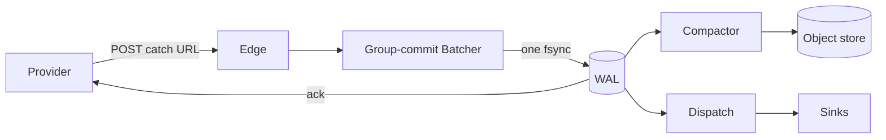
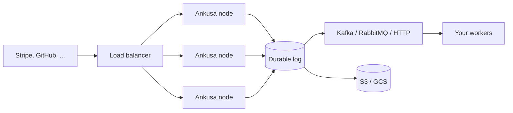

# Ankusa

<p align="center">
  
</p>

[](https://hub.docker.com/r/jamescarr/ankusa)
[](https://github.com/jamescarr/ankusa/actions/workflows/ci.yml)
[](https://hex.pm/packages/ankusa)
[](https://github.com/jamescarr/ankusa/blob/main/LICENSE)

_**Don't fight the traffic. Steer it.**_

Ankusa is a self-hosted webhook receiver. Point Stripe, GitHub, or any provider
at it: every hook is written to a durable log before Ankusa answers `2xx`,
provider retries are absorbed as duplicates, and each hook is delivered to your
own worker over HTTP, RabbitMQ, or Kafka, with retries, a dead-letter queue, and
replay. Start with one container. Grow into a fleet by changing config, not code.

## Quickstart

### 1. Run it

```sh
docker run -d --name ankusa \
  -p 4000:4000 -p 127.0.0.1:4002:4002 \
  -v ankusa-data:/var/lib/ankusa \
  jamescarr/ankusa:edge

# the image ships a healthcheck: wait for it rather than racing the listener
until [ "$(docker inspect --format '{{.State.Health.Status}}' ankusa)" = healthy ]; do sleep 1; done

curl -XPOST localhost:4000/webhooks/demo -H 'content-type: application/json' -d '{"id":"evt_1"}'
# => {"id":"01a0...","status":"accepted","seq":1}   (returned only after the WAL fsync)
curl -XPOST localhost:4000/webhooks/demo -d '{"id":"evt_1"}'
# => {"id":"01a0...","status":"duplicate","seq":1}  (the retry is absorbed, not stored twice)
```

Done? `docker rm -f ankusa`

That is a complete, durable webhook receiver. The image ships a `demo` source
that accepts anything, so it works before you have any provider credentials:
4000 is ingest, 4002 is the operator API (`/health`, `/metrics`), and
`/var/lib/ankusa` holds the only state worth keeping.

### 2. Deliver to your own worker

Ankusa POSTs each hook to your endpoint with the raw body intact and
`x-ankusa-id` for idempotency; short outages are retried, long ones land in a
dead-letter queue you can replay with one call.

```sh
git clone https://github.com/jamescarr/ankusa
cd ankusa/examples/quickstart
docker compose up -d --wait
curl -XPOST localhost:4000/webhooks/demo -H 'content-type: application/json' -d '{"id":"evt_1","type":"invoice.paid"}'
sleep 1 && docker compose logs worker
# received id=01a0... source=demo seq=1 bytes=36 body={"id":"evt_1","type":"invoice.paid"}
```

The wiring is one sink in `ankusa.yml`:

```yaml
sources:
  demo:
    verify: {type: none}
    on_verify_failure: accept_flag
    sinks:
      - type: http
        url: http://worker:8080/hooks
        timeout_ms: 5000
```

The worker is
[40 lines of standard-library Python](https://github.com/jamescarr/ankusa/blob/main/examples/quickstart/worker.py);
replace it with your own service. [The quickstart guide](docs/quickstart.md)
walks through outages, dead letters, replay, and pointing a real provider at it.

## How it works

Ankusa writes every hook to a durable log before it answers `2xx`. If a node
dies before the write, the provider never got an ack and retries. If it dies
after, dedup recognizes the retry and absorbs it. When storage slows down,
Ankusa answers `503` with `Retry-After`, so providers back off and try again
instead of losing events. You get that guarantee on day one, on one machine,
and you keep it when you run a hundred.

[`docs/architecture.md`](docs/architecture.md) walks the full pipeline and shows
why each guarantee holds.



## What you get

- Signature verification via a configurable HMAC engine — named schemes for Stripe, GitHub, Standard Webhooks, Shopify, and Slack, plus any body-HMAC scheme you describe in config
- Deduplication by provider event id
- Multi-tenant catch URLs, including ones your product mints at runtime
- Delivery over HTTP, RabbitMQ, and Kafka, with retries, backoff, a dead
  letter queue, and replay
- Quarantine for hooks that fail verification, so nothing is silently dropped
- Archiving to S3, GCS, Cloudflare R2, or MinIO
- Telemetry on every stage of the pipeline
- A clean handoff to job frameworks like Oban and Celery

Every piece is a swappable module, so when your needs outgrow a default you
replace that piece and keep the rest.

## Grow into a fleet

When one box is not enough, put edge nodes behind a load balancer on a shared
Postgres log, archive to S3 or GCS, and fan out to Kafka or RabbitMQ. Ingest,
delivery, and archiving each scale on their own, so you add capacity where the
traffic is.



Your workers can be written in anything. A TypeScript, Python, or Go consumer
reads from the queue and fetches large payloads over HTTP without ever holding
storage credentials.

Roles, the container, and fleets: [`docs/deployment.md`](docs/deployment.md).

## Examples

| Example | Delivers via | Worker | Shows |
| --- | --- | --- | --- |
| [quickstart](https://github.com/jamescarr/ankusa/tree/main/examples/quickstart/) | HTTP | Python | retries, dead letters, replay |
| [rabbitmq-consumer](https://github.com/jamescarr/ankusa/tree/main/examples/rabbitmq-consumer/) | RabbitMQ | TypeScript | consumer-owned queues, large payloads via the claim-check gateway |
| [kafka-sqs-consumer](https://github.com/jamescarr/ankusa/tree/main/examples/kafka-sqs-consumer/) | Kafka → SQS FIFO | TypeScript | per-source ordering, failure drills |
| [oban-consumer](https://github.com/jamescarr/ankusa/tree/main/examples/oban-consumer/) | HTTP → Oban on Kubernetes | Elixir | an edge fleet on a shared Postgres log, load-tested with pods killed mid-run |

How to pick one: [examples/README.md](https://github.com/jamescarr/ankusa/blob/main/examples/README.md)

## Documentation

- [Quickstart](docs/quickstart.md)
- [Configuration](docs/configuration.md)
- [Deployment and scaling](docs/deployment.md)
- [Delivery, retries, and dead letters](docs/delivery.md)
- [Integrations: Oban, Celery, queues](docs/integrations.md)
- [Architecture and guarantees](docs/architecture.md)
- [Storage](docs/storage.md)
- [Multi-tenancy](docs/multi-tenancy.md)
- [Claim check](docs/claim-check.md)

Ankusa is also an Elixir library you can embed in your own app:
[docs/elixir.md](docs/elixir.md) · [HexDocs](https://hexdocs.pm/ankusa).

## The name

अंकुश (aṅkuśa) is Sanskrit for "hook" or "goad": the curved tool a mahout uses
to steer an elephant. Its root, aṅka, means "to bend" or "curve".

Webhook traffic behaves like the elephant. It is large, it arrives on its own
schedule, and it will not wait for you. So the framework takes the same shape:
absorb the traffic durably and fast through the WAL and batcher, then steer
where it goes next through routing, dedup, and dispatch.

## License

Apache 2.0. See [LICENSE](https://github.com/jamescarr/ankusa/blob/main/LICENSE).
