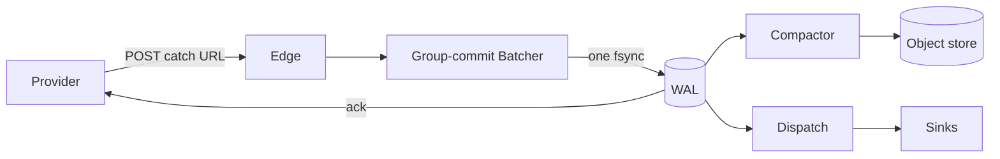
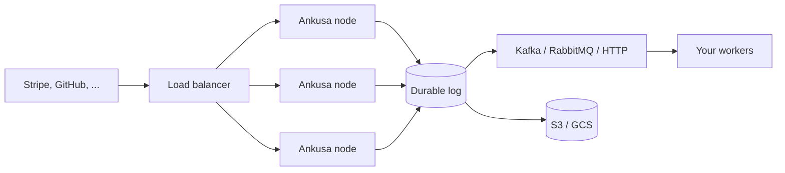

# Ankusa

<p align="center">
  
</p>

[](https://hex.pm/packages/ankusa)
[](https://hex.pm/packages/ankusa)
[](https://hexdocs.pm/ankusa)
[](https://github.com/jamescarr/ankusa/actions/workflows/ci.yml)
[](https://github.com/jamescarr/ankusa/blob/main/LICENSE)
[](https://elixir-lang.org)
[](https://github.com/jamescarr/ankusa/stargazers)

_**Don't fight the traffic. Steer it.** Durable webhook ingestion for any volume._

A loosely coupled, high-throughput webhook ingestion framework designed to let you
stop thinking about reliable webhook ingestion and get back to building.

Start with a single process on your laptop — or one container. When traffic
grows, run the same code as a fleet that takes Stripe-scale volume in stride.
You change config, not code.

## Get Started

### Run the server in Docker

No Elixir toolchain needed: one container, one volume, HTTP in and HTTP out.

```sh
docker run -d --name ankusa \
  -p 4000:4000 -p 127.0.0.1:4002:4002 \
  -v ankusa-data:/var/lib/ankusa \
  jamescarr/ankusa:edge

# the image ships a healthcheck: wait for it rather than racing the listener
until [ "$(docker inspect --format '{{.State.Health.Status}}' ankusa)" = healthy ]; do sleep 1; done

curl -XPOST localhost:4000/webhooks/demo -H 'content-type: application/json' -d '{"id":"evt_1"}'
# => {"id":"01a0...","status":"accepted","seq":1}   (returned only after the WAL fsync)
curl -XPOST localhost:4000/webhooks/demo -d '{"id":"evt_1"}'
# => {"id":"01a0...","status":"duplicate","seq":1}  (the retry is absorbed, not stored twice)

curl localhost:4002/health
# => {"status":"ok","instance":"default","roles":["dispatch","edge","storage"]}
curl localhost:4002/metrics   # Prometheus text format
```

That is a complete, durable webhook receiver. The image ships a `demo` source
that accepts anything, so it works before you have any provider credentials:
4000 is ingest, 4002 is the operator API (`/health`, `/metrics`), and
`/var/lib/ankusa` holds the only state worth keeping.

For anything real, mount your own config and check it before you start:

```sh
docker run --rm -v "$PWD/ankusa.yml:/etc/ankusa/ankusa.yml:ro" \
  -e STRIPE_WHSEC -e GITHUB_WEBHOOK_SECRET -e SINK_URL \
  jamescarr/ankusa:edge check-config
```

`edge` tracks `main`; cutting an `ankusa_server-v*` tag publishes `X.Y.Z`,
`X.Y` and `latest`. Every key, `${VAR}` interpolation, the env overrides, and
the compose files for a fleet: [`ankusa_server/README.md`](https://github.com/jamescarr/ankusa/blob/main/ankusa_server/README.md).
To build the same image from source, `mise run docker:build` tags it
`jamescarr/ankusa:dev`.

### Embed it in your app

```sh
mix deps.get
iex -S mix               # starts on :4000 with the same zero-config `demo` source

curl -XPOST localhost:4000/webhooks/demo -H 'content-type: application/json' -d '{"id":"evt_1"}'
# => {"id":"01a0...","status":"accepted","seq":1}   (returned only after the WAL fsync)
```

There is no database, message broker, or object store to set up first either.

The full walkthrough, including idempotency, inspecting state, and pointing a
real provider at it: [`docs/quickstart.md`](docs/quickstart.md).

## How It Works

Ankusa writes every hook to a durable log before it answers `2xx`. If a node
dies before the write, the provider never got an ack and retries. If it dies
after, dedup recognizes the retry and absorbs it. When storage slows down,
Ankusa answers `503` with `Retry-After`, so providers back off and try again
instead of losing events. You get that guarantee on day one, on one machine,
and you keep it when you run a hundred.

[`docs/architecture.md`](docs/architecture.md) walks the full pipeline and shows
why each guarantee holds.



## The name

अंकुश (aṅkuśa) is Sanskrit for "hook" or "goad": the curved tool a mahout uses
to steer an elephant. Its root, aṅka, means "to bend" or "curve".

Webhook traffic behaves like the elephant. It is large, it arrives on its own
schedule, and it will not wait for you. So the framework takes the same shape:
absorb the traffic durably and fast through the WAL and batcher, then steer
where it goes next through routing, dedup, and dispatch.

## Grow Into a Fleet

When one box is not enough, put edge nodes behind a load balancer on a shared
Postgres log, archive to S3 or GCS, and fan out to Kafka or RabbitMQ. Ingest,
delivery, and archiving each scale on their own, so you add capacity where the
traffic is.



Your workers can be written in anything. A TypeScript, Python, or Go consumer
reads from the queue and fetches large payloads over HTTP without ever holding
storage credentials.

## What You Get

- Signature verification for Stripe, GitHub, and Standard Webhooks
- Deduplication by provider event id
- Multi-tenant catch URLs, including ones your product mints at runtime
- Delivery over HTTP, RabbitMQ, and Kafka, with retries, backoff, a dead
  letter queue, and replay
- Quarantine for hooks that fail verification, so nothing is silently dropped
- Archiving to S3, GCS, Cloudflare R2, or MinIO
- Telemetry on every stage of the pipeline
- A clean handoff to job frameworks like Oban and Celery

Every piece is a swappable module, so when your needs outgrow a default you
replace that piece and keep the rest.

## Install

```elixir
def deps do
  [
    {:ankusa, "~> 0.1"},
    # add these as you scale out:
    {:ankusa_postgres, "~> 0.1"},  # shared log for a multi-node fleet
    {:ankusa_kafka, "~> 0.1"},     # deliver to Kafka
    {:ankusa_rabbitmq, "~> 0.1"}   # deliver to RabbitMQ
  ]
end
```

Point a Stripe endpoint at it:

```elixir
config :ankusa,
  autostart: true,
  source_store:
    {Ankusa.SourceStore.Static,
     sources: %{
       "stripe" => [
         verifier: {Ankusa.Verifier.Stripe, secret: System.get_env("STRIPE_WHSEC")},
         dedup: {Ankusa.DedupKey.Stripe, []},
         sinks: [{Ankusa.Sink.Http, url: "https://example.internal/stripe"}]
       ]
     }}
```

Stripe now posts to `/webhooks/stripe`, and every verified event lands in your
service exactly once.

## See It Running

- [`examples/rabbitmq-consumer/`](https://github.com/jamescarr/ankusa/tree/main/examples/rabbitmq-consumer/):
  a dockerized ingest fleet feeding RabbitMQ and a TypeScript worker. One
  `docker compose up --build`.
- [`examples/kafka-sqs-consumer/`](https://github.com/jamescarr/ankusa/tree/main/examples/kafka-sqs-consumer/):
  ingest to Kafka, bridged to an SQS FIFO queue, with ordering preserved end to
  end.
- [`examples/oban-consumer/`](https://github.com/jamescarr/ankusa/tree/main/examples/oban-consumer/):
  Ankusa feeding an Oban worker fleet on Kubernetes, load tested with pods
  killed mid-run.

## Documentation

Start with the [quickstart](docs/quickstart.md). From there:
[configuration](docs/configuration.md),
[deployment and scaling](docs/deployment.md),
[delivery](docs/delivery.md),
[storage](docs/storage.md),
[multi-tenancy](docs/multi-tenancy.md),
[integrations](docs/integrations.md), and
[architecture](docs/architecture.md). Full API docs are on
[HexDocs](https://hexdocs.pm/ankusa).

## License

Apache 2.0. See [LICENSE](https://github.com/jamescarr/ankusa/blob/main/LICENSE).
