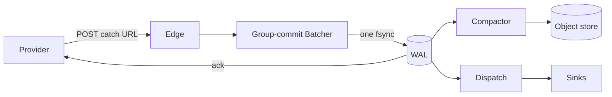

# Hook — a loosely coupled, high-throughput webhook ingestion framework

Built on [Bandit](https://github.com/mtrudel/bandit) + Plug. Implements the plan in
[`webhook-ingest-framework-plan.md`](webhook-ingest-framework-plan.md).

**Never return `2xx` until the hook is durably stored.** The edge acks only
after the group-commit batcher's WAL commit (one `fsync`) returns. Crash
before commit: no `2xx`, the provider retries. Crash after commit, before
the response: the provider retries anyway, dedup absorbs it. Store slow or
down: `503` with `Retry-After`, never ack what wasn't saved. See
[`docs/architecture.md`](docs/architecture.md) for the full pipeline and why
each guarantee holds.



## What this is

A webhook catcher designed to be the front door for one operator's laptop,
a multi-tenant SaaS's shared ingest fleet, or a product minting opaque
catch URLs at runtime — the same code, different config. Every layer (URL
routing, durable log, verification, dedup, object storage, delivery) is a
behaviour with `{module, opts}` config, so swapping one is a one-line
change, never a fork. See [`docs/architecture.md`](docs/architecture.md) for
the "durable state, not RPC" rule that makes this hold at every boundary,
including across separate BEAM nodes and separate adapter packages.

## Repo layout — a mono-repo of separate Mix projects

```
.                    hook — core. mix.exs deps: {bandit, plug}. Zero adapter deps.
hook_postgres/       shared, multi-node WAL (Postgres). Path-dep on hook + postgrex.
hook_rabbitmq/       queue delivery (RabbitMQ exchange publish). Path-dep on hook + amqp.
examples/            deployable demos (Docker Compose, not published packages)
docs/                everything below, in depth
```

Each adapter package exists because it introduces an external dependency
`hook` core shouldn't force on every user — a laptop user running `mix
deps.get` on `hook` alone never fetches `postgrex` or `amqp`. Full rationale
and the decision rule for adding a new one: [`docs/packaging.md`](docs/packaging.md).

## Quickstart

```sh
mix deps.get
iex -S mix               # starts on :4000 with a zero-config `demo` source

curl -XPOST localhost:4000/hooks/demo -H 'content-type: application/json' -d '{"id":"evt_1"}'
# => {"id":"01a0...","status":"accepted","seq":1}   — returned only after the WAL fsync
```

Full walkthrough (idempotency, inspecting state, pointing a real provider
at it): [`docs/quickstart.md`](docs/quickstart.md).

## Pluggable behaviours

| Behaviour | Job | Default | Also shipped |
| --- | --- | --- | --- |
| `Hook.RouteResolver` | Catch-URL scheme → `%Route{tenant_id, source_id}` | `RouteResolver.Path` (`/hooks/:source_id`) | `RouteResolver.TenantPath` (`/hooks/:tenant/:source`) |
| `Hook.WAL` | Durable ack, ordered log, truncation | `WAL.DiskLog` (fsync group commit) | `WAL.Postgres` (shared, multi-node — `hook_postgres`) |
| `Hook.Verifier` | Signature/timestamp checks | `Verifier.None` | `StandardWebhooks`, `Stripe`, `GitHub` |
| `Hook.DedupKey` | Extract provider event id | `DedupKey.Rules` (header/JSON path) | `Stripe`, `GitHub` |
| `Hook.SourceStore` | Source config, secrets, policy | `SourceStore.Static` | — |
| `Hook.Sink` | What happens to a delivered hook | `Sink.Log` | `Sink.Http` (`:httpc` forward), `Sink.RabbitMQ` (exchange publish — `hook_rabbitmq`) |
| `Hook.RetryPolicy` | Backoff / give-up | `RetryPolicy.Exponential` (jitter) | — |
| `Hook.BlobStore` | Segment PUT / range GET / delete | `BlobStore.LocalFS` | `BlobStore.S3` (+R2/MinIO), `BlobStore.GCS` |
| `Hook.Codec` | Segment record framing | `Codec.Raw` (len-prefixed, CRC32) | — |

Full option reference for every row: [`docs/configuration.md`](docs/configuration.md).

## Documentation

| | |
| --- | --- |
| [`docs/architecture.md`](docs/architecture.md) | Core invariant, request path, guarantees per component, instance model, **four deployment topology diagrams** (laptop → role-split host → multi-node Postgres fleet → RabbitMQ fan-out) |
| [`docs/quickstart.md`](docs/quickstart.md) | Install, run, ingest, inspect, point a real provider at it |
| [`docs/configuration.md`](docs/configuration.md) | Full `%Hook.Config{}` + `%Hook.Source{}` reference |
| [`docs/multi-tenancy.md`](docs/multi-tenancy.md) | Catch-URL routing, tenant scoping, writing your own `RouteResolver` |
| [`docs/storage.md`](docs/storage.md) | WAL (`DiskLog`, `Postgres`), segment compaction, `BlobStore` (`LocalFS`, `S3`, `GCS`), replay by id |
| [`docs/delivery.md`](docs/delivery.md) | Dispatch, `Sink` (`Log`, `Http`, `RabbitMQ`), retry/backoff, DLQ + replay, quarantine |
| [`docs/packaging.md`](docs/packaging.md) | Why adapters live in separate packages, the split rule, adding your own |
| [`docs/deployment.md`](docs/deployment.md) | Roles/`HOOK_ROLES`, Docker, scaling the fleet |
| [`docs/testing.md`](docs/testing.md) | Test suites across all three packages, integration tags, dev infra |

## Test

```sh
mix test                          # 59 tests, no external infra
mix test --include integration    # +8, needs floci (S3/GCS emulators) running
```

Covers group commit, dedup (tenant-scoped), crash-replay, dispatch retry +
DLQ, compaction round-trip, and a **loss checker** that acks 500 hooks
concurrently, hard-kills the instance, and proves every acked id survives
replay. `hook_postgres` (10 tests) and `hook_rabbitmq` (4 tests) each need
their own live infra — see [`docs/testing.md`](docs/testing.md).

## Examples

[`examples/rabbitmq-consumer/`](examples/rabbitmq-consumer/) — a full
deployed topology: dockerized ingest fleet → RabbitMQ exchange (fat
payloads offloaded to S3, small ones inlined) → a real TypeScript worker
that owns its own queue/binding, fetches, and prints. `docker compose up
--build` runs the whole thing.

## Not yet implemented (deferred adapters from the plan)

Kafka/Ra WAL adapters, zstd codec, Broadway-backed dispatch, LiveView
dashboard, `mix hook.new` generator, `SourceStore.Ecto` + a catch-URL
control-plane API, and per-source envelope encryption. Each is an adapter
behind an existing behaviour — the ingest guarantees above do not change when
they land.
