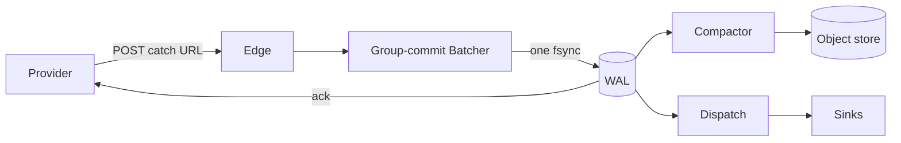

# Ankusa — a loosely coupled, high-throughput webhook ingestion framework

Built on [Bandit](https://github.com/mtrudel/bandit) + Plug. Implements the plan in
[`webhook-ingest-framework-plan.md`](https://github.com/jamescarr/ankusa/blob/main/plans/webhook-ingest-framework-plan.md).

**Never return `2xx` until the hook is durably stored.** The edge acks only
after the group-commit batcher's WAL commit (one `fsync`) returns. Crash
before commit: no `2xx`, the provider retries. Crash after commit, before
the response: the provider retries anyway, dedup absorbs it. Store slow or
down: `503` with `Retry-After`, never ack what wasn't saved. See
[`docs/architecture.md`](docs/architecture.md) for the full pipeline and why
each guarantee holds.

## The name

**अंकुश (aṅkuśa)** — Sanskrit for "hook" or "goad": the curved tool a mahout
uses to steer an elephant, applying precise pressure to direct enormous,
forceful movement without fighting it head-on. The word's root (aṅka, "to
bend/curve") carries the same idea — controlled redirection, not brute
force.

That's a literal description of what this framework does. Webhook traffic
from a provider is exactly the elephant: large, forceful, arrives on its
own schedule, and cannot be told to slow down or wait. An ankusa doesn't
stop the elephant or fight its momentum — it's a small, precise point of
contact that reliably steers it. Every design decision here follows that
shape: absorb the traffic durably and fast (the WAL/batcher), then apply
precise, deliberate control over where it goes next (routing, dedup,
dispatch) — never brute-force buffering, never blocking the source, never
losing control of something moving that fast.



## What this is

A webhook catcher designed to be the front door for one operator's laptop,
a multi-tenant SaaS's shared ingest fleet, or a product minting opaque
catch URLs of its own shape at runtime — the same code, different config.
Every layer (URL
routing, durable log, verification, dedup, object storage, delivery) is a
behaviour with `{module, opts}` config, so swapping one is a one-line
change, never a fork. See [`docs/architecture.md`](docs/architecture.md) for
the "durable state, not RPC" rule that makes this hold at every boundary,
including across separate BEAM nodes and separate adapter packages.

## Repo layout — a mono-repo of separate Mix projects

```
.                    ankusa — core. mix.exs deps: {bandit, plug, req, aws_signature}.
ankusa_postgres/       shared, multi-node WAL (Postgres). Path-dep on ankusa + postgrex.
ankusa_rabbitmq/       queue delivery (RabbitMQ exchange publish). Path-dep on ankusa + amqp.
ankusa_kafka/          queue delivery (Kafka topic produce). Path-dep on ankusa + brod.
examples/            deployable demos (Docker Compose, not published packages)
docs/                everything below, in depth
```

Each adapter package exists because it introduces an external dependency
`ankusa` core shouldn't force on every user — a laptop user running `mix
deps.get` on `ankusa` alone never fetches `postgrex`, `amqp`, or `brod`
(whose `crc32cer` NIF needs a C++ toolchain and CMake to build). That split is
about dependency *weight*, not purity: a dependency that earns its place is
welcome, and one that benefits every user belongs in core. Full rationale and the
decision rule for adding a new one: [`docs/packaging.md`](docs/packaging.md).

## Quickstart

```sh
mix deps.get
iex -S mix               # starts on :4000 with a zero-config `demo` source

curl -XPOST localhost:4000/webhooks/demo -H 'content-type: application/json' -d '{"id":"evt_1"}'
# => {"id":"01a0...","status":"accepted","seq":1}   — returned only after the WAL fsync
```

Full walkthrough (idempotency, inspecting state, pointing a real provider
at it): [`docs/quickstart.md`](docs/quickstart.md).

## Pluggable behaviours

| Behaviour | Job | Default | Also shipped |
| --- | --- | --- | --- |
| `Ankusa.RouteResolver` | Catch-URL scheme → `%Route{tenant_id, source_id}` | `RouteResolver.Path` (`/webhooks/:source_id`) | `RouteResolver.TenantPath` (`/webhooks/:tenant/:source`) |
| `Ankusa.WAL` | Durable ack, ordered log, truncation | `WAL.DiskLog` (fsync group commit) | `WAL.Postgres` (shared, multi-node — `ankusa_postgres`) |
| `Ankusa.Verifier` | Signature/timestamp checks | `Verifier.None` | `StandardWebhooks`, `Stripe`, `GitHub` |
| `Ankusa.DedupKey` | Extract provider event id | `DedupKey.Rules` (header/JSON path) | `Stripe`, `GitHub` |
| `Ankusa.SourceStore` | Source config, secrets, policy | `SourceStore.Static` | — |
| `Ankusa.Sink` | What happens to a delivered hook | `Sink.Log` | `Sink.Http` (Req forward), `Sink.RabbitMQ` (exchange publish — `ankusa_rabbitmq`), `Sink.Kafka` (topic produce — `ankusa_kafka`) |
| `Ankusa.RetryPolicy` | Backoff / give-up | `RetryPolicy.Exponential` (jitter) | — |
| `Ankusa.BlobStore` | Segment PUT / range GET / delete | `BlobStore.LocalFS` | `BlobStore.S3` (+R2/MinIO), `BlobStore.GCS` |
| `Ankusa.ClaimCheck` | Check bytes in, redeem by ticket | `ClaimCheck.Direct` (in-process) | `ClaimCheck.Remote` (HTTP, `:claim_check` role) |
| `Ankusa.Codec` | Segment record framing | `Codec.Raw` (len-prefixed, CRC32) | — |

Full option reference for every row: [`docs/configuration.md`](docs/configuration.md).

## Documentation

| | |
| --- | --- |
| [`docs/architecture.md`](docs/architecture.md) | Core invariant, request path, guarantees per component, instance model, **four deployment topology diagrams** (laptop → role-split host → multi-node Postgres fleet → RabbitMQ fan-out) |
| [`docs/quickstart.md`](docs/quickstart.md) | Install, run, ingest, inspect, point a real provider at it |
| [`docs/configuration.md`](docs/configuration.md) | Full `%Ankusa.Config{}` + `%Ankusa.Source{}` reference |
| [`docs/multi-tenancy.md`](docs/multi-tenancy.md) | Catch-URL routing, tenant scoping, writing your own `RouteResolver` |
| [`docs/storage.md`](docs/storage.md) | WAL (`DiskLog`, `Postgres`), segment compaction, `BlobStore` (`LocalFS`, `S3`, `GCS`), replay by id |
| [`docs/delivery.md`](docs/delivery.md) | Dispatch, `Sink` (`Log`, `Http`, `RabbitMQ`), retry/backoff, DLQ + replay, quarantine |
| [`docs/integrations.md`](docs/integrations.md) | Using Ankusa with a job framework (Oban, Celery) without coupling to one |
| [`docs/claim-check.md`](docs/claim-check.md) | `Ankusa.ClaimCheck` gateway: ticket contract, `Direct`/`Remote` adapters, the `:claim_check` role's HTTP API, retention |
| [`docs/packaging.md`](docs/packaging.md) | Why adapters live in separate packages, the split rule, adding your own |
| [`docs/deployment.md`](docs/deployment.md) | Roles/`ANKUSA_ROLES`, Docker, scaling the fleet |
| [`docs/testing.md`](docs/testing.md) | Test suites across all three packages, integration tags, dev infra |

## Test

```sh
mix test                          # no external infra
mix test --include integration    # needs floci (S3/GCS emulators) running
```

Covers group commit, dedup (tenant-scoped), crash-replay, dispatch retry +
DLQ, compaction round-trip, the Claim Check gateway (ticket integrity, the
`:claim_check` HTTP API, a real cross-mode `Direct`↔`Remote` proof, LocalFS
retention), and a **loss checker** that acks 500 hooks concurrently,
hard-kills the instance, and proves every acked id survives replay.
`ankusa_postgres`, `ankusa_rabbitmq`, and `ankusa_kafka` each need their own
live infra — see [`docs/testing.md`](docs/testing.md).

## Examples

[`examples/rabbitmq-consumer/`](https://github.com/jamescarr/ankusa/tree/main/examples/rabbitmq-consumer/) — a full
deployed topology: dockerized ingest fleet → RabbitMQ exchange (fat
payloads checked in through the Claim Check gateway, small ones inlined) →
a real TypeScript worker that owns its own queue/binding, redeems claims
over HTTP with **no storage credentials of its own**, and prints. `docker
compose up --build` runs the whole thing.

[`examples/kafka-sqs-consumer/`](https://github.com/jamescarr/ankusa/tree/main/examples/kafka-sqs-consumer/) — the same
guarantees through a different transport: ingest → Kafka topic → a Redpanda
Connect bridge → SQS FIFO queue → a TypeScript worker, again with no storage
credentials (claims are redeemed over HTTP). The bridge commits Kafka
offsets only after SQS accepts, and per-key order survives the hop as the
FIFO `MessageGroupId`.

## Not yet implemented (deferred adapters from the plan)

`WAL.Kafka`/`WAL.Ra` adapters (a Kafka *sink* ships as
[`ankusa_kafka`](https://github.com/jamescarr/ankusa/tree/main/ankusa_kafka/); a Kafka *WAL* would need an external dedup
ledger, since Kafka has no unique constraint), zstd codec,
Broadway-backed dispatch, LiveView
dashboard, `mix ankusa.new` generator, `SourceStore.Ecto` + a catch-URL
control-plane API, per-source envelope encryption, concurrent dispatch, and
a lease so `:dispatch`/`:storage` can run hot-standby replicas. Each is an
adapter behind an existing behaviour — the ingest guarantees above do not
change when they land.
