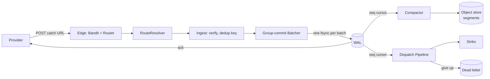
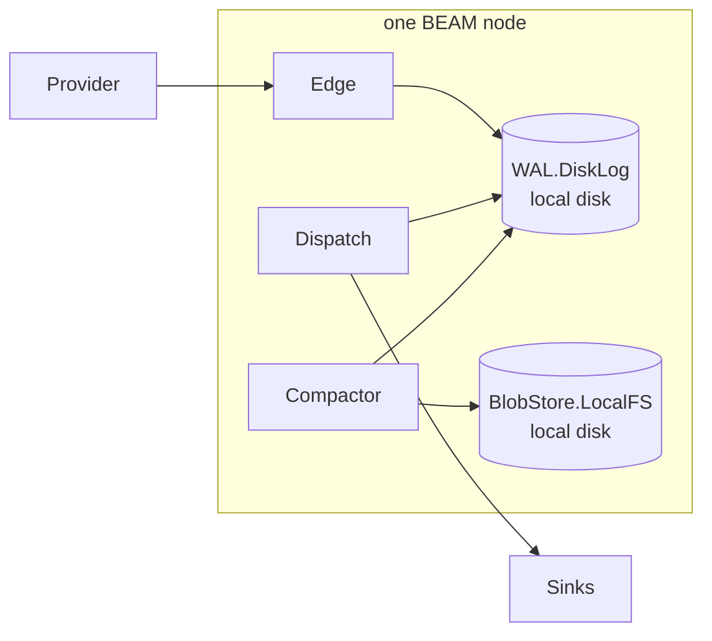
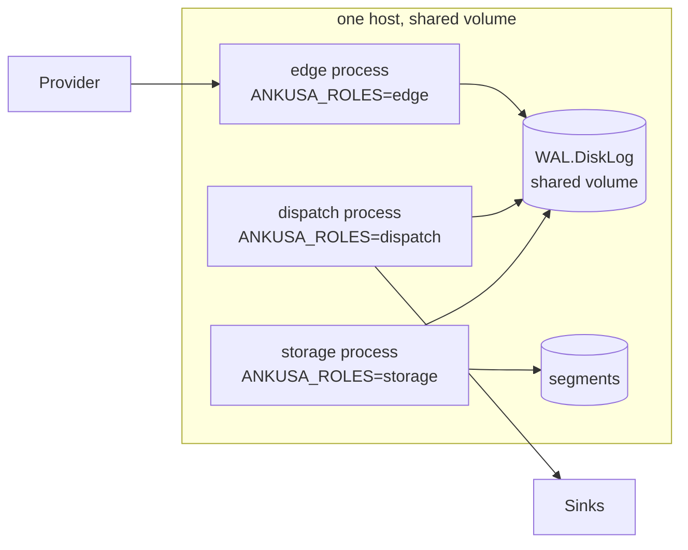
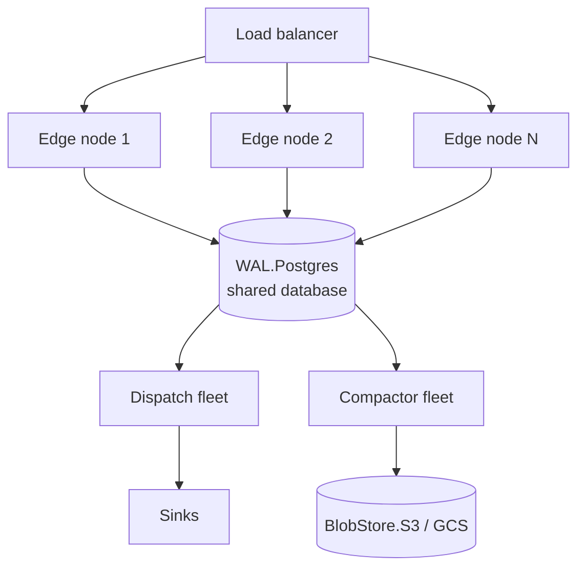
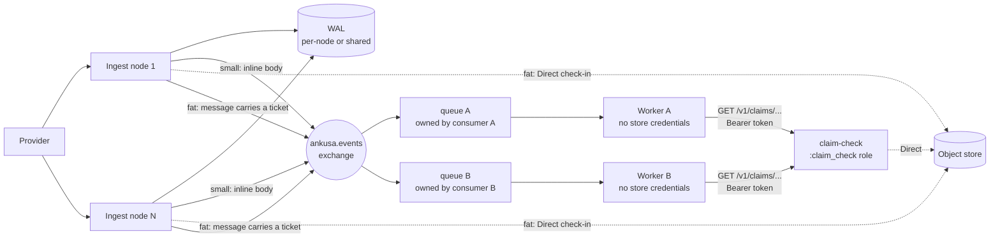

# Architecture

## The core invariant

**Never return `2xx` until the hook is durably stored.** Every other design
decision in this framework is downstream of that one sentence.

- **Crash before commit:** no `2xx` was sent. The provider retries. Nothing
  was lost because nothing was promised.
- **Crash after commit, before the HTTP response leaves:** the provider
  retries anyway (it never saw the `2xx`). Dedup absorbs the retry — same
  event, same `(tenant_id, source_id, dedup_key)`, so it comes back as
  `{"status":"duplicate"}` with the original `seq`, not a second row.
- **Store slow or down:** `503` with `Retry-After`. Never ack what wasn't
  saved, ever, under any load condition.

The one loss window this can't close is a provider that doesn't retry on a
timeout or `5xx`. That's their contract, not a bug here — document it to
whoever's provider you're catching.

The default single-node setup (`WAL.DiskLog` + `BlobStore.LocalFS`) survives
process crash and power loss **on that box** — not loss of the box. The
startup log says so, in one line, on purpose: durability claims should never
be quietly stronger than what's actually true. `WAL.Postgres` (see
[`storage.md`](storage.md)) is what survives losing the box.

## The pipeline

Ingest and dispatch are **fully decoupled**. Compaction and dispatch are
competing consumers reading the WAL by `seq` cursor — neither is an RPC
caller of the other, and neither is an RPC target of the edge. Kill the
compactor fleet: ingest keeps acking, the WAL grows, an alarm fires,
nothing is lost. Kill the dispatch fleet: same story, hooks just wait
longer to be delivered. This is the "durable state, not RPC" rule and it
holds at every boundary in the system, including across separate adapter
packages (see [`packaging.md`](packaging.md)) and across BEAM nodes sharing
a `WAL.Postgres` database (see [`storage.md`](storage.md)).

## Request path, step by step

1. **`Ankusa.Edge.Router`** (`Plug.Router` under Bandit) matches any path via a
   catch-all `POST`, enforces `max_body_bytes` while reading the body, and
   hands off to `Ankusa.RouteResolver.resolve/2` — the pluggable seam that
   turns a URL into `%Ankusa.Route{source_id, tenant_id}`. See
   [`multi-tenancy.md`](multi-tenancy.md).
2. **`Ankusa.Edge.Ingest`** looks the resolved `source_id` up via
   `Ankusa.SourceStore`, builds a `%Ankusa.Envelope{}` (raw body kept
   byte-for-byte verbatim — signature checks need the exact bytes, not a
   re-serialized copy), and runs the source's `Ankusa.Verifier`.
   - Verification failure follows the source's `on_verify_failure` policy:
     `:reject` (`401`, nothing stored), `:quarantine` (`202`, held in a
     rate-limited durable pen — see [`delivery.md`](delivery.md)), or
     `:accept_flag` (commits anyway, envelope marked `flagged: true`).
3. **Dedup key extraction** (`Ankusa.DedupKey`) runs before the commit, not
   after — the WAL's uniqueness constraint on `(tenant_id, source_id,
   dedup_key)` is what actually enforces idempotency; the extractor just
   supplies the key.
4. **`Ankusa.Edge.Batcher`** (one GenServer per partition, default one per
   scheduler) receives the envelope and **blocks the caller** until the
   batch it lands in commits. Every `max_delay_ms` (default 5ms) or once
   `max_batch` (default 256) envelopes accumulate, the batcher flushes the
   whole buffer to the WAL in **one `append/2` call — one `fsync` for
   however many hooks were in the batch**. Every blocked caller is replied
   to only after that commit returns; that's what makes the ack honest.
   The queue is bounded (`max_queue`, default 10,000): full means `503` with
   `Retry-After`, never a promise the store can't back.
5. **`Ankusa.WAL`** commits durably and returns `{:committed, envelope}` (with
   `seq` assigned) or `{:duplicate, existing_seq}` per record, in the
   original order. The edge maps this to `201`/`200`/`202`/`401`/`404`/`413`/`503`;
   a body it cannot read at all (client disconnect, read timeout) is `400`, kept
   distinct from `413` rather than reported as "too large".

From here, ingest is done. Two independent consumers tail the WAL by `seq`:

- **`Ankusa.Storage.Compactor`** reads everything past its cursor, encodes many
  records into one immutable segment via `Ankusa.Codec`, `PUT`s it to
  `Ankusa.BlobStore`, appends index rows, advances its cursor, and truncates
  the WAL through `min(compactor_seq, dispatch_seq)` — records dispatch
  hasn't consumed yet are never dropped, at-least-once delivery survives
  compaction. Detail in [`storage.md`](storage.md).
- **`Ankusa.Dispatch.Pipeline`** reads everything past its cursor and delivers
  each envelope to every one of the source's `Ankusa.Sink`s, retrying per the
  source's `Ankusa.RetryPolicy` and dead-lettering on give-up. Detail in
  [`delivery.md`](delivery.md).

## Guarantees, by component

| Component | Guarantee |
| --- | --- |
| `WAL.DiskLog` | Append-only, length-prefixed, CRC32-per-record log. Replay validates every CRC and **drops a torn trailing frame** — a write that started but never `fsync`'d, so it was never acked either. No un-acked write is ever surfaced as if it were durable. |
| Group-commit batcher | One process per partition; callers block until commit; bounded queue sheds load as `503` rather than queuing unboundedly. |
| Idempotent receiver | A duplicate still gets a `2xx` (`{"status":"duplicate"}`) — the provider's retry contract is honored even though nothing new was written. |
| Compactor | Never writes one object per hook — packs many WAL records into one immutable segment. Truncates only through `min(compactor, dispatch)`. |
| Dispatch | At-least-once to every sink, exponential backoff with jitter, dead-letter on give-up, durable cursor survives restart. |
| Quarantine | Token-bucket rate-limited (100 burst, 20/s refill) durable pen — a bad secret rotation can't silently eat real events, and a flood of forged requests can't fill the disk. |

## Instance model

Every process is registered through a single `Registry` (`Ankusa.Registry`)
with a `via` tuple keyed by instance name (`Ankusa.via(instance, key)`) — there
are no global process names anywhere in the framework. That's what makes two
independent instances runnable in one VM (and what makes the test suite
`async: true`-safe for anything that doesn't share on-disk state).

Config is a `%Ankusa.Config{}` struct built once and passed down the
supervision tree at start (`Ankusa.Instance`'s `init/1`), then cached in
`:persistent_term` for read-mostly access — no `Application.get_env/2`
buried in call sites, and instance-scoped config falls out of the struct for
free.

**Roles** (`:edge`, `:dispatch`, `:storage`) boot independently based on
`config.roles`. The same release runs all three on a laptop, or as split
fleets via `ANKUSA_ROLES=edge,dispatch` — see
[`deployment.md`](deployment.md#roles-and-topologies). No component may
require another to be *reachable at runtime*; they only ever hand off
through the WAL and the object store.

## Deployment topologies

The same code runs unmodified in each of these — only config changes
(`wal:`, `storage.blob_store:`, `roles:`/`ANKUSA_ROLES`, and which sinks a
source declares). None of these diagrams require a different release
artifact from any other; they're the same supervision tree
(`Ankusa.Instance`'s `init/1`) booting a different subset of children with
different adapter tuples. Operational how-tos live in
[`deployment.md`](deployment.md); adapter details in
[`storage.md`](storage.md) and [`delivery.md`](delivery.md).

### 1. Laptop / single container — the default

One process, every role. Nothing else to run: no broker, no database, no object
store.

`mix run --no-halt` / `iex -S mix`, or the single-container image in
[`examples/rabbitmq-consumer/`](https://github.com/jamescarr/ankusa/tree/main/examples/rabbitmq-consumer/). Durable to
process crash and power loss on that box; not to losing the box.

### 2. Role-split processes, one host

`ANKUSA_ROLES=edge` / `ANKUSA_ROLES=dispatch` / `ANKUSA_ROLES=storage` as separate
OS processes or containers sharing one volume. Still `WAL.DiskLog` — it's a
local file, so every role reading/writing it must be able to see the same
disk. Useful for isolating edge CPU/memory from compaction, without standing
up a database yet.

### 3. Multi-node fleet, shared Postgres WAL

N independent edge nodes (behind a load balancer) each run their own local
`Postgrex` pool against the **same** Postgres database — coordination
between nodes happens entirely through row-locked SQL, never BEAM
distribution. This is the topology that actually needs `WAL.Postgres`
(separate `ankusa_postgres` package); `DiskLog` cannot do this because it's
one local file per node.

Edge, dispatch, and compactor fleets scale independently; any of them can
run on any node that can reach Postgres and the object store. See
[`storage.md`](storage.md#shared-postgres-wal).

### 4. Queue fan-out to independent consumers

Ingest fleet publishes to a RabbitMQ exchange (`Sink.RabbitMQ`, separate
`ankusa_rabbitmq` package) or a Kafka topic (`Sink.Kafka`, separate
`ankusa_kafka` package); either way fat payloads are checked in through
`Ankusa.ClaimCheck` with only a ticket on the queue, and the message itself
is the same `Ankusa.Sink.Message`. With RabbitMQ each consumer owns its
**own** queue and binding — the framework never declares one, so adding a
fifth consumer later is a change on the consumer side only, not a config
change here. Kafka has no bindings: the consumer side owns a consumer group
instead, and one that wants SQS or another broker in between runs a bridge
(see [`examples/kafka-sqs-consumer/`](https://github.com/jamescarr/ankusa/tree/main/examples/kafka-sqs-consumer/)).

A consumer that shouldn't hold object-store credentials (a non-BEAM worker,
a third party) redeems through a `:claim_check`-role node's HTTP API
instead of the object store directly — see [`claim-check.md`](claim-check.md)
for the full contract, the trust-boundary table for picking `Direct` vs.
`Remote`, and why `Remote` (an RPC dependency) is allowed only downstream of
the WAL — dispatch sinks and external consumers, never the edge's pre-ack
path.

Worked end to end, dockerized, in
[`examples/rabbitmq-consumer/`](https://github.com/jamescarr/ankusa/tree/main/examples/rabbitmq-consumer/).

These compose: 3 and 4 together — a Postgres-backed multi-node edge fleet
that *also* fans out to RabbitMQ — are the same two config changes applied
to the same instance, not a different architecture.

## Telemetry

Every stage emits `:telemetry` events under the `[:ankusa, ...]` prefix —
`ingest`, `commit`, `verify`, `dedup`, `load_shed`, `dispatch`, `compact`,
`quarantine`, `claim_check`. Components emit events; they never call each
other's reporters, so wiring a metrics/tracing backend is additive, never a
code change to the pipeline itself. See `Ankusa.Telemetry`'s moduledoc for
the full event list and measurement/metadata shapes.

