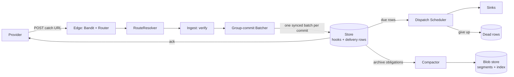
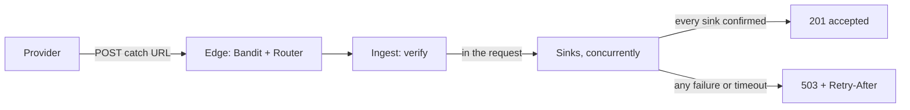
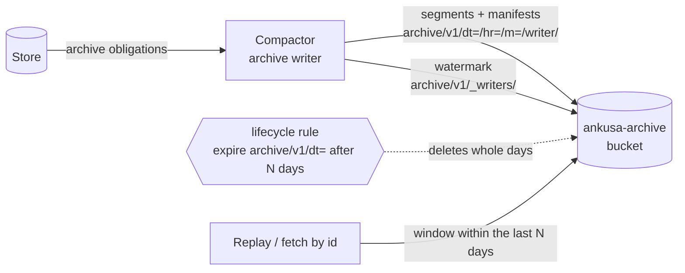
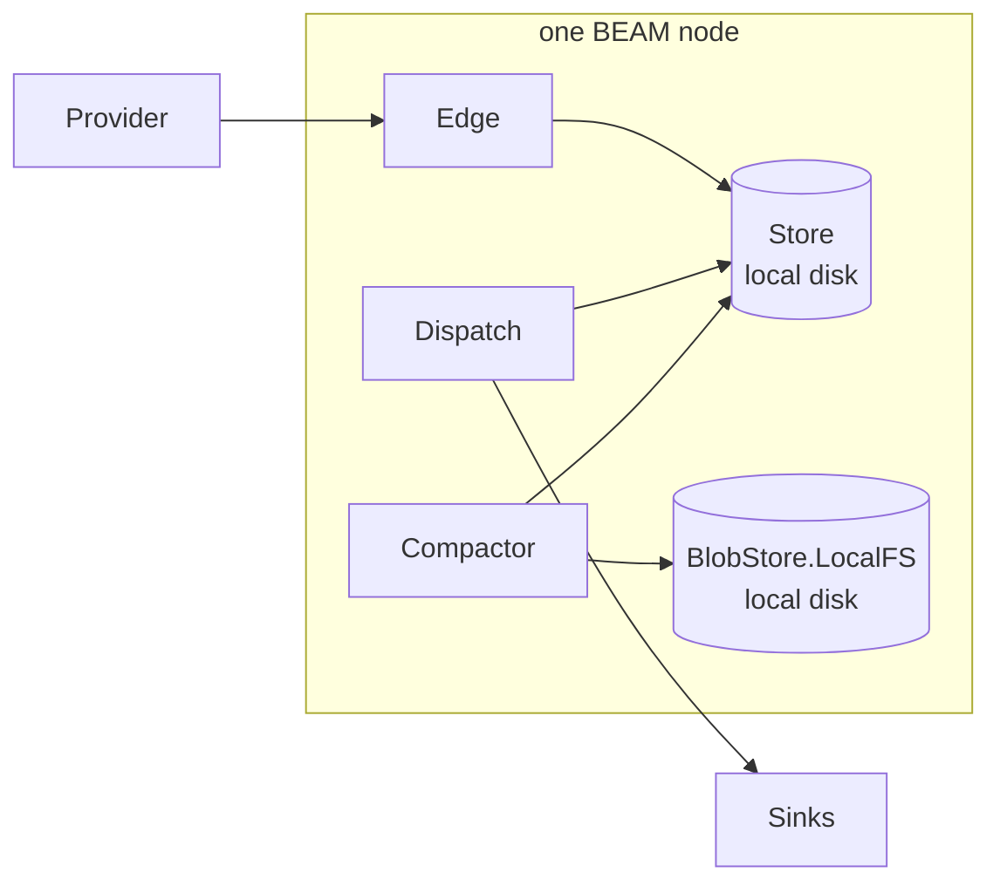
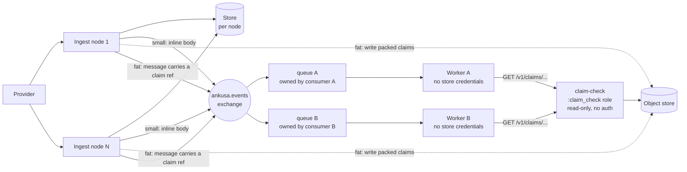
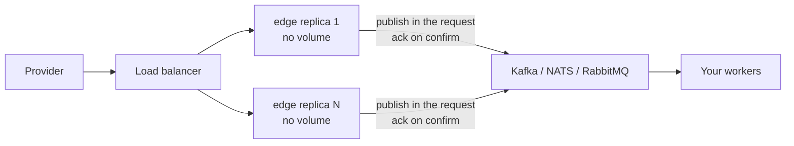

# Architecture

## The core invariant

**Never return `2xx` until the hook is durably accepted.** Which system accepts
it is one config key: `wal.type: disk` (the default) commits to this node's
store — the queue's mode; the name `wal` is historical — and dispatches
asynchronously; `wal.type: none` publishes to the source's sinks
inside the request and acks on their confirm. Neither ever promises what
nothing stored. Every other design decision in this framework is downstream of
that one sentence.

- **Crash before the accept:** no `2xx` was sent. The provider retries. Nothing
  was lost because nothing was promised.
- **Crash after the accept, before the HTTP response leaves:** the provider
  retries anyway (it never saw the `2xx`). Without a source
  [`dedupe:`](configuration.md#sources) setting, that retry is a new hook: a fresh `id`, stored and delivered again. Delivery
  is at-least-once; consumers are idempotent receivers.
- **Store slow or down:** `503` with `Retry-After`. Under `wal.type: disk` that
  is the store refusing a commit; under `wal.type: none` it is a sink refusing
  the publish — same answer, because in that mode the sink *is* the store.
  Never ack what wasn't saved, ever, under any load condition.

The one loss window this can't close is a provider that doesn't retry on a
timeout or `5xx`. That's their contract, not a bug here. Document it to
whoever's provider you're catching.

The default single-node setup (`wal.type: disk` + `BlobStore.LocalFS`) survives
process crash and power loss **on that box**, not loss of the box. The
startup log says so, in one line, on purpose: durability claims should never
be quietly stronger than what's actually true. The queue commits to one
RocksDB database per instance at `<data_dir>/<instance>/store`, owned by the
`Ankusa.Store` process; it is local to one BEAM node, so run every store
role together and scale out with independent nodes. See
[Deployment topologies](#deployment-topologies).

`wal.type: none` makes the node stateless instead: no queue, no batcher, no
dispatch pipeline, no compactor, no DLQ, and the only role left is `:edge`. The
store still runs for the quarantine pen and the API-managed sources and
rate-limit overrides, but no hook is ever written to it. The broker's confirm
replaces the `fsync`, and "the provider is the retry" replaces the retry
policy — see [Deployment topologies](#4-stateless-ingest-fleet-wal-none)
and [`delivery.md`](delivery.md#direct-mode).

## The pipeline


```mermaid
flowchart LR
    P[Provider] -->|POST catch URL| E[Edge: Bandit + Router]
    E --> RR[RouteResolver]
    RR --> IG[Ingest: verify]
    IG --> B[Group-commit Batcher]
    B -->|one synced batch per commit| S[(Store\nhooks + delivery rows)]
    S -->|ack| P
    S -->|due rows| D[Dispatch Scheduler]
    S -->|archive obligations| C[Compactor]
    C --> BS[(Blob store\nsegments + index)]
    D --> SK[Sinks]
    D -->|give up| DLQ[(Dead rows)]
```

Ingest and dispatch are **fully decoupled**. A commit writes the hook and one
delivery row per sink in one store batch; dispatch is a scheduler over the
due rows, and the compactor works over the archive obligations that same
commit wrote. Neither is an RPC caller of the other, and neither is an RPC
target of the edge. Take the compactor down: ingest keeps acking, the
obligations pile up, nothing is lost — though no alarm fires either, because
there is no store-size or cursor-lag metric yet. Take dispatch down: same
story, deliveries just wait as due rows, and a row it had already claimed is
put back as due at the next start. This is
the "durable state, not RPC" rule and it
holds at every boundary in the system, including across separate adapter
packages (see [`packaging.md`](packaging.md)) and across independent nodes,
which share nothing but the provider's traffic.

`wal.type: none` skips the queue entirely — one request, one publish, still one
honest ack:


```mermaid
flowchart LR
    P[Provider] -->|POST catch URL| E[Edge: Bandit + Router]
    E --> IG[Ingest: verify]
    IG -->|in the request| SK[Sinks, concurrently]
    SK -->|every sink confirmed| A[201 accepted]
    SK -->|any failure or timeout| R[503 + Retry-After]
```

No batcher, no queue, no compactor, no dispatch pipeline, no DLQ. The request
process publishes to each of the source's sinks and answers only once all have
confirmed (`Kafka` `acks=all`, a publisher confirm, a JetStream ack, an HTTP
`2xx`); any failure or timeout is the `503`, and the provider — not a retry policy —
is the retry. `c:Ankusa.Sink.durable?/1` is the contract behind that promise, and
boot refuses a `wal: :none` config in which no sink of a static source can make
it. Detail in [`delivery.md`](delivery.md#direct-mode).

## Request path, step by step

1. **`Ankusa.Edge.Router`** (`Plug.Router` under Bandit) matches any path via a
   catch-all `POST` and hands it to `Ankusa.RouteResolver.resolve/2`, the
   pluggable seam that turns a URL into `%Ankusa.Route{source_id, tenant_id}`
   (see [`multi-tenancy.md`](multi-tenancy.md)). It then does everything that
   can refuse the request *before reading its body*: a `Content-Length` above
   `max_body_bytes` is `413`, and a source that does not exist is `404` — so
   is a source owned by one tenant asked for under another tenant's URL (a
   source with the default tenant `"default"` is shared and answers any
   tenant), and a source store that cannot answer is `503`, never `404`. Only
   then does it read the body, still bounded by `max_body_bytes` as it streams
   (a chunked body has no length to check up front). Refusals are counted on
   `ankusa_ingest_refused_total{instance,reason}` and never create a
   per-source series, so an unauthenticated caller cannot grow `/metrics`.
2. **`Ankusa.Edge.Ingest`** builds a `%Ankusa.Envelope{}` for the source the
   router looked up via `Ankusa.SourceStore` (raw body kept byte-for-byte
   verbatim: signature checks need the exact bytes, not a re-serialized copy;
   it is copied only when it is a slice of a larger binary), and runs the
   source's `Ankusa.Verifier`.
   - Verification failure follows the source's `on_verify_failure` policy:
     `:reject` (`401`, nothing stored), `:quarantine` (`202`, held in a
     durable pen with a per-source rate limit and a byte cap — `429` or `503`
     when either refuses — until a `quarantine` replay job re-verifies and
     releases it. See [`delivery.md`](delivery.md#quarantine)), or
     `:accept_flag` (commits anyway, envelope marked `flagged: true`).
   - An accepted hook is charged against its tenant's ingest rate limit
     (`rate_limits`) before anything is written. Over the limit is `429` with
     `Retry-After`, nothing stored — and because the charge comes after
     verification, a flood of forged requests spends no budget and can never
     lock a tenant out. A forged hook is not free either: one accepted
     *flagged* (`accept_flag`) or quarantined spends its source's quarantine
     bucket (`429 quarantine_rate_limited` past it), and a flagged hook gets
     no dedupe key, so it cannot suppress the real event. See
     [`configuration.md#rate-limits`](configuration.md#rate-limits).
3. **`Ankusa.Edge.Batcher`** (one GenServer per partition, default two)
   receives the envelope and **blocks the caller** until the batch it lands
   in commits. The flush to the store runs in a `Task`, so the batcher keeps
   accepting while a commit is in flight. The next batch accumulates behind
   it and commits the instant the previous one returns. `max_batch`
   (default 256) bounds one batch, `max_delay_ms` (default 0) adds no linger.
   Every blocked caller is replied to only after that commit returns; that's
   what makes the ack honest. The queue is bounded twice — `max_queue`
   (default 10,000) records and `max_queue_bytes` (default 256 MiB) of body,
   both counting buffered *and* in-flight records: full means `503` with
   `Retry-After`, never a promise the store can't back.
4. **`Ankusa.Queue`** commits the batch to the store durably and returns
   `{:committed, envelope}` (with `seq` assigned) or `{:duplicate, envelope}`
   (the original's `id`; nothing stored) per record, in the original
   order. The edge maps this to
   `201`/`202`/`401`/`404`/`413`/`429`/`503`; a body it cannot read at all
   (client disconnect, read timeout) is `400`, kept distinct from `413` rather
   than reported as "too large". A header name or value holding a byte outside
   visible ASCII (space and tab allowed in values) is also `400 invalid_header`,
   refused before the body is read: no sink can carry it.

Under `wal: :none` steps 3 and 4 do not exist: **`Ankusa.Edge.Publish`** asks
all of the source's `Ankusa.Sink`s at once, concurrently, in the request
process, under one deadline (`direct_publish_timeout_ms`, default 8 s). The
status mapping below is unchanged, but the `201` now waits on
every sink's confirm instead of the store commit. A sink refusing, raising,
throwing, exiting or missing the deadline is the `503`, and nothing is retried here.

From here, ingest is done. Two independent consumers work off the same store:

- **`Ankusa.Storage.Compactor`** takes the archive obligations in `seq` order,
  by stored size up to `storage.roll_bytes`, encodes the hooks into one
  immutable segment via `Ankusa.Codec`, `PUT`s the segment and its index
  object to `Ankusa.BlobStore`, writes the catalogue row, and clears the
  obligations. Hooks dispatch hasn't consumed yet are not touched, so
  at-least-once delivery survives compaction. Detail in
  [`storage.md`](storage.md).
- **`Ankusa.Dispatch.Pipeline`** is a scheduler over delivery rows: it claims
  due rows (up to `dispatch.concurrency` at a time, bounded by
  `dispatch.max_inflight` claims and `dispatch.max_inflight_bytes` of stored
  hook bodies), queues them per sink key, hands slots round-robin across the
  keys, delivers each to the sink its row was bound to, retries per the
  source's `Ankusa.RetryPolicy`, parks a key whose circuit breaker is open,
  and dead-letters on give-up. Delivery is not ordered; a consumer that needs
  order has to rebuild it from data it receives and tolerate redelivery.
  Detail in [`delivery.md`](delivery.md).

## Guarantees, by component

| Component | Guarantee |
| --- | --- |
| `Ankusa.Store` (the `wal.type: disk` queue) | One RocksDB database per instance. A commit is one synced batch: the hook, one pending delivery row per sink, an archive obligation while `:storage` runs, the seq marker, and, for a hook with a dedupe key, the dedupe key and its expiry key. A torn tail (an unacked write) is dropped on open; damage before it refuses to start (`{:store_open_failed, …}`) rather than silently shortening a read. LocalFS blob writes are fsynced (temp file, rename, directory). |
| Group-commit batcher | One process per partition; the store commit runs in a supervised task, so commits pipeline while callers block until their own commit returns; bounded queue (buffered + in-flight) sheds load as `503` rather than queuing unboundedly. Every record carries a deadline (15 s by default) for its batch to *start* committing: a record still buffered at its deadline behind a stalled commit is answered `503` and dropped, and the writer refuses a batch that missed its deadline. A batch the writer has started is never abandoned, so a stall never answers `503` for a hook it then commits; a process dying while the writer is mid-commit (the commit task, the batcher, or the writer after its sync) still can, and the provider's retry stores that hook again. |
| Ingest | Every accepted POST is durably accepted and answered `201 accepted`, and `201` is the only committed response. There is no `200`. Under the default `wal.type: disk` that accept is the store commit; under `wal.type: none` it is every sink's confirm. A source with [`dedupe:`](configuration.md#sources) collapses hooks sharing a provider event key within the TTL (default 72 h): the repeat gets `201` with the original `id` and `"duplicate": true`, and nothing new is stored. Without it, a provider retry after a lost ack is a new hook with a new `id`, stored and delivered again. Consumer contract in [`delivery.md`](delivery.md#idempotent-receivers). |
| `wal: :none` (direct ack) | Ingest publishes to every sink concurrently in the request, under one deadline (`direct_publish_timeout_ms`, default 8 s), and answers `201` only after each confirmed; any sink failure, crash or timeout is a `503` with `Retry-After`, with no internal retry, and sinks that confirmed keep their copy. No queue, no batcher, no dispatch pipeline, no compactor, no DLQ: the provider is the retry and the sink's destination is the durable store. `c:Ankusa.Sink.durable?/1` is the per-sink promise, checked at boot for every static source. The local state this mode keeps is the quarantine pen (rows appear only for a source that asks for it), API-managed sources and rate-limit overrides, all in the store. |
| Compactor | Never writes one object per hook: it takes archive obligations byte-sized up to `storage.roll_bytes` and packs them into one immutable segment plus one index object. A failed blob write ends the tick and the same hooks are retried next tick. |
| Dispatch | At-least-once to every sink, concurrent up to `dispatch.concurrency` and bounded by `dispatch.max_inflight`/`max_inflight_bytes`, exponential backoff with jitter, dead-letter on give-up, a raising sink retried rather than fatal. Not ordered: ordering lanes are gone, and a consumer that needs order has to rebuild it from data it receives. DLQ entries are dead delivery rows; a replay moves them back to pending, so a replayed hook leaves the DLQ. |
| Quarantine | A durable pen in the store, bounded twice: a token bucket per source (`quarantine.burst`/`rate`, default 100 / 20 per s; over it, `429 quarantine_rate_limited`) and a cap on its total bytes (`quarantine.max_bytes`, default 1 GiB; a full pen answers `503 quarantine_full` and never evicts a held hook). It survives a restart, its byte count too, and a store that cannot write is a `503` that spends no token. A `quarantine` replay job re-verifies held hooks against the source's current verifier and commits the ones that pass with their original `id`; `DELETE /v1/quarantine` purges the rest. A secret list (`secret: [new, old]`) keeps a rotation out of the pen in the first place. |

## Archive: a retention window, by design (planned)

> **Planned, not shipped.** Designed in
> [`reliability-fixes.md`](https://github.com/jamescarr/ankusa/blob/main/reliability-fixes.md)
> (Phase 1). Today the compactor writes `seg/` segments indexed on the node;
> see [`storage.md`](storage.md).

The archive holds every accepted hook for a fixed **window**: a day, a week,
ninety days. The window is the archive bucket's lifecycle policy, not an Ankusa
setting. The archive is a recovery buffer for replay, not a system of record:
a replay reaches back as far as the window, and older hooks are gone on
purpose.


```mermaid
flowchart LR
    S[(Store)] -->|archive obligations| C[Compactor\narchive writer]
    C -->|"segments + manifests\narchive/v1/dt=/hr=/m=/writer/"| A[("ankusa-archive\nbucket")]
    C -->|"watermark\narchive/v1/_writers/"| A
    LC{{"lifecycle rule\nexpire archive/v1/dt= after N days"}} -.->|deletes whole days| A
    R[Replay / fetch by id] -->|"window within the last N days"| A
```

- **The store owns the window.** One lifecycle rule on the `archive/v1/dt=`
  prefix (S3 or R2 lifecycle configuration, GCS Object Lifecycle Management,
  Azure lifecycle management, an OCI lifecycle policy) expires archived hooks.
  Ankusa never expires an archived hook from a cloud store and has no
  retention setting for one.
- **The window is a floor.** Lifecycle rules count days from an object's
  creation, and a segment is written after its hooks arrive, so every hook is
  held for at least the window. Stores expire asynchronously, so it may live
  somewhat longer. A replay over a window older than that delivers nothing.
- **Size it to your recovery horizon**: the longest a consumer outage can go
  unnoticed, plus the time to replay it. Claims (`claims/`) keep their own
  rule ([`claim-check.md#retention`](claim-check.md#retention)); archive
  segments hold full bodies, never claim refs, so the two windows are
  independent.
- **Watermarks never expire.** `archive/v1/_writers/` sits outside the `dt=`
  prefix, so the rule never touches it.
- **Its own bucket.** `archive.store` (YAML) / the archive's `blob_store`
  (Elixir) names the archive's store; unset, it is `storage`'s. Give it a
  dedicated bucket, `ankusa-archive` in these docs, so its lifecycle rule
  describes the archive and nothing else. The name takes a hyphen, unlike the
  `ankusa.events` exchange: Azure container names allow no dots, and GCS
  requires domain verification for dotted bucket names.
- **LocalFS is the exception.** A directory has no lifecycle policy, so with a
  LocalFS archive `archive.retention_days` has Ankusa's sweeper delete whole
  `dt=` days past the window, the same sweeper behind
  `claim_check.retention_days`. Unset, a LocalFS archive keeps everything; set
  with any other store, boot fails.

A one-week window on S3:

```sh
aws s3api put-bucket-lifecycle-configuration --bucket ankusa-archive \
  --lifecycle-configuration '{"Rules":[{"ID":"ankusa-archive-window","Status":"Enabled",
    "Filter":{"Prefix":"archive/v1/dt="},"Expiration":{"Days":7}}]}'
```

## Instance model

Every instance-scoped process is registered through a single `Registry`
(`Ankusa.Registry`) with a `via` tuple keyed by instance name
(`Ankusa.via(instance, key)`) — the adapters' connections too
(`Sink.RabbitMQ` keys its connection by a digest of the URL, `Sink.NATS` by
its `:connection`). Nothing registers a `:global` or cluster-wide name. The
node-local names left are shared by every instance on purpose: each adapter
package's own `DynamicSupervisor` (started by its `Application`); brod's
client id, an atom that `Sink.Kafka` scopes as
`:"ankusa_kafka.<instance>.<client>"`; the S3 credential cache
(`:ankusa_s3_credentials`), one ETS table keyed by credential source; and, in
the image only, `AnkusaServer.GcsToken`. Each instance's route snapshot is
its own named ETS table. That's what makes two
independent instances runnable in one VM (and what makes the test suite
`async: true`-safe for anything that doesn't share on-disk state).

Config is a `%Ankusa.Config{}` struct built once and passed down the
supervision tree at start (`Ankusa.Instance`'s `init/1`), then cached in
`:persistent_term` for read-mostly access. No `Application.get_env/2`
buried in call sites, and instance-scoped config falls out of the struct for
free. Data that changes at runtime stays out of `:persistent_term` (whose
every update copies into every process that read it): the route table is an
ETS table the routes store owns. One route edit rewrites that route's rows and
a `:meta` row; a whole-table publish (boot, seed, a Redis reload) writes a new
generation and flips `:meta` to it, so readers see one table or the other.
A thousand route edits cost a thousand small inserts, not a thousand global
copies.

**Roles** (`:edge`, `:dispatch`, `:storage`) boot independently based on
`config.roles`. The same release runs all three on a laptop, and `roles` is
still a runtime config decision, but the store is local to one BEAM node and
only one process may open it, so every role that uses it must live together in
that node; see
[Deployment topologies](#deployment-topologies). Under `wal: :none` the roles
that exist only to read the queue have no work, so `Ankusa.Config.new/1` drops
`:dispatch` and `:storage` from the effective list — the admin API's
`GET /health` reports what this node actually runs, and an existing
all-role deployment can flip `wal.type` with no other change. No component may
require another to be *reachable at runtime*; they only ever hand off through
the store and the object store.

### Failure domains

The instance supervisor is `:rest_for_one`, and what a failure costs depends on
where it happens:

- **The core** is the store, the source store and the edge subtree (routes,
  queue writer, quarantine, rate limiter, batchers, the ingress listener). It is
  what acks hooks, so a crash there restarts what depends on it, and a core that
  keeps crashing stops the instance for its supervisor to restart.
- **Every other domain** (dispatch, storage, lifecycle events, metrics, and the
  admin, route-admin and claim-check listeners) runs under its own restart
  budget. When that is exhausted it is restarted later, backing off from 1 s up
  to 60 s, instead of taking the instance down: a sink that keeps raising or a
  port someone else took stops that domain, not the edge. Hooks wait in the
  store and are dispatched when the domain returns. A child that cannot start
  when the instance *boots* still fails the boot. Each outage emits
  `[:ankusa, :instance, :subtree_down]` and each recovery `:subtree_up`.
- **The registry.** A restart of `Ankusa.Registry`, or of one of its partitions,
  forgets every name an instance registered, and the processes that trap exits
  outlive it unregistered. The instance notices and stops itself so that
  whatever supervises it starts it again, every process registered anew.

A crash report prints a process's state and the message it was handling. The
processes whose state holds sink options (dispatch, lifecycle, storage, the
sweeper, the rate limiter, the writable source store, the batchers) redact them
from the state they report; the batchers and the writable source store also
from the message, since their calls carry a hook's or a source's sinks. The
replayer keeps only the codec module, so its state holds no configuration.
Supervisors cannot: their child specs carry the config, so
`:sys.get_status/1` on a supervisor, or a supervisor report when SASL reports
are turned on (`handle_sasl_reports`, off by default), still prints it.

## Deployment topologies

The same code runs unmodified in each of these. Only config changes
(`wal:`, `storage.blob_store:`, `roles:`/`ANKUSA_ROLES`, and which sinks a
source declares). None of these diagrams require a different release
artifact from any other; they're the same supervision tree
(`Ankusa.Instance`'s `init/1`) booting a different subset of children with
different adapter tuples. Operational how-tos live in
[`deployment.md`](deployment.md); adapter details in
[`storage.md`](storage.md) and [`delivery.md`](delivery.md).

### 1. Laptop / single container: the default

One process, every role. Nothing else to run: no broker, no database, no object
store.


```mermaid
flowchart LR
    P[Provider] --> E[Edge]
    subgraph Node["one BEAM node"]
        E --> S[("Store\nlocal disk")]
        Disp[Dispatch] --> S
        Comp[Compactor] --> S
        Comp --> BS[("BlobStore.LocalFS\nlocal disk")]
    end
    Disp --> SK[Sinks]
```

`mix run --no-halt` / `iex -S mix`, or the single-container image in
[`examples/rabbitmq-consumer/`](https://github.com/jamescarr/ankusa/tree/main/examples/rabbitmq-consumer/). Durable to
process crash and power loss on that box; not to losing the box.

### 2. Splitting roles across nodes is not supported

The store is one RocksDB database owned by one process per instance, and
RocksDB takes an exclusive lock on its directory, so a second OS process
cannot open the same store. Every role that uses it, `edge`, `dispatch`,
`storage`, must therefore live in **one BEAM node**; running them as separate
containers or hosts pointed at one store is not a supported topology. The one
role you can split off is `:claim_check`, which never opens the store at all
and can run anywhere, its own node included.

This constraint is the store's, not the framework's: under `wal.type: none`
there is no queue, only `:edge` runs, and every replica is independent
(topology 4).

### 3. Queue fan-out to independent consumers

An ingest fleet publishes to a RabbitMQ exchange (`Sink.RabbitMQ`, separate
`ankusa_rabbitmq` package), a Kafka topic (`Sink.Kafka`, separate
`ankusa_kafka` package), a NATS JetStream subject (`Sink.NATS`, separate
`ankusa_nats` package), or a Redis pub/sub channel (`Sink.Redis`, separate
`ankusa_redis` package); either way fat payloads are checked in through
`Ankusa.ClaimCheck` with only a claim reference on the queue, and the message
itself is the same `Ankusa.Sink.Message`. With RabbitMQ each consumer owns its
**own** queue and binding. The framework never declares one, so adding a
fifth consumer later is a change on the consumer side only, not a config
change here. Kafka has no bindings: the consumer side owns a consumer group
instead, and one that wants SQS or another broker in between runs a bridge
(see [`examples/kafka-sqs-consumer/`](https://github.com/jamescarr/ankusa/tree/main/examples/kafka-sqs-consumer/)).

Each ingest node here is an ordinary all-role node, the topology-1 shape, with
its own store, and the nodes share nothing but the broker, the provider's
traffic, and — if you like — one bucket. Segment keys are
`seg/<first_seq>-<last_seq>.seg`, so nodes sharing a bucket each set their
own `storage.key_prefix` (`node-a/`, …) or they overwrite each other's
segments. Claim keys are never prefixed — claim ids are unique across nodes —
so the claim store (the bucket, or a dedicated `claim_check.store`) is shared
by every node and one gateway serves them all.


```mermaid
flowchart LR
    P[Provider] --> E1[Ingest node 1]
    P --> E2[Ingest node N]
    E1 & E2 --> S[("Store\nper node")]
    E1 & E2 -->|small: inline body| X(("ankusa.events\nexchange"))
    E1 & E2 -.fat: write packed claims.-> Obj[("Object store")]
    E1 & E2 -->|"fat: message carries a claim ref"| X
    X --> QA[queue A\nowned by consumer A]
    X --> QB[queue B\nowned by consumer B]
    QA --> CA[Worker A\nno store credentials]
    QB --> CB[Worker B\nno store credentials]
    CA & CB -->|GET /v1/claims/...| CC["claim-check\n:claim_check role\nread-only, no auth"]
    CC --> Obj
```

A consumer that shouldn't hold object-store credentials (any worker, in any
language, or a third party) redeems the reference with `GET /v1/claims/...`
against a `claim_check`-role node instead of reading the object store. The
gateway is read-only and does no authentication; whatever fronts it decides
who may read what. See [`claim-check.md`](claim-check.md) for the API and the
reference format.

Worked end to end, dockerized, in
[`examples/rabbitmq-consumer/`](https://github.com/jamescarr/ankusa/tree/main/examples/rabbitmq-consumer/).

These compose: every node runs the full pipeline locally and publishes to the
broker, so scaling ingest with more nodes and adding queue consumers are two
independent config changes on the same architecture, not a different one.

### 4. Stateless ingest fleet (`wal: :none`)

N replicas of the same image, no volumes at all: a `Deployment`, not a
`StatefulSet`. Ingest verifies, publishes to the source's sinks in the request,
and acks on their confirm. Nothing written here is acked customer data, so a
replica can be killed, rescheduled, or added mid-storm with nothing to drain
and nothing to repoint.


```mermaid
flowchart LR
    P[Provider] --> LB[Load balancer]
    LB --> E1[edge replica 1\nno volume]
    LB --> E2[edge replica N\nno volume]
    E1 & E2 -->|publish in the request\nack on confirm| Q[Kafka / NATS / RabbitMQ]
    Q --> W[Your workers]
```

The trade is the retry: with no queue there is no retry policy, no dead-letter
queue, and no replay — a `503` with `Retry-After` is the whole retry mechanism,
so the provider must retry and consumers must dedupe on the idempotency key,
which is the hook `id` unless the source sets
[`dedupe`](configuration.md#sources). Every statically configured source needs at
least one sink whose `:ok` means durable (`c:Ankusa.Sink.durable?/1`); boot
refuses the config otherwise, and a source created at runtime through the admin
API is not checked. Every sink in the list still has to confirm, so a
non-durable one that cannot — Redis pub/sub with no subscriber — is a `503`
for every request, not a silently skipped hop. The local state this topology
has is the quarantine pen (rows in the store, added only for a source that
asks for it), API-managed sources and rate-limit overrides. See
[`delivery.md#direct-mode`](delivery.md#direct-mode) and
[`config-examples/direct.yml`](https://github.com/jamescarr/ankusa/blob/main/packages/ankusa_server/config-examples/direct.yml).

## Telemetry

Every stage emits `:telemetry` events under the `[:ankusa, ...]` prefix:
`ingest`, `commit`, `verify`, `load_shed`, `dispatch`, `compact`, `quarantine`,
`rate_limit`, `claim_check`, `replay`, `lifecycle`, `routes`, `instance` (a failure domain going down or coming
back). Components emit events; they never call each
other's reporters, so wiring a metrics/tracing backend is additive, never a
code change to the pipeline itself. See `Ankusa.Telemetry`'s moduledoc for
the full event list and measurement/metadata shapes.

Counters say what happened; the `:state` events (`[:ankusa, :store | :queue |
:quarantine | :disk | :dispatch, :state]`) say where the node stands.
`Ankusa.Metrics.Gauges` samples the store, the queue index, the quarantine
pen and the data volume's disk every `admin.gauge_interval_ms` (15 s), and
dispatch reports its scheduler on every housekeeping tick, so `/metrics`
carries `ankusa_store_hooks`, `ankusa_queue_pending` / `_scheduled` /
`_inflight` / `_dead` / `_archive_pending`, `ankusa_queue_oldest_due_age_seconds`,
`ankusa_quarantine_bytes`, `ankusa_disk_free_bytes`, `ankusa_dispatch_running`
/ `_claimed` / `_runnable` and `ankusa_dispatch_breakers_open` — enough to
alert on a growing backlog, a filling disk or an open breaker before a
provider sees a `503`. Per-delivery counters carry the sink module as a
`sink` label.
