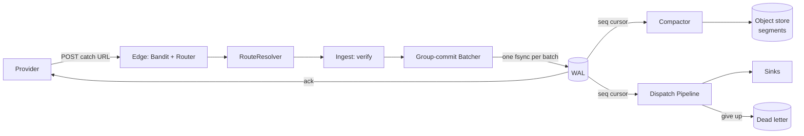
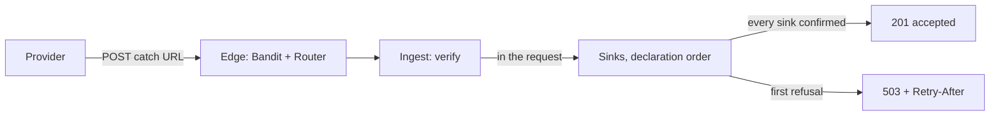
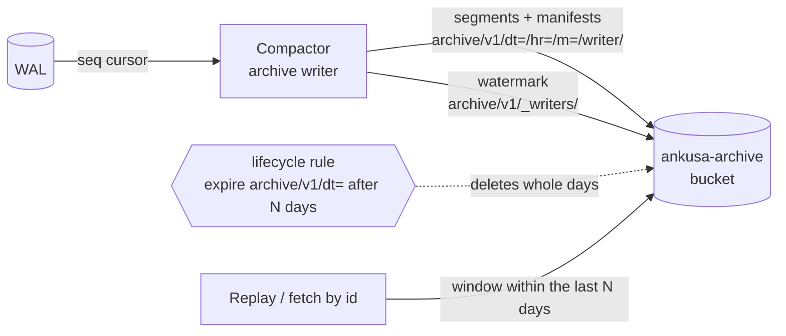
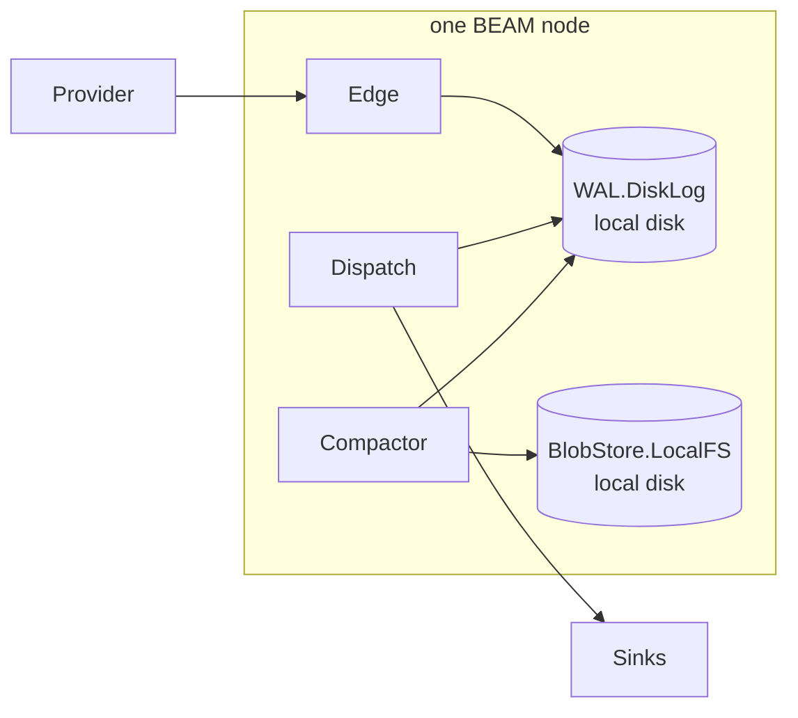
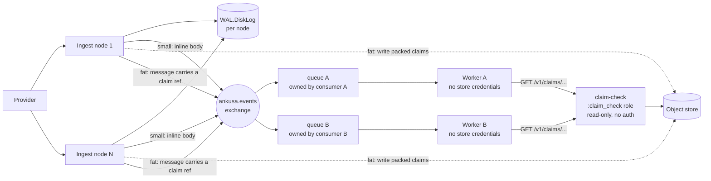
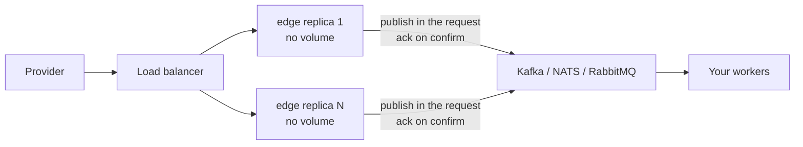

# Architecture

## The core invariant

**Never return `2xx` until the hook is durably accepted.** Which system accepts
it is one config key: `wal.type: disk` (the default) commits to this node's log
and dispatches asynchronously; `wal.type: none` publishes to the source's sinks
inside the request and acks on their confirm. Neither ever promises what
nothing stored. Every other design decision in this framework is downstream of
that one sentence.

- **Crash before the accept:** no `2xx` was sent. The provider retries. Nothing
  was lost because nothing was promised.
- **Crash after the accept, before the HTTP response leaves:** the provider
  retries anyway (it never saw the `2xx`). Ingest does no deduplication, so
  that retry is a new hook: a fresh `id`, stored and delivered again. Delivery
  is at-least-once; consumers are idempotent receivers.
- **Store slow or down:** `503` with `Retry-After`. Under `wal.type: disk` that
  is the WAL refusing a write; under `wal.type: none` it is a sink refusing the
  publish — same answer, because in that mode the sink *is* the store. Never
  ack what wasn't saved, ever, under any load condition.

The one loss window this can't close is a provider that doesn't retry on a
timeout or `5xx`. That's their contract, not a bug here. Document it to
whoever's provider you're catching.

The default single-node setup (`WAL.DiskLog` + `BlobStore.LocalFS`) survives
process crash and power loss **on that box**, not loss of the box. The
startup log says so, in one line, on purpose: durability claims should never
be quietly stronger than what's actually true. `WAL.DiskLog` is the only WAL:
it holds its index in-process and is local to one BEAM node, so run every WAL
role together and scale out with independent nodes. See
[Deployment topologies](#deployment-topologies).

`wal.type: none` makes the node stateless instead: no log, no batcher, no
dispatch pipeline, no compactor, no DLQ, and the only role left is `:edge`. The
broker's confirm replaces the `fsync`, and "the provider is the retry" replaces
the retry policy — see [Deployment topologies](#4-stateless-ingest-fleet-wal-none)
and [`delivery.md`](delivery.md#direct-mode).

## The pipeline


```mermaid
flowchart LR
    P[Provider] -->|POST catch URL| E[Edge: Bandit + Router]
    E --> RR[RouteResolver]
    RR --> IG[Ingest: verify]
    IG --> B[Group-commit Batcher]
    B -->|one fsync per batch| W[(WAL)]
    W -->|ack| P
    W -->|seq cursor| C[Compactor]
    W -->|seq cursor| D[Dispatch Pipeline]
    C --> S[(Object store\nsegments)]
    D --> SK[Sinks]
    D -->|give up| DLQ[(Dead letter)]
```

Ingest and dispatch are **fully decoupled**. Compaction and dispatch are
competing consumers reading the WAL by `seq` cursor. Neither is an RPC
caller of the other, and neither is an RPC target of the edge. Take the
compactor down: ingest keeps acking, the WAL grows, an alarm fires,
nothing is lost. Take dispatch down: same story, hooks just wait
longer to be delivered, and its cursor resumes where it left off. This is
the "durable state, not RPC" rule and it
holds at every boundary in the system, including across separate adapter
packages (see [`packaging.md`](packaging.md)) and across independent nodes,
which share nothing but the provider's traffic.

`wal.type: none` skips the log entirely — one request, one publish, still one
honest ack:


```mermaid
flowchart LR
    P[Provider] -->|POST catch URL| E[Edge: Bandit + Router]
    E --> IG[Ingest: verify]
    IG -->|in the request| SK[Sinks, declaration order]
    SK -->|every sink confirmed| A[201 accepted]
    SK -->|first refusal| R[503 + Retry-After]
```

No batcher, no WAL, no compactor, no dispatch pipeline, no DLQ. The request
process publishes to each of the source's sinks and answers only once all have
confirmed (`Kafka` `acks=all`, a publisher confirm, a JetStream ack, an HTTP
`2xx`); the first refusal is the `503`, and the provider — not a retry policy —
is the retry. `Ankusa.Sink.durable?/2` is the contract behind that promise, and
boot refuses a `wal: :none` config in which no sink of a static source can make
it. Detail in [`delivery.md`](delivery.md#direct-mode).

## Request path, step by step

1. **`Ankusa.Edge.Router`** (`Plug.Router` under Bandit) matches any path via a
   catch-all `POST`, enforces `max_body_bytes` while reading the body, and
   hands off to `Ankusa.RouteResolver.resolve/2`, the pluggable seam that
   turns a URL into `%Ankusa.Route{source_id, tenant_id}`. See
   [`multi-tenancy.md`](multi-tenancy.md).
2. **`Ankusa.Edge.Ingest`** looks the resolved `source_id` up via
   `Ankusa.SourceStore`, builds a `%Ankusa.Envelope{}` (raw body kept
   byte-for-byte verbatim: signature checks need the exact bytes, not a
   re-serialized copy), and runs the source's `Ankusa.Verifier`.
   - Verification failure follows the source's `on_verify_failure` policy:
     `:reject` (`401`, nothing stored), `:quarantine` (`202`, held in a
     rate-limited durable pen. See [`delivery.md`](delivery.md)), or
     `:accept_flag` (commits anyway, envelope marked `flagged: true`).
   - An accepted hook is charged against its tenant's ingest rate limit
     (`rate_limits`) before anything is written. Over the limit is `429` with
     `Retry-After`, nothing stored — and because the charge comes after
     verification, a flood of forged requests spends no budget and can never
     lock a tenant out. See
     [`configuration.md#rate-limits`](configuration.md#rate-limits).
3. **`Ankusa.Edge.Batcher`** (one GenServer per partition, default two)
   receives the envelope and **blocks the caller** until the batch it lands
   in commits. The flush to the WAL runs in a `Task`, so the batcher keeps
   accepting while a commit is in flight. The next batch accumulates behind
   it and commits the instant the previous one returns. `max_batch`
   (default 256) bounds one batch, `max_delay_ms` (default 0) adds no linger.
   Every blocked caller is replied to only after that commit returns; that's
   what makes the ack honest. The queue is bounded (`max_queue`, default
   10,000, counting buffered *and* in-flight records): full means `503` with
   `Retry-After`, never a promise the store can't back.
4. **`Ankusa.WAL`** commits durably and returns `{:committed, envelope}` (with
   `seq` assigned) per record, in the original order. The edge maps this to
   `201`/`202`/`401`/`404`/`413`/`429`/`503`; a body it cannot read at all
   (client disconnect, read timeout) is `400`, kept distinct from `413` rather
   than reported as "too large".

Under `wal: :none` steps 3 and 4 do not exist: **`Ankusa.Edge.Publish`** asks
each of the source's `Ankusa.Sink`s, in declaration order, in the request
process. The status mapping below is unchanged, but the `201` now waits on
every sink's confirm instead of the WAL commit. A sink refusing — or raising,
or throwing, or exiting — is the `503`, and nothing is retried here.

From here, ingest is done. Two independent consumers tail the WAL by `seq`:

- **`Ankusa.Storage.Compactor`** reads everything past its cursor, encodes many
  records into one immutable segment via `Ankusa.Codec`, `PUT`s it to
  `Ankusa.BlobStore`, appends index rows, advances its cursor, and truncates
  the WAL through `min(compactor_seq, dispatch_seq)`. Records dispatch
  hasn't consumed yet are never dropped, at-least-once delivery survives
  compaction. Detail in [`storage.md`](storage.md).
- **`Ankusa.Dispatch.Pipeline`** reads everything past its cursor and delivers
  each envelope to every one of the source's `Ankusa.Sink`s, up to
  `dispatch.concurrency` deliveries at a time and serialized per
  `c:Ankusa.Sink.ordering_key/2`, retrying per the source's
  `Ankusa.RetryPolicy` and dead-lettering on give-up. Detail in
  [`delivery.md`](delivery.md).

## Guarantees, by component

| Component | Guarantee |
| --- | --- |
| `WAL.DiskLog` | Append-only, length-prefixed, CRC32-per-record log. Replay validates every CRC and **drops a torn trailing frame**, a write that started but never `fsync`'d, so it was never acked either. No un-acked write is ever surfaced as if it were durable. |
| Group-commit batcher | One process per partition; the WAL append runs in a task, so commits pipeline while callers block until their own commit returns; bounded queue (buffered + in-flight) sheds load as `503` rather than queuing unboundedly. |
| Ingest | Every accepted POST is durably accepted and answered `201 accepted`, and `201` is the only committed response. There is no `200`. Under the default `wal.type: disk` that accept is the WAL commit; under `wal.type: none` it is every sink's confirm. Ingest does no deduplication, so a provider retry after a lost ack is a new hook with a new `id`, stored and delivered again. Consumer contract in [`delivery.md`](delivery.md#idempotent-receivers). |
| `wal: :none` (direct ack) | Ingest publishes to every sink in the request and answers `201` only after each confirmed; the first refusal is a `503` with `Retry-After`, with no internal retry. No local log, no batcher, no dispatch pipeline, no compactor, no DLQ: the provider is the retry and the sink's destination is the durable store. `Ankusa.Sink.durable?/2` is the per-sink promise, checked at boot for every static source. The quarantine pen is the only local state this mode has at all: an empty log is created at boot, and entries are appended only for a source that asks for it. |
| Compactor | Never writes one object per hook. Packs many WAL records into one immutable segment. Truncates only through `min(compactor, dispatch)`. |
| Dispatch | At-least-once to every sink, concurrent up to `dispatch.concurrency` and serialized per `c:Ankusa.Sink.ordering_key/2`, exponential backoff with jitter, dead-letter on give-up, a raising sink retried rather than fatal, durable watermark cursor survives restart. |
| Quarantine | Token-bucket rate-limited (100 burst, 20/s refill) durable pen. A bad secret rotation can't silently eat real events, and a flood of forged requests can't fill the disk. |

## Archive: a retention window, by design (planned)

> **Planned, not shipped.** Designed in
> [`reliability-fixes.md`](https://github.com/jamescarr/ankusa/blob/main/reliability-fixes.md)
> (Phase 1). Today the compactor writes `seg/` segments indexed on the node;
> see [`storage.md`](storage.md).

The archive holds every accepted hook for a fixed **window**: a day, a week,
ninety days. The window is the archive bucket's lifecycle policy, not an Ankusa
setting. The archive is a recovery buffer for replay, not a system of record:
a replay reaches back as far as the window, and older hooks are gone on
purpose.


```mermaid
flowchart LR
    W[(WAL)] -->|seq cursor| C[Compactor\narchive writer]
    C -->|"segments + manifests\narchive/v1/dt=/hr=/m=/writer/"| A[("ankusa-archive\nbucket")]
    C -->|"watermark\narchive/v1/_writers/"| A
    LC{{"lifecycle rule\nexpire archive/v1/dt= after N days"}} -.->|deletes whole days| A
    R[Replay / fetch by id] -->|"window within the last N days"| A
```

- **The store owns the window.** One lifecycle rule on the `archive/v1/dt=`
  prefix (S3 or R2 lifecycle configuration, GCS Object Lifecycle Management,
  Azure lifecycle management, an OCI lifecycle policy) expires archived hooks.
  Ankusa never expires an archived hook from a cloud store and has no
  retention setting for one.
- **The window is a floor.** Lifecycle rules count days from an object's
  creation, and a segment is written after its hooks arrive, so every hook is
  held for at least the window. Stores expire asynchronously, so it may live
  somewhat longer. A replay over a window older than that delivers nothing.
- **Size it to your recovery horizon**: the longest a consumer outage can go
  unnoticed, plus the time to replay it. Claims (`claims/`) keep their own
  rule ([`claim-check.md#retention`](claim-check.md#retention)); archive
  segments hold full bodies, never claim refs, so the two windows are
  independent.
- **Watermarks never expire.** `archive/v1/_writers/` sits outside the `dt=`
  prefix, so the rule never touches it.
- **Its own bucket.** `archive.store` (YAML) / the archive's `blob_store`
  (Elixir) names the archive's store; unset, it is `storage`'s. Give it a
  dedicated bucket, `ankusa-archive` in these docs, so its lifecycle rule
  describes the archive and nothing else. The name takes a hyphen, unlike the
  `ankusa.events` exchange: Azure container names allow no dots, and GCS
  requires domain verification for dotted bucket names.
- **LocalFS is the exception.** A directory has no lifecycle policy, so with a
  LocalFS archive `archive.retention_days` has Ankusa's sweeper delete whole
  `dt=` days past the window, the same sweeper behind
  `claim_check.retention_days`. Unset, a LocalFS archive keeps everything; set
  with any other store, boot fails.

A one-week window on S3:

```sh
aws s3api put-bucket-lifecycle-configuration --bucket ankusa-archive \
  --lifecycle-configuration '{"Rules":[{"ID":"ankusa-archive-window","Status":"Enabled",
    "Filter":{"Prefix":"archive/v1/dt="},"Expiration":{"Days":7}}]}'
```

## Instance model

Every process is registered through a single `Registry` (`Ankusa.Registry`)
with a `via` tuple keyed by instance name (`Ankusa.via(instance, key)`). There
are no global process names anywhere in the framework. That's what makes two
independent instances runnable in one VM (and what makes the test suite
`async: true`-safe for anything that doesn't share on-disk state).

Config is a `%Ankusa.Config{}` struct built once and passed down the
supervision tree at start (`Ankusa.Instance`'s `init/1`), then cached in
`:persistent_term` for read-mostly access. No `Application.get_env/2`
buried in call sites, and instance-scoped config falls out of the struct for
free.

**Roles** (`:edge`, `:dispatch`, `:storage`) boot independently based on
`config.roles`. The same release runs all three on a laptop, and `roles` is
still a runtime config decision, but `WAL.DiskLog` is local to one BEAM node,
so every WAL role must live together in that node; see
[Deployment topologies](#deployment-topologies). Under `wal: :none` the roles
that exist only to read the log have no work, so `Ankusa.Config.new/1` drops
`:dispatch` and `:storage` from the effective list — the admin API's
`GET /health` reports what this node actually runs, and an existing
all-role deployment can flip `wal.type` with no other change. No component may
require another to be *reachable at runtime*; they only ever hand off through
the WAL and the object store.

## Deployment topologies

The same code runs unmodified in each of these. Only config changes
(`wal:`, `storage.blob_store:`, `roles:`/`ANKUSA_ROLES`, and which sinks a
source declares). None of these diagrams require a different release
artifact from any other; they're the same supervision tree
(`Ankusa.Instance`'s `init/1`) booting a different subset of children with
different adapter tuples. Operational how-tos live in
[`deployment.md`](deployment.md); adapter details in
[`storage.md`](storage.md) and [`delivery.md`](delivery.md).

### 1. Laptop / single container: the default

One process, every role. Nothing else to run: no broker, no database, no object
store.


```mermaid
flowchart LR
    P[Provider] --> E[Edge]
    subgraph Node["one BEAM node"]
        E --> WAL[("WAL.DiskLog\nlocal disk")]
        Disp[Dispatch] --> WAL
        Comp[Compactor] --> WAL
        Comp --> BS[("BlobStore.LocalFS\nlocal disk")]
    end
    Disp --> SK[Sinks]
```

`mix run --no-halt` / `iex -S mix`, or the single-container image in
[`examples/rabbitmq-consumer/`](https://github.com/jamescarr/ankusa/tree/main/examples/rabbitmq-consumer/). Durable to
process crash and power loss on that box; not to losing the box.

### 2. Splitting roles across nodes is not supported

`WAL.DiskLog` keeps its record index in-process and reclaims space by renaming
the log file, so a second OS process would never see writes it didn't make and
would rewrite the file under the first one. Every role that touches the WAL,
`edge`, `dispatch`, `storage`, must therefore live in **one BEAM node**;
running them as separate containers or hosts pointed at one log is not a
supported topology. The one role you can split off is `:claim_check`, which
never touches the WAL at all and can run anywhere, its own node included.

This constraint is the WAL's, not the framework's: under `wal.type: none` there
is no log, only `:edge` runs, and every replica is independent (topology 4).

### 3. Queue fan-out to independent consumers

An ingest fleet publishes to a RabbitMQ exchange (`Sink.RabbitMQ`, separate
`ankusa_rabbitmq` package), a Kafka topic (`Sink.Kafka`, separate
`ankusa_kafka` package), a NATS JetStream subject (`Sink.NATS`, separate
`ankusa_nats` package), or a Redis pub/sub channel (`Sink.Redis`, separate
`ankusa_redis` package); either way fat payloads are checked in through
`Ankusa.ClaimCheck` with only a claim reference on the queue, and the message
itself is the same `Ankusa.Sink.Message`. With RabbitMQ each consumer owns its
**own** queue and binding. The framework never declares one, so adding a
fifth consumer later is a change on the consumer side only, not a config
change here. Kafka has no bindings: the consumer side owns a consumer group
instead, and one that wants SQS or another broker in between runs a bridge
(see [`examples/kafka-sqs-consumer/`](https://github.com/jamescarr/ankusa/tree/main/examples/kafka-sqs-consumer/)).

Each ingest node here is an ordinary all-role node, the topology-1 shape, with
its own `WAL.DiskLog`, and the nodes share nothing but the broker and the
provider's traffic. Give each node **its own bucket** (or its own LocalFS
directory) for segments: segment keys are `seg/<first_seq>-<last_seq>.seg` and
remote blob stores ignore the instance, so nodes sharing one bucket overwrite
each other's segments.


```mermaid
flowchart LR
    P[Provider] --> E1[Ingest node 1]
    P --> E2[Ingest node N]
    E1 & E2 --> WAL[("WAL.DiskLog\nper node")]
    E1 & E2 -->|small: inline body| X(("ankusa.events\nexchange"))
    E1 & E2 -.fat: write packed claims.-> Obj[("Object store")]
    E1 & E2 -->|"fat: message carries a claim ref"| X
    X --> QA[queue A\nowned by consumer A]
    X --> QB[queue B\nowned by consumer B]
    QA --> CA[Worker A\nno store credentials]
    QB --> CB[Worker B\nno store credentials]
    CA & CB -->|GET /v1/claims/...| CC["claim-check\n:claim_check role\nread-only, no auth"]
    CC --> Obj
```

A consumer that shouldn't hold object-store credentials (any worker, in any
language, or a third party) redeems the reference with `GET /v1/claims/...`
against a `claim_check`-role node instead of reading the object store. The
gateway is read-only and does no authentication; whatever fronts it decides
who may read what. See [`claim-check.md`](claim-check.md) for the API and the
reference format.

Worked end to end, dockerized, in
[`examples/rabbitmq-consumer/`](https://github.com/jamescarr/ankusa/tree/main/examples/rabbitmq-consumer/).

These compose: every node runs the full pipeline locally and publishes to the
broker, so scaling ingest with more nodes and adding queue consumers are two
independent config changes on the same architecture, not a different one.

### 4. Stateless ingest fleet (`wal: :none`)

N replicas of the same image, no volumes at all: a `Deployment`, not a
`StatefulSet`. Ingest verifies, publishes to the source's sinks in the request,
and acks on their confirm. Nothing written here is acked customer data, so a
replica can be killed, rescheduled, or added mid-storm with nothing to drain
and nothing to repoint.


```mermaid
flowchart LR
    P[Provider] --> LB[Load balancer]
    LB --> E1[edge replica 1\nno volume]
    LB --> E2[edge replica N\nno volume]
    E1 & E2 -->|publish in the request\nack on confirm| Q[Kafka / NATS / RabbitMQ]
    Q --> W[Your workers]
```

The trade is the retry: with no log there is no retry policy, no dead-letter
queue, and no replay — a `503` with `Retry-After` is the whole retry mechanism,
so the provider must retry and consumers must dedupe on the provider's own
event id, as they always have. Every statically configured source needs at
least one sink whose `:ok` means durable (`Ankusa.Sink.durable?/2`); boot
refuses the config otherwise, and a source created at runtime through the admin
API is not checked. Every sink in the list still has to confirm, so a
non-durable one that cannot — Redis pub/sub with no subscriber — is a `503`
for every request, not a silently skipped hop. The quarantine pen is the only
local state this topology has: an empty log at boot, entries only for a source
that asks for it. See
[`delivery.md#direct-mode`](delivery.md#direct-mode) and
[`config-examples/direct.yml`](https://github.com/jamescarr/ankusa/blob/main/packages/ankusa_server/config-examples/direct.yml).

## Telemetry

Every stage emits `:telemetry` events under the `[:ankusa, ...]` prefix:
`ingest`, `commit`, `verify`, `load_shed`, `dispatch`, `compact`, `quarantine`,
`rate_limit`, `claim_check`. Components emit events; they never call each
other's reporters, so wiring a metrics/tracing backend is additive, never a
code change to the pipeline itself. See `Ankusa.Telemetry`'s moduledoc for
the full event list and measurement/metadata shapes.
