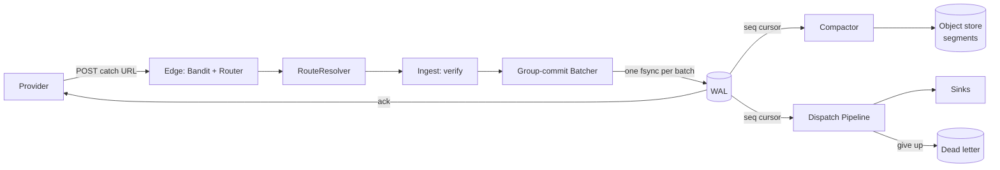
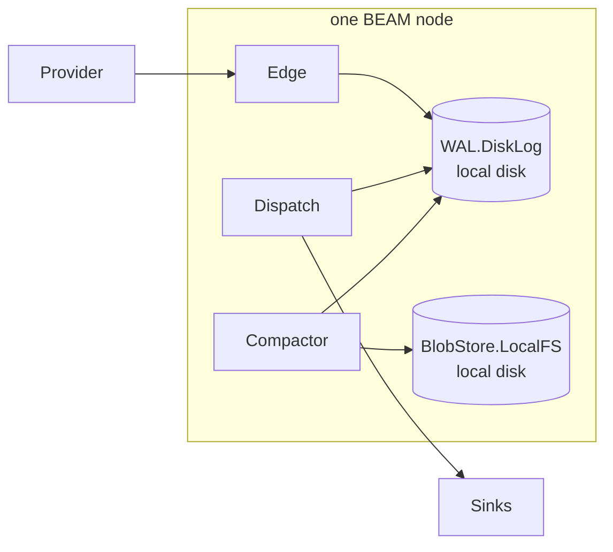
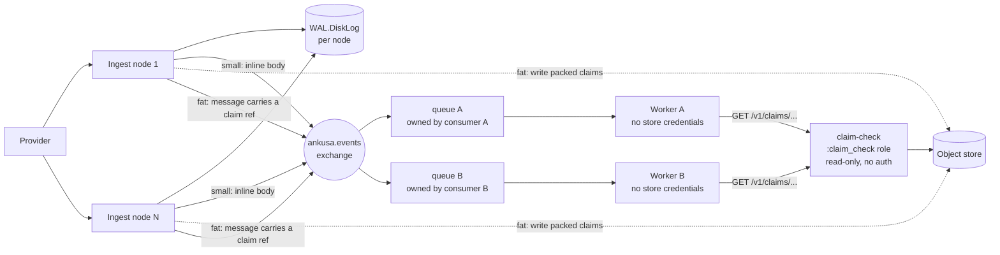

# Architecture

## The core invariant

**Never return `2xx` until the hook is durably stored.** Every other design
decision in this framework is downstream of that one sentence.

- **Crash before commit:** no `2xx` was sent. The provider retries. Nothing
  was lost because nothing was promised.
- **Crash after commit, before the HTTP response leaves:** the provider
  retries anyway (it never saw the `2xx`). Ingest does no deduplication, so
  that retry is a new hook: a fresh `id` and the next `seq`, stored and
  delivered again. Delivery is at-least-once; consumers are idempotent
  receivers.
- **Store slow or down:** `503` with `Retry-After`. Never ack what wasn't
  saved, ever, under any load condition.

The one loss window this can't close is a provider that doesn't retry on a
timeout or `5xx`. That's their contract, not a bug here — document it to
whoever's provider you're catching.

The default single-node setup (`WAL.DiskLog` + `BlobStore.LocalFS`) survives
process crash and power loss **on that box** — not loss of the box. The
startup log says so, in one line, on purpose: durability claims should never
be quietly stronger than what's actually true. `WAL.DiskLog` is the only WAL:
it holds its index in-process and is local to one BEAM node, so run every WAL
role together and scale out with independent nodes — see
[Deployment topologies](#deployment-topologies).

## The pipeline

```mermaid
flowchart LR
    P[Provider] -->|POST catch URL| E[Edge: Bandit + Router]
    E --> RR[RouteResolver]
    RR --> IG[Ingest: verify]
    IG --> B[Group-commit Batcher]
    B -->|one fsync per batch| W[(WAL)]
    W -->|ack| P
    W -->|seq cursor| C[Compactor]
    W -->|seq cursor| D[Dispatch Pipeline]
    C --> S[(Object store\nsegments)]
    D --> SK[Sinks]
    D -->|give up| DLQ[(Dead letter)]
```

Ingest and dispatch are **fully decoupled**. Compaction and dispatch are
competing consumers reading the WAL by `seq` cursor — neither is an RPC
caller of the other, and neither is an RPC target of the edge. Take the
compactor down: ingest keeps acking, the WAL grows, an alarm fires,
nothing is lost. Take dispatch down: same story, hooks just wait
longer to be delivered, and its cursor resumes where it left off. This is
the "durable state, not RPC" rule and it
holds at every boundary in the system, including across separate adapter
packages (see [`packaging.md`](packaging.md)) and across independent nodes,
which share nothing but the provider's traffic.

## Request path, step by step

1. **`Ankusa.Edge.Router`** (`Plug.Router` under Bandit) matches any path via a
   catch-all `POST`, enforces `max_body_bytes` while reading the body, and
   hands off to `Ankusa.RouteResolver.resolve/2` — the pluggable seam that
   turns a URL into `%Ankusa.Route{source_id, tenant_id}`. See
   [`multi-tenancy.md`](multi-tenancy.md).
2. **`Ankusa.Edge.Ingest`** looks the resolved `source_id` up via
   `Ankusa.SourceStore`, builds a `%Ankusa.Envelope{}` (raw body kept
   byte-for-byte verbatim — signature checks need the exact bytes, not a
   re-serialized copy), and runs the source's `Ankusa.Verifier`.
   - Verification failure follows the source's `on_verify_failure` policy:
     `:reject` (`401`, nothing stored), `:quarantine` (`202`, held in a
     rate-limited durable pen — see [`delivery.md`](delivery.md)), or
     `:accept_flag` (commits anyway, envelope marked `flagged: true`).
3. **`Ankusa.Edge.Batcher`** (one GenServer per partition, default two)
   receives the envelope and **blocks the caller** until the batch it lands
   in commits. The flush to the WAL runs in a `Task`, so the batcher keeps
   accepting while a commit is in flight — the next batch accumulates behind
   it and commits the instant the previous one returns. `max_batch`
   (default 256) bounds one batch, `max_delay_ms` (default 0) adds no linger.
   Every blocked caller is replied to only after that commit returns; that's
   what makes the ack honest. The queue is bounded (`max_queue`, default
   10,000, counting buffered *and* in-flight records): full means `503` with
   `Retry-After`, never a promise the store can't back.
4. **`Ankusa.WAL`** commits durably and returns `{:committed, envelope}` (with
   `seq` assigned) per record, in the original order. The edge maps this to
   `201`/`202`/`401`/`404`/`413`/`503`; a body it cannot read at all (client
   disconnect, read timeout) is `400`, kept distinct from `413` rather than
   reported as "too large".

From here, ingest is done. Two independent consumers tail the WAL by `seq`:

- **`Ankusa.Storage.Compactor`** reads everything past its cursor, encodes many
  records into one immutable segment via `Ankusa.Codec`, `PUT`s it to
  `Ankusa.BlobStore`, appends index rows, advances its cursor, and truncates
  the WAL through `min(compactor_seq, dispatch_seq)` — records dispatch
  hasn't consumed yet are never dropped, at-least-once delivery survives
  compaction. Detail in [`storage.md`](storage.md).
- **`Ankusa.Dispatch.Pipeline`** reads everything past its cursor and delivers
  each envelope to every one of the source's `Ankusa.Sink`s, up to
  `dispatch.concurrency` deliveries at a time and serialized per
  `c:Ankusa.Sink.ordering_key/2`, retrying per the source's
  `Ankusa.RetryPolicy` and dead-lettering on give-up. Detail in
  [`delivery.md`](delivery.md).

## Guarantees, by component

| Component | Guarantee |
| --- | --- |
| `WAL.DiskLog` | Append-only, length-prefixed, CRC32-per-record log. Replay validates every CRC and **drops a torn trailing frame** — a write that started but never `fsync`'d, so it was never acked either. No un-acked write is ever surfaced as if it were durable. |
| Group-commit batcher | One process per partition; the WAL append runs in a task, so commits pipeline while callers block until their own commit returns; bounded queue (buffered + in-flight) sheds load as `503` rather than queuing unboundedly. |
| Ingest | Every accepted POST is durably stored and answered `201 accepted`, and `201` is the only committed response — there is no `200`. Ingest does no deduplication, so a provider retry after a lost ack is a new hook with a new `id`, stored and delivered again. Consumer contract in [`delivery.md`](delivery.md#idempotent-receivers). |
| Compactor | Never writes one object per hook — packs many WAL records into one immutable segment. Truncates only through `min(compactor, dispatch)`. |
| Dispatch | At-least-once to every sink, concurrent up to `dispatch.concurrency` and serialized per `c:Ankusa.Sink.ordering_key/2`, exponential backoff with jitter, dead-letter on give-up, a raising sink retried rather than fatal, durable watermark cursor survives restart. |
| Quarantine | Token-bucket rate-limited (100 burst, 20/s refill) durable pen — a bad secret rotation can't silently eat real events, and a flood of forged requests can't fill the disk. |

## Instance model

Every process is registered through a single `Registry` (`Ankusa.Registry`)
with a `via` tuple keyed by instance name (`Ankusa.via(instance, key)`) — there
are no global process names anywhere in the framework. That's what makes two
independent instances runnable in one VM (and what makes the test suite
`async: true`-safe for anything that doesn't share on-disk state).

Config is a `%Ankusa.Config{}` struct built once and passed down the
supervision tree at start (`Ankusa.Instance`'s `init/1`), then cached in
`:persistent_term` for read-mostly access — no `Application.get_env/2`
buried in call sites, and instance-scoped config falls out of the struct for
free.

**Roles** (`:edge`, `:dispatch`, `:storage`) boot independently based on
`config.roles`. The same release runs all three on a laptop, and `roles` is
still a runtime config decision — but `WAL.DiskLog` is local to one BEAM node,
so every WAL role must live together in that node; see
[Deployment topologies](#deployment-topologies). No component may require
another to be *reachable at runtime*; they only ever hand off through the WAL
and the object store.

## Deployment topologies

The same code runs unmodified in each of these — only config changes
(`wal:`, `storage.blob_store:`, `roles:`/`ANKUSA_ROLES`, and which sinks a
source declares). None of these diagrams require a different release
artifact from any other; they're the same supervision tree
(`Ankusa.Instance`'s `init/1`) booting a different subset of children with
different adapter tuples. Operational how-tos live in
[`deployment.md`](deployment.md); adapter details in
[`storage.md`](storage.md) and [`delivery.md`](delivery.md).

### 1. Laptop / single container — the default

One process, every role. Nothing else to run: no broker, no database, no object
store.

```mermaid
flowchart LR
    P[Provider] --> E[Edge]
    subgraph Node["one BEAM node"]
        E --> WAL[("WAL.DiskLog\nlocal disk")]
        Disp[Dispatch] --> WAL
        Comp[Compactor] --> WAL
        Comp --> BS[("BlobStore.LocalFS\nlocal disk")]
    end
    Disp --> SK[Sinks]
```

`mix run --no-halt` / `iex -S mix`, or the single-container image in
[`examples/rabbitmq-consumer/`](https://github.com/jamescarr/ankusa/tree/main/examples/rabbitmq-consumer/). Durable to
process crash and power loss on that box; not to losing the box.

### 2. Splitting roles across nodes is not supported

`WAL.DiskLog` keeps its record index in-process and reclaims space by renaming
the log file, so a second OS process would never see writes it didn't make and
would rewrite the file under the first one. Every role that touches the WAL —
`edge`, `dispatch`, `storage` — must therefore live in **one BEAM node**;
running them as separate containers or hosts pointed at one log is not a
supported topology. The one role you can split off is `:claim_check`, which
never touches the WAL at all and can run anywhere, its own node included.

### 3. Queue fan-out to independent consumers

An ingest fleet publishes to a RabbitMQ exchange (`Sink.RabbitMQ`, separate
`ankusa_rabbitmq` package), a Kafka topic (`Sink.Kafka`, separate
`ankusa_kafka` package), or a NATS JetStream subject (`Sink.NATS`, separate
`ankusa_nats` package); either way fat payloads are checked in through
`Ankusa.ClaimCheck` with only a claim reference on the queue, and the message
itself is the same `Ankusa.Sink.Message`. With RabbitMQ each consumer owns its
**own** queue and binding — the framework never declares one, so adding a
fifth consumer later is a change on the consumer side only, not a config
change here. Kafka has no bindings: the consumer side owns a consumer group
instead, and one that wants SQS or another broker in between runs a bridge
(see [`examples/kafka-sqs-consumer/`](https://github.com/jamescarr/ankusa/tree/main/examples/kafka-sqs-consumer/)).

Each ingest node here is an ordinary all-role node — the topology-1 shape, with
its own `WAL.DiskLog` — and the nodes share nothing but the broker and the
provider's traffic. Give each node **its own bucket** (or its own LocalFS
directory) for segments: segment keys are `seg/<first_seq>-<last_seq>.seg` and
remote blob stores ignore the instance, so nodes sharing one bucket overwrite
each other's segments.

```mermaid
flowchart LR
    P[Provider] --> E1[Ingest node 1]
    P --> E2[Ingest node N]
    E1 & E2 --> WAL[("WAL.DiskLog\nper node")]
    E1 & E2 -->|small: inline body| X(("ankusa.events\nexchange"))
    E1 & E2 -.fat: write packed claims.-> Obj[("Object store")]
    E1 & E2 -->|"fat: message carries a claim ref"| X
    X --> QA[queue A\nowned by consumer A]
    X --> QB[queue B\nowned by consumer B]
    QA --> CA[Worker A\nno store credentials]
    QB --> CB[Worker B\nno store credentials]
    CA & CB -->|GET /v1/claims/...| CC["claim-check\n:claim_check role\nread-only, no auth"]
    CC --> Obj
```

A consumer that shouldn't hold object-store credentials (any worker, in any
language, or a third party) redeems the reference with `GET /v1/claims/...`
against a `claim_check`-role node instead of reading the object store — the
gateway is read-only and does no authentication; whatever fronts it decides
who may read what. See [`claim-check.md`](claim-check.md) for the API and the
reference format.

Worked end to end, dockerized, in
[`examples/rabbitmq-consumer/`](https://github.com/jamescarr/ankusa/tree/main/examples/rabbitmq-consumer/).

These compose: every node runs the full pipeline locally and publishes to the
broker, so scaling ingest with more nodes and adding queue consumers are two
independent config changes on the same architecture, not a different one.

## Telemetry

Every stage emits `:telemetry` events under the `[:ankusa, ...]` prefix —
`ingest`, `commit`, `verify`, `load_shed`, `dispatch`, `compact`,
`quarantine`, `claim_check`. Components emit events; they never call each
other's reporters, so wiring a metrics/tracing backend is additive, never a
code change to the pipeline itself. See `Ankusa.Telemetry`'s moduledoc for
the full event list and measurement/metadata shapes.
