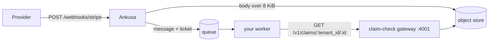

# Claim check

Webhook bodies can be megabytes; queue messages shouldn't be. When a RabbitMQ,
Kafka, or NATS sink gets a body larger than its `inline_max_bytes` (8 KiB by
default), Ankusa writes the body to the object store and publishes a small
**ticket** in its place. Your worker presents the ticket to the claim-check
gateway over HTTP and gets the exact bytes back.

The worker needs an HTTP client and nothing else: no Elixir, no cloud SDK, no
object-store credentials.



The machine-readable contract is
[`claim_check.v1.yaml`](https://github.com/jamescarr/ankusa/blob/main/priv/openapi/claim_check.v1.yaml)
(OpenAPI 3.2). Generate your client from it; this page explains how to use it.

## Run the gateway

The gateway is the `claim_check` role of the same image. It's off by default
because it serves stored payloads. It reads the same `storage` block as the
nodes that check payloads in, and needs no WAL:

```yaml
node:
  roles: [claim_check]

storage:
  type: s3
  s3:
    bucket: "${S3_BUCKET}"
    region: "${S3_REGION}"

claim_check:
  port: 4001            # [env ANKUSA_CLAIM_CHECK_PORT]
  max_bytes: 8000000
  tokens:               # optional: omit for an open gateway
    - token: "${CLAIM_CHECK_TOKEN}"
      tenants: all      # or a list: [acme, globex]
```

```sh
docker run -p 127.0.0.1:4001:4001 -v "$PWD/ankusa.yml:/etc/ankusa/ankusa.yml" \
  -e S3_BUCKET -e S3_REGION -e AWS_ACCESS_KEY_ID -e AWS_SECRET_ACCESS_KEY -e CLAIM_CHECK_TOKEN \
  jamescarr/ankusa:edge
curl localhost:4001/health    # {"status":"ok"}
```

A single container can run it next to the other roles instead
(`roles: [edge, dispatch, storage, claim_check]`), as
[`rabbitmq-fanout.yml`](https://github.com/jamescarr/ankusa/blob/main/ankusa_server/config-examples/rabbitmq-fanout.yml)
does. Either way, keep port 4001 on your internal network: it serves webhook
payloads.

## The ticket

A queue message carries either `body_base64` or a `claim` — the ticket
([full message format](delivery.md#sinkrabbitmq--queue-delivery)):

```json
{"v": 1, "tenant_id": "acme", "id": "0199a1c2-7b3e-7d4a-9c1f-2e5b8a6d4f10",
 "size": 3145728, "sha256": "9f86d081884c7d659a2feaa0c55ad015a3bf4f1b2b0b822cd15d6c15b0f00a08",
 "content_type": "application/json"}
```

| Field | Use it for |
| --- | --- |
| `v` | Format version, always `1`. Reject any other value rather than guess. |
| `tenant_id` | First path segment. The hook's tenant — `default` when the source has none. |
| `id` | Second path segment. A lowercase UUIDv7, the same as the message's `id`. |
| `size` | Byte length. Check it against what you receive. |
| `sha256` | Lowercase hex digest. Check it against what you receive. |
| `content_type` | The provider's content type. Advisory; may be `null` or absent. |

A ticket holds no URL or storage key. You build the path from `tenant_id` and
`id`, and the gateway derives the storage key itself, so a ticket can only ever
fetch its own claim.

## Redeem a claim

```
GET /v1/claims/{tenant_id}/{id}
authorization: Bearer <token>        (only if the gateway has tokens)
```

Percent-encode `tenant_id`. A `200` returns the raw bytes as
`application/octet-stream`.

**The gateway doesn't check integrity** — the URL carries no size or digest, so
only the ticket holder can. Compare `size` and `sha256` before you use the
bytes, and treat a mismatch as permanent.

```sh
curl -fsS -H "authorization: Bearer $CLAIM_CHECK_TOKEN" \
  http://claim-check:4001/v1/claims/acme/0199a1c2-7b3e-7d4a-9c1f-2e5b8a6d4f10 -o body.bin
shasum -a 256 body.bin    # must equal the ticket's sha256
```

### Responses

Errors are JSON: `{"error": "not_found"}`.

| Status | `error` | Cause | Retry? |
| --- | --- | --- | --- |
| `200` | — | the bytes | — |
| `400` | `invalid_tenant`, `invalid_id` | empty or over-256-byte tenant; id isn't a lowercase UUIDv7 | No — a bug |
| `401` | `unauthorized` | missing or unknown bearer token | No — fix config |
| `403` | `forbidden_tenant` | the token isn't scoped to this tenant | No — fix config |
| `404` | `not_found` | no claim: expired by retention, or never checked in | No — dead-letter |
| `503` | `store_unavailable` | the object store is unreachable; `Retry-After: 1` | Yes |
| — | — | bytes don't match `size`/`sha256` (your check) | No — dead-letter |

Redeeming doesn't delete. Several consumers can redeem one claim — every queue
bound to a fanout exchange, say — and claims go away only through
[retention](#retention).

### From TypeScript, with a generated client

Generate the types from the spec, and let `openapi-fetch` build the request:

```sh
npx openapi-typescript claim_check.v1.yaml -o src/claim-check-schema.d.ts
npm install openapi-fetch
```

```typescript
import createClient from "openapi-fetch";
import { createHash } from "node:crypto";
import type { components, paths } from "./claim-check-schema.d.ts";

type Ticket = components["schemas"]["Ticket"];

const claimCheck = createClient<paths>({
  baseUrl: process.env.CLAIM_CHECK_URL ?? "http://localhost:4001",
  headers: { authorization: `Bearer ${process.env.CLAIM_CHECK_TOKEN}` },
});

async function redeemClaim(claim: Ticket): Promise<Buffer> {
  const { data, error, response } = await claimCheck.GET("/v1/claims/{tenant_id}/{id}", {
    params: { path: { tenant_id: claim.tenant_id, id: claim.id } },
    parseAs: "arrayBuffer",
  });
  if (error) throw new Error(`redeem failed (${response.status}): ${JSON.stringify(error)}`);

  const body = Buffer.from(data as ArrayBuffer);
  const sha256 = createHash("sha256").update(body).digest("hex");
  if (body.length !== claim.size || sha256 !== claim.sha256) {
    throw new Error(`integrity mismatch for ${claim.tenant_id}/${claim.id}`);
  }
  return body;
}
```

The workers in
[`rabbitmq-consumer`](https://github.com/jamescarr/ankusa/tree/main/examples/rabbitmq-consumer/worker)
and
[`kafka-sqs-consumer`](https://github.com/jamescarr/ankusa/tree/main/examples/kafka-sqs-consumer/worker)
are complete versions: `npm run generate:types` regenerates the client, and
`redeemClaim` sorts failures into dead-letter (`404`, other `4xx`, integrity)
and retry (`5xx`, network). Any other OpenAPI generator — `openapi-generator`,
`openapi-python-client` — works against the same file.

## Check a payload in

Ankusa's sinks check bodies in on their own. `PUT` is for your own producers
that want the same offload:

```sh
curl -XPUT http://claim-check:4001/v1/claims/acme/0199a1c2-7b3e-7d4a-9c1f-2e5b8a6d4f10 \
  -H "authorization: Bearer $CLAIM_CHECK_TOKEN" \
  -H 'content-type: application/json' \
  -H "x-ankusa-sha256: $(shasum -a 256 big.json | cut -d' ' -f1)" \
  --data-binary @big.json
# 201 {"ticket":{"v":1,"tenant_id":"acme","id":"0199a1c2-...","size":...,"sha256":"...","content_type":"application/json"}}
```

- **You choose the id**, and it must be a lowercase UUIDv7. Retrying a `PUT`
  with the same id rewrites the same object, so check-in is idempotent.
- **Publish after the `201`, never before.** The ticket comes back only once the
  write is durable.
- **Never reuse an id for different bytes.** The new bytes replace the old ones,
  and every earlier ticket for that id then fails its `sha256` check.
- `x-ankusa-sha256` is optional. If it doesn't match the body the gateway
  received, the response is `422 integrity_mismatch` and nothing is stored.
- A body over `claim_check.max_bytes` gets `413 payload_too_large`.

`PUT` returns the same `400`, `401`, `403`, and `503` errors as `GET`.

## Authentication

Tokens are optional:

- **With `claim_check.tokens`**, every `/v1/claims` request needs
  `authorization: Bearer <token>`. `tenants: all` authorizes every tenant; a list
  authorizes exactly those. The gateway compares SHA-256 hashes of tokens and
  never logs them.
- **Without it**, the gateway is open, and authentication is whatever fronts the
  port — a proxy, a service mesh, network policy.

`/health` never needs a token. Tokens are static config; changing them means a
restart.

## Nodes without storage credentials

A node that checks payloads in — any node running `dispatch` with a queue sink —
writes to the object store with its own `storage` settings. To keep
object-store credentials off that node, send its check-ins through a gateway
instead:

```yaml
claim_check:
  remote: {url: "http://claim-check.internal:4001", token: "${CLAIM_CHECK_TOKEN}"}
```

Check-ins happen during dispatch, after the hook is already durable, so a
gateway outage delays delivery (the sink retries) and never loses a hook. A node
still needs storage credentials if it runs the `storage` role.

The node refuses to boot if:

- `remote` is set on a node that also runs `claim_check` — it would call itself.
- `claim_check.max_bytes` is below `http.max_body_bytes` on a `dispatch` node —
  a hook the edge accepted could then never be checked in.
- `retention_days` is set and storage isn't `local` (see below).

## Retention

**Retention has to outlast your slowest consumer.** A claim that expires before
it's redeemed is the one way a claim check loses data: the worker gets `404`.
Cover the longest a message can sit in any queue, plus however long you might
wait before replaying a dead letter.

- **S3 or GCS:** add a lifecycle rule on the `claims/` prefix. Ankusa doesn't
  expire these for you.

  ```sh
  aws s3api put-bucket-lifecycle-configuration --bucket "$S3_BUCKET" \
    --lifecycle-configuration '{"Rules":[{"ID":"ankusa-claims","Status":"Enabled",
      "Filter":{"Prefix":"claims/"},"Expiration":{"Days":14}}]}'
  ```

- **Local storage:** set `claim_check.retention_days` on the node running the
  `storage` role. It dates each claim from the timestamp inside its UUIDv7 id and
  deletes the expired ones every hour.

## Storage layout

Claims live at `claims/<tenant_id>/<id>` in the storage bucket, beside the
`seg/` segment files, which lifecycle rules and the sweeper never touch. The
tenant is percent-encoded — every byte outside `[A-Za-z0-9_-]` — so no tenant
can escape its prefix, and deleting one tenant's claims is a prefix delete.

## Not supported yet

- **Presigned URLs.** Every redeemed byte passes through the gateway.
- **Bodies over `max_bytes`.** No streaming or multipart.
- **Signed tickets.** Don't hand tickets to anyone outside your trust boundary.
- **Listing or deleting claims** over the API.

## From Elixir

Embedding the library? `Ankusa.ClaimCheck.check_in/4` and
`Ankusa.ClaimCheck.redeem/3` are the same operations in-process — `redeem/3`
runs the integrity check for you:

```elixir
{:ok, ticket} = Ankusa.ClaimCheck.check_in(:default, body, %{tenant_id: "acme", id: id})
{:ok, ^body} = Ankusa.ClaimCheck.redeem(:default, ticket)
```

The default adapter, `Ankusa.ClaimCheck.Direct`, uses the instance's blob store;
`Ankusa.ClaimCheck.Remote` calls a gateway over the API above. Config keys:
[`configuration.md`](configuration.md#library-configuration-elixir). Callbacks,
error reasons, and telemetry events: [HexDocs](https://hexdocs.pm/ankusa).
