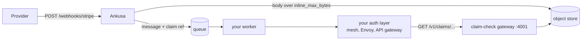

# Claim check

Webhook bodies can be megabytes; queue messages shouldn't be. When a RabbitMQ,
Kafka, or NATS sink gets a body larger than its `inline_max_bytes` (64 KiB by
default), Ankusa writes the body to the object store and publishes a small
**reference** in its place. Your worker turns the reference into an HTTP GET
and gets the exact bytes back — with an HTTP client and nothing else: no
Elixir, no cloud SDK, no object-store credentials.



The machine-readable contract is
[`claim_check.v1.yaml`](https://github.com/jamescarr/ankusa/blob/main/priv/openapi/claim_check.v1.yaml)
(OpenAPI 3.1). Generate your client from it; this page explains how to use it.

## The reference

A queue message carries either `body_base64` or a `claim` — one reference
string ([full message format](delivery.md#sinkrabbitmq--queue-delivery)):

```
urn:ankusa:claim:v1:acme:0199a1c2-7b3e-7d4a-9c1f-2e5b8a6d4f10:66:3145728:sha256-3bea8a9a07c1e8dcaa4c1b816815c35a29b4fb585ba6ecc70ea44840a794cfb3
                    └tenant┘└────────── object id ───────────┘└offset┘└length┘└───────────────────────── sha256 ────────────────────────────┘
```

| Segment | Meaning |
| --- | --- |
| `tenant` | `[A-Za-z0-9_-]{1,64}`. The same string in the reference, the URL, and the storage key — no encoding anywhere. |
| `object id` | The id of the object holding the claim. Several claims share one object (see [Write cost](#write-cost)). |
| `offset`, `length` | Where the claim's bytes sit inside that object. |
| `sha256` | Lowercase hex digest of the claim's bytes. Always present; the reader checks it. |

A reference grants nothing and names no bucket or URL. You turn it into a
request by dropping the prefix and the digest:

```
urn:ankusa:claim:v1:acme:0199a1c2-7b3e-7d4a-9c1f-2e5b8a6d4f10:66:3145728:sha256-...
                                   → GET /v1/claims/acme/0199a1c2-7b3e-7d4a-9c1f-2e5b8a6d4f10/66/3145728
```

## Run the gateway

The gateway is the `claim_check` role of the same image, and it is read-only:
no writes, no listing, no delete. It reads the same `storage` block as the
nodes that write claims, and needs no WAL:

```yaml
node:
  roles: [claim_check]

storage:
  type: s3
  s3:
    bucket: "${S3_BUCKET}"
    region: "${S3_REGION}"

claim_check:
  port: 4001            # [env ANKUSA_CLAIM_CHECK_PORT]
  pack_max_bytes: 16777216
```

```sh
docker run -p 127.0.0.1:4001:4001 -v "$PWD/ankusa.yml:/etc/ankusa/ankusa.yml" \
  -e S3_BUCKET -e S3_REGION -e AWS_ACCESS_KEY_ID -e AWS_SECRET_ACCESS_KEY \
  jamescarr/ankusa:edge
curl localhost:4001/health    # {"status":"ok"}
```

A single container can run it next to the other roles
(`roles: [edge, dispatch, storage, claim_check]`), as
[`rabbitmq-fanout.yml`](https://github.com/jamescarr/ankusa/blob/main/ankusa_server/config-examples/rabbitmq-fanout.yml)
does. Either way, keep port 4001 on your internal network: it serves webhook
payloads.

**The gateway does no authentication or authorization.** Who may read what is
decided in front of it — a service mesh, Envoy, an API gateway, a cloud load
balancer with OIDC. It logs a warning saying so at startup, the same as the
admin API.

## Redeem a claim

```
GET /v1/claims/{tenant}/{object_id}/{offset}/{length}
```

A `200` returns exactly `length` bytes at `offset`, as
`application/octet-stream`, with `cache-control: public, max-age=31536000,
immutable` — objects are written once and never rewritten, so they're safe to
cache forever.

**The gateway doesn't check integrity** — the path carries no digest, so only
the holder of the reference can. Compare the bytes' sha256 against the
reference's before you use them, and treat a mismatch as permanent.

```sh
curl -fsS http://claim-check:4001/v1/claims/acme/0199a1c2-7b3e-7d4a-9c1f-2e5b8a6d4f10/66/3145728 -o body.bin
shasum -a 256 body.bin    # must equal the sha256 in the reference
```

### Responses

Errors are JSON: `{"error": "not_found"}`.

| Status | `error` | Cause | Retry? |
| --- | --- | --- | --- |
| `200` | — | the bytes, cacheable forever | — |
| `400` | `invalid_tenant`, `invalid_id`, `invalid_range` | tenant outside `[A-Za-z0-9_-]{1,64}`; id not a lowercase UUIDv7; a malformed offset or length | No — a bug |
| `404` | `not_found` | no such object: expired by retention, or never written | No — dead-letter |
| `416` | `invalid_range` | the range runs past the end of a real object | No — a bug |
| `503` | `store_unavailable` | the object store is unreachable; `Retry-After: 1` | Yes |
| — | — | bytes don't match the reference's sha256 (your check) | No — dead-letter |

Redeeming doesn't delete. Several consumers can redeem one claim — every queue
bound to a fanout exchange, say — and claims go away only through
[retention](#retention).

### What a front layer needs

The whole integration surface for auth is one method and one path shape:

```
^/v1/claims/[A-Za-z0-9_-]{1,64}/[0-9a-f]{8}-[0-9a-f]{4}-7[0-9a-f]{3}-[89ab][0-9a-f]{3}-[0-9a-f]{12}/(0|[1-9][0-9]{0,11})/[1-9][0-9]{0,11}$
```

Anything else can be refused at the edge. The tenant is a path segment, so an
authorizer compares it to the caller's identity without reading a body. One
rule matters more than the rest: **a shared cache must sit behind the
authorizer, never in front of it** — a cache in front would serve one tenant's
payload to another tenant's request.

### From TypeScript, with a generated client

Generate the types from the spec, and let `openapi-fetch` build the request:

```sh
npx openapi-typescript claim_check.v1.yaml -o src/claim-check-schema.d.ts
npm install openapi-fetch
```

```typescript
import createClient from "openapi-fetch";
import { createHash } from "node:crypto";
import type { paths } from "./claim-check-schema.d.ts";

const claimCheck = createClient<paths>({ baseUrl: process.env.CLAIM_CHECK_URL ?? "http://localhost:4001" });

// claim is the URN from the queue message: 9 colon-separated segments.
function parseClaimRef(claim: string) {
  const parts = claim.split(":");
  if (parts.length !== 9 || !claim.startsWith("urn:ankusa:claim:v1:")) throw new Error("bad ref");
  return {
    tenant_id: parts[4],
    object_id: parts[5],
    offset: parts[6],
    length: parts[7],
    digest: parts[8].slice("sha256-".length),
  };
}

async function redeemClaim(claim: string): Promise<Buffer> {
  const { tenant_id, object_id, offset, length, digest } = parseClaimRef(claim);
  const { data, error, response } = await claimCheck.GET("/v1/claims/{tenant_id}/{object_id}/{offset}/{length}", {
    params: { path: { tenant_id, object_id, offset, length } },
    parseAs: "arrayBuffer",
  });
  if (error) throw new Error(`redeem failed (${response.status}): ${JSON.stringify(error)}`);

  const body = Buffer.from(data as ArrayBuffer);
  const sha256 = createHash("sha256").update(body).digest("hex");
  if (body.length !== Number(length) || sha256 !== digest) {
    throw new Error(`integrity mismatch for ${tenant_id}/${object_id}`);
  }
  return body;
}
```

The workers in
[`rabbitmq-consumer`](https://github.com/jamescarr/ankusa/tree/main/examples/rabbitmq-consumer/worker)
and
[`kafka-sqs-consumer`](https://github.com/jamescarr/ankusa/tree/main/examples/kafka-sqs-consumer/worker)
are complete versions: `npm run generate:types` regenerates the client, and
`redeemClaim` sorts failures into dead-letter (`404`, other `4xx`, integrity)
and retry (`5xx`, network). Any other OpenAPI generator — `openapi-generator`,
`openapi-python-client` — works against the same file.

## Write cost

Object stores bill per write: S3 Standard and GCS regional Standard both charge
around $0.005 per 1,000 writes, and reads are $0.0004 per 1,000. Only bodies
over a sink's `inline_max_bytes` become claims at all, and dispatch writes them
**once per envelope** (it used to write per sink and per retry). Two more
levers keep writes cheap:

- **The threshold is configurable per sink.** The 64 KiB default is chosen so
  most webhook bodies ride inline — base64 turns it into about 88 KiB, under
  Kafka's 1 MiB `max.message.bytes` and SQS's 256 KiB. Raise or lower
  `inline_max_bytes` per sink; the cost moves to broker bytes.
- **Claims are packed.** Dispatch holds up to `dispatch.batch` (128) hooks per
  WAL read, checks each batch's claims in per tenant as one object, and gives
  every hook a byte range inside it — one `PUT` per tenant per batch instead of
  one per hook, with no added latency (the batch is already in hand). A group
  bigger than `claim_check.pack_max_bytes` (16 MiB default) splits into several
  objects; a body bigger than that gets an object of its own.

| Fat hooks/day | One object per claim | 32 claims per object |
| --- | --- | --- |
| 100k | ~$15/month | ~$0.47/month |
| 1M | ~$150/month | ~$4.69/month |
| 10M | ~$1,500/month | ~$46.88/month |

### Pack format

Every claim object is an uncompressed ZIP: one entry per claim, named by the
claim's id, plus a `manifest.json` listing each claim's offset, length, digest,
content type, and receive time. The gateway never parses it — a reference's
offset points straight at one entry's bytes — but `unzip`, Python's `zipfile`,
Java, Go, and Erlang all read the pack with no Ankusa code. It's the same
end-of-file index Parquet uses. Entries stay uncompressed because a compressed
entry has no raw byte range to serve.

## Storage layout

Claims live at

```
claims/tenant=acme/dt=2026-09-24/0199a1c2-7b3e-7d4a-9c1f-2e5b8a6d4f10
```

in the storage bucket, beside the `seg/` segments. `dt` is the UTC date inside
the object id's UUIDv7 timestamp, so the key is computable from the reference.
Hive-style `key=value` folders are what Spark and Databricks partition
discovery, BigQuery, and Athena read without configuration.

## Retention

**Retention has to outlast your slowest consumer.** A claim that expires before
it's redeemed is the one way a claim check loses data: the worker gets `404`.
Cover the longest a message can sit in any queue, plus however long you might
wait before replaying a dead letter.

- **S3 or GCS:** add a lifecycle rule on the `claims/` prefix. Ankusa doesn't
  expire these for you.

  ```sh
  aws s3api put-bucket-lifecycle-configuration --bucket "$S3_BUCKET" \
    --lifecycle-configuration '{"Rules":[{"ID":"ankusa-claims","Status":"Enabled",
      "Filter":{"Prefix":"claims/"},"Expiration":{"Days":14}}]}'
  ```

- **Local storage:** set `claim_check.retention_days` on the node running the
  `storage` role. It deletes whole `dt=` day directories once everything in them
  is past retention, every hour.

## Reading claims from a data platform

A claim is read two ways, and both work without Ankusa code on the reading
side:

- **Application services** use the gateway (above).
- **Databricks, Snowflake, BigQuery, Athena** read the bucket directly under
  their own governance — Unity Catalog external locations, Snowflake external
  stages, BigQuery object tables. Pulling each claim through an HTTP call per
  row from Spark executors is slow, and Databricks serverless compute needs
  private connectivity set up to reach an internal endpoint at all.

Those platforms need three things:

- **The key layout as a second, documented read contract** — Hive-style folders,
  no encoding.
- **Hex digests.** Spark and Snowflake `sha2(x, 256)`, `sha256sum`, and
  `hashlib.hexdigest()` all produce hex, so a reader compares directly.
- **A flat `claim` string** in the message, plus the offset and length for a
  packed claim (Spark's `binaryFile` source plus Python's `zipfile` in a UDF, or
  slice with `substring(content, offset + 1, length)`).

No connectors or per-platform guides ship with Ankusa; this is the contract they
read.

## Not supported yet

- **Presigned URLs.** Every redeemed byte passes through the gateway.
- **Bodies over `max_body_bytes`.** No streaming or multipart.
- **A write API.** Ankusa's dispatch nodes are the only writers. A standalone
  claim-check service with a `PUT` for other producers is possible — the
  reference, layout, and read route already don't depend on the webhook
  pipeline — but it's a separate piece of work.
- **Listing or deleting claims** over the API.

## From Elixir

Embedding the library? `Ankusa.ClaimCheck.check_in/4` checks a batch's claims in
for one tenant, `check_in_batch/2` groups many tenants and splits packs, and
`redeem/2` fetches a reference's bytes and runs the sha256 check for you:

```elixir
{:ok, refs} = Ankusa.ClaimCheck.check_in(:default, "acme", [%{id: id, body: body}])
{:ok, ^body} = Ankusa.ClaimCheck.redeem(:default, refs[id])
```

Config keys: [`configuration.md`](configuration.md#library-configuration-elixir).
Callbacks, error reasons, and telemetry events: [HexDocs](https://hexdocs.pm/ankusa).
