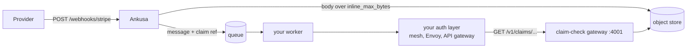

# Claim check

Webhook bodies can be megabytes; queue messages shouldn't be. When a RabbitMQ,
Kafka, or NATS sink gets a body larger than its `inline_max_bytes` (64 KiB by
default), Ankusa writes the body to the object store and publishes a small
**reference** in its place. Your worker turns the reference into an HTTP GET
and gets the exact bytes back, with an HTTP client and nothing else: no
Elixir, no cloud SDK, no object-store credentials.


```mermaid
flowchart LR
    P[Provider] -->|POST /webhooks/stripe| A[Ankusa]
    A -->|body over inline_max_bytes| S[(object store)]
    A -->|message + claim ref| Q[(queue)]
    Q --> W[your worker]
    W --> F[your auth layer<br/>mesh, Envoy, API gateway]
    F -->|GET /v1/claims/...| G[claim-check gateway :4001]
    G --> S
```

The machine-readable contract is
[`claim_check.v1.yaml`](https://github.com/jamescarr/ankusa/blob/main/packages/ankusa/priv/openapi/claim_check.v1.yaml)
(OpenAPI 3.1). Generate your client from it; this page explains how to use it.

## The reference

A queue message carries either `body_base64` or a `claim` plus its `sha256`
([full message format](delivery.md#sinkrabbitmq--queue-delivery)):

```json
{"claim": "urn:ankusa:claim:v1:acme:01M39VMD8RA3C5HR4RBV67Y002",
 "sha256": "3bea8a9a07c1e8dcaa4c1b816815c35a29b4fb585ba6ecc70ea44840a794cfb3"}
```

```
urn:ankusa:claim:v1:acme:01M39VMD8RA3C5HR4RBV67Y002
                    └┬─┘ └─────────┬──────────────┘
                   tenant       claim id
```

| Field | Meaning |
| --- | --- |
| `tenant` | `[A-Za-z0-9_-]{1,64}`. The same string in the reference, the URL, and the storage key, no encoding anywhere. |
| `claim id` | A [ULID](https://github.com/ulid/spec) in canonical form: 26 uppercase Crockford base32 characters. The first 48 bits are the time the claim's pack was written; the last 16 are the claim's position in that pack. Several claims share one pack (see [Write cost](#write-cost)). |
| `sha256` | A message field next to `claim`, not part of the reference: the lowercase hex digest of the claim's bytes. The reader checks it. |

A reference grants nothing and names no bucket or URL. You turn it into a
request by dropping the prefix:

```
urn:ankusa:claim:v1:acme:01M39VMD8RA3C5HR4RBV67Y002
                    → GET /v1/claims/acme/01M39VMD8RA3C5HR4RBV67Y002
```

## Run the gateway

The gateway is the `claim_check` role of the same image, and it is read-only:
no writes, no listing, no delete. It reads the same `storage` block as the
nodes that write claims, and needs no WAL:

```yaml
node:
  roles: [claim_check]

storage:
  type: s3
  s3:
    bucket: "${S3_BUCKET}"
    region: "${S3_REGION}"

claim_check:
  port: 4001            # [env ANKUSA_CLAIM_CHECK_PORT]
  pack_max_bytes: 16777216
```

```sh
docker run -p 127.0.0.1:4001:4001 -v "$PWD/ankusa.yml:/etc/ankusa/ankusa.yml" \
  -e S3_BUCKET -e S3_REGION -e AWS_ACCESS_KEY_ID -e AWS_SECRET_ACCESS_KEY \
  jamescarr/ankusa:edge
curl localhost:4001/health    # {"status":"ok"}
```

A single container can run it next to the other roles
(`roles: [edge, dispatch, storage, claim_check]`), as
[`rabbitmq-fanout.yml`](https://github.com/jamescarr/ankusa/blob/main/packages/ankusa_server/config-examples/rabbitmq-fanout.yml)
does. Either way, keep port 4001 on your internal network: it serves webhook
payloads.

**The gateway does no authentication or authorization.** Who may read what is
decided in front of it: a service mesh, Envoy, an API gateway, a cloud load
balancer with OIDC. It logs a warning saying so at startup, the same as the
admin API.

## Redeem a claim

```
GET /v1/claims/{tenant}/{claim_id}
```

A `200` returns exactly the claim's bytes, as `application/octet-stream`,
with `cache-control: public, max-age=31536000, immutable`. Claims are written
once and never rewritten, so they're safe to cache forever.

**The gateway doesn't check integrity**: the path carries no digest, so only
the holder of the message can. Compare the bytes' sha256 against the
message's `sha256` before you use them, and treat a mismatch as permanent.

```sh
curl -fsS http://claim-check:4001/v1/claims/acme/01M39VMD8RA3C5HR4RBV67Y002 -o body.bin
shasum -a 256 body.bin    # must equal the message's sha256
```

### Responses

Errors are JSON: `{"error": "not_found"}`.

| Status | `error` | Cause | Retry? |
| --- | --- | --- | --- |
| `200` |  | the bytes, cacheable forever |  |
| `400` | `invalid_tenant`, `invalid_id` | tenant outside `[A-Za-z0-9_-]{1,64}`; claim id not a canonical ULID | No, a bug |
| `404` | `not_found` | no such claim: expired by retention, or never written | No, dead-letter |
| `503` | `store_unavailable` | the object store is unreachable; `Retry-After: 1` | Yes |
|  |  | bytes don't match the message's sha256 (your check) | No, dead-letter |

Redeeming doesn't delete. Several consumers can redeem one claim, every queue
bound to a fanout exchange, say, and claims go away only through
[retention](#retention).

### What a front layer needs

The whole integration surface for auth is one method and one path shape:

```
^/v1/claims/[A-Za-z0-9_-]{1,64}/[0-7][0-9A-HJKMNP-TV-Z]{25}$
```

Anything else can be refused at the edge. The tenant is a path segment, so an
authorizer compares it to the caller's identity without reading a body. One
rule matters more than the rest: **a shared cache must sit behind the
authorizer, never in front of it**. A cache in front would serve one tenant's
payload to another tenant's request.

### From TypeScript, with the SDK

[`packages/sdk-typescript`](https://github.com/jamescarr/ankusa/tree/main/packages/sdk-typescript)
(npm package `ankusa`) wraps a client generated from the spec with
`openapi-typescript` + `openapi-fetch`: it parses a ref, redeems it, and
verifies the bytes against the message's sha256 before returning them: the
gateway does not check this itself. It's the framework's own
umbrella client package: the claim-check client is the first piece in it.

```sh
npm install ankusa   # or, before its first npm release, a `file:` path
                      # dep, see the package README
```

```typescript
import { ClaimCheckError, createClaimCheckClient } from "ankusa";

const claimCheck = createClaimCheckClient({ baseUrl: process.env.CLAIM_CHECK_URL ?? "http://localhost:4001" });

// claim and sha256 are the queue message's fields.
async function redeemClaim(claim: string, sha256: string): Promise<Buffer> {
  return claimCheck.redeem(claim, sha256);
}
```

Every failure is a `ClaimCheckError` with a `retryable` boolean: `false` for
a malformed ref, `404`, other `4xx`, or an integrity mismatch; `true` for
`5xx`/`503` or an unreachable gateway. So sorting a redeem failure into
dead-letter vs. retry needs no status-code knowledge. The workers in
[`rabbitmq-consumer`](https://github.com/jamescarr/ankusa/tree/main/examples/rabbitmq-consumer/worker)
and
[`kafka-sqs-consumer`](https://github.com/jamescarr/ankusa/tree/main/examples/kafka-sqs-consumer/worker)
depend on it.

### From Python, with the SDK

[`packages/sdk-python`](https://github.com/jamescarr/ankusa/tree/main/packages/sdk-python)
(PyPI package `ankusa`) ships a `ClaimCheckClient` built on
[`httpx`](https://www.python-httpx.org/) against the same contract: it
parses a ref, redeems it, and verifies the bytes against the message's sha256
before returning them, the same end-to-end check the TypeScript client runs
and the gateway itself does not. It's the umbrella client
package for non-Elixir consumers: the claim-check client is the first piece
in it, alongside a webhook header-parsing helper for the HTTP-sink side.

```sh
pip install ankusa   # or, before its first PyPI release, a uv/pip local
                      # path dep, see the package README
```

```python
import os

from ankusa import ClaimCheckClient, ClaimCheckError

claim_check = ClaimCheckClient(os.environ.get("CLAIM_CHECK_URL", "http://localhost:4001"))

# claim and sha256 are the queue message's fields.
def redeem_claim(claim: str, sha256: str) -> bytes:
    return claim_check.redeem(claim, sha256)
```

Every failure is a `ClaimCheckError` subclass with a `retryable` attribute:
`False` for a malformed ref, `404`, other `4xx`, or an integrity mismatch;
`True` for `5xx`/`503` or an unreachable gateway, the same dead-letter vs.
retry split as the TypeScript client.

### Any other language

Any OpenAPI generator, `openapi-generator`, `openapi-python-client`, works
against the same
[`claim_check.v1.yaml`](https://github.com/jamescarr/ankusa/blob/main/packages/ankusa/priv/openapi/claim_check.v1.yaml).

## Write cost

Object stores bill per write: S3 Standard and GCS regional Standard both charge
around $0.005 per 1,000 writes, and reads are $0.0004 per 1,000. Only bodies
over a sink's `inline_max_bytes` become claims at all, and dispatch writes them
**once per envelope** (it used to write per sink and per retry). Under
`wal.type: none` the request process is the writer (`Ankusa.Edge.Publish`) and
it keeps the same property: one check-in per envelope, before the first sink
runs, shared by every sink of that source. Two more levers keep writes cheap:

- **The threshold is configurable per sink.** The 64 KiB default is chosen so
  most webhook bodies ride inline: base64 turns it into about 88 KiB, under
  Kafka's 1 MiB `max.message.bytes` and SQS's 256 KiB. Raise or lower
  `inline_max_bytes` per sink; the cost moves to broker bytes.
- **Claims are packed.** Dispatch holds up to `dispatch.batch` (128) hooks per
  WAL read, checks each batch's claims in per tenant as one object, and gives
  every hook a byte range inside it: one `PUT` per tenant per batch instead of
  one per hook, with no added latency (the batch is already in hand). A group
  bigger than `claim_check.pack_max_bytes` (16 MiB default) splits into several
  objects; a body bigger than that gets an object of its own.

Packs never mix tenants, so the write count is one per *tenant present* in a
batch. A tenant with thousands of distinct values, an account id say, keeps
every tenant's claims in objects of its own, which is what lets you delete
one tenant's data by deleting one prefix; the cost is that a batch spread
across 128 accounts is 128 writes, the "one object per claim" column below.

| Fat hooks/day | One object per claim | 32 claims per object |
| --- | --- | --- |
| 100k | ~$15/month | ~$0.47/month |
| 1M | ~$150/month | ~$4.69/month |
| 10M | ~$1,500/month | ~$46.88/month |

### Pack format

Every claim object is an uncompressed ZIP, in this order:

1. `index.bin`: one 8-byte row per claim, in position order: the byte offset
   of the claim's bytes in the pack and their length, each a big-endian
   unsigned 32-bit integer.
2. One entry per claim, named by its claim id.
3. `manifest.json`: each claim's claim id, hook id, offset, length, digest,
   content type, and receive time.

The gateway serves a claim with two ranged reads: the start of the pack
through the claim's index row, then the claim's bytes. The index comes first
so no read needs the pack's size. `unzip`, Python's `zipfile`, Java, Go, and
Erlang all read the pack with no Ankusa code, through the ZIP central
directory at the end. Entries stay uncompressed because a compressed entry
has no raw byte range to serve.

## Storage layout

Claims live at

```
claims/tenant=acme/dt=2026-09-24/01M39VMD8RA3C5HR4RBV67Y000
```

in the storage bucket, beside the `seg/` segments. The last segment is the
pack id: any of its claim ids with the position bits (the last three
characters, plus the lowest bit of the fourth-from-last) zeroed. `dt` is the
UTC date of the id's timestamp, so the key is computable from the reference.
Hive-style `key=value` folders are what Spark and Databricks partition
discovery, BigQuery, and Athena read without configuration.

## Retention

**Retention has to outlast your slowest consumer.** A claim that expires before
it's redeemed is the one way a claim check loses data: the worker gets `404`.
Cover the longest a message can sit in any queue, plus however long you might
wait before replaying a dead letter.

- **S3 or GCS:** add a lifecycle rule on the `claims/` prefix. Ankusa doesn't
  expire these for you.

  ```sh
  aws s3api put-bucket-lifecycle-configuration --bucket "$S3_BUCKET" \
    --lifecycle-configuration '{"Rules":[{"ID":"ankusa-claims","Status":"Enabled",
      "Filter":{"Prefix":"claims/"},"Expiration":{"Days":14}}]}'
  ```

- **Local storage:** set `claim_check.retention_days` on the node running the
  `storage` role. It deletes whole `dt=` day directories once everything in them
  is past retention, every hour.

## Reading claims from a data platform

A claim is read two ways, and both work without Ankusa code on the reading
side:

- **Application services** use the gateway (above).
- **Databricks, Snowflake, BigQuery, Athena** read the bucket directly under
  their own governance: Unity Catalog external locations, Snowflake external
  stages, BigQuery object tables. Pulling each claim through an HTTP call per
  row from Spark executors is slow, and Databricks serverless compute needs
  private connectivity set up to reach an internal endpoint at all.

Those platforms need three things:

- **The key layout as a second, documented read contract**: Hive-style folders,
  no encoding.
- **Hex digests.** Spark and Snowflake `sha2(x, 256)`, `sha256sum`, and
  `hashlib.hexdigest()` all produce hex, so a reader compares directly.
- **A flat `claim` string** in the message whose claim id is also the claim's
  entry name in its pack (Spark's `binaryFile` source plus Python's
  `zipfile` in a UDF), and a `manifest.json` with each claim's offset and
  length to slice with `substring(content, offset + 1, length)`.

No connectors or per-platform guides ship with Ankusa; this is the contract they
read.

## Not supported yet

- **Presigned URLs.** Every redeemed byte passes through the gateway.
- **Bodies over `max_body_bytes`.** No streaming or multipart.
- **A write API.** Ankusa's dispatch nodes are the only writers. A standalone
  claim-check service with a `PUT` for other producers is possible, the
  reference, layout, and read route already don't depend on the webhook
  pipeline, but it's a separate piece of work.
- **Listing or deleting claims** over the API.

## From Elixir

Embedding the library? `Ankusa.ClaimCheck.check_in/4` checks a batch's claims in
for one tenant, `check_in_batch/2` groups many tenants and splits packs, and
`redeem/3` fetches a reference's bytes and runs the sha256 check for you:

```elixir
{:ok, claims} = Ankusa.ClaimCheck.check_in(:default, "acme", [%{id: id, body: body}])
%{ref: ref, sha256: sha256} = claims[id]
{:ok, ^body} = Ankusa.ClaimCheck.redeem(:default, ref, sha256)
```

Config keys: [`configuration.md`](configuration.md#library-configuration-elixir).
Callbacks, error reasons, and telemetry events: [HexDocs](https://hexdocs.pm/ankusa).
