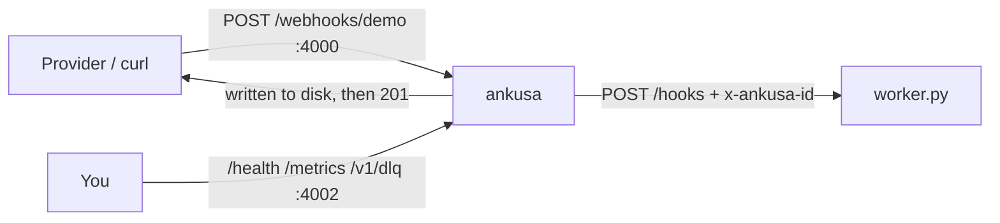

# Quickstart

Run Ankusa and a worker you own, send webhooks, then break the worker and watch
nothing get lost. All you need is Docker with Compose v2.

## 1. Start Ankusa and a worker

```sh
git clone https://github.com/jamescarr/ankusa
cd ankusa/examples/quickstart
docker compose up -d --wait
```



[`ankusa.yml`](https://github.com/jamescarr/ankusa/blob/main/examples/quickstart/ankusa.yml)
declares one source (`demo`) with one HTTP sink pointed at the worker;
[`worker.py`](https://github.com/jamescarr/ankusa/blob/main/examples/quickstart/worker.py)
is a standard-library HTTP server that prints what it receives.

## 2. Send a webhook

```sh
curl -XPOST localhost:4000/webhooks/demo -H 'content-type: application/json' -d '{"id":"evt_1","type":"invoice.paid"}'
# => {"id":"01a0...","status":"accepted","seq":1}

sleep 1 && docker compose logs worker
# received id=01a0... source=demo seq=1 bytes=36 body={"id":"evt_1","type":"invoice.paid"}
```

The `201` returns only after the hook is on disk — that is
[the core invariant](architecture.md#the-core-invariant), not a formality.

## 3. Provider retries are absorbed

Providers retry. Send the identical request again:

```sh
curl -XPOST localhost:4000/webhooks/demo -H 'content-type: application/json' -d '{"id":"evt_1","type":"invoice.paid"}'
# => {"id":"01a0...","status":"duplicate","seq":1}
```

The worker log gains nothing, because Ankusa deduped on the body's `id` before
delivery. The provider still gets a `2xx`, so it stops retrying.

## 4. When your worker goes down

### Short outage — retried until it comes back

```sh
docker compose stop worker
curl -XPOST localhost:4000/webhooks/demo -H 'content-type: application/json' -d '{"id":"evt_2"}'
docker compose start worker
sleep 10 && docker compose logs worker | grep evt_2
```

The provider still got its `201`: Ankusa holds the hook and retries delivery
until the worker answers or the retry budget runs out.

### Long outage — dead-lettered, then replayed

```sh
docker compose stop worker
curl -XPOST localhost:4000/webhooks/demo -H 'content-type: application/json' -d '{"id":"evt_3"}'
sleep 20
curl -s localhost:4002/v1/dlq
# => {"total":1,"entries":[{"id":"01a0...","source_id":"demo",...}]}
docker compose start worker
sleep 1
curl -XPOST localhost:4002/v1/dlq/replay -d '{"source_id":"demo"}'
# => {"replayed":1}
sleep 1 && docker compose logs worker | grep evt_3
```

`ankusa.yml` caps retries at 6 attempts (roughly 8–15s, jitter included) so this
drill takes seconds; the default is 12 attempts backing off to 30s.

### Replay is safe

Run the replay call again:

```sh
curl -XPOST localhost:4002/v1/dlq/replay -d '{"source_id":"demo"}'
# => {"replayed":1}
sleep 1 && docker compose logs worker | grep 'duplicate id='
# duplicate id=01a0... source=demo (already handled)
```

Entries stay in the dead-letter queue after a replay, so replaying twice is
normal. Redelivery is harmless because the worker dedupes on `x-ankusa-id` —
here with an in-memory set, which a real worker replaces with a unique key in
its database.

## 5. Look inside

```sh
curl localhost:4002/health
# => {"status":"ok","instance":"default","roles":["dispatch","edge","storage"]}
curl -s localhost:4002/metrics | grep ankusa_ingest_requests_total
curl localhost:4002/v1/config      # the effective config, secrets redacted
curl localhost:4002/v1/quarantine  # hooks held after a failed verification
```

Port 4002 is unauthenticated, so never publish it — the compose file binds it to
`127.0.0.1` only.

## 6. Point a real provider at it

Add the provider as a second source under `sources:` in `ankusa.yml`:

```yaml
  stripe:
    verify: {type: stripe, secret: "${STRIPE_WHSEC}", tolerance_seconds: 300}
    dedup_key: {type: stripe}
    on_verify_failure: quarantine
    sinks:
      - {type: http, url: "http://worker:8080/hooks"}
```

Pass the secret in as an environment variable by adding `environment:
[STRIPE_WHSEC]` to the `ankusa` service, then check the file before starting:

```sh
STRIPE_WHSEC=whsec_... docker compose run --rm ankusa check-config
# config OK: roles=[:edge, :dispatch, :storage] sources=demo,stripe ...
STRIPE_WHSEC=whsec_... docker compose up -d
```

A bad file exits `78` and names the field. Expose ingest with a tunnel, then set
the provider's endpoint to `<tunnel>/webhooks/stripe`:

```sh
ngrok http 4000     # or cloudflared / tailscale funnel
```

GitHub and Standard Webhooks sources are the same shape with a different
`verify.type`: [`configuration.md`](configuration.md#sources).

## Ingest responses

- `201` — accepted, durably stored
- `200` — duplicate, already stored
- `202` — quarantined after a failed verification
- `400` — body unreadable
- `401` — verification failed
- `404` — unknown source
- `413` — body over `max_body_bytes`
- `503` — overloaded; retry later

The catch URL is `/webhooks/:source_id` by default; a tenant-in-the-URL scheme
is one config line away — see [`multi-tenancy.md`](multi-tenancy.md).

## Clean up

```sh
docker compose down -v
```

## Where next

- Every YAML key: [`configuration.md`](configuration.md)
- Roles, fleets, the container: [`deployment.md`](deployment.md)
- Sinks, retries, the dead-letter queue, quarantine: [`delivery.md`](delivery.md)
- Oban, Celery, and queue handoff: [`integrations.md`](integrations.md)
- All the examples: [examples/README.md](https://github.com/jamescarr/ankusa/blob/main/examples/README.md)
- Embedding in an Elixir app instead: [`elixir.md`](elixir.md)
