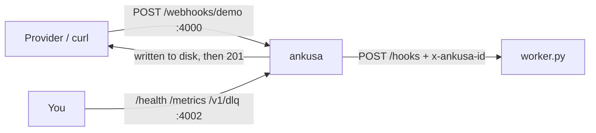

# Quickstart

Run Ankusa and a worker you own, send webhooks, then break the worker and watch
nothing get lost. All you need is Docker with Compose v2.

## 1. Start Ankusa and a worker

```sh
git clone https://github.com/jamescarr/ankusa
cd ankusa/examples/quickstart
docker compose up --build -d --wait
```


```mermaid
flowchart LR
    P[Provider / curl] -->|POST /webhooks/demo :4000| A[ankusa]
    A -->|written to disk, then 201| P
    A -->|POST /hooks + x-ankusa-id| W[worker.py]
    O[You] -->|/health /metrics /v1/dlq :4002| A
```

[`ankusa.yml`](https://github.com/jamescarr/ankusa/blob/main/examples/quickstart/ankusa.yml)
declares one source (`demo`) with one HTTP sink pointed at the worker;
[`worker.py`](https://github.com/jamescarr/ankusa/blob/main/examples/quickstart/worker.py)
is a small [FastAPI](https://fastapi.tiangolo.com/) app that prints what it receives.

## 2. Send a webhook

```sh
curl -XPOST localhost:4000/webhooks/demo -H 'content-type: application/json' -d '{"id":"evt_1","type":"invoice.paid"}'
# => {"id":"01a0...","status":"accepted"}

sleep 1 && docker compose logs worker
# received id=01a0... source=demo bytes=36 body={"id":"evt_1","type":"invoice.paid"}
```

The `201` returns only after the hook is durably accepted, that is
[the core invariant](architecture.md#the-core-invariant), not a formality.

## 3. Provider retries are stored again

Ingest does no deduplication. Send the identical request again and it is a new
hook and a new `id`, stored and delivered a second time:

```sh
curl -XPOST localhost:4000/webhooks/demo -H 'content-type: application/json' -d '{"id":"evt_1","type":"invoice.paid"}'
# => {"id":"01b1...","status":"accepted"}
```

That is at-least-once on purpose: the provider's retry contract is honored
without an ingest-side dedup table, and your worker is the idempotent receiver
(see [Replay is safe](#replay-is-safe) below, and
[`delivery.md`](delivery.md#idempotent-receivers)).

## 4. When your worker goes down

### Short outage: retried until it comes back

```sh
docker compose stop worker
curl -XPOST localhost:4000/webhooks/demo -H 'content-type: application/json' -d '{"id":"evt_2"}'
docker compose start worker
sleep 10 && docker compose logs worker | grep evt_2
```

The provider still got its `201`: Ankusa holds the hook and retries delivery
until the worker answers or the retry budget runs out.

### Long outage: dead-lettered, then replayed

```sh
docker compose stop worker
curl -XPOST localhost:4000/webhooks/demo -H 'content-type: application/json' -d '{"id":"evt_3"}'
sleep 20
curl -s localhost:4002/v1/dlq
# => {"total":1,"entries":[{"id":"01a0...","source_id":"demo",...}]}
docker compose start worker
curl -XPOST localhost:4002/v1/replays -d '{"kind":"dlq","source_id":"demo","rate":100}'
# => 202 {"id":"01a0...","kind":"dlq","state":"running","filter":{"source_id":"demo"},...}
sleep 1 && docker compose logs worker | grep evt_3
```

`ankusa.yml` caps retries at 6 attempts (roughly 8–15s, jitter included) so this
drill takes seconds; the default is 12 attempts backing off to 30s.

### Replay is safe

A replay is a durable job, not a one-shot flip: it drips dead rows back into
the delivery queue at `rate` items per second, and only while dispatch has
spare capacity (the oldest-due lag stays under `max_lag_ms`, 2 s by default),
so it can never flood a recovering sink or starve live traffic. Each replayed
delivery keeps the hook's original id and carries the job's `replay_id`.
Watch it and stop it anytime:

```sh
curl -s localhost:4002/v1/replays/<job-id>
# => {"state":"done","moved":1,"delivered":1,...}
curl -XPATCH localhost:4002/v1/replays/<job-id> -d '{"state":"cancelled"}'
```

Redelivery is still at-least-once, so the receiver stays idempotent: a hook
that reached the sink before it failed is delivered again with the same
`x-ankusa-id` and the same `x-ankusa-dedupe-key`, and the worker dedupes on
the latter — here with an in-memory set, which
a real worker replaces with a unique key in its database. In this drill the
worker was down for every attempt, so replay delivers evt_3 once and never
again.

## 5. Look inside

```sh
curl localhost:4002/health
# => {"status":"ok","instance":"default","roles":["dispatch","edge","storage"]}
curl -s localhost:4002/metrics | grep ankusa_ingest_requests_total
curl localhost:4002/v1/config      # the effective config, secrets redacted
curl localhost:4002/v1/quarantine  # hooks held after a failed verification
```

Port 4002 is unauthenticated, so never publish it: the compose file binds it to
`127.0.0.1` only.

## 6. Point a real provider at it

Add the provider as a second source under `sources:` in `ankusa.yml`:

```yaml
  stripe:
    verify: {type: stripe, secret: "${STRIPE_WHSEC}", tolerance_seconds: 300}
    on_verify_failure: quarantine
    sinks:
      - {type: http, url: "http://worker:8080/hooks"}
```

Pass the secret in as an environment variable by adding `environment:
[STRIPE_WHSEC]` to the `ankusa` service, then check the file before starting:

```sh
STRIPE_WHSEC=whsec_... docker compose run --rm ankusa check-config
# config OK: roles=[:edge, :dispatch, :storage] sources=demo,stripe ...
STRIPE_WHSEC=whsec_... docker compose up -d
```

A bad file exits `78` and names the field. Expose ingest with a tunnel, then set
the provider's endpoint to `<tunnel>/webhooks/stripe`:

```sh
ngrok http 4000     # or cloudflared / tailscale funnel
```

GitHub and Standard Webhooks sources are the same shape with a different
`verify.type`: [`configuration.md`](configuration.md#sources).

## Ingest responses

- `201`: accepted, durably so
- `202`: quarantined after a failed verification
- `400`: body unreadable
- `401`: verification failed
- `404`: unknown source
- `413`: body over `max_body_bytes`
- `503`: no durable destination right now (overload, the store could not take
  the commit, or a sink refused under `wal.type: none`); retry later

`201 accepted` is the only committed response, and it comes back only after a
durable accept: the store's synced commit (`wal.type: disk`, the default) or
every sink's confirm (`wal.type: none`); there is no `200`. Every accepted POST
is a new hook with a new `id`, and a provider retry after a lost ack is stored
and delivered again. Ingest does no deduplication.

The catch URL is `/webhooks/:source_id` by default; a tenant-in-the-URL scheme
is one config line away, see [`multi-tenancy.md`](multi-tenancy.md).

## Clean up

```sh
docker compose down -v
```

## Where next

- Every YAML key: [`configuration.md`](configuration.md)
- Roles, fleets, the container: [`deployment.md`](deployment.md)
- Sinks, retries, the dead-letter queue, quarantine: [`delivery.md`](delivery.md)
- Oban, Celery, and queue handoff: [`integrations.md`](integrations.md)
- All the examples: [examples/README.md](https://github.com/jamescarr/ankusa/blob/main/examples/README.md)
- Embedding in an Elixir app instead: [`elixir.md`](elixir.md)
