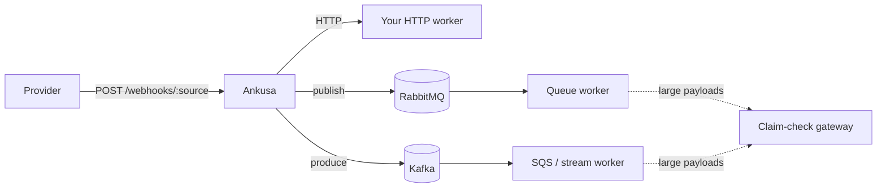
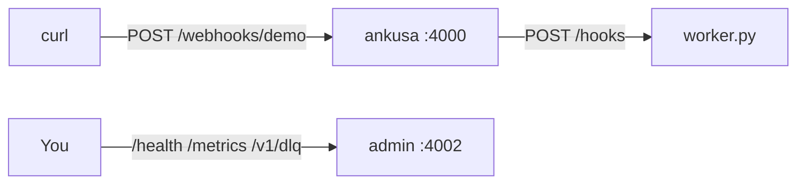
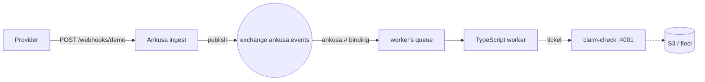
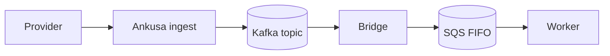
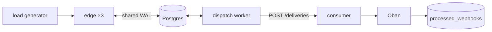

# Examples

Each one runs with Docker and ends with a worker you could replace with your own.

## Pick one

| Example | Delivers via | Worker | Needs | Run |
| --- | --- | --- | --- | --- |
| [quickstart](quickstart/) | HTTP | Python | docker | `docker compose up -d --wait` |
| [rabbitmq-consumer](rabbitmq-consumer/) | RabbitMQ | TypeScript | docker | `docker compose up --build` |
| [kafka-sqs-consumer](kafka-sqs-consumer/) | Kafka → SQS FIFO | TypeScript | docker | `docker compose up --build -d --wait` |
| [oban-consumer](oban-consumer/) | HTTP → Oban | Elixir | docker, kind, kubectl | `./run.sh` |

## quickstart

The smallest complete deployment: the published image receives a hook and POSTs
it to a 40-line Python worker. Nothing to build, no broker, no object store —
read this one first, and keep it as the shape to copy when you write your own
receiving service.

[`quickstart/`](quickstart/)

## rabbitmq-consumer

Ingest publishes to a RabbitMQ exchange and a TypeScript worker declares and
binds its own queue — the consumer owns topology, the framework never touches a
queue. Bodies over 8 KiB are checked in to S3 and the message carries a ticket,
which the worker redeems through the claim-check gateway.

[`rabbitmq-consumer/`](rabbitmq-consumer/)

## kafka-sqs-consumer

The same topology one transport over, plus the hop RabbitMQ doesn't need: a
Redpanda Connect bridge carries records from a Kafka topic into an SQS FIFO
queue, and the FIFO `MessageGroupId` keeps per-source order end to end. Its
README documents three failure drills — bridge down, worker down, poison claim.

[`kafka-sqs-consumer/`](kafka-sqs-consumer/)

## oban-consumer

A real Kubernetes (`kind`) deployment: three edge replicas on a shared Postgres
WAL, one dispatch+storage worker calling the consumer over HTTP, and Oban doing
the actual work. `tools/loadgen` drives three load phases — steady, chaos with
pods killed mid-run, and a closed-loop burst — and verifies every acknowledged
hook lands exactly once.

[`oban-consumer/`](oban-consumer/)

`rabbitmq-consumer`, `kafka-sqs-consumer`, and `oban-consumer` build their
ingest app from this repo's Elixir source, so you can see the library in use;
`quickstart` runs the published image instead.
