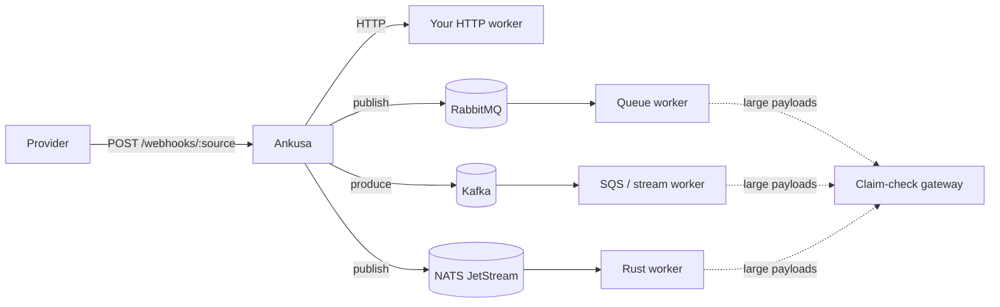
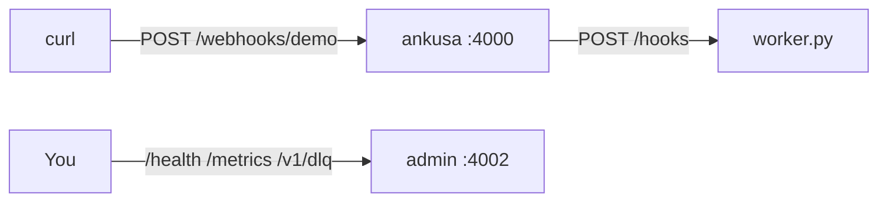
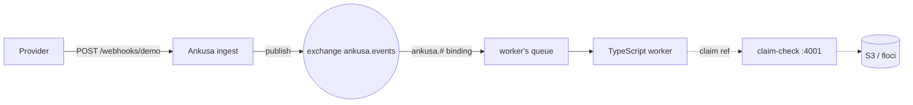
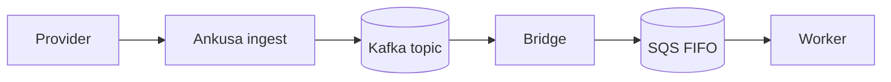
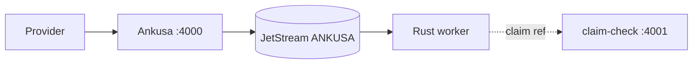
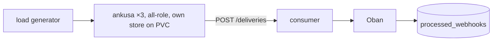

# Examples

Each one runs with Docker and ends with a worker you could replace with your own.

```mermaid
flowchart LR
    P[Provider] -->|POST /webhooks/:source| A[Ankusa]
    A -->|HTTP| H[Your HTTP worker]
    A -->|publish| R[(RabbitMQ)]
    A -->|produce| K[(Kafka)]
    A -->|publish| N[(NATS JetStream)]
    R --> QW[Queue worker]
    K --> SW[SQS / stream worker]
    N --> RW[Rust worker]
    QW & SW & RW -.->|large payloads| CC[Claim-check gateway]
```

## Pick one

| Example | Delivers via | Worker | Needs | Run |
| --- | --- | --- | --- | --- |
| [quickstart](quickstart/) | HTTP | Python (FastAPI, uv) | docker | `docker compose up --build -d --wait` |
| [rabbitmq-consumer](rabbitmq-consumer/) | RabbitMQ | TypeScript | docker | `docker compose up --build` |
| [kafka-sqs-consumer](kafka-sqs-consumer/) | Kafka → SQS FIFO | TypeScript | docker | `docker compose up --build -d --wait` |
| [nats-consumer](nats-consumer/) | NATS JetStream | Rust | docker | `docker compose up --build -d --wait` |
| [oban-consumer](oban-consumer/) | HTTP → Oban | Elixir | docker, kind, kubectl | `./run.sh` |

## quickstart

The smallest complete deployment: the published image receives a hook and POSTs
it to a small [FastAPI](https://fastapi.tiangolo.com/) worker built with `uv`,
using the `ankusa` Python SDK ([`packages/sdk-python`](../packages/sdk-python))
to parse the delivery's headers. No broker, no object store.
Read this one first, and keep it as the shape to copy when you write your own
receiving service.

```mermaid
flowchart LR
    C[curl] -->|POST /webhooks/demo| A[ankusa :4000]
    A -->|POST /hooks| W[worker.py]
    Y[You] -->|/health /metrics /v1/dlq| AD[admin :4002]
```

[`quickstart/`](quickstart/)

## rabbitmq-consumer

Ingest publishes to a RabbitMQ exchange and a TypeScript worker declares and
binds its own queue: the consumer owns topology, the framework never touches a
queue. Bodies over the sink's `inline_max_bytes` are checked in to S3 and the
message carries a claim ref URN, which the worker redeems through the
claim-check gateway.

```mermaid
flowchart LR
    P[Provider] -->|POST /webhooks/demo| I[Ankusa ingest]
    I -->|publish| X((exchange ankusa.events))
    X -->|ankusa.# binding| Q[worker's queue]
    Q --> W[TypeScript worker]
    W -.->|claim ref| CC[claim-check :4001]
    CC -.-> S[(S3 / floci)]
```

[`rabbitmq-consumer/`](rabbitmq-consumer/)

## kafka-sqs-consumer

The same topology one transport over, plus the hop RabbitMQ doesn't need: a
Redpanda Connect bridge carries records from a Kafka topic into an SQS FIFO
queue keyed by `tenant/source`, so one source's records land in one group. Its
README documents three failure drills: bridge down, worker down, poison claim.

```mermaid
flowchart LR
    P[Provider] --> I[Ankusa ingest]
    I --> K[(Kafka topic)]
    K --> B[Bridge]
    B --> Q[(SQS FIFO)]
    Q --> W[Worker]
```

[`kafka-sqs-consumer/`](kafka-sqs-consumer/)

## nats-consumer

The published image publishes each hook to a NATS JetStream subject, and a Rust
worker built on the published `ankusa` crate pulls them through a durable
consumer. The worker creates its own stream, redeems bodies over
`inline_max_bytes` through the claim-check gateway with `ClaimCheckClient`,
dedupes on the hook id, `nak`s a failure a retry can fix (the gateway
unreachable), and `term`s one it can't (bad JSON, a sha256 mismatch). No object
store: the claim-check gateway runs on the same node as everything else.

```mermaid
flowchart LR
    P[Provider] --> A[Ankusa :4000]
    A --> N[(JetStream ANKUSA)]
    N --> W[Rust worker]
    W -.->|claim ref| CC[claim-check :4001]
```

[`nats-consumer/`](nats-consumer/)

## oban-consumer

A real Kubernetes (`kind`) deployment: three self-contained Ankusa nodes, each
with its own on-disk store on a persistent volume, calling the consumer over
HTTP, with Oban doing the actual work. `tools/loadgen` drives three load phases,
steady, chaos with pods killed mid-run, and a closed-loop burst, and verifies
every acknowledged hook is delivered and processed.

```mermaid
flowchart LR
    L[load generator] --> N[ankusa ×3, all-role, own store on PVC]
    N -->|POST /deliveries| C[consumer]
    C --> OJ[Oban]
    OJ --> DB[(processed_webhooks)]
```

[`oban-consumer/`](oban-consumer/)

`rabbitmq-consumer`, `kafka-sqs-consumer`, and `oban-consumer` build their
ingest app from this repo's Elixir source, so you can see the library in use;
`quickstart` and `nats-consumer` run the published image instead.
