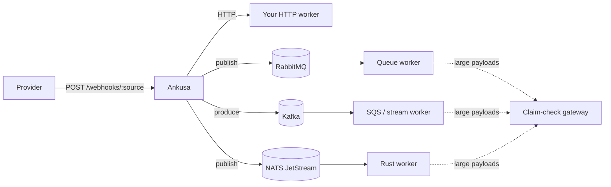
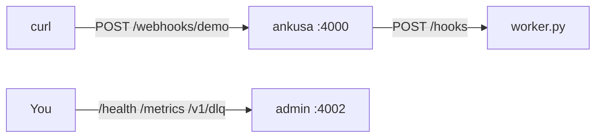
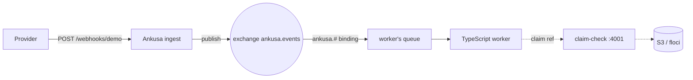
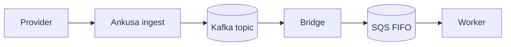
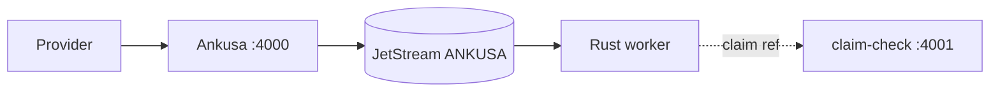
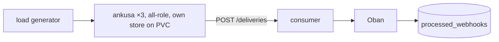
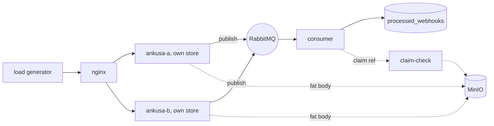
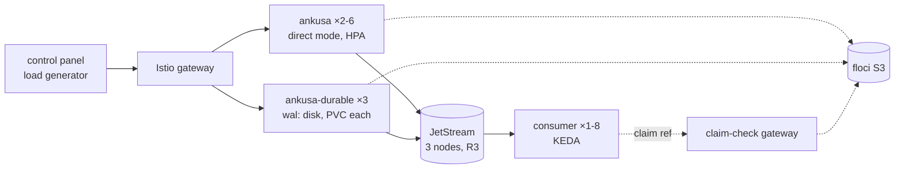

# Examples

Seven runnable demonstrations of the same receiver with a different last hop.
Each one ends in a worker you could replace with your own service; read the
[quickstart](quickstart/) first, then pick the transport you actually run.

```mermaid
flowchart LR
    P[Provider] -->|POST /webhooks/:source| A[Ankusa]
    A -->|HTTP| H[Your HTTP worker]
    A -->|publish| R[(RabbitMQ)]
    A -->|produce| K[(Kafka)]
    A -->|publish| N[(NATS JetStream)]
    R --> QW[Queue worker]
    K --> SW[SQS / stream worker]
    N --> RW[Rust worker]
    QW & SW & RW -.->|large payloads| CC[Claim-check gateway]
```

## Pick one

| Example | Delivers via | Worker | Needs | Run |
| --- | --- | --- | --- | --- |
| [quickstart](quickstart/) | HTTP | Python (FastAPI, uv) | docker | `docker compose up --build -d --wait` |
| [rabbitmq-consumer](rabbitmq-consumer/) | RabbitMQ | TypeScript | docker | `docker compose up --build` |
| [kafka-sqs-consumer](kafka-sqs-consumer/) | Kafka → SQS FIFO | TypeScript | docker | `docker compose up --build -d --wait` |
| [nats-consumer](nats-consumer/) | NATS JetStream | Rust | docker | `docker compose up --build -d --wait` |
| [oban-consumer](oban-consumer/) | HTTP → Oban | Elixir | docker, kind, kubectl | `./run.sh` |
| [fleet-e2e](fleet-e2e/) | RabbitMQ, two nodes behind nginx (or, from the Helm chart, on kind) | TypeScript (Postgres) | docker (kind, kubectl, helm for `./kind.sh`) | `./run.sh` |
| [jetstream-k8s](jetstream-k8s/) | NATS JetStream, two autoscaling fleets (kind + Helm + Istio) | TypeScript | docker, kind, kubectl, helm | `./run.sh` |

`quickstart` and `nats-consumer` run the published image. `rabbitmq-consumer`,
`kafka-sqs-consumer`, and `oban-consumer` build their ingest app from this
repo's Elixir source, so you can see the library in use. `fleet-e2e` builds the
server image from this checkout; `jetstream-k8s` does too unless you set
`ANKUSA_IMAGE` to a published tag.

## quickstart

The smallest complete deployment: the published image receives a hook and POSTs
it to a small [FastAPI](https://fastapi.tiangolo.com/) worker built with `uv`,
using the `ankusa` Python SDK ([`packages/sdk-python`](../packages/sdk-python))
to parse the delivery's headers. No broker, no object store. Keep it as the
shape to copy when you write your own receiving service.

```mermaid
flowchart LR
    C[curl] -->|POST /webhooks/demo| A[ankusa :4000]
    A -->|POST /hooks| W[worker.py]
    Y[You] -->|/health /metrics /v1/dlq| AD[admin :4002]
```

[`quickstart/`](quickstart/)

## rabbitmq-consumer

Ingest publishes to a RabbitMQ exchange and a TypeScript worker declares and
binds its own queue: the consumer owns the topology, and the framework never
touches a queue. A body over the sink's `inline_max_bytes` is checked in to S3
and the message carries a claim ref URN, which the worker redeems through the
claim-check gateway.

```mermaid
flowchart LR
    P[Provider] -->|POST /webhooks/demo| I[Ankusa ingest]
    I -->|publish| X((exchange ankusa.events))
    X -->|ankusa.# binding| Q[worker's queue]
    Q --> W[TypeScript worker]
    W -.->|claim ref| CC[claim-check :4001]
    CC -.-> S[(S3 / floci)]
```

[`rabbitmq-consumer/`](rabbitmq-consumer/)

## kafka-sqs-consumer

The same topology one transport over, plus the hop RabbitMQ does not need: a
Redpanda Connect bridge carries records from a Kafka topic into an SQS FIFO
queue with `message_group_id` set from the Kafka key (`tenant/source`), so one
source's records land in one group. Its README documents three failure drills:
bridge down, worker down, poison claim.

```mermaid
flowchart LR
    P[Provider] --> I[Ankusa ingest]
    I --> K[(Kafka topic)]
    K --> B[Bridge]
    B --> Q[(SQS FIFO)]
    Q --> W[Worker]
```

[`kafka-sqs-consumer/`](kafka-sqs-consumer/)

## nats-consumer

The published image publishes each hook to a NATS JetStream subject, and a Rust
worker built on the published `ankusa` crate pulls them through a durable
consumer. The worker creates its own stream, redeems bodies over
`inline_max_bytes` through the claim-check gateway with `ClaimCheckClient`,
dedupes on the hook id, `nak`s a failure a retry can fix (the gateway
unreachable), and `term`s one it cannot (bad JSON, a sha256 mismatch). No object
store: the claim-check gateway runs on the same node as everything else.

```mermaid
flowchart LR
    P[Provider] --> A[Ankusa :4000]
    A --> N[(JetStream ANKUSA)]
    N --> W[Rust worker]
    W -.->|claim ref| CC[claim-check :4001]
```

[`nats-consumer/`](nats-consumer/)

## oban-consumer

A real Kubernetes (`kind`) deployment: three self-contained Ankusa nodes, each
with its own on-disk store on a persistent volume, calling the consumer over
HTTP, with Oban doing the actual work. `tools/loadgen` drives three load
phases — steady, chaos with pods killed mid-run, and a closed-loop burst — and
verifies every acknowledged hook is delivered and processed.

```mermaid
flowchart LR
    L[load generator] --> N[ankusa ×3, all-role, own store on PVC]
    N -->|POST /deliveries| C[consumer]
    C --> OJ[Oban]
    OJ --> DB[(processed_webhooks)]
```

[`oban-consumer/`](oban-consumer/)

## fleet-e2e

The multi-node proof in plain Compose, run nightly in CI: nginx round-robins
over two Ankusa nodes that keep their own stores and share route and source
definitions (Redis) and a bucket (MinIO, distinct `storage.key_prefix` per
node). A claim-check gateway serves fat bodies to a TypeScript consumer that
records every hook in Postgres, and `run.sh` drives `tools/loadgen` through
steady, chaos (a node killed, a provider retry sent to the other node, the
consumer killed) and burst phases, then verifies that every acknowledged hook
was processed. `--wal dual --kill-node` runs the same drill under the intake log
and restores a replacement node from backup.

```mermaid
flowchart LR
    L[load generator] --> LB[nginx]
    LB --> A[ankusa-a, own store]
    LB --> B[ankusa-b, own store]
    A & B -->|publish| X((RabbitMQ))
    X --> C[consumer]
    C --> DB[(processed_webhooks)]
    A & B -.->|fat body| S[(MinIO)]
    C -.->|claim ref| CC[claim-check]
    CC -.-> S
```

[`fleet-e2e/`](fleet-e2e/)

## jetstream-k8s

A `kind` cluster installed with Helm, with an Istio ingress gateway (Envoy)
load-balancing webhooks across two fleets: stateless ankusa pods in direct mode
(`wal.type: none`, HPA on CPU) and a three-pod durable fleet (`wal.type: disk`,
a PVC each). Both publish to a three-node NATS JetStream cluster, and an
autoscaling TypeScript consumer (KEDA on JetStream lag) pulls from it. A Phoenix
LiveView control panel fires synthetic webhooks (rate, burst, payload size),
draws the flow live, tails the last 30 consumed hooks, and breaks things on
request: kill pods, cut a connection with an Istio `AuthorizationPolicy`,
inject `503`s or delay at the gateway. Bodies over the inline limit take the
claim-check path through an S3 emulator. Prometheus scrapes every ankusa pod,
and a provisioned Grafana dashboard shows ingest, store, dispatch, claim-check
and lifecycle metrics at `/grafana/`.

```mermaid
flowchart LR
    S[control panel\nload generator] --> G[Istio gateway]
    G --> A[ankusa ×2-6\ndirect mode, HPA]
    G --> D[ankusa-durable ×3\nwal: disk, PVC each]
    A --> N[(JetStream\n3 nodes, R3)]
    D --> N
    N --> C[consumer ×1-8\nKEDA]
    A -.-> F[(floci S3)]
    D -.-> F
    C -.->|claim ref| CC[claim-check gateway]
    CC -.-> F
```

[`jetstream-k8s/`](jetstream-k8s/)
