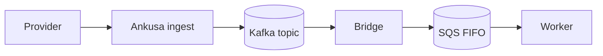
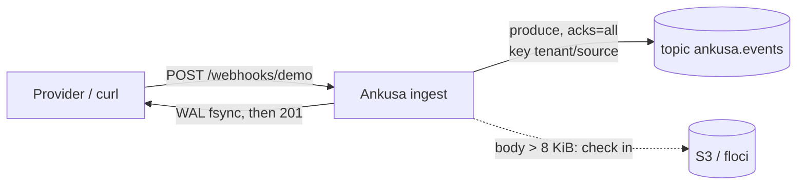
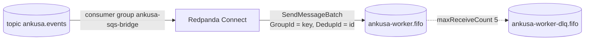
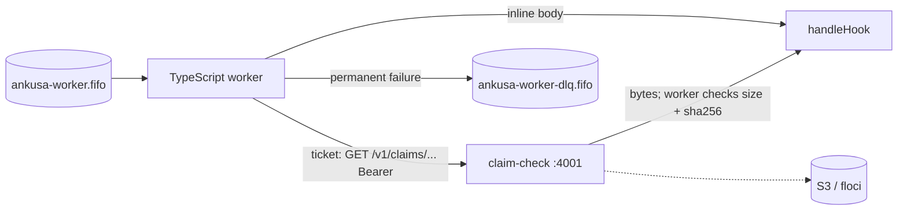

# Example: Kafka → SQS FIFO → worker

A complete deployed topology over Kafka, including the hop the RabbitMQ
example doesn't need: a **Messaging Bridge**, for when the consumer doesn't
speak Kafka. Ingest produces to a topic, Redpanda Connect carries records
into an SQS FIFO queue, and a TypeScript worker consumes the queue —
redeeming fat payloads through the Claim Check gateway
([`docs/claim-check.md`](../../docs/claim-check.md)) with no object-store
credentials of its own.



### Ingest



- `ingest/` — a real `Ankusa.Instance` (`ANKUSA_ROLES=edge,dispatch,storage`,
  the default) configured entirely from environment variables.
  `Ankusa.Sink.Kafka` produces every delivered hook to the `ankusa.events`
  topic, keyed `tenant_id/source_id`;
  `Ankusa.BlobStore.S3` backs both segment compaction (the framework's own
  async archival, `seg/...` keys) and the sink's fat-payload claim check
  (`claims/...` keys) — same bucket, same credentials, no separate storage
  code.
- `claim-check` — the **same image**, `ANKUSA_ROLES=claim_check` is the only
  difference. Its own listener (`:4001`), its own bearer token. Besides
  `ingest`, it's the only piece holding S3 credentials.

### Bridge



- `bridge/` — Redpanda Connect: `redpanda` input → metadata whitelist →
  `aws_sqs` output. It owns the consumer group (`ankusa-sqs-bridge`) and the
  queue URL; ingest knows neither exists. A Kafka topic has no bindings —
  the consumer side owns a consumer *group* instead, which is why this hop
  is a process and not a config line.

### Worker



- `worker/` — a minimal TypeScript consumer with **no S3 credentials at
  all**: SQS only, redeeming tickets over HTTP. It moves permanent failures
  to the DLQ explicitly and backs off transient ones.

### Supporting services

- `redpanda` / `redpanda-console` — the broker and a UI on `:8080` showing
  the topic, messages, and consumer-group lag (the RabbitMQ example's
  management-UI equivalent).
- `redpanda-bootstrap` — creates the topic (`-p 6 -r 1`). Topic ownership
  belongs to ops, never to the sink: partition count is an ordering and
  capacity contract, so `Ankusa.Sink.Kafka` will not create a topic even
  when it's missing.
- `aws-bootstrap` — creates the S3 bucket, the FIFO queue, and the DLQ with
  its redrive policy.
- `floci` — one local emulator for both S3 and SQS; stands in for real AWS.

## Small vs. fat payloads

Same contract as the RabbitMQ example, because it's the same message
(`Ankusa.Sink.Message`): the worker prints `via=inline` or
`via=claim:<id>`.

- **Small** (≤ `INLINE_MAX_BYTES`, 8 KiB here): base64 in the record value.
- **Fat**: checked in to S3, ticket in the record value. The worker GETs
  `/v1/claims/:tenant/:id` with a bearer token, then verifies `size` and
  `sha256` itself — integrity is checked where the bytes are used, never
  trusted from the gateway.

## Ordering and delivery, honestly

| Hop | Guarantee | Duplicates | Ordering |
| --- | --- | --- | --- |
| Provider → WAL | durable ack | deduped on `(tenant, source, dedup_key)` | — |
| WAL → Kafka | at-least-once, `acks=all` | yes, on a retried produce | per key, per dispatch node |
| Kafka → SQS | at-least-once (offset committed after SQS accepts) | absorbed within 5 minutes by the FIFO dedup id | per key (`max_in_flight: 1`, group = key) |
| SQS → worker | at-least-once (visibility timeout) | yes, after 5 minutes | per group, while the worker processes each group in order |
| **Consumer contract** | **idempotent on `id`** | | |

The FIFO queue is what carries Kafka's per-key order into SQS: the record
key becomes the `MessageGroupId`, and the envelope `id` becomes the
`MessageDeduplicationId`. FIFO costs throughput (roughly 300 msg/s per queue,
~3,000 batched) and head-of-line blocking *within a group* — one slow source
never stalls another, since the group is `tenant/source`.

## Run it

```sh
docker compose up --build -d --wait
```

Small hook:

```sh
curl -XPOST localhost:4000/webhooks/demo -H 'content-type: application/json' -d '{"id":"evt_1"}'
```

Fat hook (same endpoint, larger body):

```sh
python3 -c "import json;print(json.dumps({'id':'evt_2','items':[{'n':i} for i in range(2000)]}))" \
  | curl -XPOST localhost:4000/webhooks/demo -H 'content-type: application/json' --data-binary @-
```

Watch it land:

```sh
docker compose logs -f worker
# hook id=01a0... source=demo tenant=default
# group=default/demo size=24919 via=claim:01a0...
```

Tear down (including the topic, queues, and bucket):

```sh
docker compose down -v
```

## Failure drills

Each proves one thing. They're worth running by hand at least once.

1. **Bridge down** — `docker compose stop bridge`, then send a few hooks.
   Ingest keeps returning `201` (the ack never depended on the broker), and
   consumer-group lag grows in the Redpanda Console. `docker compose start
   bridge` and the lag drains; the worker prints everything, in order per
   source. *Proves the queue is a real buffer, not a synchronous hop.*
2. **Worker down** — `docker compose stop worker`, send hooks, and watch
   `ApproximateNumberOfMessages` on the main queue grow. Start the worker
   and it drains. *Proves SQS holds the backlog while the consumer is gone.*
3. **Poison claim** — send a fat hook, delete its `claims/...` object from
   the bucket, then let the worker try it. The redeem 404s, the worker moves
   the message to the DLQ, and later messages from the same source keep
   flowing. *Proves a bad message doesn't wedge its FIFO group for the
   redrive policy's five receives.*

```sh
# drill 3, in full
docker compose stop worker
FAT_ID=$(python3 -c "import json;print(json.dumps({'id':'poison','pad':'x'*20000}))" \
  | curl -s -XPOST localhost:4000/webhooks/demo -H 'content-type: application/json' --data-binary @- \
  | python3 -c "import sys,json;print(json.load(sys.stdin)['id'])")
curl -s -XPOST localhost:4000/webhooks/demo -H 'content-type: application/json' -d '{"id":"after_poison"}'

# delete the claim object out from under the worker, then let it try
docker compose run --rm --entrypoint sh aws-bootstrap -c \
  "aws s3 rm s3://ankusa-example/claims/default/$FAT_ID"

docker compose start worker
docker compose logs worker | grep -E "permanent|after_poison"
```

## What's stubbed on purpose

- The worker's `handleHook` prints. Replacing it with real processing is the
  consumer's job; everything around it (long poll, batch order, dedup,
  claim redemption with integrity checks, DLQ moves, visibility backoff,
  SIGTERM) is real working code.
- The worker's seen-`id` set is in memory, so it only survives within one
  process — a real consumer records processed ids durably. SQS FIFO's own
  5-minute dedup window is the only guaranteed one.
- `redpanda-console` and the Redpanda Connect HTTP server (`:4195` inside
  the bridge, not published) are for looking at, not for prod.
