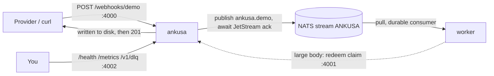

# Example: Ankusa → NATS JetStream → a Rust worker

The published Ankusa image receives webhooks and publishes each one to a NATS
JetStream subject. A small Rust worker pulls them from a durable consumer,
using the published `ankusa` crate ([crates.io](https://crates.io/crates/ankusa),
source [`packages/sdk-rust`](../../packages/sdk-rust)) to redeem large bodies
from Ankusa's claim-check gateway. No object store, and the worker holds no
storage credentials.



## What's here

| File | What it is |
| --- | --- |
| `docker-compose.yml` | NATS with JetStream, the worker, and Ankusa on 4000 (ingest) and 127.0.0.1:4002 (admin); the claim-check gateway (4001) stays on the compose network |
| `ankusa.yml` | One open `demo` source whose NATS sink publishes to `ankusa.demo`, with `inline_max_bytes: 8192` so a ~20 KB hook takes the claim-check path |
| `Cargo.toml` / `Cargo.lock` | The worker's crate: `async-nats`, `serde_json`, `base64`, and `ankusa` (published 0.3.0, `default-features = false`, since the gateway is plain HTTP) |
| `Dockerfile` | Builds the worker with `cargo build --release --locked`; the build context is this directory alone, because the SDK comes from crates.io |
| `src/main.rs` | Creates the `ANKUSA` stream and a durable pull consumer, decodes each message, redeems claims via `ankusa::ClaimCheckClient`, dedupes on `id`, acks |

## Run it

```sh
docker compose up --build -d --wait

# Small: the body rides inline in the message.
curl -XPOST localhost:4000/webhooks/demo -H 'content-type: application/json' -d '{"id":"evt_1","type":"invoice.paid"}'

# Large: the message carries a claim ref; the worker redeems it from the gateway.
printf '{"id":"evt_2","pad":"%s"}' "$(head -c 20000 /dev/zero | tr '\0' x)" |
  curl -XPOST localhost:4000/webhooks/demo -H 'content-type: application/json' --data-binary @-

sleep 1 && docker compose logs worker
# received id=01a0... source=demo via=inline bytes=36 body={"id":"evt_1","type":"invoice.paid"}
# received id=01a0... source=demo via=claim bytes=20023 body={"id":"evt_2","pad":"xxxx...
```

Tear down (the `-v` drops the WAL volume too):

```sh
docker compose down -v
```

Developing the worker outside Docker: `cargo run` from this directory, with
`NATS_URL` and `CLAIM_CHECK_URL` pointing at a JetStream-enabled NATS server and
an Ankusa claim-check gateway (both default to `localhost`).

## How the worker behaves

- **The worker owns the stream.** Ankusa publishes to a subject and never
  creates a stream, so the worker creates `ANKUSA` (subjects `ankusa.>`) on
  startup. Until it exists, publishes fail and go through Ankusa's retries, then
  the dead-letter queue.
- **Ankusa answers `201` only after the hook is on disk**, and its sink only
  counts a hook as delivered after JetStream acknowledges the publish.
- **Dedupe on `id`**: delivery is at-least-once. The worker records an id only
  after the hook is handled, so a failure is redelivered, not skipped as a
  duplicate.
- **Failures are `nak`ed** and redelivered after 2s, at most 5 times per
  message (`max_deliver`).
- Every message is the same JSON the RabbitMQ and Kafka sinks publish, so this
  worker's decoding works for those transports too. Format and claim-check
  details: [`../../docs/claim-check.md`](../../docs/claim-check.md).
