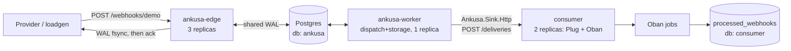

# Example: ingest fleet → Postgres WAL → Oban worker fleet, on real Kubernetes

A full `kind` (Kubernetes-in-Docker) deployment proving the framework feeds a
production job-queue fleet — Oban, backed by Postgres — over plain HTTP,
with zero loss under normal load, under chaos (pods killed mid-flight), and
under a closed-loop burst.



**What each piece proves:**

- `ankusa-edge` (3 replicas, `ANKUSA_ROLES=edge`) is a stateless HTTP front
  door: any replica can accept a webhook because the WAL lives in
  `ankusa_postgres`, not on the pod's local disk.
- `ankusa-worker` (1 replica, `ANKUSA_ROLES=dispatch,storage`) is a
  deliberate singleton — dispatch and storage hold no lease, so running more
  than one would double-deliver or corrupt segment compaction (see
  `docs/deployment.md`). It reads the shared WAL and calls out through
  `Ankusa.Sink.Http`, plain HTTP POSTs to `consumer`'s `/deliveries` route.
  Ankusa and `ingest_app` know nothing about Oban, jobs, or queues; the sink
  only knows it's making an HTTP call.
- `consumer` (2 replicas) is the only place Oban exists in this whole
  example: a small Plug.Router app whose `/deliveries` handler is the
  handoff point — it records/enqueues an Oban job per delivery, and the job
  writes the idempotent result into `processed_webhooks`, keyed by
  `ankusa_id`, so a replayed delivery does not double-process.
- `postgres` is one StatefulSet holding two databases: `ankusa` (the shared
  WAL used by `ankusa-edge`/`ankusa-worker`) and `consumer` (Oban's own
  tables plus `processed_webhooks`).
- `tools/loadgen` drives three phases against the cluster and, for each,
  verifies every 202-acknowledged webhook eventually lands exactly once in
  `processed_webhooks` with a matching body hash — proof of zero loss, not
  just that requests returned 200.

**Oban appears only in `consumer_app/`, which talks to Ankusa over plain
HTTP via `Ankusa.Sink.Http` — Ankusa and `ingest_app` know nothing about
Oban.**

## Prerequisites

- `docker` (Docker Desktop or equivalent)
- `kind` — not installed by default: `brew install kind`
- `kubectl`
- `mix` / Elixir (to run `tools/loadgen` locally, against the cluster's
  exposed NodePorts)

## Run it

```sh
./run.sh
```

This creates a `kind` cluster (`ankusa-e2e`), builds and loads both
application images, applies the manifests in `k8s/` in order, waits for
Postgres, runs the two migration Jobs, waits for the consumer and Ankusa
fleets to become ready, waits for `localhost:8080/health`, then runs three
load phases against `localhost:8080` and verifies each against Postgres at
`localhost:15432` (both exposed by the kind cluster's `extraPortMappings`).
By default it tears the cluster down on exit; set `KEEP=1` to leave it
running for inspection.

### Env knobs

| Var | Default | Meaning |
| --- | --- | --- |
| `CLUSTER` | `ankusa-e2e` | kind cluster name |
| `RATE` | `100` | requests/sec for the steady and chaos phases |
| `DURATION` | `60` | seconds for the steady and chaos phases |
| `BURST_SECONDS` | `15` | seconds for the closed-loop burst phase |
| `CONCURRENCY` | `64` | concurrent in-flight requests during the burst phase (no rate cap) |
| `KEEP` | `0` | set to `1` to skip `kind delete cluster` on exit |
| `OUT_DIR` | `examples/oban-consumer/.e2e-out` | where CSVs and JSON reports land |

### The three phases

1. **steady** — constant `RATE` req/s for `DURATION` seconds against a
   healthy cluster.
2. **chaos** — the same load profile, but partway through the run one
   `ankusa-edge` pod, the `ankusa-worker` pod, and one `consumer` pod are
   each killed in turn (10s apart) while traffic keeps flowing.
3. **burst** — a closed-loop flood at `CONCURRENCY` concurrent requests for
   `BURST_SECONDS` seconds, no rate limit, to prove the WAL absorbs a spike
   without dropping anything.

Each phase writes `$OUT_DIR/<phase>.csv` (every acknowledged id, its body's
sha256, and the provider event id it carried), `$OUT_DIR/<phase>-report.json`
(loadgen's own send-side stats: throughput, latency, error counts), and
`$OUT_DIR/<phase>-verify.json` (loss-verification results: `missing`,
`deduplicated`, `sha_mismatches`, `duplicate_deliveries`, `extra_deliveries`
and `drain_s`, the time it took every acked id to show up in
`processed_webhooks`). A passing run has `missing: 0` and `sha_mismatches: 0`
in every `*-verify.json`: nothing accepted was lost, and nothing arrived with
the wrong bytes. `deduplicated` is expected to be non-zero when the run resends
bodies — those acks are accounted for by the sibling copy that did arrive — and
`duplicate_deliveries` is expected to be non-zero too, because this example runs
the default in-process dedup ledger and then kills the worker holding it: the
copy that a dead dispatcher had already delivered is delivered again. It is
reported, not failed, and it is why `mix loadgen.verify` only fails on
duplicates under `--dedup-store ra` — the ledger that survives the kill, which
is what the chaos harness in `ankusa_ra` runs. `run.sh` exits non-zero if any
phase fails verification, even though it still tears down the cluster on the
way out (unless `KEEP=1`).
