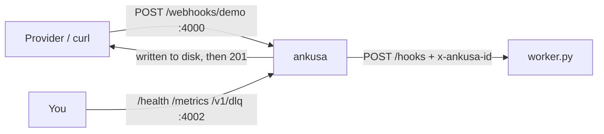

# Example: Ankusa + your own worker

The published Ankusa image receives webhooks and POSTs each one to a
small [FastAPI](https://fastapi.tiangolo.com/) worker: no Elixir, no broker,
no object store. The worker depends on the `ankusa` Python SDK
([`packages/sdk-python`](../../packages/sdk-python)) for header parsing,
managed with [`uv`](https://docs.astral.sh/uv/).


```mermaid
flowchart LR
    P[Provider / curl] -->|POST /webhooks/demo :4000| A[ankusa]
    A -->|written to disk, then 201| P
    A -->|POST /hooks + x-ankusa-id| W[worker.py]
    O[You] -->|/health /metrics /v1/dlq :4002| A
```

## What's here

| File | What it is |
| --- | --- |
| `docker-compose.yml` | Ankusa on 4000 (ingest) and 127.0.0.1:4002 (admin), plus the worker |
| `ankusa.yml` | One open `demo` source whose single HTTP sink points at the worker, with retries shortened so the drills are quick |
| `pyproject.toml` / `uv.lock` | The worker's `uv` project; `ankusa` resolves to [`../../packages/sdk-python`](../../packages/sdk-python) as a local path dependency |
| `Dockerfile` | Builds the worker with `uv sync --locked`; built from the **repo root** so it can see `packages/sdk-python` (see the comment at its top) |
| `worker.py` | FastAPI app: reads the body, parses headers via `ankusa.parse_headers`, dedupes on `ankusa.idempotency_key` (the `x-ankusa-idempotency-key` header), prints |

## Run it

```sh
docker compose up --build -d --wait

curl -XPOST localhost:4000/webhooks/demo -H 'content-type: application/json' -d '{"id":"evt_1","type":"invoice.paid"}'

sleep 1 && docker compose logs worker
# received id=01a0... source=demo bytes=36 body={"id":"evt_1","type":"invoice.paid"}
```

Tear down (the `-v` drops the data volume too):

```sh
docker compose down -v
```

Editing `worker.py` needs a rebuild (`docker compose up --build -d --wait`):
it's baked into the image, not bind-mounted, since the image now also needs
`packages/sdk-python` present at build time.

Developing the worker outside Docker: `uv sync && uv run python worker.py`
from this directory.

## Write your own worker

- Ankusa POSTs the hook's **raw body verbatim**, with the provider's `content-type`.
- Identity is in headers: `x-ankusa-id`, `x-ankusa-source`, and
  `x-ankusa-tenant` when the source has one.
- **`2xx` means delivered.** Anything else, a timeout (default 5s), or a redirect
  is retried per `dispatch.retry`, then dead-lettered.
- **Dedupe on `x-ankusa-id`**: delivery is at-least-once, so the same hook can
  arrive twice after a retry.
- Point `url:` at your service. Compose service names resolve; outside compose,
  use a host the container can reach.

Watching what happens when the worker is down: retries, the dead-letter queue,
and replay: [`../../docs/quickstart.md`](../../docs/quickstart.md).
