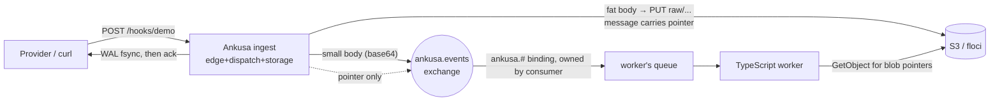

# Example: ingest fleet → RabbitMQ → worker

A complete deployed topology, proving the framework isn't just a library —
it's something you run, front real webhooks with, and consume from a queue.



**What each piece is doing:**

- `ingest/` — a real `Ankusa.Instance` (edge + dispatch + storage), configured
  entirely from environment variables. `Ankusa.Sink.RabbitMQ` publishes every
  delivered hook to the `ankusa.events` exchange, `Ankusa.BlobStore.S3` backs
  segment compaction (the framework's own async archival, `seg/...` keys) —
  the sink reuses that *same* configured blob store for its own fat-payload
  offload (`raw/...` keys), no separate storage code.
- `worker/` — a minimal TypeScript consumer. It declares and binds its own
  queue (`ankusa.#` against the exchange) — the ingest framework never touches
  a queue, only the exchange. This is deliberate: producers own exchanges,
  consumers own their own topology downstream of it.
- `floci` — local S3-compatible emulator (see the root README's "Object
  store adapters" section); stands in for real S3/R2/MinIO.

## Small vs. fat payloads

`Ankusa.Sink.RabbitMQ` inlines a body under `INLINE_MAX_BYTES` (default 8 KiB,
base64-encoded in the message). Anything larger is `PUT` directly to the
blob store and the message carries `{"blob": {"key": ..., "size": ...}}`
instead — RabbitMQ throughput and memory stay flat regardless of how large a
webhook payload is. The worker fetches the blob only when the pointer is
present; otherwise it just decodes the inline body. Try both — the commands
below send one of each.

## Run it

```sh
docker compose up --build
```

Brings up: RabbitMQ (management UI at `http://localhost:15672`, guest/guest),
`floci` (S3 emulator, bucket `ankusa-example` auto-created), the ingest server
(`localhost:4000`), and the worker (consuming and printing to its own logs).

Send a small hook:

```sh
curl -XPOST localhost:4000/hooks/demo -H 'content-type: application/json' \
  -d '{"id":"evt_1","event":"push"}'
```

Send a fat one (anything over 8 KiB routes through the blob store instead):

```sh
python3 -c "import json; print(json.dumps({'id':'evt_2','items':[{'n':i} for i in range(2000)]}))" \
  | curl -XPOST localhost:4000/hooks/demo -H 'content-type: application/json' --data-binary @-
```

Watch the worker print both:

```sh
docker compose logs -f worker
```

You'll see `via=inline` for the first and `via=blob:raw/default/demo/<id>.bin`
for the second, followed by the actual decoded payload in each case — proof
the pointer round-trips through the real object store, not just that a
message arrived.

Tear down:

```sh
docker compose down -v
```

## Scaling the ingest fleet

`docker compose up --build --scale ingest=3` runs three independent ingest
containers, each with its own local WAL, all publishing to the same
exchange and writing to the same bucket. Nothing about `Ankusa.Sink.RabbitMQ`
or `Ankusa.BlobStore.S3` changes — that's the "durable state, not RPC" rule
holding here exactly like it does between the edge/dispatch/storage roles
inside one instance. (You'd need a load balancer in front for the ingest
port at that point — a deployment concern, not something the framework
does for you.) For a *shared* WAL across those nodes instead of N
independent local ones, see `ankusa_postgres/` in the repo root.

## What's stubbed on purpose

`worker/src/worker.ts`'s `handleHook` just prints. That's the boundary the
prompt asked for: "queue bound to exchange with client code consuming (we
won't implement)" — replace it with your real processing; everything above
it (topology declaration, message decode, blob fetch, ack/nack) is real,
working code, not a stub.
