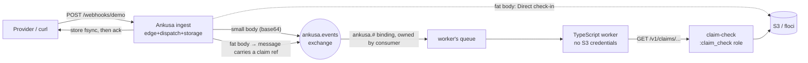

# Example: ingest fleet → RabbitMQ → claim-check gateway → worker

A complete deployed topology, proving the framework isn't just a library:
it's something you run, front real webhooks with, and consume from a queue,
with a Claim Check gateway (`docs/claim-check.md`) fronting the object store
for consumers that shouldn't hold storage credentials.


```mermaid
flowchart LR
    P[Provider / curl] -->|POST /webhooks/demo| I[Ankusa ingest\nedge+dispatch+storage]
    I -->|store fsync, then ack| P
    I -->|"small body (base64)"| X((ankusa.events\nexchange))
    I -.fat body: Direct check-in.-> S[(S3 / floci)]
    I -->|"fat body → message carries a claim ref"| X
    X -->|ankusa.# binding, owned by consumer| Q[worker's queue]
    Q --> W[TypeScript worker\nno S3 credentials]
    W -->|GET /v1/claims/...| CC[claim-check\n:claim_check role]
    CC --> S
```

**What each piece is doing:**

- `ingest_app/`: a real `Ankusa.Instance` (`ANKUSA_ROLES=edge,dispatch,storage`,
  the default), configured entirely from environment variables.
  `Ankusa.Sink.RabbitMQ` publishes every delivered hook to the
  `ankusa.events` exchange; `Ankusa.BlobStore.S3` backs both segment
  compaction (the framework's own async archival, `seg/...` keys) and the
  sink's fat-payload claim check (`claims/...` keys): same bucket, same
  credentials, no separate storage code.
- `claim-check`: the **same image**, `ANKUSA_ROLES=claim_check` is the only
  difference. Its own listener (`:4001`), open: no bearer token; auth goes
  in front of it. It's the only piece besides `ingest` that ever holds S3
  credentials.
- `worker/`: a minimal TypeScript consumer with **no S3 credentials at
  all**. It declares and binds its own queue (`ankusa.#` against the
  exchange), the ingest framework never touches a queue, only the
  exchange, and redeems fat-payload claim refs through `claim-check`'s HTTP
  API, using a client generated straight from
  [`priv/openapi/claim_check.v1.yaml`](https://github.com/jamescarr/ankusa/blob/main/packages/ankusa/priv/openapi/claim_check.v1.yaml)
  (`npm run generate:types`) instead of a hand-maintained ref type,
  see ["Redeem a claim"](https://github.com/jamescarr/ankusa/blob/main/docs/claim-check.md#redeem-a-claim).
- `floci`: local S3-compatible emulator (see
  [`docs/storage.md`](../../docs/storage.md)); stands in for real S3/R2/MinIO.

## Small vs. fat payloads

`Ankusa.Sink.RabbitMQ` inlines a body under `INLINE_MAX_BYTES`: 64 KiB by
default, 8 KiB in this example so the demo's fat hook takes the claim path.
It's base64-encoded in the message; anything larger is checked in through
`Ankusa.ClaimCheck` and the message carries a claim ref URN instead:
`{"claim": "urn:ankusa:claim:v1:<tenant>:<claim_id>", "sha256": "<hex>"}`,
where `claim_id` is a ULID and `sha256` is the lowercase hex digest of the
claim's bytes.
RabbitMQ throughput and memory stay flat regardless of how large a webhook
payload is. The worker redeems the claim (a
`GET /v1/claims/<tenant>/<claim_id>` against `claim-check`, verified end
to end against the message's `sha256`) only when one
is present; otherwise it just decodes the inline body. Try both: the
commands below send one of each.

## Run it

```sh
docker compose up --build
```

Brings up: RabbitMQ (management UI at `http://localhost:15672`, guest/guest),
`floci` (S3 emulator, bucket `ankusa-example` auto-created), the ingest server
(`localhost:4000`), the claim-check gateway (`localhost:4001`), and the
worker (consuming and printing to its own logs).

Send a small hook:

```sh
curl -XPOST localhost:4000/webhooks/demo -H 'content-type: application/json' \
  -d '{"id":"evt_1","event":"push"}'
```

Send a fat one (anything over 8 KiB checks in through the gateway instead):

```sh
python3 -c "import json; print(json.dumps({'id':'evt_2','items':[{'n':i} for i in range(2000)]}))" \
  | curl -XPOST localhost:4000/webhooks/demo -H 'content-type: application/json' --data-binary @-
```

Watch the worker print both:

```sh
docker compose logs -f worker
```

You'll see `via=inline` for the first and `via=claim:<claim_id>` for the
second, followed by the actual decoded payload in each case: proof the
claim ref round-trips through the real gateway and the real object store,
not just that a message arrived. You can also redeem a claim by hand:

```sh
curl http://localhost:4001/v1/claims/<tenant>/<claim_id>
```

Tear down:

```sh
docker compose down -v
```

## Scaling the ingest fleet

This compose file runs one ingest container: it publishes host port 4000, so a
second replica cannot bind it. A fleet needs one host port per node or a load
balancer in front, and its own bucket per node, because segment keys are
`seg/<first>-<last>.seg` and would collide in a shared one. See
[`docs/deployment.md`](../../docs/deployment.md).

## What's stubbed on purpose

`worker/src/worker.ts`'s `handleHook` just prints. That's the boundary the
prompt asked for: "queue bound to exchange with client code consuming (we
won't implement)". Replace it with your real processing; everything above
it (topology declaration, message decode, claim redemption and integrity
verification, ack/nack) is real, working code, not a stub.
