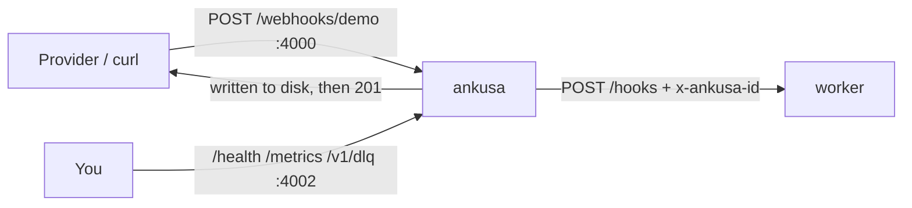

# Example: Ankusa + a Rust worker

The published Ankusa image receives webhooks and POSTs each one to a
small [axum](https://github.com/tokio-rs/axum) worker: no Elixir, no broker,
no object store. The worker depends on the published `ankusa` crate
([crates.io](https://crates.io/crates/ankusa), source
[`packages/sdk-rust`](../../packages/sdk-rust)) for header parsing.



## What's here

| File | What it is |
| --- | --- |
| `docker-compose.yml` | Ankusa on 4000 (ingest) and 127.0.0.1:4002 (admin), plus the worker |
| `ankusa.yml` | One open `demo` source whose single HTTP sink points at the worker, with retries shortened so the drills are quick |
| `Cargo.toml` / `Cargo.lock` | The worker's crate. `ankusa` is the published 0.3.0 with `default-features = false`: this worker only parses headers and makes no outbound HTTPS calls, so it skips rustls and its C build deps |
| `Dockerfile` | Builds the worker with `cargo build --release --locked`; the build context is this directory alone, because the SDK comes from crates.io |
| `src/main.rs` | axum app: reads the body, parses headers via `ankusa::parse_headers`, dedupes on `x-ankusa-id`, prints |

## Run it

```sh
docker compose up --build -d --wait

curl -XPOST localhost:4000/webhooks/demo -H 'content-type: application/json' -d '{"id":"evt_1","type":"invoice.paid"}'

sleep 1 && docker compose logs worker
# received id=01a0... source=demo bytes=36 body={"id":"evt_1","type":"invoice.paid"}
```

Tear down (the `-v` drops the WAL volume too):

```sh
docker compose down -v
```

Editing `src/main.rs` needs a rebuild (`docker compose up --build -d --wait`):
the binary is baked into the image, not bind-mounted.

Developing the worker outside Docker: `cargo run` from this directory.

## Write your own worker

- Ankusa POSTs the hook's **raw body verbatim**, with the provider's `content-type`.
- Identity is in headers: `x-ankusa-id`, `x-ankusa-source`, and
  `x-ankusa-tenant` when the source has one.
- **`2xx` means delivered.** Anything else, a timeout (default 5s), or a redirect
  is retried per `dispatch.retry`, then dead-lettered.
- **Dedupe on `x-ankusa-id`**: delivery is at-least-once, so the same hook can
  arrive twice after a retry.
- Point `url:` at your service. Compose service names resolve; outside compose,
  use a host the container can reach.

Watching what happens when the worker is down: retries, the dead-letter queue,
and replay: [`../../docs/quickstart.md`](../../docs/quickstart.md).
