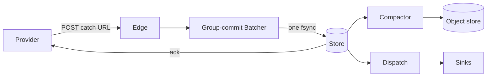
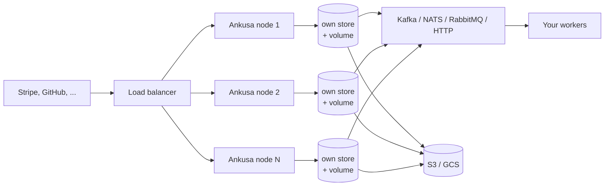

## Why I built it

I have received Stripe and GitHub hooks straight into an application more times than I want to count, and it has gone wrong in the same three ways. The worker was down, the endpoint returned a `5xx`, and the provider gave up after its retry window. A database-backed inbox fell over the first time a burst arrived. Large payloads clogged the queue that was supposed to protect the app.

I built Ankusa because people should not have to think hard about high-volume webhook ingestion. The goal is one container, one YAML file, and your worker in any language.

## What it does

Ankusa is a self-hosted webhook receiver. I point Stripe, GitHub, or any provider at it. Every hook is written to a durable local store before Ankusa answers `2xx`, every accepted POST is stored under a fresh `id`, and each hook is delivered to my own worker over HTTP, RabbitMQ, Kafka, NATS JetStream, or Redis pub/sub, with retries, a dead-letter queue, and replay.

Which system accepts the hook is one config key. By default the node's RocksDB store accepts it. When the destination slows down, Ankusa answers `503` with `Retry-After`, so providers back off and try again instead of losing events.



## Run it in 60 seconds

```sh
docker run -d --name ankusa \
  -p 4000:4000 -p 127.0.0.1:4002:4002 -e ANKUSA_ADMIN_IP=0.0.0.0 \
  -v ankusa-data:/var/lib/ankusa \
  jamescarr/ankusa:edge

# the image ships a healthcheck: wait for it rather than racing the listener
until [ "$(docker inspect --format '{{.State.Health.Status}}' ankusa)" = healthy ]; do sleep 1; done

curl -XPOST localhost:4000/webhooks/demo -H 'content-type: application/json' -d '{"id":"evt_1"}'
# => {"id":"01a0...","status":"accepted"}   (returned only after the store fsync)
```

`201 accepted` is the only committed response. There is no `200`. If that `201` came back, the hook is in the store; if the node dies before the write, the provider never got an ack and retries. The image ships a `demo` source that accepts anything, so this works before you have provider credentials. Port 4000 is ingest and 4002 is the operator API (`/health`, `/metrics`). The operator API listens on 127.0.0.1 inside the container by default, so `-e ANKUSA_ADMIN_IP=0.0.0.0` lets the port published on the host's loopback reach it. It has no authentication, which is why I publish it on `127.0.0.1` only.

## Break the worker

The [quickstart](https://github.com/jamescarr/ankusa/blob/main/docs/quickstart.md) runs a small worker under Docker Compose. First, a short outage:

```sh
docker compose stop worker
curl -XPOST localhost:4000/webhooks/demo -H 'content-type: application/json' -d '{"id":"evt_2"}'
docker compose start worker
sleep 10 && docker compose logs worker | grep evt_2
```

The provider still got its `201`. Ankusa held the hook and retried delivery until the worker came back.

Now a long outage, long enough for the retries to run out:

```sh
docker compose stop worker
curl -XPOST localhost:4000/webhooks/demo -H 'content-type: application/json' -d '{"id":"evt_3"}'
sleep 20
curl -s localhost:4002/v1/dlq
# => {"total":1,"entries":[{"id":"01a0...","source_id":"demo",...}]}
docker compose start worker
curl -XPOST localhost:4002/v1/replays -d '{"kind":"dlq","source_id":"demo","rate":100}'
# => 202 {"id":"01a0...","kind":"dlq","state":"running","filter":{"source_id":"demo"},...}
sleep 1 && docker compose logs worker | grep evt_3
```

The hook lands in the dead-letter queue instead of disappearing, and a replay job moves it back out. A replay is a durable, rate-limited, cancellable job, so I can stop one that is hurting the worker. The quickstart config caps retries at 6 attempts so the drill finishes quickly. The default retry budget is about 6 hours.

## What you get

- Signature verification through an HMAC engine, with named schemes for Stripe, GitHub, Standard Webhooks, Shopify, and Slack.
- Multi-tenant catch URLs with a pluggable resolver.
- Delivery over HTTP, RabbitMQ, Kafka, NATS JetStream, and Redis pub/sub, with backoff, a DLQ, and replay.
- Quarantine for hooks that fail verification, so nothing is silently dropped.
- Archiving to S3, GCS, Azure Blob Storage, OCI Object Storage, Cloudflare R2, or MinIO.
- A handoff to job frameworks like Oban.

Large bodies go to the object store and the queue message carries a reference, so brokers never see megabytes. There are eight SDKs, one conformance suite, 131 shared cases. They parse the delivery headers, decode queue messages, and redeem claims with a sha256 check. They do not verify signatures, because Ankusa already did that at the edge.

I tested the chaos case on purpose. Pods were killed mid-run, and every phase reported `missing: 0` (measured on an Apple M4 Pro laptop under kind/OrbStack, not a production-scale claim). The full story is in {{BLOG_URL}}/killing-pods-mid-run.

## Why the fsync is cheap enough

A group-commit batcher, one GenServer per partition, collects hooks and writes them in one synced RocksDB batch. That batch holds the hook, one delivery row per sink, and the next-seq marker, so hundreds of hooks share one fsync. The caller blocks until the batch it landed in commits, which is why a `201` means what it says. A `kill -9` loses no acked hook.

When the store is slow, down, or the disk is full, a commit that fails answers `503 store_unavailable` and nothing is acked. Ingest resumes with no restart once space frees. If a partition's queue is full, the provider gets a `503` with `Retry-After` rather than a `200` I cannot honor.

Delivery is a separate reader of the same store. If dispatch or the compactor goes down, ingest keeps acking and hooks wait in the store. I wrote the deep dive on the commit path in {{BLOG_URL}}/never-ack-what-you-didnt-save.

## What it is not (yet)

- Delivery is at-least-once. A provider retry is a new hook with a new `id`, and a redelivery can repeat. Your receiver has to be idempotent on `x-ankusa-idempotency-key`. By default ingest does no deduplication; a source can opt in to `dedupe:`.
- Ports 4001 (claim-check gateway), 4002 (admin API, `/metrics`) and 4003 (route management) have no authentication, by design. They listen on 127.0.0.1 by default. Front anything you publish beyond the host with your own proxy or network policy.
- Metrics are counters and histograms, not gauges, yet.
- The claim-check gateway is single-node today.
- Everything is 0.x and APIs may change.

## Grow into a fleet

When one box is not enough, I run N independent all-role nodes behind a load balancer. Each node has its own data volume, its own store, and its own DLQ and admin API.



The caveat: each node is durable to power loss on this host only. Fleet durability comes from running N independent nodes, each owning its store.

## The name

अंकुश (aṅkuśa) is Sanskrit for "hook" or "goad": the curved tool a mahout uses to steer an elephant. Webhook traffic behaves like the elephant, so Ankusa absorbs it durably and fast, then steers where it goes next. Don't fight the traffic. Steer it.

## Try it

```sh
docker run -d --name ankusa \
  -p 4000:4000 -p 127.0.0.1:4002:4002 -e ANKUSA_ADMIN_IP=0.0.0.0 \
  -v ankusa-data:/var/lib/ankusa \
  jamescarr/ankusa:edge

# the image ships a healthcheck: wait for it rather than racing the listener
until [ "$(docker inspect --format '{{.State.Health.Status}}' ankusa)" = healthy ]; do sleep 1; done

curl -XPOST localhost:4000/webhooks/demo -H 'content-type: application/json' -d '{"id":"evt_1"}'
# => {"id":"01a0...","status":"accepted"}   (returned only after the store fsync)
```

The [quickstart](https://github.com/jamescarr/ankusa/blob/main/docs/quickstart.md) walks through outages, dead letters, replay, and pointing a real provider at it. The code is at <https://github.com/jamescarr/ankusa>. It's 0.x; tell me what breaks: <https://github.com/jamescarr/ankusa/issues>
