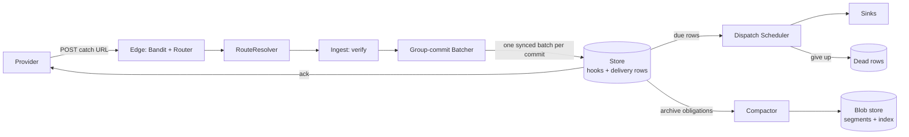

## The invariant, in one line

I built Ankusa around one sentence from [docs/architecture.md](https://github.com/jamescarr/ankusa/blob/main/docs/architecture.md): Ankusa never answers `2xx` until the hook is durably accepted. Every other design decision is downstream of it. This post walks the path a request takes to earn its `201`, what the commit contains, and what happens when the commit cannot happen.

Two crash cases define the contract:

- **Crash before the accept.** No `2xx` was sent, so the provider retries. Nothing was lost, because nothing was promised.
- **Crash after the accept, before the response leaves.** The provider never saw the `2xx`, so it retries anyway. By default ingest does no deduplication: that retry is a new hook with a new `id`. A source can opt in to collapsing provider retries with `dedupe:`. Delivery is at-least-once, so receivers must be idempotent. Dedupe on `x-ankusa-idempotency-key`.

There is one loss window I cannot close: a provider that does not retry on a timeout or a `5xx`. That is their contract, so know it for every provider you catch.

## The request path, step by step

Here is the pipeline with the default `wal.type: disk`:



In order:

1. **`Ankusa.Edge.Router`** matches a catch-all `POST` and hands it to `Ankusa.RouteResolver`, which turns the URL into a source and tenant. Then it refuses what it can refuse before reading the body: a `Content-Length` above `max_body_bytes` is `413`, an unknown source is `404`.
2. **`Ankusa.Edge.Ingest`** builds the envelope with the raw body kept byte for byte, because signature checks need the exact bytes, and runs the source's `Ankusa.Verifier`. A failed verification follows the source's `on_verify_failure` policy: `401` and nothing stored, or `202` with the hook held in a quarantine pen. Then the tenant's rate limit is charged, after verification on purpose: a flood of forged requests spends no budget.
3. **`Ankusa.Edge.Batcher`** takes the envelope and blocks the caller until the batch it lands in commits.
4. **`Ankusa.Queue`** commits the batch, with `Ankusa.Queue.Writer` assigning the sequence number, and returns `{:committed, envelope}` per record. Only then does the edge answer `201`.

The batcher is where the ack becomes honest. It is one `GenServer` per partition, two by default. The store flush runs in a `Task`, so the batcher keeps accepting while a commit is in flight; the next batch accumulates behind it and commits the instant the previous one returns. `max_batch` is 256 and `max_delay_ms` is 0, so there is no linger. Every blocked caller is replied to only after its own commit returns.

## What one commit contains

`Ankusa.Queue.Writer`, one per instance, is the only process that assigns a sequence number. Each commit is one synced RocksDB batch holding:

- the hook, keyed by its sequence number;
- one pending delivery row and one due key per sink of its source;
- an archive obligation, but only while the `storage` role runs;
- the next-sequence marker.

The batch is atomic: it lands whole or nothing is acked. It is written with `sync: true`, so a busy partition spends one fsync on hundreds of hooks rather than one each. That is the whole trick of group commit, and why `max_delay_ms: 0` works: batches form behind the commit already in flight, not from a timer.

The boot log says what this buys you, on purpose:

> `[ankusa] store at <path>. Durable to power loss on THIS host only.`

`kill -9` loses no acked hook; RocksDB recovers its own write-ahead log. A torn trailing write, the last and never-acked one, is dropped on open. Damage anywhere before it makes the store refuse to open, because a store this node cannot read is never treated as empty. What it does not give you is survival of the host itself. If you want that, you run N independent nodes behind a load balancer, each with its own store. I would rather the log line be annoying than quietly stronger than the truth.

## Backpressure is the feature

A system that acks everything has an unbounded promise. Ankusa bounds its promise in two places.

First, the queue. `max_queue` is 10,000 per partition, counting buffered and in-flight records. When it is full the answer is `503` with `Retry-After`, never a promise the store cannot back. Second, the deadline. A record still buffered behind a stalled commit after its deadline, 15 s by default, is answered `503` and dropped.

Then the store itself. A commit that fails is a `503 store_unavailable` and nothing is acked. A full disk is the same answer, and ingest resumes by itself once space frees, with no restart. As a safety net, any failed store write also tells the store to close and reopen itself, at most once every 5 s, which clears a latched RocksDB write error if one outlives the freed space.

A `503` beats a `200` you cannot honor because the provider already has a retry loop, and your event stays in their system until you can store it. What each answer means:

| Status | Meaning |
| --- | --- |
| `201` | accepted, durably so |
| `202` | quarantined after a failed verification |
| `400` | body unreadable, or a header holds a byte outside visible ASCII, space and tab (`invalid_header`; no sink could carry it, so retrying is pointless) |
| `401` | verification failed |
| `404` | unknown source |
| `413` | body over `max_body_bytes` |
| `429` | over a rate limit, nothing stored |
| `503` | no durable destination right now; retry later |

`201 accepted` is the only committed response. There is no `200`.

## Dispatch is a separate reader

Ingest ends at the commit. Delivery is a different process reading the same store. `Ankusa.Dispatch.Pipeline` is a scheduler over the due delivery rows, and `Ankusa.Storage.Compactor` works over the archive obligations the same commit wrote. Neither is an RPC caller of the other. Take either down and ingest keeps acking, with hooks waiting in the store. The cost: nothing pages you for it. Ankusa's metrics are counters and histograms, not gauges, so you build that alarm yourself.

Delivery is at-least-once to every sink, with exponential backoff and jitter, a dead-letter row on give-up, and no ordering. The defaults:

- `base_ms` is 100, `max_ms` is five minutes, `max_attempts` is 84, jitter on;
- that is 100 ms doubling to the 5-minute cap by attempt 13, then 5 minutes apart until attempt 84: about 6 hours, 3–6 h with jitter;
- an attempt not returned after `dispatch.attempt_timeout_ms`, 30 s by default, is killed and counts as failed.

There is one retry policy for all sources today. The DLQ is the set of dead delivery rows, listed by `GET /v1/dlq`, and a dead row keeps its hook until it is replayed and delivered, with `POST /v1/replays`. A replayed delivery keeps the original `id` and idempotency key.

Dispatch writes its outcomes without a per-write fsync. A power failure right after a give-up can undo it, and the hook is retried again. That is at-least-once by construction: the cheap write is allowed to be lost because the loss direction is always "deliver again", never "forget". The cost lands on your receiver, which is why the idempotency key exists. It is `tenant:source_id:dedupe_key` when the source extracted a provider event key, otherwise the hook's `id`, and it arrives as `x-ankusa-idempotency-key` on `Sink.Http`. Read it; do not rebuild it.

## The other mode: `wal.type: none`

Group commit is the right answer when Ankusa is the store. Sometimes your broker already is. With `wal.type: none` there is no store for hooks, no batcher, no dispatch, no compactor, and no DLQ. The request publishes to the source's sinks concurrently under one deadline, 8 s by default, and answers `201` only after every sink confirms. The first refusal is a `503` with `Retry-After`, and the provider's retry is the retry.

What you give up is plain: no retry policy, no replay, no dead letters. What you get is a stateless node: a Deployment you can scale and replace freely, with the broker's confirm standing in for the fsync. Boot refuses a config where no sink of a static source is durable. Every shipped sink except `Sink.Log` and `Sink.Redis` is. Every sink still has to confirm, though, so a source with a Redis pub/sub sink and no subscribers answers `503` to every ingest.

I would use direct mode when Kafka or RabbitMQ is already your system of record. I would not use it if you want replay.

## Measured

I ran the load generator against a kind cluster: a 3-pod `ankusa` StatefulSet, each pod an all-role node with its own store on a persistent volume, plus a 2-replica Oban consumer. Steady is paced at `RATE` requests per second. Chaos is the same load with `kubectl delete pod` on `ankusa-0`, `ankusa-1`, and one consumer pod at +10s, +20s and +30s. Burst is closed-loop, 64 workers, no rate cap. Proof is `mix loadgen.verify`, which polls until every acked id shows up in the consumer and fails the run on any `missing > 0` or `sha_mismatches > 0`. `201` is the only success, `503` is shed, and anything else is an error.

`RATE=300`, measured on an Apple M4 Pro laptop under kind/OrbStack, not a production-scale claim. Latencies are in ms:

| Phase | accepted/s | p50 | p95 | p99 | shed | errors | missing | extra deliveries | `drain_s` |
| --- | --- | --- | --- | --- | --- | --- | --- | --- | --- |
| steady | 283.5 | 3.8 | 9.2 | 34.5 | 0 | 0 | **0** | 0 | 0.08 |
| chaos | 283.5 | 4.1 | 48.0 | 165.0 | 0 | 0 | **0** | 0 | 0.09 |
| burst (64 workers) | 1236.5 | 43.0 | 88.7 | 282.8 | 0 | 0 | **0** | 0 | 0.09 |

Every phase, including chaos, reported `missing: 0` and `sha_mismatches: 0`. `drain_s` is the time from the end of ingest to the last ack being visible in the consumer. The burst generator is closed-loop, so its `accepted/s` is what 64 workers and a 40 ms round trip sustain, not a dispatch ceiling.

That is the only measurement I am quoting. I am not quoting an ingest ceiling, because I have none I would defend. Run the core bench on your own hardware. It exits non-zero if anything acked never arrived:

```sh
N=20000 CONCURRENCY=256 SINK_LATENCY_MS=5 mise run bench
```

It reports `ingest_per_s`, `end_to_end_per_s`, `drain_s` and `missing`. What the chaos run found in an earlier storage adapter is in [Killing pods mid-run]({{BLOG_URL}}/killing-pods-mid-run). Request path and storage layout: [docs/architecture.md](https://github.com/jamescarr/ankusa/blob/main/docs/architecture.md) and [docs/storage.md](https://github.com/jamescarr/ankusa/blob/main/docs/storage.md). Retry and replay: [docs/delivery.md](https://github.com/jamescarr/ankusa/blob/main/docs/delivery.md). Everything is 0.x and APIs may change.

## Try it

```sh
docker run -d --name ankusa \
  -p 4000:4000 -p 127.0.0.1:4002:4002 -e ANKUSA_ADMIN_IP=0.0.0.0 \
  -v ankusa-data:/var/lib/ankusa \
  jamescarr/ankusa:edge

# the image ships a healthcheck: wait for it rather than racing the listener
until [ "$(docker inspect --format '{{.State.Health.Status}}' ankusa)" = healthy ]; do sleep 1; done

curl -XPOST localhost:4000/webhooks/demo -H 'content-type: application/json' -d '{"id":"evt_1"}'
# => {"id":"01a0...","status":"accepted"}   (returned only after the store fsync)
```

The [quickstart](https://github.com/jamescarr/ankusa/blob/main/docs/quickstart.md) walks through outages, dead letters, replay, and pointing a real provider at it. The code is at <https://github.com/jamescarr/ankusa>. It's 0.x; tell me what breaks: <https://github.com/jamescarr/ankusa/issues>
