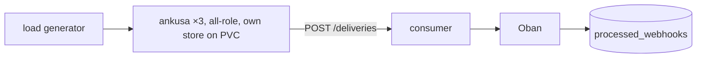

"We never lose a webhook" is a sentence I distrust when someone else writes it. So before I wrote it about Ankusa, I built a test whose only job is to make the sentence false: kill pods while traffic is flowing, then count.

This post is what that test does, what it reported, and the loss it caught in an earlier storage backend. That backend is gone, and I'll label that part as history. Every number below was measured on an Apple M4 Pro laptop under kind/OrbStack, not a production-scale claim.

## The setup

The harness is `examples/oban-consumer/run.sh`, described in [docs/testing.md](https://github.com/jamescarr/ankusa/blob/main/docs/testing.md). It stands up a `kind` cluster with a 3-pod `ankusa` StatefulSet and a 2-replica `consumer` running Oban. Each Ankusa pod is a self-contained all-role node with its own store on a persistent volume. The nodes share nothing, which is how I describe fleets in [the launch post]({{BLOG_URL}}/ankusa-launch). Then `tools/loadgen` drives three phases against it.



The phases:

1. **steady**: a paced `RATE` req/s for a fixed duration.
2. **chaos**: the same load, with `kubectl delete pod` against `ankusa-0`, `ankusa-1`, and one `consumer` pod at +10s/+20s/+30s.
3. **burst**: closed-loop at 64 workers, no rate cap. The drain time it reports is how long the pipeline needed after ingest stopped.

## What counts as proof

A load generator that says how many requests it sent proves nothing about delivery. The check that matters sits on the consumer side. `mix loadgen.verify` polls `processed_webhooks`, the consumer's ground truth, until every id the generator saw acknowledged shows up or its timeout expires. It fails the run on any `missing > 0` or `sha_mismatches > 0`.

The generator is strict about response codes. `201` is the only success, `503` is shed load, and anything else is an error. A `200` would count as an error, because Ankusa has no `200`: `201 accepted` is the only committed response. If the receiver ever said "fine" without saying "stored", the count would show it.

## Results

Latencies are in ms. `drain_s` is the time from the end of ingest to the last ack being visible in the consumer, measured on the verify poll. The burst generator is closed-loop, so its `accepted/s` is what 64 workers and a 40 ms round trip sustain, not a dispatch ceiling. Machine caveat once more: measured on an Apple M4 Pro laptop under kind/OrbStack, not a production-scale claim.

| Machine | `RATE` | Phase | accepted/s | p50 | p95 | p99 | shed | errors | missing | extra deliveries | `drain_s` |
| --- | --- | --- | --- | --- | --- | --- | --- | --- | --- | --- | --- |
| Apple M4 Pro, macOS, OrbStack | 60 | steady | 56.0 | 5.3 | 9.6 | 13.5 | 0 | 0 | **0** | 0 | 0.04 |
| Apple M4 Pro, macOS, OrbStack | 60 | chaos | 56.1 | 5.3 | 9.5 | 14.3 | 0 | 0 | **0** | 0 | 0.04 |
| Apple M4 Pro, macOS, OrbStack | 60 | burst (64 workers) | 1496.5 | 39.0 | 69.7 | 89.7 | 0 | 0 | **0** | 0 | 0.05 |
| Apple M4 Pro, macOS, OrbStack | 300 | steady | 283.5 | 3.8 | 9.2 | 34.5 | 0 | 0 | **0** | 0 | 0.08 |
| Apple M4 Pro, macOS, OrbStack | 300 | chaos | 283.5 | 4.1 | 48.0 | 165.0 | 0 | 0 | **0** | 0 | 0.09 |
| Apple M4 Pro, macOS, OrbStack | 300 | burst (64 workers) | 1236.5 | 43.0 | 88.7 | 282.8 | 0 | 0 | **0** | 0 | 0.09 |

Every phase, including chaos, reports `missing: 0` and `sha_mismatches: 0`. After rebasing onto `main` with the NATS JetStream adapter and the HMAC verifier engine, I re-verified: `RATE=300` again reported `missing: 0` and `sha_mismatches: 0` in all three phases: steady 284.0/s, chaos 284.0/s, burst 1360.2/s, `shed: 0`, and `drain_s` 0.05–0.07 s.

Look at the chaos row at `RATE` 300. The tail is worse than steady: p95 48.0 ms against 9.2, p99 165.0 against 34.5. Killing pods has a cost, and it shows up as latency on the requests that were in flight. It does not show up in the `missing` column.

What this does and doesn't say: with each pod's store on its own volume, killing those pods mid-run lost no acked hook in these runs. It is not an ingest ceiling, and I'm not quoting one. For your own hardware, `mise run bench` reports `ingest_per_s`, `end_to_end_per_s`, `drain_s` and `missing`, and exits non-zero if anything acked never arrived.

The `extra deliveries` column is 0 in these runs. Delivery is at-least-once, so I would not promise it stays 0: a killed delivery can still complete, and the consumer has to be an idempotent receiver. That is the next section.

## The bug it found first

This section is history. The bug lived in the `WAL.Postgres` adapter, which has since been removed along with the `ankusa_postgres` package. Ankusa's queue now commits to the RocksDB store. I keep the story because the failure mode, a reader losing a commit that landed out of order, is a hazard for any log you read by cursor.

Before the store existed, killing a worker pod dropped about 0.5–1.5% of acked hooks permanently. One documented run of the same harness lost 12 of 1,581 acked hooks in chaos. The mechanism was not in the dispatch pipeline.

The adapter allocated `seq` at INSERT time (`BIGSERIAL`), but a row only became visible at COMMIT. Two writers could allocate 100 and 101 and commit in the opposite order. A reader following the log with `seq > cursor` read 101, advanced its cursor past it, and never saw 100 when it landed. The compactor's truncation was bounded by that same cursor, so it then deleted the row. The hook was in no log, no `oban_jobs` row, no `processed_webhooks` row, no DLQ, and the cursor had already moved on.

It took killing the worker to reproduce, because that bursts the catch-up load onto the shared Postgres and widens the window between allocation and commit. A cursor reader only has to pass the tail at the wrong moment.

The fix was a per-instance advisory lock (`pg_advisory_xact_lock`) taken before allocating seqs and held until COMMIT, so seq order was commit order. Serialized commits per instance were the accepted cost. The regression test widened the window with a sleeping statement trigger and, on the pre-fix code, failed with about 34 seqs a cursor-following reader never saw.

One more honest detail: the chaos phase of the run behind the next table also came back clean, which is honest but not reassuring. The loss was a race. It needs the window between allocating a seq and committing it to be wide enough at the exact moment a cursor reader passes the tail. A clean chaos run is weak evidence on its own, which is why the regression test reproduces the mechanism on purpose instead of waiting for luck.

### A different problem in the same table

The same harness produced a second finding that has nothing to do with loss. This is the code before the core dispatch change, same machine, same harness, `RATE=60`:

| Phase | accepted/s | p50 | p95 | p99 | missing | `drain_s` |
| --- | --- | --- | --- | --- | --- | --- |
| steady | 56.3 | 11.1 | 13.5 | 15.6 | 0 | 0.04 |
| chaos | 56.3 | 11.2 | 15.4 | 18.7 | 0 | 0.04 |
| burst (64 workers) | 3168.1 | 18.0 | 31.7 | 40.7 | 0 | **320.6** |

The paced phases were fine. 60/s is far below the roughly 150/s the old one-envelope-at-a-time dispatch could sustain. The burst phase is where that ceiling showed: 47,632 accepted envelopes took 320.6 seconds to drain after ingest stopped (about 149/s), against 0.05–0.09 s now.

Do not read that as the loss bug. The 320.6 s was a throughput limit in dispatch that went away with a dispatch change. The 12 lost hooks were the seq/commit race. Different cause, different fix, same harness found both. Notice that `missing` is 0 in that table: loss and slowness are separate columns, and I'd have missed the second finding if I had only checked the first.

## Why the Oban side is boring on purpose

The consumer is where "at-least-once" meets your database, so I made it unexciting. The `/deliveries` route keys on the `x-ankusa-idempotency-key` header the HTTP sink ships, falling back to the Ankusa id for a sender that predates it. That key is the primary key of a `processed_webhooks` row, and the Oban job is inserted in the same transaction as the row. Ankusa and its wrapper know nothing about Oban; the consumer is the only place it is imported. The key is computed once per hook, and the consumer reads it and never rebuilds it:

```elixir
  # The key Ankusa computed: read it, never rebuild it.
  key = header(conn, "x-ankusa-idempotency-key") || ankusa_id
```

The insert is the dedupe:

```elixir
          INSERT INTO processed_webhooks
            (idempotency_key, ankusa_id, source_id, tenant_id, body, body_sha256, deliveries)
          VALUES ($1, $2, $3, $4, $5, $6, 1)
          ON CONFLICT (idempotency_key) DO UPDATE
            SET deliveries = processed_webhooks.deliveries + 1
          RETURNING (xmax = 0) AS inserted
```

A redelivery, whether a lost `2xx` or a DLQ replay, bumps `deliveries` and queues no second job. The row is the dedupe, not Oban's job uniqueness, so pruning completed jobs can never let a retry or replay re-run the effect. The `processed_at` column is what proves "processed" against actual attempts rather than against enqueue, and `loadgen.verify` polls exactly that table.

That is why the `extra deliveries` column is a measurement and not a failure. When a pod dies mid-delivery, the hook is retried, the counter goes up, and no second job is queued. The full code is in [the integrations doc](https://github.com/jamescarr/ankusa/blob/main/docs/integrations.md), and [examples/oban-consumer](https://github.com/jamescarr/ankusa/tree/main/examples/oban-consumer) has the whole deployment.

## Run it yourself

Run `mise run e2e`. You need `docker`; `kind`, `kubectl` and Elixir come from `.mise.toml`. `RATE` defaults to 300, so set it to try the lighter 60 run. `KEEP=1` keeps the cluster after the run so you can poke at the pods and the `processed_webhooks` table. The script is the one the results above came from, so if your numbers disagree with mine, that is information I want.

I'm not asking you to take the table on trust. The one thing the harness is built to do is fail loudly on `missing > 0`. If you can make it fail, open an issue.

Next in the series: [how the claim check keeps megabyte bodies off your queue]({{BLOG_URL}}/megabyte-webhooks-claim-check).

## Try it

```sh
docker run -d --name ankusa \
  -p 4000:4000 -p 127.0.0.1:4002:4002 -e ANKUSA_ADMIN_IP=0.0.0.0 \
  -v ankusa-data:/var/lib/ankusa \
  jamescarr/ankusa:edge

# the image ships a healthcheck: wait for it rather than racing the listener
until [ "$(docker inspect --format '{{.State.Health.Status}}' ankusa)" = healthy ]; do sleep 1; done

curl -XPOST localhost:4000/webhooks/demo -H 'content-type: application/json' -d '{"id":"evt_1"}'
# => {"id":"01a0...","status":"accepted"}   (returned only after the store fsync)
```

The [quickstart](https://github.com/jamescarr/ankusa/blob/main/docs/quickstart.md) walks through outages, dead letters, replay, and pointing a real provider at it. The code is at <https://github.com/jamescarr/ankusa>. It's 0.x; tell me what breaks: <https://github.com/jamescarr/ankusa/issues>
