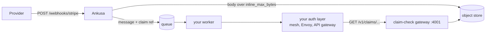

## A queue is the wrong place for a megabyte

Some of the webhooks I receive are big, and pushing the whole body onto a queue goes the way you'd expect: the broker carries every byte, every consumer group reads every byte, and every redelivery pays for the same bytes again. A queue is good at small messages that many workers can pull fast. It is a poor place to park a megabyte while you wait for someone to process it.

So Ankusa has a claim check. When a RabbitMQ, Kafka, NATS, or Redis sink gets a body larger than its `inline_max_bytes` (64 KiB by default), Ankusa writes the body to an object store and publishes a small reference in its place. The worker turns the reference into an HTTP GET and gets the exact bytes back. It needs an HTTP client and nothing else: no Elixir, no cloud SDK, no object-store credentials.

This post is how that works, what it costs, and what it does not do yet. Everything below is 0.x, and APIs may change.

## The flow

This is the diagram from [`docs/claim-check.md`](https://github.com/jamescarr/ankusa/blob/main/docs/claim-check.md):



The provider still gets its `201` only after the hook is durably accepted, same as every other hook. Claim checking happens on the way to the sinks, not on the way in. Bodies at or under `inline_max_bytes` never touch the object store; they ride in the message as `body_base64`. The threshold is per sink, so you can move it if your broker has opinions.

## What the reference looks like

A queue message carries either `body_base64` or a `claim` plus its `sha256`. Consumers ignore keys they do not know.

```json
{"claim": "urn:ankusa:claim:v1:acme:01M39VMD8RA3C5HR4RBV67Y002",
 "sha256": "3bea8a9a07c1e8dcaa4c1b816815c35a29b4fb585ba6ecc70ea44840a794cfb3"}
```

The claim is `urn:ankusa:claim:v1:<tenant>:<claim_id>`. The tenant is a short identifier, the claim id is a ULID. The reference grants nothing and names no bucket or URL. You turn it into a request by dropping the prefix:

```
urn:ankusa:claim:v1:acme:01M39VMD8RA3C5HR4RBV67Y002
                    → GET /v1/claims/acme/01M39VMD8RA3C5HR4RBV67Y002
```

The `sha256` sits next to the reference, not inside it. That is deliberate and it matters in the next section.

## The gateway, and what it won't do for you

The worker redeems claims through the claim-check gateway on port 4001. It is the `claim_check` role of the same image, read-only: no writes, no listing, no delete. It reads the same `storage` block as the nodes that write claims and needs no store of its own.

```yaml
node:
  roles: [claim_check]

storage:
  type: s3
  s3:
    bucket: "${S3_BUCKET}"
    region: "${S3_REGION}"

claim_check:
  port: 4001            # [env ANKUSA_CLAIM_CHECK_PORT]
  ip: 0.0.0.0           # [env ANKUSA_CLAIM_CHECK_IP] default 127.0.0.1; consumers on other hosts need 0.0.0.0
```

```sh
docker run -p 127.0.0.1:4001:4001 \
  -v "$PWD/ankusa.yml:/etc/ankusa/ankusa.yml" \
  -e S3_BUCKET -e S3_REGION -e AWS_ACCESS_KEY_ID -e AWS_SECRET_ACCESS_KEY \
  jamescarr/ankusa:edge
curl localhost:4001/health    # {"status":"ok"}
```

The object stores I support are the local filesystem, S3 (AWS, MinIO, Cloudflare R2), GCS, Azure Blob, and OCI Object Storage. A single container can also run the gateway next to the other roles.

Two things about the gateway are on you, and I would rather say them here than have you find them in production.

First, it does no authentication or authorization, and it serves webhook payloads. It listens on 127.0.0.1 by default; the `ip: 0.0.0.0` above is only there so a published port or another host can reach it. Keep port 4001 on an internal network and put your own auth layer in front: a service mesh, Envoy, an API gateway. It logs a warning saying so at startup. The integration surface for that layer is one method and one path shape, and the tenant is a path segment, so an authorizer can compare it to the caller's identity without reading a body.

Second, it does not check integrity. The path carries no digest, so only the holder of the message can verify the bytes. Compare the sha256 of what you got against the message's `sha256`, and treat a mismatch as permanent:

```sh
curl -fsS http://claim-check:4001/v1/claims/acme/01M39VMD8RA3C5HR4RBV67Y002 -o body.bin
shasum -a 256 body.bin    # must equal the message's sha256
```

A `200` returns exactly the claim's bytes, cacheable forever, because claims are written once and never rewritten. The error cases are small:

- `400`: tenant or claim id malformed. Not retryable; it is a bug in the caller.
- `404`: no such claim, expired by retention or never written. Not retryable; dead-letter it.
- `503` with `store_unavailable`: the object store is unreachable. Retry.

Redeeming does not delete, so several consumers can redeem the same claim, say every queue bound to a fanout exchange. One rule I would not skip: if you put a shared cache in front of the gateway, it sits behind your authorizer, never in front of it. A cache in front would serve one tenant's payload to another tenant's request.

## Why a pack, not an object per hook

Object stores bill per write, and an earlier version of this wrote a claim per sink and per retry. The claim-check doc puts S3 Standard and GCS regional Standard at around $0.005 per 1,000 writes (vendor list price; check current pricing), and a retry loop on a fat hook multiplies that quickly.

What it does now:

- A claim is written once per hook. Every sink and every retry shares it.
- Dispatch claims up to 128 delivery rows per store scan and checks each batch's claims in, per tenant, as one object. A hook gets a byte range inside that pack, so the pack costs one write per tenant per batch instead of one per hook, with no added latency, because the batch is already in hand.
- A group bigger than `claim_check.pack_max_bytes` (16 MiB by default) splits into several objects. A body bigger than that gets an object of its own.

Packs never mix tenants. So the write count is one per tenant present in a batch, and a batch spread across many tenants costs many writes. I chose that over a cheaper layout because it lets you delete one tenant's data by deleting one prefix. If your traffic is one big tenant, packing helps a lot; if it is thousands of tenants in every batch, it helps less. I am not reproducing the doc's cost table here: prices move, and the shape of the argument is the point.

## A worker in four languages

Here is the redeem call, with the retry decision, as it appears in four SDK READMEs. Every SDK failure carries one bit that says whether to retry: `false` for a malformed ref, `404`, other `4xx`, or an integrity mismatch; `true` for `5xx`/`503` or an unreachable gateway. You do not need status-code knowledge to sort a redeem failure into dead-letter or retry.

The SDKs do not verify provider signatures (Ankusa did that at the edge) and they ship no broker client. Bring your own consumer; the SDK does the redeem, the sha256 check, and the classification.

TypeScript (`npm install ankusa`, Node 20 or newer, ESM only). This is the body of the README's `resolveBody` function:

```ts
  try {
    return await claimCheck.redeem(ref, sha256);
  } catch (err) {
    if (err instanceof ClaimCheckError && !err.retryable) {
      // bad ref, 404, or an integrity mismatch: dead-letter, don't requeue
      throw err;
    }
    // gateway unreachable or 5xx: safe to retry
    throw err;
  }
```

Python (`pip install ankusa`, 3.11 or newer):

```python
def resolve_body(message: dict) -> bytes:
    try:
        return claim_check.redeem(message["claim"], message["sha256"])
    except ClaimCheckError as err:
        if not err.retryable:
            # bad ref/sha256, 404, or an integrity mismatch: dead-letter, don't requeue
            raise
        # gateway unreachable or 5xx: safe to retry
        raise
```

Rust (`cargo add ankusa`, async on Tokio):

```rust
use ankusa::ClaimCheckClient;

let client = ClaimCheckClient::new("http://127.0.0.1:4001")?;
match client
    .redeem("urn:ankusa:claim:v1:acme:01M39VMD8RA3C5HR4RBV67Y002", "8e1bed597394cf01672e49232d9929c8bc6b3d6ea4e2f489517ec88701f01581")
    .await
{
    Err(err) if err.is_retryable() => eprintln!("retry later: {err}"),
    Err(err) => eprintln!("give up: {err}"),
    Ok(bytes) => println!("{} bytes", bytes.len()),
}
```

Go (`go get github.com/jamescarr/ankusa/packages/sdk-go`, standard library only):

```go
body, err := claimCheck.Redeem(ctx, ref, sha256)
if err != nil {
    var apiErr ankusa.Error
    if errors.As(err, &apiErr) && !apiErr.Retryable() {
        // bad ref, 404, or an integrity mismatch: dead-letter, don't requeue
    }
    return err
}
```

Read the TypeScript and Python excerpts closely: both branches rethrow. That is how the READMEs are written, because what "requeue" and "dead-letter" mean belongs to your broker. In your consumer, the retryable branch becomes a nack with requeue (or a NATS `nak`), and the non-retryable branch becomes a dead-letter or a `term`. Ruby, PHP, Elixir, and Java have the same client; each has a README under `packages/` with the same shape.

Delivery to your queue is at-least-once, so the worker is still an idempotent receiver. Dedupe on the `idempotency_key` field of the message (it is also the `ankusa_idempotency_key` header on RabbitMQ, Kafka, and NATS). A claim redeemed twice returns the same bytes, so redelivery is safe, just not free.

## The examples that use it

Two examples in the repo run the whole path.

[`rabbitmq-consumer`](https://github.com/jamescarr/ankusa/tree/main/examples/rabbitmq-consumer) has Ankusa publishing to a RabbitMQ exchange and a TypeScript worker declaring and binding its own queue. The consumer owns topology; the framework never touches a queue. Bodies over the sink's `inline_max_bytes` are checked in to S3, the message carries a claim ref URN, and the worker redeems it through the gateway.

[`nats-consumer`](https://github.com/jamescarr/ankusa/tree/main/examples/nats-consumer) publishes each hook to a NATS JetStream subject and a Rust worker, built on the published `ankusa` crate, pulls them through a durable consumer. The worker creates its own stream, redeems large bodies with `ClaimCheckClient`, dedupes on the hook id, `nak`s a failure a retry can fix (the gateway unreachable), and `term`s one it can't (bad JSON, a sha256 mismatch). There is no object store in that example; the gateway runs on the same node as everything else.

Both are in [`examples/README.md`](https://github.com/jamescarr/ankusa/blob/main/examples/README.md), next to the others, so pick the broker you already run.

## Limits

This is what a claim check does not do today:

- **The claim-check topology is single-node today.** Claims are written through the same blob store as segments, and segments need one bucket per node, so a gateway can only redeem the claims in the bucket it reads. Several ingest nodes feeding one gateway does not work yet. A gateway on its own node is fine: it is stateless and reads only the blob store.
- **No auth on the gateway.** Covered above; front it.
- **No presigned URLs.** Every redeemed byte passes through the gateway.
- **Bodies over `max_body_bytes` are rejected at ingest.** No streaming or multipart.
- **No write API.** Dispatch nodes are the only writers. Listing or deleting claims over the API is not supported either.
- **Retention is yours.** A claim that expires before it is redeemed is the one way a claim check loses data: the worker gets `404`. Ankusa does not expire S3 or GCS claims for you, so add a lifecycle rule on the `claims/` prefix that outlasts your slowest consumer plus however long you might wait before replaying a dead letter.

There is no throughput number for the claim check in this post. The only figures I publish are the chaos-run numbers in the [kill-the-pods post]({{BLOG_URL}}/killing-pods-mid-run), measured on an Apple M4 Pro laptop under kind/OrbStack, not a production-scale claim. If you run claim-check traffic through your own bucket, measure that.

If you have a broker, an object store, or a size distribution that makes this design look wrong, I want to hear about it. The launch post is at [{{BLOG_URL}}/ankusa-launch]({{BLOG_URL}}/ankusa-launch), and the SDK side of this story is in [{{BLOG_URL}}/eight-sdks-one-conformance-suite]({{BLOG_URL}}/eight-sdks-one-conformance-suite).

## Try it

```sh
docker run -d --name ankusa \
  -p 4000:4000 -p 127.0.0.1:4002:4002 -e ANKUSA_ADMIN_IP=0.0.0.0 \
  -v ankusa-data:/var/lib/ankusa \
  jamescarr/ankusa:edge

# the image ships a healthcheck: wait for it rather than racing the listener
until [ "$(docker inspect --format '{{.State.Health.Status}}' ankusa)" = healthy ]; do sleep 1; done

curl -XPOST localhost:4000/webhooks/demo -H 'content-type: application/json' -d '{"id":"evt_1"}'
# => {"id":"01a0...","status":"accepted"}   (returned only after the store fsync)
```

The [quickstart](https://github.com/jamescarr/ankusa/blob/main/docs/quickstart.md) walks through outages, dead letters, replay, and pointing a real provider at it. The code is at <https://github.com/jamescarr/ankusa>. It's 0.x; tell me what breaks: <https://github.com/jamescarr/ankusa/issues>
