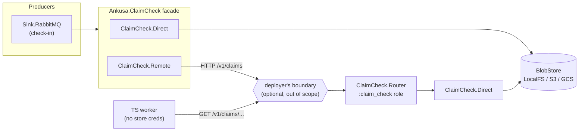

# Claim Check Gateway: Build Plan

2026-09-23 · status: ready to build · rev 2 (adds OpenAPI 3.2 contract and CI; removes authn/authz from the library)

## Intent

Ankusa already has `Ankusa.BlobStore` (LocalFS, S3, GCS) and already runs an
ad-hoc Claim Check inside `Ankusa.Sink.RabbitMQ`: fat bodies get `PUT` to the
blob store and the queue message carries a pointer. This plan pulls that into
a first-class **Claim Check Gateway**. It gives every producer and consumer
in the system (Elixir or not) one contract: *check bytes in, get a ticket;
present the ticket, get the bytes back*. The storage engine and the network
topology stay hidden behind it. Which implementation runs is a
`{module, opts}` config choice, like every other Ankusa behaviour.

The HTTP half of that contract is an **OpenAPI 3.2 document**, checked into
the repo, linted and validated in CI, and served by the gateway itself. The
spec is the source of truth. The code conforms to it.

The gateway does **not** authenticate or authorize callers. Securing it is
the deployer's job, at their own boundary. See "Out of scope: securing the
gateway".

## What changed in rev 2

| Change | Why |
| --- | --- |
| Committed `priv/openapi/claim_check.v1.yaml` (OpenAPI 3.2.0) as the HTTP contract | Non-BEAM consumers need a machine-readable contract, not prose |
| Added a GitHub Actions job: Redocly lint plus spec-conformance tests | The spec is worthless if it drifts from the router |
| Removed bearer tokens, tenant scoping, `401`/`403` from the server | Auth would bake in assumptions about how people deploy this. Moved to "For future consideration" |
| `Remote` loses `token`, gains a generic `headers` opt | Lets a deployer attach whatever their auth layer expects without the library knowing what it is |
| New `claim_check.ip` option, default loopback | Safe by default without choosing an auth scheme |

## What exists today (and what's wrong with it)

| Fact | Where | Consequence |
| --- | --- | --- |
| Check-in logic is private to the RabbitMQ sink | `ankusa_rabbitmq/lib/ankusa/sink/rabbitmq.ex` `put_blob/3` | No other channel or service can reuse it. Key layout (`raw/<tenant>/<source>/<id>.bin`) is an implementation detail that leaks. |
| The wire pointer is `{"store": "Elixir.Ankusa.BlobStore.S3", "key": ...}` | same, `build_payload/3` | The contract carries an Elixir module name. Consumers can't redeem without out-of-band knowledge of the bucket and credentials. |
| The consumer reads S3 directly with bucket credentials | `examples/rabbitmq-consumer/worker/src/worker.ts` `fetchBlob/1` | Every consumer is coupled to the storage engine and needs store credentials. A LocalFS-backed deployment can't be redeemed from another host at all. |
| No integrity check on redeem | worker + sink | A truncated or overwritten object is processed as if it were valid. |
| The worker nacks with `requeue=true` on *any* error | `worker.ts` `consume` | A missing claim (404) becomes an infinite poison-message loop. |
| `BlobStore` not-found is inconsistent | `LocalFS.get/3` → `{:error, :enoent}`; S3/GCS → `{:error, :not_found}` | Callers can't tell permanent errors from transient ones in a store-agnostic way. |
| `LocalFS` joins keys straight onto its root | `LocalFS.abs/2` | A key containing `..` escapes the data dir. That's fine for trusted internal keys, and fatal if a network client can influence a key. |
| S3/GCS `list/3` doesn't follow continuation tokens and returns `[]` on error | `s3.ex` `parse_list_keys/1`, `gcs.ex` `list/3` | Can't be used for store-agnostic retention sweeps. |
| The WAL child boots unconditionally | `Ankusa.Instance.init/1` | A node that only serves claims would still open a WAL (and, with `WAL.Postgres`, need DB credentials). |
| The edge router is a catch-all `POST /*` | `Ankusa.Edge.Router` | A claim API can't share the edge's listener or port. |
| No HTTP contract exists for any Ankusa API | n/a | Every non-Elixir client is written against source code or prose. |

## Pattern mapping (EIP)

| Pattern | Realized as |
| --- | --- |
| **Claim Check** | `Ankusa.ClaimCheck.check_in/4` / `redeem/3` and the `Ticket` |
| **Content Filter** (check-in side) | A channel adapter (for example `Sink.RabbitMQ`) replaces the body with a ticket |
| **Content Enricher** (redeem side) | A consumer swaps the ticket back for the body |
| **Messaging Gateway** | The `Ankusa.ClaimCheck` facade. Callers never see `BlobStore`, HTTP, keys, or buckets. |
| **Remote Proxy / Service Activator** | `ClaimCheck.Remote` (client) ↔ `ClaimCheck.Router` (server, `:claim_check` role) |
| **Canonical Data Model + Format Indicator** | Ticket JSON, versioned by `"v"`, defined once as `#/components/schemas/Ticket` in the OpenAPI document |
| **Idempotent Receiver** | The caller supplies the id; the key is derived deterministically; `PUT` semantics |

## The architect's correction: mode is a trust boundary, not a node count

The loose plan framed it as "single service → direct, fleet → API." That's
the wrong axis. Today, a fleet of Ankusa nodes sharing one S3 bucket already
*is* a working distributed claim check (`--scale ingest=3` in the example),
and Direct against a shared bucket is strictly better for them: no extra hop
and no extra tier to keep up. Pick the mode per caller, based on **who is
allowed to hold store credentials**:

| Caller | Mode | Why |
| --- | --- | --- |
| Ankusa node with bucket credentials (any fleet size) | `Direct` | Talks to the store; no extra network hop |
| Ankusa node deliberately *without* bucket credentials | `Remote` | Credential isolation |
| Non-BEAM consumer (TS worker, third-party service) | HTTP API | One small protocol described by OpenAPI, no cloud SDK, no store credentials |
| Anything, when the store is `LocalFS` on another host | HTTP API | LocalFS isn't network-reachable any other way |

Who may call the HTTP API, and for which tenants, is decided outside the
library. The gateway removes the need for store credentials. It does not
replace the deployer's access control.

A Direct-issued ticket MUST be redeemable through the gateway and vice versa.
That's the testable form of "the code won't notice the difference."



### Architecture rule: where RPC is allowed

`architecture.md` says no component may require another to be reachable at
runtime. `Remote` is an RPC dependency, so it's allowed **only on retryable
paths downstream of the WAL**: dispatch sinks and external consumers. There a
gateway outage means delayed delivery, not loss, because the WAL and the
queue hold the work. **The edge (pre-ack path) MUST NOT check in via
`Remote`.** v1 does no edge-time check-in at all. The master plan's open item
"size tiering at ingest" stays open. If it gets built, it's Direct-only, and
`ClaimCheck.validate_config!/1` rejects a `Remote` adapter used from the
edge.

## Scope

In scope:

1. The `Ankusa.ClaimCheck` behaviour and facade, the `Ticket`, and the
   `Direct` and `Remote` adapters.
2. The `:claim_check` role: an HTTP API on its own listener.
3. The OpenAPI 3.2 document for that API, served at `/v1/openapi.yaml`.
4. CI: OpenAPI lint and validation, plus spec-conformance tests.
5. Cutting `Sink.RabbitMQ` and the example worker over to tickets.
6. Retention for LocalFS-backed claims.
7. Prerequisite `BlobStore` and `Instance` fixes listed below.

Non-goals (each has a trigger for revisiting it in "Open decisions"):

- **Authentication and authorization.** See "Out of scope: securing the
  gateway".
- Redeeming *archived envelopes* from segments (`Ankusa.Storage.fetch/2`).
  Different lifecycle, a local-disk index, internal format. Claims live in
  their own `claims/` namespace and never touch `seg/`.
- Presigned-URL redemption, streaming/multipart bodies above `max_bytes`,
  `DELETE` on redeem, per-tenant encryption.
- An AsyncAPI document for the RabbitMQ message shape. The `Ticket` schema
  it would reference is defined now, in the OpenAPI components.

## Design

### Contract: `Ankusa.ClaimCheck`

This follows the shape of `Ankusa.BlobStore` (behaviour plus instance-scoped
facade in one module). **The facade is smart and the adapters are dumb
transport.** The facade builds the ticket (validation, SHA-256, size), checks
integrity, and emits telemetry. Adapters only move bytes.

```elixir
@type meta :: %{required(:tenant_id) => String.t(), required(:id) => String.t(),
                optional(:content_type) => String.t() | nil}
@type reason ::
        :invalid_tenant | :invalid_id | :too_large | :not_found | :integrity_mismatch
        | :unsupported_ticket_version | {:unavailable, term()}
        # Remote only: returned by whatever the deployer put in front of the gateway.
        # The gateway itself never emits these.
        | :unauthorized | :forbidden

# adapter callbacks: transport only
@callback store(instance :: atom(), Ticket.t(), data :: iodata(), opts :: keyword()) ::
            :ok | {:error, reason()}
@callback fetch(instance :: atom(), Ticket.t(), opts :: keyword()) ::
            {:ok, binary()} | {:error, reason()}

# facade
@spec check_in(atom(), iodata(), meta(), keyword()) :: {:ok, Ticket.t()} | {:error, reason()}
@spec redeem(atom(), Ticket.t(), keyword()) :: {:ok, binary()} | {:error, reason()}
@spec validate_config!(Ankusa.Config.t()) :: :ok
```

- `check_in/4`: `Ticket.new(meta, data)`, then `adapter.store/4`, then
  `{:ok, ticket}`. It returns only after the adapter reports a durable write.
  Option `:adapter` overrides the configured `{mod, opts}` (the server uses
  it to force `Direct`). Option `:expect_sha256` makes check-in fail with
  `:integrity_mismatch` if the computed digest differs (used by the server).
- `redeem/3`: `adapter.fetch/3`, then verify `byte_size == ticket.size` and
  `sha256 == ticket.sha256`, else `{:error, :integrity_mismatch}`.
  Integrity is checked **end to end at the redeemer**, never trusted from
  the server.
- **Permanent errors** (`:not_found`, `:integrity_mismatch`, `:invalid_*`,
  `:too_large`, `:unsupported_ticket_version`): retrying won't help, so
  consumers should dead-letter. **Transient errors** (`{:unavailable, _}`):
  retry. `:unauthorized` and `:forbidden` can only come from a
  deployer-supplied layer in front of the gateway. They mean
  misconfiguration. Treat them as permanent and alert.

### The ticket: `Ankusa.ClaimCheck.Ticket`

The canonical, versioned value that crosses every boundary. Its normative
definition is `#/components/schemas/Ticket` in the OpenAPI document. The
Elixir struct, the RabbitMQ `claim` field, and the TS worker all conform to
that schema.

```json
{"v": 1, "tenant_id": "acme", "id": "0199a1c2-...-7...", "size": 3145728,
 "sha256": "9f86d0...", "content_type": "application/json"}
```

- `v`: format indicator. `from_map/1` returns
  `{:error, :unsupported_ticket_version}` for anything but `1`.
- `id`: **required, caller-supplied UUIDv7** (lowercase, hyphenated,
  validated by regex: version nibble `7`, variant `8-b`). The same regex is
  the `UUIDv7` schema's `pattern` in the spec. Why v7 and not an arbitrary
  string:
  1. Retries stay idempotent. A dispatch retry reuses `env.id`, so it hits
     the same key and doesn't create an orphan object.
  2. The age is inside the id, so retention needs no metadata or `stat` API
     (`Ankusa.UUIDv7.timestamp_ms/1`, new).
  3. 74 random bits make ids unguessable.
  4. It's already the envelope id type. Non-Elixir producers generate
     RFC 9562 v7 ids.
- `tenant_id`: any non-empty UTF-8 string of at most 256 bytes. Restricting
  the character set would turn a tenant the edge accepted (for example via
  `RouteResolver.TenantPath`) into a permanent dispatch failure and a DLQ
  trap. Encode it into the key instead (next section). JSON Schema
  `maxLength` counts characters, not bytes, so the spec states the byte
  limit in prose and the server enforces it.
- `size`, `sha256` (lowercase hex): computed by the facade, never supplied
  by the caller.
- `content_type`: advisory and optional. Stored only in the ticket, never as
  object metadata. `BlobStore` has no metadata API, and doesn't need one.
- The ticket **does not carry the storage key**. The key is *derived*, so a
  client can never steer a read to an arbitrary object (`seg/...` or
  anything outside `claims/`).
- **Not signed.** An HMAC-signed ticket was considered and rejected for v1.
  Ids are unguessable, the server derives keys (so a forged ticket can only
  name an object under `claims/`), and integrity is end to end via `sha256`.
  Signing would add key distribution, rotation, and fleet-wide key
  agreement for only marginal gain. Whether a caller may read a given
  tenant is the deployer's policy, not the ticket's.

### Key layout

```
claims/<enc(tenant_id)>/<id>
```

- `claims/` is a **fixed constant**, not config. If producers and the
  gateway disagreed on a configurable prefix, redeems would 404, and that
  failure would only show up in production.
- `enc/1` percent-encodes every byte outside `[A-Za-z0-9_-]` (including
  `.`, so `.` and `..` can't be spelled). The mapping is injective,
  traversal-proof on LocalFS, and readable for sane tenant ids
  (`acme` → `acme`). `Ticket.key/1` is the only function that builds a key.
- Flat per-tenant directories. Per-tenant deletion is a prefix delete of
  `claims/<enc(tenant)>/`, which is much easier than with shared segments
  (see master plan item 8).
- Segments (`seg/`) and claims share a bucket by default and never collide.
  Lifecycle rules target the `claims/` prefix.

### Semantics

- **Idempotency:** check-in is `PUT`-by-client-id. Re-checking in the same
  `(tenant_id, id)` overwrites (last writer wins). Checking in *different*
  bytes under the same id is a caller bug. It isn't prevented at write time
  (that would need conditional-put support in all three `BlobStore`
  adapters). It's *detected* at redeem time, because the earlier ticket's
  `sha256` no longer matches, and it fails loudly as `:integrity_mismatch`.
- **Durability:** the ticket is returned only after `BlobStore.put` returns
  `:ok` (LocalFS: temp file plus rename; S3/GCS: 2xx). Producers must not
  publish a message carrying a ticket before `check_in` returns `{:ok, _}`.
  `Sink.RabbitMQ` already orders it this way.
- **No delete on redeem.** A fan-out exchange means N independent consumers
  redeem the same claim. Removal is purely time-based (see Retention).
- **Size cap:** `claim_check.max_bytes` (default `8_000_000`, equal to
  `max_body_bytes`). `validate_config!/1` fails boot if
  `claim_check.max_bytes < max_body_bytes` on a node running `:dispatch`,
  because that combination would dead-letter legitimately accepted hooks.

### Adapters

**`Ankusa.ClaimCheck.Direct`**. Opts: `blob_store: {mod, opts}` (default: the
instance's `storage.blob_store`). `store/4` calls
`mod.put(instance, Ticket.key(t), data, opts)`. `fetch/3` calls `mod.get/3`.
It maps store errors: `:not_found` stays `:not_found`; everything else
becomes `{:unavailable, reason}`.

**`Ankusa.ClaimCheck.Remote`**. Opts: `url` (required), `headers` (default
`[]`), `timeout_ms` (default `10_000`). It uses `:httpc`, with no new
dependency, mirroring `Sink.Http`.

- `headers` is a list of `{name, value}` pairs added to every request. The
  library attaches no meaning to them. A deployer whose boundary expects a
  bearer token, an API key, or a tenant header puts it here. With nothing
  in front of the gateway, it stays empty.
- `store/4`: `PUT {url}/v1/claims/{tenant}/{id}` with `x-ankusa-sha256` set
  to `ticket.sha256` and `content-type` set to `ticket.content_type` (when
  present). On `201` it decodes the returned ticket and asserts it equals
  the local one, else `:integrity_mismatch`.
- `fetch/3`: `GET {url}/v1/claims/{tenant}/{id}`. Integrity is verified by
  the facade.
- Status mapping, taken from the spec's `Error` enum: `400` →
  `:invalid_tenant`/`:invalid_id` (from the error body); `404` →
  `:not_found`; `413` → `:too_large`; `422` → `:integrity_mismatch`;
  `5xx` and transport errors → `{:unavailable, reason}`. Statuses the
  gateway never returns but a fronting layer might: `401` →
  `:unauthorized`; `403` → `:forbidden`; `429` → `{:unavailable, :rate_limited}`.

### Server: the `:claim_check` role

- A new role atom `:claim_check`, **off by default** (default roles stay
  `[:edge, :dispatch, :storage]`). Enable it with `ANKUSA_ROLES=claim_check`
  or config.
- `Ankusa.Instance.init/1` adds `claim_check_children/2`: a second `Bandit`
  child with `plug: {Ankusa.ClaimCheck.Router, instance: ...}` on
  `claim_check.ip` / `claim_check.port` (defaults `{127, 0, 0, 1}` /
  `4001`). It's separate from the edge on purpose: the edge is
  internet-facing and the claim API is internal-network only, and the
  edge's catch-all `POST` would swallow the routes anyway.
- **Loopback by default.** The API has no auth, so the library refuses to
  guess the network. A deployer opts in to exposure by setting `ip`
  (for example `{0, 0, 0, 0}` behind a proxy or inside a private network).
  Boot logs a warning when the listener binds a non-loopback address:
  `claim_check listener on <ip>:<port> performs no authentication; secure it at your boundary`.
- `ClaimCheck.Router` is a plain `Plug.Router`. It runs the same on Bandit
  (Ankusa's server) and Cowboy (`plug_cowboy`), so nothing in the router or
  the spec is server-specific.
- The WAL child boots only if one of `:edge`, `:dispatch`, `:storage` is
  enabled, so a claim-check-only fleet needs **only** blob-store
  credentials.
- The server always calls the facade with `adapter: {Direct, opts}`.
  `validate_config!/1` fails boot if the configured adapter on a
  `:claim_check` node is `Remote`, because that would proxy to itself.

HTTP API (v1). The OpenAPI document (`priv/openapi/claim_check.v1.yaml`) is normative. This table
is a summary:

| Request | Success | Errors |
| --- | --- | --- |
| `PUT /v1/claims/:tenant_id/:id` (raw body; optional `content-type`, `x-ankusa-sha256`) | `201 {"ticket": {...}}` | `400 invalid_tenant\|invalid_id`, `413 too_large`, `422 integrity_mismatch`, `503 store_unavailable` + `Retry-After: 1` |
| `GET /v1/claims/:tenant_id/:id` | `200`, raw bytes, `content-type: application/octet-stream` | `400`, `404 not_found`, `503` + `Retry-After: 1` |
| `GET /v1/openapi.yaml` | `200`, the spec, `content-type: application/yaml` | none |
| `GET /health` | `200 {"status":"ok"}` | none |

- The client supplies the id and uses `PUT`, not `POST` with a
  server-generated id, so retries are idempotent under plain HTTP
  semantics.
- The tenant is in the path, not a header or the body. That's deliberate.
  An external policy layer (a proxy route rule, an authz filter) can decide
  per tenant by matching `/v1/claims/{tenant_id}/` without reading bodies.
- The body is read with the edge's bounded reader. Extract
  `read_body_limited/2` from `Ankusa.Edge.Router` into a shared helper
  module; don't copy it. It returns `413` without buffering past
  `max_bytes`.
- JSON error bodies use the same `{"error": "..."}` shape as the edge. The
  `error` values are a closed enum in the spec.
- There is no `DELETE` and no list endpoint in v1. With no auth in the
  library, a list endpoint would be a tenant-enumeration tool. Keep it out.

### OpenAPI specification

**Version: OpenAPI 3.2.0**, the current release (published by the OpenAPI
Initiative on 2025-09-23). Its Schema Object is JSON Schema 2020-12, which
gives us `const`, type unions (`[string, "null"]`), and `examples` without
3.0's nullable workarounds.

**Location and ownership.**

- `priv/openapi/claim_check.v1.yaml` in core. Already committed.
  YAML, hand-written, reviewed like code. See Appendix A.
- `redocly.yaml` at the repo root configures linting (Appendix B).
- `docs/claim-check.md` links to the spec for the HTTP API and the ticket
  schema instead of restating them.
- The router serves the file at `GET /v1/openapi.yaml`. It's read at
  compile time (`@external_resource` plus `File.read!/1` into a module
  attribute), so the served spec is always the one the release was built
  with. No YAML parsing at runtime.

**Spec-first, not code-first.** The Elixir recommendation for documenting
Plug APIs, on Cowboy or Bandit, is
[OpenApiSpex](https://hex.pm/packages/open_api_spex): define schemas as
Elixir modules, generate the document with `mix openapi.spec.yaml`, and
validate requests at runtime with `OpenApiSpex.Plug.CastAndValidate`. We
are **not** adopting it for v1:

1. It targets OpenAPI 3.0. The request for 3.1 support
   ([#637](https://github.com/open-api-spex/open_api_spex/issues/637)) has
   been open since September 2024, and it rejects list-valued `type`. The
   current release (3.22.4, 2026-08-30) still doesn't emit 3.1 or 3.2.
   Choosing it means choosing 3.0.
2. The ticket is a cross-language contract consumed mostly by non-Elixir
   code. The plan already said to write it "as a spec rather than as
   whatever the code emits." Code-first generation inverts that.
3. The API has two path params, one header, and a raw body. Hand
   validation in the router is about 20 lines. A runtime validation
   framework would add a core dependency for no behavioural gain.

What we take from the OpenApiSpex playbook: the spec lives in the repo,
it's checked in CI, and a `--check`-style drift guard fails the build when
code and spec disagree. We do that with conformance tests (below) instead
of generation. Revisit trigger: OpenApiSpex ships 3.1+ output, *and* the
gateway grows enough endpoints that hand validation stops being trivial.

**3.2 features used, and why.**

- `info.summary` and `tags[].description`: human-readable contract.
- `security: []` at the root: an explicit, machine-readable statement that
  the API defines no auth. That's more honest than omitting the field,
  which tools read as "unspecified".
- `const` for `Ticket.v` and `Health.status`; `type: [string, "null"]` for
  `content_type`.
- `'*/*': {}` request body and `application/octet-stream: {}` response: in
  3.1+ an empty Media Type Object means raw bytes, with no fake
  `format: binary` schema.
- `components.headers.RetryAfter` on every `503`.
- Not used: the `QUERY` method, `itemSchema` streaming, `additionalOperations`.
  Nothing here needs them. Streaming is revisited with the multipart
  deferral.

**Versioning.** `info.version` is the API contract version (`1.0.0`),
independent of the Ankusa release. The path prefix `/v1` changes only on a
breaking change to the HTTP surface. Ticket format changes bump `Ticket.v`
and the schema's `const`. Additive changes (new optional ticket field, new
error enum value) bump the minor. A new error enum value counts as
additive only because clients MUST treat unknown `error` values as
permanent. Say so in the spec's `Error` description once it has one.

### CI: OpenAPI lint and validation

Three layers. The first two run in a dedicated workflow. The third runs in
the existing `mix test` job.

1. **Lint and structural validation (Redocly CLI).** Redocly supports
   OpenAPI 3.2, 3.1, 3.0, and 2.0. `redocly lint` validates the document
   against the 3.2 structure and runs the ruleset in `redocly.yaml`. It
   runs from the `redocly/cli` Docker image, so the Elixir repo doesn't
   gain a `package.json`. `--format=github-actions` turns problems into
   inline PR annotations.
2. **Rule choices.** Extend `recommended`. Turn `security-defined` **off**,
   with a comment pointing at this plan, because no security is a decision
   and not an oversight. Promote `operation-4xx-response`,
   `operation-operationId`, and `no-unused-components` to `error`.
   `redocly lint` exits non-zero only on errors, so any rule we want to
   block a merge is set to `error` in `redocly.yaml`. Policy lives in one
   file.
3. **Spec conformance (ExUnit).** Test-only deps: `jsv` (JSON Schema
   2020-12 validator) and `yaml_elixir`. A helper loads the spec once and
   builds validators by `$ref` into `#/components/schemas/*`. Tests:
   - `Ticket.to_map/1` output validates against `Ticket`, for tickets from
     both `Direct` and `Remote` (catches struct/spec drift).
   - Every router response in the Phase 2 suite is checked with
     `assert_conforms(resp, operation_id)`: the status is declared for that
     operation, the `content-type` matches a declared media type, and a
     JSON body validates against the declared schema. `503` responses
     carry `Retry-After`.
   - **Operation coverage:** the conformance module declares
     `@covered ~w(checkInClaim redeemClaim getOpenApiDocument getHealth)`.
     One test asserts that set equals the spec's `operationId`s. Adding an
     operation to the spec without a test, or a test for an operation the
     spec dropped, fails CI.
   - **Error vocabulary:** the router's `reason → error string` map and the
     spec's `Error.error` enum are equal sets.
   - `GET /v1/openapi.yaml` returns bytes identical to the file in `priv/`.

Workflow (`.github/workflows/openapi.yml`):

```yaml
name: openapi

on:
  pull_request:
    paths:
      - "priv/openapi/**"
      - "redocly.yaml"
      - "lib/ankusa/claim_check/**"
      - ".github/workflows/openapi.yml"
  push:
    branches: [main]
    paths:
      - "priv/openapi/**"
      - "redocly.yaml"

env:
  # Pin an exact release. Bump deliberately; new versions add rules.
  REDOCLY_CLI_VERSION: "<exact version>"

jobs:
  lint:
    name: Lint and validate OpenAPI
    runs-on: ubuntu-latest
    steps:
      - uses: actions/checkout@<pinned sha>
      - name: redocly lint
        run: |
          docker run --rm -v "$PWD:/spec" -w /spec \
            "redocly/cli:${REDOCLY_CLI_VERSION}" \
            lint --format=github-actions
```

The conformance tests don't need a separate job. They're ordinary `mix
test` cases, so the existing CI job runs them on every PR. The path filter
above keeps the lint job off unrelated PRs. Make `Lint and validate
OpenAPI` a required check on `main` via branch protection, with the path
filter in mind (a skipped required check blocks merges unless the ruleset
allows it; use a ruleset "required workflow" or drop the filter if that
bites).

Local equivalent, documented in `docs/testing.md`:

```sh
docker run --rm -v "$PWD:/spec" -w /spec redocly/cli lint
mix test test/ankusa/claim_check/openapi_conformance_test.exs
```

### Out of scope: securing the gateway

The library ships **no authentication and no authorization**. Any scheme
we picked (static bearer tokens, JWTs, mTLS, API keys) assumes something
about the people deploying Ankusa. They already have an identity story,
and the gateway should fit into it rather than compete with it.

What the library guarantees, so a deployer's layer has something solid to
stand on:

- The listener is off by default and bound to loopback by default.
- Keys are derived, never client-supplied. The API can reach only
  `claims/`, never `seg/` or other objects in the bucket.
- The tenant is a path segment, so route-based policy works.
- There's no list, no delete, and no server-generated ids.
- `/health` and `/v1/openapi.yaml` are the only non-claim routes, so a
  proxy can allow-list them explicitly.
- `Remote` forwards arbitrary `headers`, so Ankusa nodes can pass through
  whatever the boundary checks.

Examples of how a deployer might secure it (illustrative, not endorsed or
tested by us):

- Envoy in front of the listener, with its JWT authentication filter
  validating tokens from the deployer's identity provider, and a route or
  RBAC rule matching the `tenant_id` path segment against a claim.
- A service mesh with mTLS and per-service authorization policy.
- Network-only isolation: a private subnet or Kubernetes `NetworkPolicy`
  that admits only the consumer workloads.
- An API gateway that terminates API keys and injects nothing.

`docs/claim-check.md` gets a "Securing the gateway" section stating the
above, and `docs/deployment.md` says plainly: **do not expose the
claim-check port to the internet.** An exposed gateway is an unauthenticated
read/write proxy to every tenant's claims.

## Retention

- **S3/GCS: bucket lifecycle rules on `claims/`** (for example, expire after
  N days). Documented, not automated. The adapters' `list/3` doesn't page,
  so an in-process sweep would silently miss keys.
- **LocalFS: `Ankusa.ClaimCheck.Sweeper`**, a `GenServer` in the `:storage`
  role, started only when `claim_check.retention_days` is set. On each tick
  (`sweep_interval_ms`, default 1 hour) it runs `BlobStore.list("claims/")`
  and deletes keys whose `UUIDv7.timestamp_ms(id)` is older than the cutoff.
  `validate_config!/1` fails boot if `retention_days` is set and the claim
  store isn't `BlobStore.LocalFS`. The error message points at lifecycle
  rules, so a partial deletion is never passed off as full retention.
- `LocalFS.list/3` currently globs the whole segments root and then filters.
  Change it to walk only the prefix's directory.
- Retention must be at least the longest time a message can sit in any
  consumer queue, plus DLQ replay windows. Say this in the docs. It's the
  one way a claim check loses data: the claim expires before its message is
  redeemed.

## Config

New deep-merged section in `%Ankusa.Config{}`. Add `:claim_check` to the
`k in [:batcher, :dispatch, :storage]` merge list in `Config.new/1`.

```elixir
claim_check: %{
  adapter: {Ankusa.ClaimCheck.Direct, []},
  # or {Ankusa.ClaimCheck.Remote, url: "...", headers: [{"authorization", "Bearer ..."}]}
  max_bytes: 8_000_000,
  # :claim_check role only
  ip: {127, 0, 0, 1},
  port: 4001,
  # LocalFS retention only
  retention_days: nil,
  sweep_interval_ms: 3_600_000
}
```

`Ankusa.Application.build_config/0` passes
`claim_check: Application.get_env(:ankusa, :claim_check, %{})`. No new env
vars in core. That stays a wrapper-app concern, per
`configuration.md#runtime-environment-overrides`.

`validate_config!/1` rules, in one place:

- `max_bytes < max_body_bytes` on a `:dispatch` node → fail.
- `Remote` adapter on a `:claim_check` node → fail (would proxy to itself).
- `Remote` adapter used from the edge → fail.
- `retention_days` set with a non-LocalFS claim store → fail.
- Non-loopback `ip` on a `:claim_check` node → warn, don't fail.

## Telemetry

Emitted by the facade, so they cover every adapter and the server:

- `[:ankusa, :claim_check, :check_in, :start | :stop | :exception]`:
  measurements `%{duration, size}`; meta
  `%{tenant_id, adapter, result: :ok | reason}`
- `[:ankusa, :claim_check, :redeem, :start | :stop | :exception]`: same
  shape
- `[:ankusa, :claim_check, :sweep, :stop]`: measurements
  `%{deleted, scanned, duration}`

Add them to the `Ankusa.Telemetry` moduledoc list.

## Migration: `Sink.RabbitMQ` and the example

This is a clean cutover with no compatibility shim.

- `Sink.RabbitMQ.build_payload/3`: the fat path becomes
  `ClaimCheck.check_in(ctx.instance, env.body, %{tenant_id: env.tenant_id, id: env.id, content_type: env.content_type})`,
  and the message carries `"claim": Ticket.to_map(ticket)` in place of
  `"blob"`. On error it returns `{:error, {:claim_check, reason}}` into the
  existing `RetryPolicy`.
- Remove the `:blob_store` and `:blob_key_prefix` sink opts and delete
  `put_blob/3` and `resolve_blob_store/2`. The sink uses the instance's
  `claim_check.adapter`.
- The `ankusa_rabbitmq` wire contract changes (`blob` → `claim`), so it
  needs a minor version bump (0.x breaking) and a CHANGELOG entry. The
  CHANGELOG points at `#/components/schemas/Ticket` as the definition of
  the `claim` field. **Rollout:** drain consumer queues of `blob`-shaped
  messages before deploying. Delete the old `raw/` objects afterwards (a
  one-time operator step, documented).
- `examples/rabbitmq-consumer/worker/src/worker.ts`:
  - Redeem through the gateway:
    `GET ${CLAIM_CHECK_URL}/v1/claims/${encodeURIComponent(t.tenant_id)}/${t.id}`.
    No auth header. The example runs on a private compose network.
  - Verify `size` and `sha256` with `node:crypto`.
  - **Remove `@aws-sdk/client-s3` and every S3 env var.** The worker no
    longer holds store credentials, and that's the point of the demo.
  - Error handling: `404` and integrity mismatches become
    `nack(requeue=false)` (permanent); `503` and network errors become
    `nack(requeue=true)`.
- Example `docker-compose.yml`: add a `claim-check` service running the same
  `ingest_app` image with `ANKUSA_ROLES=claim_check`, bound to `0.0.0.0:4001`
  **on the compose network only** (no `ports:` mapping to the host).
  `ingest_app`'s `application.ex` reads roles and the claim-check IP from
  the environment instead of hardcoding `[:edge, :dispatch, :storage]`.
- The example `README.md` says the gateway is unauthenticated, that this is
  fine on a private compose network, and links to "Securing the gateway".

## Prerequisite fixes (Phase 0)

1. `BlobStore.LocalFS.get/3` and `get_range/5`: map `:enoent` to
   `{:error, :not_found}`. Document in `storage.md` that `:not_found` is part
   of the `BlobStore` contract for every adapter.
2. `Ankusa.UUIDv7.timestamp_ms/1`: parse the 48-bit prefix; `:error` on
   non-v7 input.
3. `Ankusa.Instance.init/1`: boot the WAL child only when `:edge`,
   `:dispatch`, or `:storage` is enabled.
4. `LocalFS.list/3`: walk only the prefix's directory.

Found and **out of scope** (tracked here so nobody rediscovers them):

- `Application.build_config/0` ignores `config :ankusa, storage:` and
  `wal:`, even though `storage.md` shows exactly that usage.
- S3/GCS `list/3` has no pagination and swallows errors as `[]`.

## Build order

Each phase is one PR and ships green on its own.

| Phase | Deliverable | Files | Acceptance |
| --- | --- | --- | --- |
| 0 | Prerequisites above | `blob_store/local_fs.ex`, `uuid_v7.ex`, `instance.ex` | LocalFS missing key → `:not_found`; a `roles: [:claim_check]` instance boots with no WAL process registered |
| 1 | Contract + Direct + **spec + CI lint** | new `claim_check.ex`, `claim_check/ticket.ex`, `claim_check/direct.ex`; `config.ex`, `application.ex`, `telemetry.ex`; new `redocly.yaml`, `.github/workflows/openapi.yml`; test deps `jsv`, `yaml_elixir` | Direct round trip over LocalFS; re-check-in is idempotent; tampered object → `:integrity_mismatch`; traversal-shaped tenant (`../x`) round-trips safely under `claims/`; non-v7 id → `:invalid_id`; `validate_config!` rejections; `Ticket.to_map/1` validates against `#/components/schemas/Ticket`; `openapi` workflow green |
| 2 | Server role + Remote + **conformance** | new `claim_check/router.ex`, `claim_check/remote.ex`; body-reader extraction from `edge/router.ex`; `instance.ex`; new `test/.../openapi_conformance_test.exs` | **Cross-mode:** Direct check-in → Remote redeem and Remote check-in → Direct redeem, same bytes; `413` over the cap; `422` for a bad `x-ankusa-sha256`; `404` → `:not_found`; `Remote` sends configured `headers`; a fronting `401`/`403` maps to `:unauthorized`/`:forbidden`; listener binds loopback by default; every response conforms; operation-coverage and error-vocabulary tests pass; `/v1/openapi.yaml` matches `priv/` |
| 3 | Cutover | `ankusa_rabbitmq/lib/ankusa/sink/rabbitmq.ex` + test; example `worker.ts`, `package.json`, `docker-compose.yml`, `ingest_app/.../application.ex` | Fat payload message carries `claim`, which validates against the `Ticket` schema and is redeemable via `ClaimCheck.redeem/3`; `docker compose up --build` in the example, fat hook, worker prints `via=claim:<id>` with **no S3 credentials in its environment** |
| 4 | LocalFS retention | new `claim_check/sweeper.ex`; `local_fs.ex` list; `instance.ex` storage children | Claims with backdated UUIDv7 ids older than `retention_days` are deleted, newer ones kept, `seg/` untouched; boot fails with `retention_days` + S3 store |

The spec is already committed, before the router exists, on purpose.
Phase 1 puts it under lint and validates the ticket against it. Phase 2 is
then "make the router conform," with the tests already defining done.

## Test plan

This follows `docs/testing.md`: real infrastructure, no mocks.

- **Core, always on (`mix test`):** everything in the Phase 1, 2, and 4
  acceptance columns, against LocalFS. Phase 2 tests start a real instance
  with `roles: [:claim_check]` on an ephemeral port, and a second
  Direct-configured instance pointed at the same data dir, so the
  cross-mode test crosses a real HTTP boundary. `async: false` where
  on-disk state is shared.
- **Spec conformance (`mix test`):** the `assert_conforms/2` helper, the
  operation-coverage test, the error-vocabulary test, and the ticket-schema
  test, as described under "CI: OpenAPI lint and validation".
- **Fronting-layer statuses:** a tiny `Plug` in the test that returns `401`
  or `403` for requests missing a header, placed in front of the router, to
  prove `Remote` maps them and forwards `headers`. This tests *our* client
  behaviour. It is not an auth feature.
- **Core, `:integration` (floci):** Direct round trip, `:not_found`, and
  integrity checks against `BlobStore.S3` and `BlobStore.GCS`. Extend
  `blob_store_s3_test.exs` and `blob_store_gcs_test.exs`, or add
  `claim_check_integration_test.exs` with the same tag.
- **`ankusa_rabbitmq`:** rewrite the existing fat-payload test ("offloaded
  to the blob store and the message carries a pointer") to assert
  `decoded["claim"]` and redeem it through the facade. Delete the assertion
  that pins `raw/t1/src/<id>.bin`, because key layout is no longer part of
  the contract.
- **Example:** verified by running it, per the existing
  `testing.md#verifying-the-worked-example`.
- **CI:** the `openapi` workflow (Redocly lint) on any PR touching the spec,
  its config, or the claim-check code.
- No tests pinning telemetry wiring or config defaults.

## Docs and changelogs

- New `docs/claim-check.md`: contract, mode-selection table, key layout,
  retention, the "RPC only downstream of the WAL" rule, and "Securing the
  gateway". For the HTTP API and the ticket schema it links to
  `priv/openapi/claim_check.v1.yaml` rather than restating them.
- `architecture.md`: topology 4 shows the gateway; add the RPC-exception
  rule. `configuration.md`: the `claim_check` section, a behaviour-table
  row, and the `:claim_check` role. `delivery.md`: the new RabbitMQ message
  shape, referencing the `Ticket` schema. `storage.md`: the `:not_found`
  contract and the `claims/` vs `seg/` namespaces. `deployment.md`: running
  a claim-check fleet, and "do not expose the port". `testing.md`: test
  counts, the conformance suite, and the local lint command. Root
  `README.md` and the example `README.md`.
- `CHANGELOG.md` (ankusa, minor) and `ankusa_rabbitmq/CHANGELOG.md` (minor,
  breaking wire change plus rollout note).

## Risks

| Risk | Mitigation |
| --- | --- |
| The gateway is exposed without any protection | Off by default; loopback by default; boot warning on non-loopback bind; docs say "do not expose"; derived keys limit reach to `claims/`; no list endpoint. Securing it remains the deployer's call. |
| The spec drifts from the router | Conformance tests fail on undeclared statuses, media types, schema mismatches, uncovered operations, and error-enum drift. Served spec is the compiled-in file. |
| 3.2 tooling is thinner than 3.0 tooling | Redocly supports 3.2 for lint. Codegen and diff tools may lag. We don't depend on codegen, and breaking-change detection is an open decision below. |
| The gateway becomes a consumer-side single point of failure | Stateless; scale it behind a load balancer; `/health` for probes. An outage is `503`, and consumers requeue. Bytes are never at risk, because they live in the store. |
| Memory on the gateway: bodies are buffered (up to `max_bytes`) | Worst case is concurrency × `max_bytes` (100 × 8 MB ≈ 800 MB). Size nodes and the load balancer's connection caps to match. Streaming is a named deferral. |
| A claim expires before its message is redeemed | Retention must cover the longest queue residency plus the DLQ replay window. Documented as the one loss mode of the pattern. |
| Poison messages from permanent redeem errors | The permanent/transient split in `reason()`; the example worker dead-letters permanent errors. |
| Same id checked in with different bytes | Detected at redeem (`:integrity_mismatch`), not prevented. Acceptable because it's a caller bug; revisit with conditional puts if it happens in practice. |

## Decisions

- [x] Adapter selection is `{module, opts}` config, like every other behaviour.
- [x] Mode is chosen by trust boundary, not by fleet size; Direct is right
  for credentialed Ankusa nodes at any scale.
- [x] Caller-supplied UUIDv7 ids; the key is derived, never client-supplied.
- [x] Unsigned tickets; integrity via end-to-end SHA-256.
- [x] **No authentication or authorization in the library.** Deployers
  secure the gateway at their boundary. `Remote` forwards opaque `headers`.
- [x] Separate `:claim_check` role and listener; off by default; loopback
  by default.
- [x] **OpenAPI 3.2.0, spec-first, hand-written YAML** in `priv/openapi/`.
  Not OpenApiSpex (3.0 only).
- [x] **CI:** Redocly lint in a dedicated workflow; conformance tests in
  `mix test` with test-only `jsv` and `yaml_elixir`.
- [x] Remote is never used on the edge's pre-ack path.
- [x] Retention: lifecycle rules for S3/GCS, an in-process sweeper for
  LocalFS only.
- [x] Clean cutover of `Sink.RabbitMQ` (`blob` → `claim`), no compatibility
  path.

## Open decisions (deferred, each with a trigger)

- [ ] **For future consideration: built-in authentication and tenant
  authorization.** Candidate shapes: a pluggable `ClaimCheck.Authorizer`
  behaviour (`authorize(conn, tenant_id, :read | :write)`), or trusting an
  identity header set by a fronting proxy. Trigger: several deployers ask
  for the same scheme, or Ankusa ships a control plane that owns identity
  (`SourceStore.Ecto`). If it lands, the spec gains `securitySchemes`, the
  root `security: []` changes, and `security-defined` is turned back on.
- [ ] **Breaking-change detection in CI** (diff the PR's spec against
  `main`). Trigger: a second consumer outside this repo depends on the API,
  or a diff tool with solid 3.2 support is confirmed. Until then, the `/v1`
  prefix plus review is the guard.
- [ ] **AsyncAPI document for the RabbitMQ message**, `$ref`-ing the
  OpenAPI `Ticket` schema. Redocly lints AsyncAPI too. Trigger: a second
  channel adapter (not RabbitMQ) starts emitting tickets.
- [ ] **Generated clients from the spec** (for example, TS types for the
  worker). Trigger: more than one non-Elixir consumer.
- [ ] **OpenApiSpex adoption.** Trigger: it supports 3.1+ *and* the API
  grows past trivially hand-validated inputs.
- [ ] **Presigned-URL redemption** for S3/GCS (`GET` → `302` to a
  short-lived SigV4/V4-signed URL) to take the gateway out of the byte path.
  Trigger: gateway egress cost or latency shows up in telemetry. Note:
  presigned URLs are a form of authorization, so this likely rides with the
  auth decision above.
- [ ] **Streaming/multipart** above `max_bytes`. Trigger: a source that
  legitimately needs bodies larger than `max_body_bytes`.
- [ ] **Signed tickets.** Trigger: tickets handed to parties outside the
  deployer's trust boundary.
- [ ] **Edge-time size tiering** (master plan): a separate plan,
  Direct-only by the rule above.

## Appendix A: the OpenAPI document

The spec lives at `priv/openapi/claim_check.v1.yaml`. It is not
reproduced here, so there is only one copy to keep current. Changes to the
HTTP contract go in that file, in the same PR as the router change.

Status of the draft: it validates against the official OpenAPI 3.2 JSON
Schema (both `schema` and `schema-base`, from the OAI `v3.2-dev` branch).
The `Ticket` example validates against its own schema, and a UUIDv4 id is
rejected. Redocly lint has not been run yet. Phase 1 runs it.

What it defines:

- Operations: `checkInClaim` (`PUT /v1/claims/{tenant_id}/{id}`),
  `redeemClaim` (`GET` same path), `getOpenApiDocument`, `getHealth`.
- Schemas: `Ticket`, `TicketEnvelope`, `UUIDv7`, `Sha256`, `Error`
  (closed `error` enum), `Health`.
- Shared responses for `400`, `404`, `413`, `422`, and `503` (with
  `Retry-After`).
- Root `security: []`.

## Appendix B: `redocly.yaml`

```yaml
extends:
  - recommended

rules:
  # Auth is out of scope for the library (see the build plan, "Out of scope:
  # securing the gateway"). The spec declares `security: []` on purpose.
  # Turn this back on if built-in auth ever lands.
  security-defined: off

  # Warnings we want enforced are promoted here so policy lives in one file.
  operation-4xx-response: error
  operation-operationId: error
  no-unused-components: error

apis:
  claim-check@v1:
    root: priv/openapi/claim_check.v1.yaml
```

## References

- [OpenAPI Specification v3.2.0](https://spec.openapis.org/oas/v3.2.0.html)
  and the [3.2 announcement](https://www.openapis.org/blog/2025/09/23/announcing-openapi-v3-2)
- [Redocly CLI](https://github.com/Redocly/redocly-cli) (OpenAPI 3.2, 3.1,
  3.0, 2.0; AsyncAPI 3.0 and 2.6)
- [OpenApiSpex](https://hex.pm/packages/open_api_spex),
  [changelog](https://open-api-spex.hexdocs.pm/changelog.html), and
  [3.1 support issue #637](https://github.com/open-api-spex/open_api_spex/issues/637)
- [JSV](https://github.com/lud/jsv), a JSON Schema 2020-12 validator for Elixir