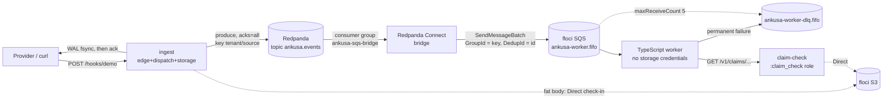

# Kafka Sink + Redpanda → SQS Example: Build Plan

2026-09-23 · status: ready to build (after the Phase 0 spike)

## Intent

Ship Kafka as a delivery target, the way `ankusa_rabbitmq` ships RabbitMQ:
a new adapter package, `ankusa_kafka`, providing `Ankusa.Sink.Kafka`. Add
a worked example, `examples/kafka-sqs-consumer/`, that runs the whole path:
Redpanda (Kafka API), a Kafka → SQS bridge, a fake SQS queue on floci, and a
TypeScript worker that reads **from SQS**. Fat payloads redeem through the
existing Claim Check gateway, exactly as in the RabbitMQ example.

### Scope correction: "an SQS queue bound to Kafka"

Kafka has no bindings. In AMQP, a consumer binds its queue to the producer's
exchange and the broker does the routing. In Kafka, a consumer **group**
reads a topic and the consumer does its own routing. So the "binding" here
is a **Messaging Bridge**: a Redpanda Connect process with its own consumer
group that reads `ankusa.events` and writes to the SQS queue. The ownership
rule from the RabbitMQ example still holds, just one layer out:

| | RabbitMQ example | Kafka example |
| --- | --- | --- |
| Ingest writes to | exchange `ankusa.events` | topic `ankusa.events` |
| Consumer-owned "binding" | queue binding (`ankusa.#`) | bridge + consumer group `ankusa-sqs-bridge` |
| Consumer-owned buffer | RabbitMQ queue | SQS FIFO queue (+ DLQ) |
| Adding a second consumer | new queue + binding | new consumer group (or a second bridge) |
| Ingest config change needed? | no | no |

## What exists today

| Fact | Where | Consequence |
| --- | --- | --- |
| `Sink.RabbitMQ` builds the wire message itself (`build_payload/3`: inline `body_base64` or a claim ticket) | `ankusa_rabbitmq/lib/ankusa/sink/rabbitmq.ex` | A second transport would duplicate the canonical message format. That's the moment to extract it (Phase 1). |
| The RabbitMQ message has no format indicator (the claim ticket has `v`, the message doesn't) | same | Once the same message crosses two transports and a bridge, consumers need `v` to survive the next change. |
| The RabbitMQ sink **declares** its exchange at connect time | `rabbitmq/connection.ex` `connect/1` | Kafka parity would mean creating the topic. That's rejected below: a partition count isn't a free, idempotent declaration. |
| Adapter packages use a `Mix.env()`-conditional `ankusa` dep, `config :ankusa, autostart: false`, their own `docker-compose.yml`, and tests against real infra | `ankusa_rabbitmq/mix.exs`, `docs/packaging.md`, `docs/testing.md` | `ankusa_kafka` follows the same scaffold. |
| CI and release run each adapter against a `services:` container | `.github/workflows/{ci,release}.yml` | Redpanda needs command-line flags, which `services:` can't pass. Its job uses a `docker compose up -d --wait` step instead. |
| floci (already used here for S3) emulates SQS on the same `:4566` port | floci.io | One emulator for claims and the queue. FIFO/redrive support isn't documented, so the Phase 0 spike checks it. |
| brod 4.6.3 (Apache-2.0, 11M downloads) needs the `crc32cer` NIF, which requires **CMake 4** to build | hex.pm/packages/brod, brod README | This is a native toolchain dependency. It's why the package is separate, and it changes the example image and the CI job. |
| Redpanda Connect's `kafka_franz` input is deprecated (since 4.68); the unified `redpanda` input replaces it | docs.redpanda.com | Use the `redpanda` input. |
| The `aws_sqs` output sends metadata as message attributes and **keeps only the first 10 (alphabetical)** | Redpanda Connect `aws_sqs` docs | Kafka input metadata (8 `kafka_*` fields) plus our headers would exceed 10. The bridge has to whitelist metadata explicitly. |

## Pattern mapping (EIP)

| Pattern | Realized as |
| --- | --- |
| **Canonical Data Model + Format Indicator** | `Ankusa.Sink.Message` v1, byte-identical across RabbitMQ and Kafka |
| **Publish-Subscribe Channel** | Kafka topic `ankusa.events`; each consumer group is an independent subscriber |
| **Messaging Bridge** | Redpanda Connect: `redpanda` input → `aws_sqs` output |
| **Point-to-Point Channel + Competing Consumers** | SQS FIFO queue, N worker replicas |
| **Correlation / ordering key** | Kafka key `tenant_id/source_id` → partition → SQS `MessageGroupId` |
| **Idempotent Receiver** | SQS FIFO `MessageDeduplicationId` = envelope `id` (5-minute window), plus the worker deduping on `id` |
| **Dead Letter Channel** | SQS DLQ: explicit move on permanent errors, redrive policy as a backstop |
| **Claim Check** | Reused unchanged: `Ankusa.ClaimCheck`, `claim-check` service, worker redeems over HTTP |
| **Guaranteed Delivery** | `acks=all` + synchronous produce; the bridge commits offsets only after SQS accepts |

## Scope

In scope:

1. `Ankusa.Sink.Message` in core. The RabbitMQ sink moves onto it.
2. The `ankusa_kafka` package: `Ankusa.Sink.Kafka`, tests against real Redpanda, CI and release jobs.
3. `examples/kafka-sqs-consumer/`: Redpanda, Redpanda Console, Redpanda Connect bridge, floci (S3 + SQS), ingest, claim-check, and the SQS worker.
4. Docs and changelogs.

Non-goals (each with a trigger for revisiting):

- **`WAL.Kafka`** (the master plan's "Kafka WAL for shops that already run
  it"). It's a different contract: the WAL needs `(tenant, source,
  dedup_key)` uniqueness, `seq` cursors, and truncation, and Kafka has no
  unique constraint. It needs its own plan with an external dedup ledger.
  Trigger: a user with Kafka and no Postgres.
- **A native `Sink.SQS`**. It would be zero-dependency in core, reusing
  SigV4 from `BlobStore.S3`. This example deliberately shows the
  bridge topology instead. Trigger: someone wants SQS without Kafka.
- **A per-message topic function.** v1 uses a static topic. A dynamic
  topic means starting producers on demand per topic. Trigger:
  topic-per-tenant.
- **Compression** (snappy/lz4/zstd are more NIF dependencies),
  **transactions/exactly-once**, and a **schema registry/Avro**.
- **A Java-compatible `murmur2` partitioner.** brod's `:hash` uses
  `erlang:phash2`, so the same key lands on a different partition than a
  Java producer would pick. That only matters for co-partitioned
  consumers (Kafka Streams/ksqlDB joins) or other producers sharing the
  topic. Trigger: either of those.
- **Ankusa consuming Kafka.** Ingest stays HTTP.

## Design

### Phase 1 (core): `Ankusa.Sink.Message`

This extracts the canonical wire format so every queue-style sink produces
identical bytes:

```elixir
@spec encode(Envelope.t(), Ankusa.Sink.ctx(), inline_max_bytes :: pos_integer()) ::
        {:ok, binary()} | {:error, {:claim_check, Ankusa.ClaimCheck.reason()}}
```

```jsonc
{"v": 1, "id": "...", "source_id": "stripe", "tenant_id": "acme", "received_at": 173...,
 "content_type": "application/json", "size": 245,
 "body_base64": "..."}                    // size <= inline_max_bytes
 // or  "claim": {"v":1,"tenant_id":...,"id":...,"size":...,"sha256":...,"content_type":...}
```

- `"v": 1` is **additive**. Existing RabbitMQ consumers ignore unknown keys,
  so it goes under "Added", not "Breaking", in the `ankusa_rabbitmq`
  CHANGELOG.
- `Sink.RabbitMQ.build_payload/3` and `check_in_claim/2` are deleted, and
  the sink calls `Ankusa.Sink.Message.encode/3`. This is a clean cutover.
- **Size ceiling** (documented, not enforced): base64 inflates by 4/3, so
  `inline_max_bytes × 4/3 + ~1 KiB` must stay under the smallest limit on
  the path: Kafka `max.message.bytes` (1 MiB default) and the SQS message
  size limit (256 KiB standard). The 8 KiB default leaves plenty of room.

### Phase 2 (package): `Ankusa.Sink.Kafka`

```elixir
sinks: [
  {Ankusa.Sink.Kafka,
   brokers: ["redpanda:9092"],          # required; "host:port" strings or {host, port}
   topic: "ankusa.events",              # required; static
   key: fn env -> "#{env.tenant_id}/#{env.source_id}" end,  # or a static string; this is the default
   inline_max_bytes: 8_192,
   client: :default,                    # names the brod client; one TCP connection per broker per client
   ssl: false,                          # passed through to brod: true | [ssl opts]
   sasl: nil,                           # passed through: {:plain | :scram_sha_256 | :scram_sha_512, user, pass}
   produce_timeout_ms: 5_000}
]
```

Each record looks like this:

- **Key**: `tenant_id/source_id` by default. That key is the ordering
  scope: it picks the partition in Kafka and, through the bridge, the
  FIFO message group in SQS.
- **Value**: `Ankusa.Sink.Message.encode/3`, byte-identical to the RabbitMQ
  message.
- **Headers**: `ankusa_id`, `ankusa_source_id`, `ankusa_tenant_id`,
  `ankusa_message_version`, `content_type` (`application/json`). The names
  use underscores rather than hyphens so they work without quoting as
  Bloblang metadata keys (`@ankusa_id`), SQS attribute names, and JS
  property names.
- **Timestamp**: `env.received_at` (CreateTime = event time, not dispatch
  time).

Delivery semantics:

- **acks**: `required_acks: -1` (all in-sync replicas). This is fixed, not
  configurable. `deliver/3` returns `:ok` only after `:brod.produce_sync`
  reports that the broker has the record. That's the Kafka equivalent of
  RabbitMQ publisher confirms, and it keeps the dispatch pipeline's `:ok`
  honest.
- **Duplicates**: brod's regular producer doesn't use Kafka idempotence (no
  producer-id or sequence numbers; verified in Phase 0). A produce retried
  after a lost ack can therefore write the same message twice. That's
  acceptable because delivery is already at-least-once end to end.
  Consumers dedupe on `id`, and the example's FIFO dedup id absorbs most
  duplicates at the channel.
- **Errors**: every failure returns `{:error, reason}` into the existing
  `Ankusa.RetryPolicy`, and on give-up the DLQ takes over. There's no
  separate reconnect policy, same as RabbitMQ. That includes an
  unreachable broker, a timeout, an unknown topic, a message that's too
  large, and a claim-check failure.
- **Topic creation**: the sink **never creates topics**. This deliberately
  differs from RabbitMQ declaring its exchange. An exchange declaration is
  idempotent and costs nothing. A topic's partition count is a capacity
  and ordering contract: it can only grow, and growing it remaps keys to
  different partitions, which breaks per-key ordering. An unknown topic
  fails loudly into retry and then the DLQ. It is never silently
  auto-created with one partition.

Process model. It mirrors `Sink.RabbitMQ`, minus the wrapper GenServer:

- `Ankusa.Sink.Kafka.Application` starts a
  `DynamicSupervisor` (`Ankusa.Sink.Kafka.Supervisor`). Core doesn't
  change.
- `ensure_started/2` starts a brod client on first delivery with
  `{:brod_client, :start_link, [endpoints, client_id, config]}` under
  that supervisor. It treats `{:error, {:already_started, _}}` as
  success, then calls `:brod.start_producer/3` per topic (also idempotent).
  brod's client already handles reconnects, leader changes, and metadata
  refresh, so wrapping it in another GenServer would add nothing.
- **This deviates from "no global names."** brod requires a
  locally registered atom as the client id. The plan confines it to
  `:"ankusa_kafka.#{instance}.#{client}"`. Both parts come from config
  (the instance atom plus the `:client` opt atom), so the number of atoms
  is bounded and two instances never collide. Say so in the moduledoc.

Ordering, as honestly as it can be stated:

- Order is preserved **per key, per dispatch node**. The dispatch
  pipeline is a single sequential poller, and inline retries block the
  batch, so a retried record never overtakes a later one.
- Order is **not** preserved in these cases:
  - after a DLQ replay;
  - across a fleet of dispatch nodes sharing a `WAL.Postgres`;
  - after the topic's partition count changes.

### Phase 3 (example): `examples/kafka-sqs-consumer/`



Services (`docker-compose.yml`):

| Service | Image | Notes |
| --- | --- | --- |
| `redpanda` | `docker.redpanda.com/redpandadata/redpanda:v26.2.3` | `redpanda start --mode dev-container --smp 1`, internal listener `redpanda:9092`, external `localhost:19092`; healthcheck `rpk cluster health` |
| `redpanda-bootstrap` | same image | `rpk topic create ankusa.events -p 6 -r 1`. The topic is owned by ops/bootstrap, never by the sink. |
| `redpanda-console` | `redpandadata/console` | Web UI on `:8080` showing the topic, messages, and **consumer group lag**. Parity with the RabbitMQ management UI. |
| `floci` | `floci/floci:latest` | S3 (claims) and SQS on `:4566` |
| `aws-bootstrap` | `amazon/aws-cli` | Creates the bucket `ankusa-example`; creates `ankusa-worker-dlq.fifo` first, then `ankusa-worker.fifo` with `FifoQueue=true`, `ContentBasedDeduplication=false`, `VisibilityTimeout=30`, and `RedrivePolicy={deadLetterTargetArn: <dlq>, maxReceiveCount: 5}` |
| `ingest` | `ingest_app` image | `ANKUSA_ROLES=edge,dispatch,storage`; `Sink.Kafka` → `redpanda:9092` |
| `claim-check` | same `ingest_app` image | `ANKUSA_ROLES=claim_check`, `:4001`, same S3 bucket |
| `bridge` | `docker.redpanda.com/redpandadata/connect:4.110.0` | `bridge/bridge.yaml`, mounted |
| `worker` | `./worker` | SQS credentials only (fake). **No S3 credentials.** |

`bridge/bridge.yaml`. The exact Bloblang is checked with `rpk connect lint`
in Phase 0:

```yaml
input:
  redpanda:
    seed_brokers: ["redpanda:9092"]
    topics: ["ankusa.events"]
    consumer_group: ankusa-sqs-bridge      # consumer-owned; ingest never knows it exists
    start_offset: earliest
pipeline:
  processors:
    # Whitelist metadata: aws_sqs keeps only 10 attributes (alphabetical), and
    # the redpanda input alone adds 8 kafka_* fields.
    - mutation: |
        meta = @.filter(kv -> kv.key.has_prefix("ankusa_") ||
                              ["kafka_key", "kafka_partition", "kafka_offset"].contains(kv.key))
output:
  aws_sqs:
    url: http://floci:4566/000000000000/ankusa-worker.fifo
    endpoint: http://floci:4566
    region: us-east-1
    credentials: { id: test, secret: test }
    message_group_id: ${! @kafka_key }           # ordering scope = Kafka key
    message_deduplication_id: ${! @ankusa_id }   # FIFO dedup (5-min window) on envelope id
    max_in_flight: 1                             # >1 can reorder sends within a group
    batching: { count: 10, period: 100ms }       # SendMessageBatch caps at 10
```

- **At-least-once hop.** The `redpanda` input commits an offset only after
  the output confirms, so a bridge crash replays from the last commit.
  Replays inside 5 minutes are absorbed by the FIFO dedup id. Anything
  older still reaches the worker, which is why the worker dedupes too.
- **FIFO over a standard queue**: this keeps Kafka's per-key ordering and
  gets channel-level dedup for free. The cost is throughput (roughly
  300 msg/s per queue, or 3,000 batched; high-throughput FIFO mode goes
  further) and head-of-line blocking per group. Both are documented in the
  README.

Worker (`worker/src/worker.ts`, `@aws-sdk/client-sqs`, `endpoint:
http://floci:4566`):

- `ReceiveMessage` with a 20s long poll, batch size 10, `MessageAttributeNames: ["All"]`, and `MessageSystemAttributeNames: ["ApproximateReceiveCount", "MessageGroupId"]`.
- Messages are processed **sequentially** in the order received, which is
  the only order FIFO guarantees within a group.
- A message that fails `v === 1` or isn't valid JSON is a **permanent**
  error.
- Claim redemption is the same as the RabbitMQ worker: `GET` against
  claim-check, then `size` and `sha256` are verified locally.
- Outcomes:

  | Outcome | Action |
  | --- | --- |
  | Success | `DeleteMessageBatch` |
  | Permanent (404, integrity, 4xx, bad format/version) | `SendMessage` to the DLQ (same group id and dedup id), **then** `DeleteMessage`. Send-then-delete means a crash in between duplicates the message rather than losing it. An explicit move unblocks the group now instead of after 5 wasted receives. |
  | Transient (5xx, network) | `ChangeMessageVisibility` to `min(30s × 2^(receiveCount−1), 900s)` **for this message and every later message of the same group in this batch**. Processing a later same-group message now would break ordering. The redrive policy (5 receives) is the backstop. |

- SIGTERM stops polling and finishes in-flight messages. There's no
  forced exit.
- The redeem code (about 40 lines) is duplicated from the RabbitMQ worker
  on purpose. Examples stay self-contained, and there's no shared npm
  package to publish.

`ingest_app/`: a new wrapper that depends on `ankusa` + `ankusa_kafka`. It's
not shared with the RabbitMQ example; a shared wrapper would compile both
`amqp` and `brod` into both images. The Dockerfile follows the existing
pattern, plus `apk add --no-cache build-base cmake` for `crc32cer`. If
Alpine's `cmake` is older than 4, it switches to the Debian-based
`elixir:1.20.4` image (see Phase 0).

Failure drills, documented in the README and each run once in Phase 3
verification:

1. **Bridge down**: `docker compose stop bridge`, send hooks. Ingest keeps
   returning `201`, and consumer lag grows in the Redpanda Console. Then
   `start bridge`: lag drains and the worker prints everything, in order
   per source.
2. **Worker down**: stop the worker and send hooks. They accumulate in
   SQS (`aws sqs get-queue-attributes ... ApproximateNumberOfMessages`).
   Start the worker and they drain.
3. **Poison claim**: send a fat hook, delete its `claims/...` object from
   floci S3, and replay or resend. The worker gets a 404, moves the message
   to the DLQ, and later messages from that source keep flowing.

## End-to-end guarantees

| Hop | Guarantee | Duplicates? | Ordering |
| --- | --- | --- | --- |
| Provider → WAL | durable ack (unchanged) | deduped by `(tenant, source, dedup_key)` | n/a |
| WAL → Kafka (`Sink.Kafka`) | at-least-once, `acks=all` | yes, on a retried produce | per key, per dispatch node |
| Kafka → SQS (bridge) | at-least-once, offset committed after send | absorbed within 5 minutes by FIFO dedup id | per key (`max_in_flight: 1`, group = key) |
| SQS → worker | at-least-once (visibility timeout) | yes after 5 minutes, or on a redelivery | per group, as long as the worker processes each group in order |
| **Consumer contract** | **idempotent on `id`** | | |

## Build order

Each phase is one PR and ships green on its own.

| Phase | Deliverable | Acceptance |
| --- | --- | --- |
| 0 | **Spike**, timeboxed and throwaway, with findings appended to this plan. See the list below. | Every check has a recorded result. Any failure flips the named fallback before Phase 2 starts. |
| 1 | `Ankusa.Sink.Message` in core; `Sink.RabbitMQ` moved onto it | Inline and claim paths, `"v": 1`, threshold boundary (`size == inline_max_bytes` is inline). Existing RabbitMQ tests pass unchanged apart from the added `v`. Core suite green. |
| 2 | `ankusa_kafka` package, CI and release jobs | Against real Redpanda: an inline record is fetched back with the expected value, key, headers, and timestamp; a fat record carries a claim that redeems through `ClaimCheck.redeem/3`; the key works as a string and as a function; an unreachable broker returns `{:error, _}` within `produce_timeout_ms` (no hang); an unknown topic returns `{:error, _}`, not auto-creation. |
| 3 | `examples/kafka-sqs-consumer/` | `docker compose up --build`. A small hook prints `via=inline`, a fat hook prints `via=claim:<id>`, and the worker has no S3 credentials in its environment. All three failure drills behave as described. |
| 4 | Docs and changelogs | Listed below. |

Phase 0 checks:

1. `crc32cer` builds on `elixir:1.20.4-alpine` (with `apk cmake`) and on the GitHub `ubuntu-latest` runner. If it doesn't: use the Debian base image, and add `jwlawson/actions-setup-cmake` in CI.
2. brod against Redpanda:
   - `produce_sync` with `required_acks: -1` and a headers/timestamp message map;
   - behavior and timing with an unreachable broker and with an unknown topic;
   - whether the regular producer really lacks idempotence;
   - that `start_producer/3` is idempotent.
3. floci SQS: FIFO queues, `MessageGroupId` ordering, a `MessageDeduplicationId` duplicate is dropped, and the redrive policy moves a message after `maxReceiveCount`. If any of those fail: use **ElasticMQ** (`softwaremill/elasticmq-native`, FIFO + DLQ supported) for SQS only and keep floci for S3. If that also fails, fall back to a standard queue and rely on worker dedupe alone, and document that ordering is lost.
4. `rpk connect lint bridge.yaml`; the metadata whitelist produces exactly the intended attributes; `max_in_flight: 1` keeps per-group order under load (1,000 records, 6 partitions).

## Files

| Phase | Files |
| --- | --- |
| 1 | new `lib/ankusa/sink/message.ex`, `test/ankusa/sink/message_test.exs`; `ankusa_rabbitmq/lib/ankusa/sink/rabbitmq.ex` |
| 2 | new `ankusa_kafka/`: `mix.exs` (`{:brod, "~> 4.6"}` + the conditional `ankusa` dep), `.formatter.exs`, `LICENSE`, `CHANGELOG.md`, `config/config.exs` (`autostart: false`), `docker-compose.yml` (Redpanda on `:19092`), `lib/ankusa/sink/kafka.ex`, `lib/ankusa/sink/kafka/application.ex`, `test/test_helper.exs`, `test/ankusa/sink/kafka_test.exs`; `.github/workflows/ci.yml` and `release.yml` (new `ankusa_kafka` job, `needs: ankusa`, `docker compose up -d --wait` step, CMake setup) |
| 3 | new `examples/kafka-sqs-consumer/`: `README.md`, `docker-compose.yml`, `bridge/bridge.yaml`, `ingest_app/{mix.exs,Dockerfile,lib/.../application.ex}`, `worker/{package.json,package-lock.json,tsconfig.json,Dockerfile,src/worker.ts}` |
| 4 | `docs/delivery.md` (`Sink.Kafka` section, shared message format), `docs/configuration.md` (behaviour-table row), `docs/packaging.md` (third adapter package; the NIF toolchain as the split reason), `docs/architecture.md` (topology 4 generalized to "RabbitMQ or Kafka + bridge"), `docs/testing.md` (`ankusa_kafka` section), `docs/deployment.md` (CMake in images, release order), root `README.md` (layout, behaviours, examples), `CHANGELOG.md` (Added: `Ankusa.Sink.Message`), `ankusa_rabbitmq/CHANGELOG.md` (Changed: uses `Ankusa.Sink.Message`; Added: `"v": 1`), `ankusa_kafka/CHANGELOG.md` (0.1.0) |

## Test plan

This follows `docs/testing.md`: real infrastructure, no mocks.

- **Core**: `Ankusa.Sink.Message` tests over LocalFS claims. No new
  infrastructure is needed.
- **`ankusa_kafka`**: every test runs against the package's Redpanda
  container, like `ankusa_rabbitmq`. Records are read back with
  `:brod.fetch/4` (no consumer group needed). Each test gets its own
  topic, created in `setup` through brod's admin API and deleted in
  `on_exit`, so the tests stay isolated.
- **`ankusa_rabbitmq`**: the existing 4 tests pass. The fat-payload test
  additionally asserts `decoded["v"] == 1`.
- **Example**: verified by running it and the three failure drills, per
  `testing.md#verifying-the-worked-example`.
- Not tested: brod's internals (reconnects, leader changes) and Redpanda
  Connect's semantics. Both are verified once in the Phase 0 spike and
  owned upstream.

## Risks

| Risk | Mitigation |
| --- | --- |
| The NIF toolchain (CMake 4) breaks image builds or CI | Phase 0 check 1, with a named fallback (Debian image, setup-cmake action). Core stays NIF-free. |
| Duplicate produces (no idempotent producer) | At-least-once is already the contract; FIFO dedup plus worker dedupe on `id`. Documented in the moduledoc and `delivery.md`. |
| A poison message blocks its FIFO group | The worker moves permanent failures to the DLQ immediately; transient failures back off; redrive is the backstop. Group = `tenant/source`, so one bad source never stalls another. |
| Metadata goes over the SQS 10-attribute cap and gets silently truncated | Explicit whitelist in the bridge (8 attributes), checked in Phase 0. |
| Someone changes the partition count and per-key ordering breaks silently | The sink never creates or alters topics; the docs say partition count is a capacity and ordering contract owned by ops. |
| Atom registration for brod client ids | Built only from config atoms (instance + `:client`), so the count is bounded; documented as a deliberate exception. |
| Example images grow (Redpanda, Console, Connect, floci) | It's an example. `--scale ingest=N` still works; the README lists memory expectations. |

## Decisions

- [x] Kafka ships as a separate `ankusa_kafka` package using brod. The trigger is the external dependency plus its NIF, per `packaging.md`.
- [x] The canonical message is extracted to core (`Ankusa.Sink.Message`), with an additive `"v": 1`.
- [x] `acks=all`, synchronous produce; the sink returns `:ok` only once the broker has the record.
- [x] The sink never creates topics. The topic belongs to ops/bootstrap.
- [x] The default key is `tenant_id/source_id`, which is the ordering scope end to end.
- [x] Header names use underscores.
- [x] Static topic only in v1.
- [x] The bridge is Redpanda Connect with the unified `redpanda` input (not the deprecated `kafka_franz`).
- [x] SQS FIFO: group = Kafka key, dedup id = envelope `id`, `max_in_flight: 1`.
- [x] The worker moves permanent failures to the DLQ explicitly (send, then delete); redrive is the backstop.
- [x] floci provides both S3 and SQS, with ElasticMQ as the fallback if FIFO or redrive fail in Phase 0.

## Open decisions (deferred, each with a trigger)

- [ ] A Java-compatible `murmur2` partitioner. Trigger: co-partitioned consumers, or a non-Ankusa producer on the same topic.
- [ ] Per-message topic selection. Trigger: topic-per-tenant.
- [ ] Compression (snappy/lz4/zstd). Trigger: broker egress or storage cost.
- [ ] A native `Sink.SQS` in core (SigV4 reuse, zero dependencies). Trigger: SQS-only users.
- [ ] `WAL.Kafka`, as its own plan. Trigger: a user with Kafka and no Postgres.
