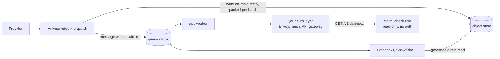

# Claim check: store bytes, return bytes, nothing else

**Status:** Approved, unapplied

The claim-check gateway grew an auth system nobody asked for: static bearer
tokens, per-tenant scopes, and `401`/`403` responses. The OpenAPI document never
had any of it (`security: []`), so the code and the contract already disagree.
This plan removes auth and cuts the claim check down to what it's for: storing
payloads cheaply and returning them quickly to whoever the deployer's own
infrastructure let through.

Who may read what is decided in front of Ankusa: Envoy and Wayfinder on
Kubernetes, a service mesh, an API gateway, a cloud load balancer with OIDC.
Each makes different assumptions, and Ankusa shouldn't bake any of them in. A
hosted or enterprise auth offering could come later as a separate component in
front of the gateway. Nothing in this plan boxes that in, and nothing here
blocks the claim check from later shipping as a standalone service (see "A
standalone claim-check service").

Nobody depends on the formats yet, so they change in place. The message stays
`v: 1`, the API stays `/v1`, and the reference starts at `v1`.

The reasoning follows
[The Route Table Is the Contract](https://james-carr.org/posts/2026-07-29-stop-treating-your-object-store-like-a-shared-database/)
and its [demo](https://github.com/jamescarr/object-gateway-demo/tree/read-side-post):

- **The writer owns the payloads, so it writes to the store directly.** Every
  other service reads through a gateway.
- **A reference names bytes and grants nothing.** It's safe in a queue, a log,
  a DLQ dump, or a table column. Access is decided at read time, by the reader's
  own identity.
- **Stored objects are never rewritten**, so caches never have to invalidate
  anything.
- **The path shape is the contract** that a route table, an authorizer, or a
  cache matches on.

## Target



### The reference

The six-field ticket (195 bytes for tenant `acme`) becomes one string of 145
bytes:

```
urn:ankusa:claim:v1:acme:0199a1c2-7b3e-7d4a-9c1f-2e5b8a6d4f10:66:3145728:sha256-3bea8a9a07c1e8dcaa4c1b816815c35a29b4fb585ba6ecc70ea44840a794cfb3
                    └tenant┘└────────── object id ───────────┘└offset┘└len┘└──────────────────────── integrity ───────────────────────────┘
```

| Segment | Meaning |
| --- | --- |
| tenant | `[A-Za-z0-9_-]{1,64}`. The URN segment, the URL segment, and the key segment are the same string, with no encoding anywhere. |
| object id | A lowercase UUIDv7 naming one stored object. Its timestamp decides the date folder. |
| offset, length | Where the claim's bytes sit inside that object: decimal integers, no leading zeros. The object is a pack ("Pack format" below), and the offset points at the claim's entry data, so a read is one range fetch. |
| integrity | `sha256-` followed by 64 lowercase hex characters over the claim's bytes. Always present. The reader checks it and never sends it to the gateway. |

`content_type` isn't in the reference; the message already carries it. The
message's `id` identifies the hook. The object id identifies storage, and
it's allowed to differ.

A consumer turns a ref into a request by dropping the prefix and the digest and
swapping `:` for `/`:

```
GET /v1/claims/acme/0199a1c2-7b3e-7d4a-9c1f-2e5b8a6d4f10/66/3145728
```

In Elixir, `Ankusa.ClaimCheck.Ticket` becomes `Ankusa.ClaimCheck.Ref`
(`tenant_id`, `object_id`, `offset`, `length`, `sha256`), with `parse/1`,
`String.Chars`, and `key/1`.

### Storage layout: Hive-style date folders

```
claims/tenant=acme/dt=2026-09-24/0199a1c2-7b3e-7d4a-9c1f-2e5b8a6d4f10
```

`dt` is the UTC date of the object id's UUIDv7 timestamp, so the key is still a
pure function of the ref.

Hive-style `key=value` folders are what Spark and Databricks partition discovery,
BigQuery hive partitioning, and Athena read without configuration. A reader
filtering on a day skips every other day's objects. The LocalFS sweeper can
drop whole `dt=` directories past retention instead of listing every object.

### The message

Same `v: 1`. `claim` becomes the string:

```json
{"v": 1, "id": "0199a1c3-...", "source_id": "stripe", "tenant_id": "acme", "received_at": 1760000000000,
 "content_type": "application/json", "size": 3145728,
 "claim": "urn:ankusa:claim:v1:acme:0199a1c2-7b3e-7d4a-9c1f-2e5b8a6d4f10:66:3145728:sha256-3bea8a9a..."}
```

A flat string column is easier for every schema-on-read consumer than a nested
object: Spark's `from_json`, Snowflake `VARIANT`, BigQuery JSON.

### The gateway: read-only

| Request | Response |
| --- | --- |
| `GET /v1/claims/{tenant}/{object_id}/{offset}/{length}` | `200` with exactly those bytes and `cache-control: public, max-age=31536000, immutable`; `400` malformed; `404`; `416` range past the object's end; `503` + `Retry-After` |
| `GET /health` | `200` |

The read is one `BlobStore.get_range/5` call, which all three adapters already
implement for segment reads. There's no `PUT` and no auth. Ankusa's dispatch
nodes are the only writers, and they write straight to the store.

**Immutable by construction.** Every object is written once under a freshly
minted UUIDv7 and never rewritten, so the `immutable` cache header is safe
without conditional writes. Someone editing the bucket by hand is outside the
contract, and the reader's digest check catches it.

### What a front layer needs from us

This is the whole integration surface for auth. Ankusa documents it and ships
no proxy config.

- One method and one path shape:
  `^/v1/claims/[A-Za-z0-9_-]{1,64}/[0-9a-f]{8}-[0-9a-f]{4}-7[0-9a-f]{3}-[89ab][0-9a-f]{3}-[0-9a-f]{12}/(0|[1-9][0-9]{0,11})/[1-9][0-9]{0,11}$`.
  Anything else can be refused at the edge.
- The tenant is a path segment, so an authorizer can compare it to the caller's
  identity without reading a body.
- A caller allowed to read a tenant can request any range of that tenant's
  objects. That grants nothing new: it can already read every claim in them.
- **A shared cache must sit behind the authorizer, never in front of it.** A
  cache in front would serve one tenant's payload to another tenant's request.
  This is the one rule we have to say loudly.
- The gateway performs no authentication and logs a warning saying so at
  startup, the same way the admin API does.

## Write cost

Object stores bill per write. At the time of writing, S3 Standard (us-east-1)
and GCS regional Standard both charge $0.005 per 1,000 writes, and GCS
multi-region charges $0.01. Reads are $0.0004 per 1,000.

Only bodies over a sink's `inline_max_bytes` become claims. Every hook is
*already* written once to the object store in batch: the compactor packs
everything from a tick into one segment, which is one `PUT`. A claim writes the
same body a second time.

| Fat hooks/day | One object per claim | 32 claims per object |
| --- | --- | --- |
| 100k | $15/month | $0.47/month |
| 1M | $150/month | $4.69/month |
| 10M | $1,500/month | $46.88/month |

These figures assume one write per claim. Today's code does worse. Here are
four levers, cheapest first.

**1. Fix write amplification. This is a bug.** `Sink.Message.encode/3` calls
`ClaimCheck.check_in/4` from inside each sink's `deliver/3`, and
`Dispatch.Pipeline.deliver_with_retry/4` calls `deliver/3` once per sink and
again on every retry attempt. The result:

- A fat hook on a source with a RabbitMQ sink and a Kafka sink is written twice.
- During a broker outage it's written up to `max_attempts` (12) times.

The fix: the pipeline checks each envelope in **once**, before its sinks run,
and passes the ref to every sink and every attempt through `ctx`. Sinks stop
calling the claim check at all. They only decide inline or claim by comparing
`size` to their `inline_max_bytes`. The pipeline checks a body in when any of
its source's sinks will need it, which means sinks declare their threshold.

**2. Default the inline threshold to 64 KiB (decided).** Every body under the
threshold costs zero object writes. Users set the threshold per sink with
`inline_max_bytes`, in YAML and in Elixir opts, as they do today; only the
default changes, from 8 KiB to 65,536 bytes.

Base64 turns 64 KiB into about 87 KiB, plus about 1 KiB of envelope. That's
well under the ceilings `Sink.Message`'s moduledoc documents: Kafka's default
`max.message.bytes` of 1 MiB and SQS's 256 KiB. Most webhook bodies are a few
KiB to tens of KiB, so most claims become inline bodies. The cost moves to
broker bytes, which the docs must say; 8 KiB was chosen to keep RabbitMQ memory
flat.

The default is defined once, as `Sink.Message.default_inline_max_bytes/0`,
instead of being hardcoded separately in `Sink.RabbitMQ` and `Sink.Kafka`. Both
examples keep `INLINE_MAX_BYTES=8192` explicitly, with a comment saying why:
their ~25 KB demo "fat" hook has to take the claim path.

**3. Pack claims per dispatch batch.** Dispatch already holds up to
`dispatch.batch` (128) envelopes per poll. Before running sinks, the pipeline
concatenates the claim bodies of each tenant in the batch into one object under
a new UUIDv7, with one `PUT` per tenant per batch. Each envelope gets a ref
with its own offset and length.

- **Latency:** no waiting for more hooks than a dispatch poll already holds. A
  group's messages do wait for its one `PUT`; "Pack format: options and latency"
  covers how that's bounded.
- **Durability:** unchanged. The `PUT` completes before any message is
  published.
- **Retries** reuse the refs (lever 1).
- **A dispatch crash** mid-batch rewrites the batch into a new object on
  restart. The old one is orphaned and retention reaps it.
- **Tenant erasure** is still a prefix delete, because packs never mix tenants.
- **Low-traffic tenants** degrade to one claim per object, which is no worse
  than today.
- **Costs:** a claim can't be deleted on its own, only its object (retention is
  per object anyway). Bulk readers read the pack's own index; see the next
  section.

### Pack format: options and latency

**The format doesn't add read latency.** Every option below reads a claim the
same way: one ranged `GET` at the offset and length in the ref. Nothing parses
the pack on the hot path. On S3 and GCS, the first byte of a range read doesn't
depend on how large the object is.

**Building the pack doesn't add latency either.** Measured in Elixir, in memory,
20 runs each:

| Pack | Uncompressed ZIP | Raw concatenation | sha256 (computed either way) |
| --- | --- | --- | --- |
| 128 × 64 KiB | 2 ms | 6 ms | 4 ms |
| 128 × 1 MiB | 28 ms | 34 ms | 57 ms |

Both formats are one memory copy. The ZIP headers and CRC-32 are noise next to
it, and next to the digest we compute anyway.

**Packing itself adds write-side latency, whatever the format.** Every message
in a tenant's group waits for that group's one `PUT`, and a bigger pack takes
longer to upload. Today each fat hook waits for its own small `PUT`. Packed, the
first hook in a group waits for the whole group's upload, while the last one no
longer waits for N round trips in a row. Phase 3 bounds it three ways:

- **A size cap:** `claim_check.pack_max_bytes`, default 16 MiB. A group over
  the cap splits into several packs. A single body larger than the cap gets a
  pack of its own.
- **Concurrent uploads.** Packs for different tenants, and split packs, upload
  concurrently, so one slow upload doesn't hold the others' messages.
- **Failure isolation.** A pack whose `PUT` fails doesn't block the rest. Its
  envelopes go through the normal sink retry, and on retry they check in as
  one-entry packs.

The options (all 1 ranged `GET` per claim):

| Option | `PUT`s per pack | How a bulk reader finds claims in the bucket | Readable without Ankusa code |
| --- | --- | --- | --- |
| **A. Uncompressed ZIP + `manifest.json`** (chosen) | 1 | Read the tail: the central directory, then `manifest.json`. That's two small range reads, or one generous tail read. | Yes: `unzip`, Python `zipfile`, `java.util.zip`, Go `archive/zip`, Erlang `:zip` |
| **B. Raw bodies, index at the front** | 1 | One range read of the head. | No: the header is our own format |
| **C. Raw bodies + a sidecar index object** | 2 | `GET` the small index object. | Mostly: the index is JSON; the pack is raw bytes |
| **D. Raw bodies, no index in storage** | 1 | It doesn't. The refs in the messages are the index. | For anyone reading the messages; the bucket alone isn't self-describing |
| **E. Parquet** | 1 | The footer, natively in SQL engines. | Yes, and SQL engines read it natively |

- **A** is the only option that is both self-describing and a standard format.
  - Overhead is about 350 bytes per claim, under 0.6% of a 64 KiB body.
  - Entries stay uncompressed so a range can be served raw.
  - Our own writer, about 100 lines, emits it with offsets known by
    construction. `:zip` reads the output back in tests.
  - Checked: a slice at the computed offset is byte-identical to the body, and
    `unzip`, `zipfile`, and `:zip` all read the pack.
  - The format's 65,535-entry and 4 GiB limits sit far above the 16 MiB cap. A
    body of 4 GiB or more can't be stored, so boot fails if `max_body_bytes`
    reaches that.
- **B** is possible only because dispatch holds the whole batch before
  writing, so every size is known up front. It beats A for bulk readers by one
  range read, at the cost of being a format nobody else reads.
- **C** is Git's `.idx` and WARC's CDX pattern.
  - It doubles `PUT`s per pack. That's still 16× fewer than unpacked at 32
    claims per pack.
  - Both uploads can run concurrently, so there's no added latency.
  - It's two objects to keep consistent: the index must land after the pack,
    or a reader can find an index pointing at nothing.
- **D** is the leanest. A Databricks job already reading the Kafka topic has
  every ref, so it can skip any in-bucket index. The cost is the "self-describing
  packs" decision.
- **E**: a single value isn't reliably byte-addressable (pages, encodings,
  compression), so the gateway would have to decode, which costs read latency.
  The only Elixir writer is Explorer's Polars NIF. If SQL-native reads become
  the priority, add a periodic job that converts packs to Parquet.
- **Provider features** like appendable objects were ruled out: they only exist
  on some stores, and packs have to work the same on `LocalFS`, S3, and GCS.

**Others have solved this.** Packing many small blobs into one object, with an
index of offsets and single-record range reads, is well established:

| System | What it shows |
| --- | --- |
| Common Crawl | Web pages live in large WARC files. Its index stores each record's file, offset, and length, and readers fetch one record with an HTTP range request: the same shape as our ref. |
| Facebook Haystack | Many small photos packed into large volume files with an offset index, to avoid per-object overhead. |
| WarpStream and similar Kafka-on-object-storage systems | Batch writes from many partitions into one object per flush specifically to cut object-store `PUT` costs, keeping the index in a metadata service. |
| Parquet, ORC, ZIP | The index sits at the end of the file and is found by reading the tail. |
| Git packfiles | The index is a separate `.idx` file (option C). |

**4. Reuse the compactor's segments as claim storage** (zero extra writes).
Rejected:

- Publishing a claim would have to wait for compaction, up to a tick.
- The id → segment index lives on the storage node's local disk, where the
  gateway can't reach it.
- Segments hold full envelopes, headers included, in Ankusa's codec, which no
  data platform can read.
- Segments mix tenants.
- Segments are archive data and may move to cold tiers, but claims need hot
  reads.

**Order:** all three ship in this plan. 1 is a bug fix, 2 is a default, and 3
is decided. Phase 3 builds on phase 2's single check-in.

## A standalone claim-check service

The claim check could ship on its own as a generic service: the same image with
`roles: [claim_check]` already runs without a WAL. What makes it a product is a
**write API for producers other than Ankusa**. This plan leaves that out and
keeps it possible. Here's what it would need, all of which Ankusa's own writer
avoids by construction:

- **Server-minted object ids.** A client-chosen UUIDv7 picks its own date
  folder and so defeats retention. It can also collide with another writer's
  object. Minting server-side also enables `Idempotency-Key` retries.
- **Write-once enforced by the store:** `If-None-Match: *` on S3,
  `ifGenerationMatch=0` on GCS, an exclusive create on LocalFS. That's because
  an external writer *can* send different bytes.
- **A size cap and a large-upload path**, for example mint-then-upload as in
  the demo's
  [`write-path.md`](https://github.com/jamescarr/object-gateway-demo/blob/read-side-post/docs/write-path.md).
- **`Content-Digest` (RFC 9530)** instead of a custom header.
- **Still no auth.** Write access is decided in front of it, like reads.

This plan's choices keep that door open:

- `Ref`, the key layout, the read route, and retention depend on nothing from
  the envelope or the WAL.
- The ref grammar already covers a single uploaded object: a one-entry pack.
- Packing is an internal optimization of one writer, not part of the contract.

**Not now (decided).** The door stays open: a write API would be a separate
plan, triggered by a real second producer.

## Platform integration

A claim gets read in two ways, and both have to work without any Ankusa code on
the reading side.

**1. HTTP, for application services.** Workers in any language, Lambda
functions, Kafka Connect, workflow engines. They need network reach to the
gateway plus whatever credential the deployer's front layer accepts. The
contract is one `GET` route in an OpenAPI **3.1** document, downgraded from 3.2.
The spec uses nothing specific to 3.2, and 3.1 is what `openapi-generator`,
`openapi-python-client`, and most API gateway importers actually read.

**2. Governed direct reads, for data platforms.** Databricks, Snowflake,
BigQuery, and Athena all read object storage natively under their own
governance: Unity Catalog external locations and volumes, Snowflake external
stages, BigQuery object tables.

For them, the HTTP gateway is the wrong tool. Pulling each claim through an HTTP
call per row from Spark executors is slow. Databricks serverless compute needs
private connectivity set up to reach an internal endpoint at all. And the
platform already has an authorizer and an audit log for the bucket. The
gateway argument in the post is about application services each taking bucket
credentials; a governed data platform is a different case.

Those platforms need:

- **The key layout as a second, documented read contract**, with Hive-style
  folders and no encoding.
- **Hex digests.** Spark and Snowflake `sha2(x, 256)`, `sha256sum`, and
  `hashlib.hexdigest()` all produce hex, so a reader compares directly.
- **A flat `claim` string in the message.**
- **A standard container for packs.** A bulk job reads the ZIP's central
  directory or `manifest.json`: Spark's `binaryFile` source plus Python's
  `zipfile` in a UDF, with no Ankusa code. Readers that already have messages
  can skip the archive and slice with the ref's offset and length:

  ```sql
  substring(content, offset + 1, length)
  ```

  SQL engines don't read ZIP natively. That's the case the rejected-Parquet
  note above covers.

This plan ships no connectors, notebooks, or per-platform guides. The docs cover
the two contracts and one worked HTTP example, which already exists in the
TypeScript workers.

## SPIFFE

SPIFFE is a standard for **workload identity**: short-lived X.509 or JWT
credentials (SVIDs) that name a service, such as
`spiffe://prod/ns/billing/sa/worker`, issued by SPIRE, Istio, Linkerd, or Consul.
It fits the "auth in front" model well, and it needs **no code in Ankusa**:

- **Inbound:** a SPIFFE-aware mesh or Envoy authenticates the calling worker
  over mTLS, and an authorization policy allows its SPIFFE ID for `GET` on the
  claims path. The gateway never sees any of it. That's the model working as
  intended.
- **Outbound is the real gap, and it's broader than SPIFFE.** `BlobStore.S3`
  only takes static access keys. It has no session tokens and no web-identity
  federation. Adding `AssumeRoleWithWebIdentity` (a projected token file) would
  cover all of these at once:
  - EKS IRSA and Pod Identity
  - SPIRE JWT-SVIDs, through SPIRE's OIDC discovery provider federated into AWS
    IAM
  - GCP Workload Identity Federation

  That would be a separate plan about Ankusa logging in to its own
  dependencies, not about access control. **Set aside for now.**

Verdict: document SPIFFE-based meshes as one good front layer. Don't integrate
anything.

## What this removes, and why

| Removed | Why |
| --- | --- |
| Bearer tokens, tenant scopes, `401`/`403` (`claim_check.api_tokens`, YAML `claim_check.tokens`) | That's the point of the plan. |
| `PUT /v1/claims/...` and `x-ankusa-sha256` | Ankusa's own writer doesn't use them. As a generic write API, the current `PUT` is the wrong shape anyway: client-minted ids, no write-once, no large uploads. It returns in the standalone-service plan. |
| `Ankusa.ClaimCheck.Remote`, the adapter behaviour, `claim_check.adapter`, YAML `claim_check.remote` | `Remote` is the only outbound call Ankusa would ever need to authenticate, so keeping it would put auth back in through tokens, headers, or mTLS. It also puts an RPC dependency on dispatch. The writer owns the data. |
| `claim_check.max_bytes` | The only bytes checked in are ones the edge already accepted under `http.max_body_bytes`. Startup already refuses any value below that, so the only allowed values do nothing. |
| Percent-encoded tenants | Some proxies normalize `%2F`, which changes the tenant. Encoding also defeats simple route regexes and leaks into every key a data platform reads. The tenant is validated at ingest instead. |
| Conditional writes (the first draft's `put_new/4`) | Objects are minted fresh and never rewritten. Conditional writes come back with a standalone write API, not before. |
| The first draft's spec-conformance test and its YAML dependency | The API is one `GET` route. The drift it was meant to catch (auth, error names) is being deleted. |

**Tenant validation moves to ingest.** A tenant outside the grammar gets `404`
at the edge before anything is written: from `TenantPath` today, and from
`Edge.Ingest` for any custom `RouteResolver`. A static source `tenant:` is
checked at boot. This replaces the old worry that "a resolver-provided tenant
shouldn't become a permanent dispatch failure": a bad tenant now fails before
the provider gets an ack, which is where it can be fixed.

## Alternatives considered

| Recommendation | Decision |
| --- | --- |
| Keep built-in tokens | Rejected. Static secrets, restart to rotate, no caller identity. |
| Presigned URLs in the message | Rejected. They expire under replay and DLQ, they're bearer credentials that leak through logs, and they name the bucket. |
| Gateway answers `302` to a short-lived presigned URL | Deferred. Can't work for `LocalFS`. Trigger: gateway egress or latency shows up in telemetry. |
| Signed or HMAC refs | Rejected. That's auth embedded in the reference. |
| Content-addressed keys | Rejected. They can't express tenancy, and identical payloads from two tenants would share an object. |
| The HTTP `Range` header instead of offset/length in the path | Rejected as the primary form. Shared caches handle a range per URL much more reliably than range requests on one URL, and a consumer builds the path straight from the ref. |
| Replace the role with `nginx-s3-gateway` | Allowed for S3 deployments whose front layer turns the ref's offset and length into a `Range` header: the key layout is a documented contract. The role stays for `LocalFS`, GCS, and path-addressed ranges. |
| SPIFFE or mTLS inside Ankusa | Rejected (see above). |

## Non-goals

- **Webhook signature verification** is data integrity at ingest and stays.
- **Outbound credentials to dependencies** stay. Workload identity for them is
  the follow-up plan above.
- **The admin API** is already unauthenticated and unchanged.
- **Streaming reads.** `max_body_bytes` bounds each claim at 8 MB by default.
  A pack is at most `dispatch.batch` × that, but reads only ever fetch one
  claim's range.

## Phases

Each phase leaves every package green.

### 1. Read-only, auth-free gateway

**Core**

- `lib/ankusa/claim_check/remote.ex`: delete.
- `lib/ankusa/claim_check.ex`:
  - drop the behaviour and adapter resolution; call the instance's `BlobStore`
    directly (folding in `direct.ex`)
  - drop `check_size`
  - drop the `:unauthorized`, `:forbidden`, and `:too_large` reasons
  - drop the `adapter` telemetry and metric tag
- `lib/ankusa/claim_check/router.ex`:
  - delete `PUT`, `authenticate/2`, `hash_tokens/1`, `authorize/2`, and the
    `401`/`403`/`413`/`422` clauses
  - add the cache header to `200`
- `lib/ankusa/config.ex`: drop `claim_check.api_tokens`, `adapter`, and
  `max_bytes`. Confirm that `Config.new/1` rejects the removed keys; add that
  check if it doesn't.
- `ClaimCheck.validate_config!/1`: drop the `Remote` and `max_bytes` rules. Keep
  `retention_days`.
- `lib/ankusa/instance.ex`: an unconditional "performs no authentication"
  warning, like the admin API's.
- `lib/ankusa/admin/redact.ex`: drop `api_tokens`.
- `lib/ankusa/metrics.ex`: drop the `adapter` tag.

**Server**

- `ankusa_server/lib/ankusa_server/config.ex`: the claim_check keys become
  `port retention_days`. `tokens`, `remote`, and `max_bytes` fail `check-config`
  with exit 78, naming the key.
- `config-examples/*.yml` and the test fixture env: remove the tokens blocks and
  `CLAIM_CHECK_TOKEN`.

**Examples**

- Both `ingest_app` `application.ex` files: drop `api_tokens`.
- Both compose files: drop `CLAIM_CHECK_TOKEN`.
- Both workers: drop the `authorization` header.

**Tests**

- Delete `cross_mode_test.exs`, the `PUT` and auth tests in `router_test.exs`,
  and the `Remote` and `max_bytes` cases in `claim_check_test.exs`.
- Add:
  - `GET` carries the cache header
  - `PUT` is `404`
  - each removed YAML key fails `check-config`

**Verify**

- Core suite passes; the server suite passes in its container.
- A grep for `api_tokens|CLAIM_CHECK_TOKEN|ClaimCheck.Remote` is empty.
- `rabbitmq-consumer` compose e2e: a fat hook prints `via=claim:` with no token
  anywhere.

### 2. Reference, layout, tenant grammar, and check in once

**Core**

- New `lib/ankusa/claim_check/ref.ex`, replacing `ticket.ex`, per the grammar
  above. `key/1` builds the Hive-style dated key; the redeem check is
  digest-only over the range.
- Router: `GET /v1/claims/{tenant}/{object_id}/{offset}/{length}` through
  `get_range/5`, with `416` past the end.
- **Check in once per envelope.**
  - `Dispatch.Pipeline` checks each envelope's body in before its sinks run,
    as a one-entry pack under `object_id = env.id`, and passes the ref in
    `ctx`. The pack writer and `manifest.json` land here, so the storage format
    is final from the start.
  - Sinks declare their inline threshold, defaulting to
    `Sink.Message.default_inline_max_bytes/0` (65,536). The pipeline checks a
    body in only if it's over at least one of its source's sinks' thresholds.
    A sink whose threshold the body fits under still sends it inline.
  - `Sink.Message.encode` takes the ref from `ctx` and never calls the claim
    check.
- `lib/ankusa/sink/message.ex`: `claim` becomes the URN string.
- **The 64 KiB default:**
  - add `Sink.Message.default_inline_max_bytes/0` (65,536)
  - `ankusa_rabbitmq/lib/ankusa/sink/rabbitmq.ex` and
    `ankusa_kafka/lib/ankusa/sink/kafka.ex` use it in place of their own
    `8_192` fallbacks
  - in `ankusa_server/config-examples/reference.yml`, which shows every key at
    its default, `inline_max_bytes: 65536`
  - `rabbitmq-fanout.yml` and `kafka-fanout.yml` drop the line
  - both example compose files keep `INLINE_MAX_BYTES: "8192"`, commented as
    deliberately low so the demo's fat hook takes the claim path
  - both `ingest_app` `application.ex` files stop hardcoding an `8_192`
    fallback
- Tenant validation:
  - `RouteResolver.TenantPath` returns `:error` for a tenant outside the
    grammar
  - `Edge.Ingest` rejects one from any resolver with `404`, before the WAL
  - static source tenants are checked at boot, in core config and in
    `ankusa_server` config
- LocalFS sweeper: delete expired `dt=` directories whole.

**Examples**

- Workers: a `claimPath` that maps the ref to its URL path and pulls out the
  digest. The check is hex against hex.

**Tests**

- Ref:
  - round trip through `to_string` and `parse`
  - rejects a colon or `%` in the tenant, leading zeros, a zero length, and a
    wrong digest length
- Key: the key's `dt` comes from the id's timestamp (UTC), including a
  midnight-boundary id.
- Pipeline:
  - a fat hook on a source with two queue sinks, where the first sink fails
    twice before succeeding, produces **exactly one** blob `PUT`. Count calls
    through a test `BlobStore`.
  - both messages carry the same ref.
- Edge: an invalid tenant from `TenantPath` is `404` and writes nothing to the
  WAL.
- Router: `416` past the end.
- The message, `ankusa_rabbitmq`, and `ankusa_kafka` sink tests use `Ref.parse`.

**Verify**

- Core, `ankusa_rabbitmq`, and `ankusa_kafka` suites pass; kafka runs in its
  container.
- Both compose examples e2e with a fat hook.

### 3. Pack claims per dispatch batch

**Core**

- Pipeline: group a batch's claim bodies by tenant and write each group as
  packs of at most `claim_check.pack_max_bytes` (default 16 MiB) under fresh
  UUIDv7s. Uploads run concurrently, and each envelope gets its entry's offset
  and length.
- A failed pack `PUT` fails only its envelopes' deliveries. Those go through the
  sink's normal retry and check in as one-entry packs.
- `claim_check.pack_max_bytes` (default 16,777,216) is added to core config and
  validated as a positive integer. The server YAML keys become
  `port retention_days pack_max_bytes`, and
  `ankusa_server/config-examples/reference.yml` shows it at its default.
- No new flush timer. Packing never waits for more hooks than one dispatch poll
  already holds.

**Tests**

- A batch with three fat hooks from two tenants produces two `PUT`s, and every
  ref redeems to its own body.
- A restart mid-batch produces a new object, and the refs still redeem.
- A pack is readable by `:zip`: its entry names are the envelope ids, and
  `manifest.json`'s offsets, lengths, and digests match the refs.
- The writer splits at the entry limit. Test with a lowered limit, not 65,535
  real entries.
- A group over `pack_max_bytes` splits into several packs, and a single body
  over the cap gets a pack of its own.
- If one tenant's `PUT` fails, the other tenant's messages still publish, and
  the failed envelopes succeed on retry.
- A zero or negative `pack_max_bytes` fails `Config.new/1` and `check-config`
  (exit 78). A configured value, not just the default, changes where packs
  split.

**Verify**

- Compose e2e with a burst of fat hooks. Count `PUT`s at floci against hooks
  sent.

Phase 3 builds on phase 2's single check-in and reuses its ref plumbing
unchanged. Only the object a claim lives in changes.

### 4. Contract and docs

**Contract**

- `priv/openapi/claim_check.v1.yaml`:
  - `openapi: 3.1.0`
  - the ranged `GET` and `/health` only
  - a `Ref` string schema with the pattern
  - the error enum is exactly `invalid_tenant`, `invalid_id`, `invalid_range`,
    `not_found`, `store_unavailable`
  - remove `/v1/openapi.yaml`, which no route serves
  - keep `security: []`
- Regenerate `claim-check-schema.d.ts` in both workers.

**Docs**

- `docs/claim-check.md`:
  - drop "Check a payload in", "Authentication", and "Nodes without storage
    credentials"
  - add "What your front layer needs"
  - add "Reading claims from a data platform" (the layout, hex, byte slices)
  - add "Write cost" (the threshold trade-off and the numbers)
  - "The ticket" becomes "The reference"
- `delivery.md`: the `claim` string, and the 64 KiB default.
- `configuration.md`: `claim_check` is `port`, `retention_days`, and
  `pack_max_bytes` (16777216), plus the Elixir config table row. The `rabbitmq`
  and `kafka` rows show `inline_max_bytes` (65536).
- `examples/README.md`: its "over 8 KiB" line becomes "over the sink's
  `inline_max_bytes`".
- `deployment.md`, `architecture.md`, `storage.md` (the claims namespace and
  layout), `ankusa_server/README.md`, and both example READMEs.

**Release notes**

- CHANGELOG entries: core, `ankusa_server`, `ankusa_rabbitmq`, `ankusa_kafka`.

**Verify**

- The `check:examples` and `check:links` tasks pass.
- `mix docs --warnings-as-errors` passes.
- `npx @redocly/cli lint` on the spec.
- `openapi-python-client generate` on the spec.

## Decisions

- [x] **Formats stay v1** and change in place; nobody depends on them yet.
- [x] **Auth is out of Ankusa entirely.** A hosted or enterprise offering could
  come later, as a separate component in front.
- [x] **Hive-style date folders:** `claims/tenant=<t>/dt=<yyyy-mm-dd>/<object_id>`.
- [x] **Default `inline_max_bytes` is 65,536**, still configurable per sink.
- [x] **Packing ships in this plan** (phase 3).
- [x] **No standalone claim-check service now.** Keep the door open; a write
  API is a separate plan.
- [x] **SPIFFE: no integration.** Document SPIFFE-based meshes as one front
  layer.
- [x] **Tenant grammar:** `[A-Za-z0-9_-]{1,64}`, upper and lower case.
- [x] **Self-describing packs:** yes.
- [x] **Pack format: A, uncompressed ZIP + `manifest.json`.** It lands in phase
  2, so the storage format is final from the start.
- [x] **`claim_check.pack_max_bytes`:** default 16 MiB (16,777,216 bytes),
  configurable in YAML and Elixir config. It must be a positive integer, or
  `check-config` and `Config.new/1` fail. Any positive value works, because a
  body larger than the cap gets a pack of its own.
- [x] **Workload identity for `BlobStore.S3`:** set aside; not being pursued
  now.

## Open decisions

None. The plan is ready to implement.
