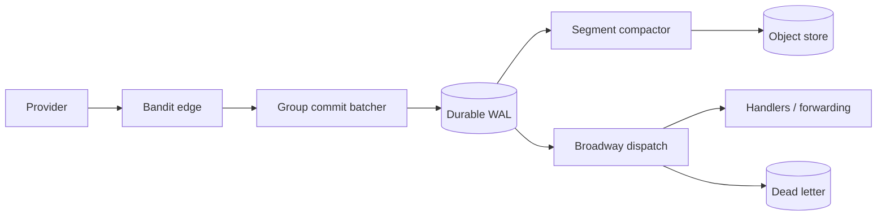
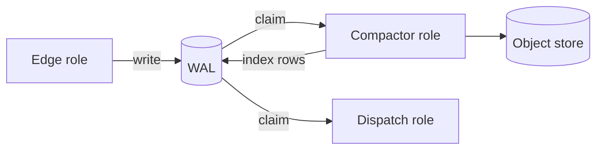

# Elixir Webhook Ingestion Framework: Build Plan

2026-09-22 · @Someone

## Core invariant

Never return 2xx until the hook is durably stored. Everything else follows from that.

- **Crash before commit:** no 2xx sent. The provider retries.
- **Crash after commit, before response:** the provider retries. Dedup absorbs it.
- **Store slow or down:** return 503 with `Retry-After`. Never ack what you haven't saved.

The one loss window we can't close is a provider that doesn't retry. That's their contract. Document it.

## Architecture

Ingest and dispatch are fully decoupled. The hot path does one thing: get bytes to durable storage fast.



The edge acks only after the batcher's commit returns. Compaction and dispatch run off the WAL asynchronously.

### Edge (Bandit + Plug)

- Bandit for HTTP/1.1 and HTTP/2.
- A custom body reader that keeps raw bytes. Signature checks need the exact payload.
- Minimal work: size limit, capture headers, assign a UUIDv7, hand off. No JSON parsing on the hot path.
- Route by source: `POST /hooks/:source_id`.

### Group commit batcher

- Requests hand envelopes to a batcher process per partition.
- It flushes every N ms or N items in one multi-row write.
- Callers block on a reply. All are acked after the commit.
- One fsync covers hundreds of hooks.
- The queue is bounded. When full, shed load with a 503.

### Storage behaviour (pluggable WAL)

- **Postgres (default):** `synchronous_commit = on`. Daily partitioned tables.
- **Kafka:** `acks=all`, for shops that already run it.
- **Replicated local log (later):** built on Ra, the Raft library behind RabbitMQ quorum queues. Ack after quorum commit.
- Single-node local disk is not "never lose." The docs say so plainly.

### Verification

- Provider modules: Stripe, GitHub, Shopify, Slack, Twilio, and the Standard Webhooks spec.
- HMAC is microseconds, so verify inline.
- On failure, persist to a rate-limited quarantine. A bad secret rotation should never silently eat real events.
- Per-source policy: reject, quarantine, or accept-and-flag.

### Idempotent receiver

- Extract the provider event ID, such as Stripe `evt_` or `X-GitHub-Delivery`.
- Unique constraint on `(source_id, dedup_key)`.
- Duplicates still get a 2xx.

### Dispatch

- Broadway with a custom producer. `LISTEN/NOTIFY` as the wake signal, `SKIP LOCKED` polling as the truth.
- Handler behaviour: `handle_webhook(envelope, ctx)`.
- At-least-once delivery. Exponential backoff with jitter.
- Dead letter channel. Replay by ID, time range, or source.
- Per-key ordering via Broadway `partition_by`.
- Forwarding mode relays to downstream HTTP via Finch. This makes it usable as a standalone gateway.

### Observability

- `:telemetry` events at every stage.
- Metrics: ingest p50/p99, batch size, commit latency, queue depth, verification failures, DLQ depth, compaction lag.
- OpenTelemetry integration and a LiveDashboard page.

## Quick start: standalone, zero dependencies

One command, no Postgres, no S3, no Kafka, no config file. It has to run on a laptop in under a minute or people bounce.

```
mix archive.install hex hook_new
mix hook.new my_hooks && cd my_hooks && mix hook.server
```

Or a single static binary built with Burrito, so there's a path that needs no Elixir install at all.

What the default profile uses:

| Component | Standalone default | Production default |
| --- | --- | --- |
| WAL | SQLite, WAL mode, `synchronous = FULL` | Postgres |
| Blob store | Local filesystem segments under `./data/segments` | S3 or compatible |
| Dispatch | In-process Broadway | Same, multi-node |
| Config | Code or a single TOML file | Same |
| Dashboard | Bundled, on `/hooks/dashboard` | Same, auth required |

The standalone binary is honest about its limits. SQLite plus local disk survives process crash and power loss on that box. It does not survive the box. The startup log and the docs say this in one line. Same invariant, smaller blast radius.

What the quick start gives you out of the box:

- A live endpoint plus a tunnel hint, so a real provider can hit it in minutes.
- A dashboard showing hooks arriving, verification status, and dispatch results.
- `mix hook.replay --since 1h` for replay from the first minute.
- A generated handler module with a passing test.
- Sample payload fixtures per provider, so it works before you have credentials.

Moving to production is a config change, not a rewrite. Swap the WAL and blob adapters. The handler code stays identical.

## Pluggable components

Every layer is a behaviour with a default implementation. Apache 2.0, adapters in-tree where they carry no heavy dependency, separate Hex packages where they do.

| Behaviour | Job | Default | Also shipped |
| --- | --- | --- | --- |
| `Hook.WAL` | Durable ack, ordered log, truncation | SQLite | Postgres, Kafka, Ra, WAL-less |
| `Hook.BlobStore` | Segment PUT, range GET, delete | Local filesystem | S3, GCS, R2, Azure Blob |
| `Hook.Verifier` | Signature and timestamp checks | Standard Webhooks | Stripe, GitHub, Shopify, Slack, Twilio |
| `Hook.DedupKey` | Extract the provider event ID | Header and JSON path rules | Per-provider modules |
| `Hook.Codec` | Segment record framing and compression | Length-prefixed, CRC32C, zstd | Uncompressed, custom |
| `Hook.Sink` | What happens to a delivered hook | Generated handler module | HTTP forward, Broadway sink, log |
| `Hook.SourceStore` | Source config, secrets, policy | TOML file | Ecto-backed, env vars, Vault |
| `Hook.RetryPolicy` | Backoff and give-up rules | Exponential with jitter | Fixed, custom |
| `Hook.Telemetry` | Metrics and traces | `:telemetry` events | OpenTelemetry, Prometheus |

Rules that keep this honest:

- **Adapters are contract-tested.** One shared test suite runs against every WAL adapter and every blob store, including the loss checker. A third-party adapter passes the same bar or it isn't an adapter.
- **No adapter in the core package.** `core` depends on behaviours only. Adapters bring their own deps.
- **Defaults are real, not stubs.** SQLite and local filesystem are supported paths, documented for single-node deployments.
- **Config is a keyword list.** `wal: {Hook.WAL.Postgres, repo: MyApp.Repo}`. Swapping is one line.
- **Nothing proprietary in the hot path.** No hosted control plane, no phone-home, no "open core" feature gating. If a feature exists, it's in the repo.

The interesting extension point is `Hook.Sink`. It's what lets this be a library inside a Phoenix app, a standalone forwarding gateway, or the front door to someone else's pipeline, with the same ingest guarantees underneath.

## Deployment topology

Every component is an OTP application with its own supervision tree, started only if its role is configured. The same code runs as one binary on a laptop or as separate fleets, because the boundaries between components are durable state, not function calls.

### The rule that makes migration free

No component may require another component to be reachable at runtime. Components hand work to each other through the WAL and the object store. Compaction, dispatch, and the dashboard are competing consumers reading claim-checked records, never RPC callers.

This matters more than any packaging decision. RPC between components would force you to build discovery, retries, and backpressure across a network boundary. Durable state already has all three.



Edge never talks to compactor. Kill the compactor fleet and ingest keeps acking. The WAL grows, an alarm fires, nothing is lost.

### Applications

| Application | Role | Runs where |
| --- | --- | --- |
| `hook_core` | Behaviours, envelope struct, telemetry contracts, config structs | Everywhere, no processes of its own |
| `hook_edge` | Bandit listener, verification, group commit batcher | Ingest fleet |
| `hook_storage` | Compactor, segment codec, index writer, retention, orphan sweep | Storage fleet |
| `hook_dispatch` | Broadway pipeline, retries, DLQ, replay | Worker fleet |
| `hook_dashboard` | LiveView UI, admin API | Ops node or embedded |

Each has a single public facade module. Nothing reaches into another app's internals. `hook_core` depends on no sibling.

### BEAM conventions

- **No global names.** Every process is registered through a `Registry` with a `via` tuple keyed by instance name. Two independent instances can run in one VM. This is what makes async tests possible and multi-tenant embedding sane.
- **Config as a struct, passed down.** The supervision tree receives a `%Hook.Config{}` at start. No `Application.get_env/2` buried in call sites. Instance-scoped config falls out of this for free.
- **Partitioned batchers, not one GenServer.** One batcher per scheduler under a `DynamicSupervisor`, keyed by `:erlang.phash2`. A single commit process is a throughput ceiling and a single point of failure.
- **Backpressure, never mailboxes.** Bounded queues with explicit load shedding on the edge. GenStage or Broadway demand everywhere else. An unbounded mailbox is a slow memory leak that ends in an OOM kill.
- **Binary hygiene.** Keep the raw body as a refcounted binary and pass it by reference. Use `:binary.copy/1` on any small slice you retain, or a 4 KB sub-binary pins a 1 MB payload.
- **Read-mostly config in ETS** with `read_concurrency: true`. Source secrets and routing rules get read on every request and change rarely.
- **No links across component boundaries.** A compactor crash must never propagate into the edge's supervision tree. Separate trees, isolated by config.
- **Telemetry is the cross-component contract.** Components emit events. They do not call each other's reporters.

### Topologies

| Stage | Shape | What changes |
| --- | --- | --- |
| 1. Laptop | One release, all roles, SQLite plus local filesystem | Nothing. This is the quick start. |
| 2. Small production | One release, all roles per node, Postgres plus S3 | Adapter config only |
| 3. Split fleets | Same release, `HOOK_ROLES` env picks which apps boot | Deployment config only |
| 4. Separate service | Storage runs as its own deployment with its own scaling, budget, and on-call | Nothing in the code |
| 5. Polyglot | Someone rewrites the compactor in Rust against the same WAL schema and segment format | Format spec becomes the contract |

Stages 3 through 5 need no code change because of the rule above. `config/runtime.exs` reads `HOOK_ROLES` and starts only those children. One Mix release, many deployments.

### What this costs

Spec the segment format and the WAL schema as versioned documents, not as whatever the Elixir code happens to write. That is the real interface at stage 4 and beyond. Version both, and make the compactor tolerate reading an older segment version than it writes.

Contract tests run each component against both an in-process peer and a separately deployed one. If the split only works in theory, it doesn't work.

## Payload storage and object store batching

Never write one object per hook. Ack from a small hot WAL, then pack hooks into large immutable segment files in the object store. Every serious log system has converged on this shape.

### Why it matters

Approximate S3 Standard list pricing ($0.005 per 1,000 PUTs), at a sustained 10k hooks/s on one node:

| Write strategy | PUTs per month | Approx. PUT cost per month |
| --- | --- | --- |
| One object per hook | \~25.9 billion | \~$130,000 |
| One segment every 250 ms | \~10.4 million | \~$52 |
| One segment every 2 s | \~1.3 million | \~$6.50 |

Tiny objects also hurt elsewhere. Archive tiers bill a minimum object size. Listing and lifecycle scans slow down. Per-request latency dominates throughput.

### Prior art worth studying

From memory, not re-verified for this doc:

- **Kafka tiered storage (KIP-405):** closed log segments roll to object storage. Brokers keep only the hot tail on disk.
- **WarpStream:** stateless agents buffer for roughly 250 ms, then write one file mixing many partitions. A separate metadata store maps offsets to files.
- **Pulsar:** offloads sealed BookKeeper ledgers to object storage.
- **Loki, Quickwit, Datadog Husky:** small hot buffer, large immutable objects, separate index.
- **Kinesis Firehose:** buffers by size or time, whichever hits first.

The common thread: separate the durability tier from the storage tier. Batch at the boundary between them.

### Recommended design

1. **Two tiers.** The WAL (Postgres, Kafka, or Ra) gives fast durable acks. The object store holds everything long term. The WAL stays small because it gets truncated.
2. **Segment format.** Length-prefixed records with a CRC32C each. Compress in zstd blocks of 64 to 256 KB, not the whole file. A footer maps event ID to block offset. One range GET then reads one hook.
3. **Index and blob split.** Postgres keeps an index row per hook: event ID, source, received time, segment key, block offset, block length. The payload column is nulled after compaction.
4. **Commit protocol.** Deterministic segment key, e.g. `source/yyyy/mm/dd/hh/seq`. PUT with a checksum. Commit index rows in one transaction. Only then truncate WAL rows. A crash mid-way re-uploads to the same key, which is idempotent. A sweeper deletes orphaned objects with no index rows.
5. **Segment sizing.** Roll at 16 to 64 MB or a time cap like 30 s, whichever comes first. Bigger segments cost less but keep hooks in the WAL longer.
6. **Partition by source and hour.** Retention becomes deleting whole objects through lifecycle rules. No rewriting.
7. **Size tiering at ingest.** Most hooks are a few KB and go through the WAL. Payloads over a threshold, e.g. 1 MB, upload directly as their own object before the ack. The PUT cost amortizes over the bytes. The WAL stores only a pointer.
8. **Per-tenant deletion.** Shared segments make "delete this customer's data" hard. Use envelope encryption with a key per source. Deleting the key crypto-shreds their data without touching segments.

### Optional: WAL-less mode

A WarpStream-style adapter could skip the WAL. It acks after a batched PUT to the object store.

- Upside: no database in the hot path. Lowest infra cost at very high volume.
- Downside: ack latency becomes the batch window plus PUT latency, often 100 to 400 ms on S3 Standard.
- S3 Express One Zone cuts PUT latency sharply, but data lives in a single AZ. That weakens the durability story.
- Most providers allow seconds before timing out, so this is viable. It should be an opt-in adapter, not the default.

My take: default to Postgres WAL plus segment compaction. It's the best balance of latency, cost, and operational simplicity. Offer WAL-less mode for cost-driven, very high-volume users.

## Proving "never lose"

Build the loss checker before the framework. It's the project's credibility.

- A load generator that records every acked ID.
- A chaos harness: kill nodes mid-batch, partition the DB with Toxiproxy, fill the disk, fail object store PUTs mid-compaction.
- A checker that confirms every acked ID is readable after the run, from the WAL or a segment. Zero tolerance.
- StreamData property tests for the batcher, dedup, and the compaction commit protocol.
- Publish the chaos report and benchmarks with every release.

## Targets and packaging

These targets are unvalidated. The harness proves or revises them.

| Metric | Target |
| --- | --- |
| Ingest p99, Postgres WAL | < 15 ms |
| Throughput per node | 10k+ req/s |
| Acked-hook loss under chaos | 0 |
| Compaction lag, WAL to segment | < 60 s |

Library-first, so it embeds in an existing Phoenix app. Also ship a standalone release and Docker image.

Hex packages:

- `hook_core` (behaviours, envelope, config, telemetry contracts, no adapter deps)
- `hook_edge`, `hook_storage`, `hook_dispatch`, `hook_dashboard` (the role applications)
- `hook_sqlite` and `hook_local_fs` (the standalone defaults)
- `hook_postgres`, `hook_kafka`, `hook_object_store` (S3, GCS, R2)
- `hook_providers`
- `hook_adapter_test` (the shared contract suite, including the loss checker)
- `hook_new` (project generator archive)

## Phased roadmap

| Phase | Scope |
| --- | --- |
| 0. Harness | Loss checker, load generator, chaos rig |
| 1. Core ingest | Bandit edge, group commit, SQLite WAL, dedup, \`mix hook.new\` quick start |
| 2. Segments | Compactor, segment format, index split, local filesystem and S3 adapters, Postgres WAL, retention |
| 3. Verification | Provider modules, Standard Webhooks, quarantine |
| 4. Dispatch | Broadway, retries, DLQ, replay from WAL and segments |
| 5. Operations | Forwarding mode, admin API, dashboard, per-source encryption |
| 6. Advanced storage | Ra replicated log, Kafka adapter, WAL-less mode |
| 7. 1.0 | Docs, published benchmarks, chaos report |

Segments move up to phase 2. The storage layout shapes replay and retention, so it should settle early. Role separation lands in phase 1 as application boundaries, even though everything boots in one release until someone needs otherwise.

## Open decisions

- [ ] Batcher per scheduler or per source? Tenant isolation versus batch efficiency.
- [ ] Segments per source or mixed across sources? Mixed means fewer PUTs for small tenants but harder deletion without crypto-shredding.
- [ ] Segment roll thresholds: size, time, or both, and the defaults.
- [ ] Large-payload threshold for direct upload before ack.
- [ ] Return 2xx before verification completes on slow providers? Leaning no. Keep the invariant pure.
- [ ] Replay reads: served from segments via range GETs, or rehydrated into the WAL first?
