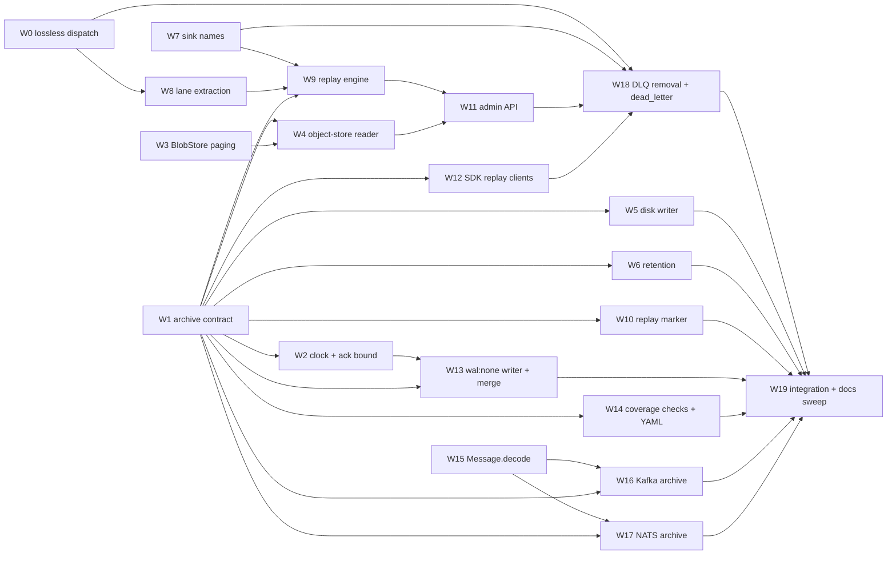

# Reliability fixes: lossless dispatch, Archive + Replay

Replace the DLQ with a pluggable **archive** (every accepted hook, kept for a
retention period, searchable by time) and one **replay** engine (re-deliver a
time window through any `Sink`). Fix the dispatch path that silently drops
acked hooks first.

Prior art for the shape: EventBridge
[Archive + `StartReplay`](https://docs.aws.amazon.com/eventbridge/latest/APIReference/API_StartReplay.html),
Kafka [`--reset-offsets --to-datetime`](https://kafka.apache.org/41/operations/basic-kafka-operations/),
JetStream [start-time deliver policy](https://docs.nats.io/learn/jetstream/policies).
A DLQ only sees failures Ankusa observed; a downstream incident (consumer acked,
then lost or mangled the data) is invisible to it. Replay from history covers
both.

## Decisions

1. **No Ankusa-side failure ledger.** Recovery is time-window replay; consumers
   dedupe on `id`. Dead-lettering for broker sinks belongs to the user's broker
   (DLX, dead-letter topics). An optional per-source `dead_letter:` sink is the
   user-space hook for give-ups (Phase 5).
2. **Name: `Archive`.** `Storage` already means the compactor's segment tier.
3. **Amended: under `wal: none`, `archive` must be set explicitly.** As first
   agreed ("object store optional, broker read-back default") it leaves a
   source whose only durable sink is `Sink.Http` with no history: `Sink.Http`
   has no `durable?/1`, so it defaults to `true` (`sink.ex:99-107`) and passes
   `WAL.validate_config!` (`wal.ex:85-93`), yet an HTTP endpoint retains
   nothing to read back, and `wal: none` runs no compactor. Broker read-back
   also has no zero-config value (it needs a topic/stream). So:
   - `object_store`: every acked hook is written to the archive in the ack path.
     Covers every source, including runtime-created ones.
   - a broker read-back adapter (Phase 4): boot and `SourceStore.put` reject any
     source without a sink the adapter covers.
   - `none`: replay disabled, stated at boot, in `/health`, and as
     `409 archive_disabled` on `/v1/replays`.

   `wal: none` is unreleased (`packages/ankusa/CHANGELOG.md` `[Unreleased]`),
   so requiring the key breaks no deployed config. Under `wal: disk` the archive
   is always `object_store` (the compactor already archives everything today).
4. **The archive is a window, and the object store defines it.** The archive
   has its own blob store (`archive.blob_store`, default `storage.blob_store`);
   docs and examples use a dedicated `ankusa-archive` bucket so one lifecycle
   rule on `archive/v1/dt=` is the whole retention policy (one day, one week,
   whatever the operator sets). Ankusa never expires archive objects in a cloud
   store. LocalFS has no lifecycle policy, so `archive.retention_days` drives
   Ankusa's sweeper there and is a boot error with any other store, the same
   rule as `claim_check.retention_days`. The name is hyphenated, not
   `ankusa.archive` like the `ankusa.events` exchange: Azure containers allow no
   dots and GCS requires domain verification for dotted bucket names.

## Invariants (acceptance targets for the whole plan)

- **I1** An acked hook is never dropped without a durable record.
- **I2** With an archive configured, every acked hook reaches it, in every WAL
  mode, for every source, regardless of dispatch outcome.
- **I3** Replay re-delivers the **same `id`** plus a replay marker; it never
  mints a new id.
- **I4** Replay never takes live dispatch capacity.
- **I5** The archive is fleet-wide: any node finds any hook by time or id with
  no node-local index.
- **I6** A replay never reports `done` for a window some writer may still
  archive acked hooks into. It reads only up to the fleet's sealed-through time
  and reports what it is waiting on.
- **I7** Every prefix a read path lists holds O(writers) objects per minute at
  steady state, independent of flush rate, core count, and tenant count. This
  is a scale requirement, not an optimization.
- **I8** The archive holds every hook for at least the window its store's
  lifecycle policy (LocalFS: `archive.retention_days`) defines, and Ankusa
  deletes no hook inside it. A replay window older than that reads nothing.

## Phase 0: stop losing acked hooks (ship first, independent)

**Bug.** `Pipeline.sinks_for/3` maps `SourceStore.fetch` → `:error` to `[]`
(`dispatch/pipeline.ex:361-365`); `admit/2` then counts the hook handled and
advances `read_seq` (`:240-242`). No DLQ entry, no log. The WAL is truncated
past it. Triggers with the shipped stores (`Persistent.fetch` is an ETS lookup,
`source_store/persistent.ex:49-52`):
- source deleted through the admin API while its backlog is in the WAL (i.e.
  during a sink outage);
- a persisted source that no longer decodes after an upgrade is skipped at
  load (`persistent.ex:26-27, 288-290`);
- source removed from YAML and redeployed.

`Dispatch.replay/2` repeats it: missing source → `[]` (`dispatch.ex:28-31`),
`deliver/3` results ignored, entry counted as replayed (`:34-35`).

Root cause: `fetch/2` is `{:ok, Source.t()} | :error` (`source_store.ex:32-33`),
which cannot say "unavailable".

**Changes**
- `Ankusa.SourceStore` `fetch/2` → `{:ok, Source.t()} | :not_found | {:error, term()}`.
  `Static` (`source_store.ex:171-176`) and `Persistent` return `:not_found` on
  a miss. Callers (all three):
  - `edge/ingest.ex:41-44`: `:not_found` → `{:error, :unknown_source}` (404, as
    today); `{:error, _}` → `{:error, :store_unavailable}` (503 + `Retry-After`).
  - `dispatch/pipeline.ex:356-370`:
    - `{:ok, %Source{sinks: []}}`: intentionally sink-less, handled as today.
    - `:not_found`: orphan. `DLQ.write` with reason `{:source_not_found, id}`,
      emit `[:ankusa, :dispatch, :dlq]`, log the hook id, then advance.
    - `{:error, reason}`: stop `fill/2` at this envelope without advancing
      `read_seq`; retry next poll; log once per outage, not per poll.
  - `dispatch.ex:28-35`: count an entry only when every sink returned `:ok`;
    missing source and failures are logged, not counted. Response shape
    (`{replayed: n}`) unchanged; `admin.v1.yaml` description corrected.

**Tests** (`dispatch_test.exs`, `edge_test.exs`, `source_store_persistent_test.exs`)
- source deleted after commit, before tick → entry in DLQ with
  `{:source_not_found, _}`; cursor advances.
- store returns `{:error, :down}` → cursor does not advance; after recovery the
  hook is delivered.
- replay with a failing sink → not counted.
- ingest with `{:error, _}` store → 503, not 404.
- existing `== :error` assertions on `fetch` (`source_store_persistent_test.exs:176,196`)
  become `:not_found`.

**Smoke.** All-role node, sink pointed at a stopped worker, POST hooks, delete
the source via the admin API, restore the worker: hooks appear in `/v1/dlq`
with `source_not_found`.

## Phase 1: `Ankusa.Archive` + fleet-wide object-store layout

**Why the current tier can't serve replay.**
- Keys are `seg/<first_seq>-<last_seq>.seg` (`storage/compactor.ex:165`); every
  node's seq starts at 1, so nodes sharing a bucket overwrite each other
  (`docs/deployment.md:126-129` requires a bucket per node).
- Keys carry no time/tenant/source. The only locator is the node-local
  `segments/index.log`, one row per event, loaded whole into ETS
  (`storage/index.ex:10-23`). Lose the host → its segments survive but are
  unsearchable.
- A fleet-wide replay would fan out to N buckets plus N local indexes.

**Behaviour** (`lib/ankusa/archive.ex`)

```elixir
defmodule Ankusa.Archive do
  @type window :: %{from: integer(), to: integer()}   # received_at, unix ms, [from, to)
  @type filter :: %{optional(:source_id) => String.t(), optional(:tenant_id) => String.t()}
  @type cursor :: binary()                             # opaque; the replay job persists it
  @type lagging :: %{writer: String.t(), sealed_through: integer(), updated_at: integer()}

  @callback read(atom(), window(), filter(), cursor() | nil, pos_integer(), keyword()) ::
              {:ok, [Ankusa.Envelope.t()], cursor() | :done} | {:error, term()}
  @callback fetch(atom(), id :: String.t(), keyword()) ::
              {:ok, Ankusa.Envelope.t()} | :not_found | {:error, term()}
  # Every acked hook with received_at < the returned time is already readable.
  @callback sealed_through(atom(), keyword()) ::
              {:ok, integer(), [lagging()]} | {:error, term()}
  @callback append(atom(), [Ankusa.Envelope.t()], keyword()) :: :ok | {:error, term()}
  @callback covers?({module(), keyword()}, keyword()) :: boolean()
  @optional_callbacks append: 3, covers?: 2
end
```

- `:not_found` vs `{:error, _}` is deliberate (the Phase 0 lesson).
- `append/3` is optional because broker-backed archives are written by their
  sink. `covers?/2` is for broker adapters (Phase 4); the object store covers
  every source implicitly.
- The facade also exposes `label/1` (boot banner, `check-config`),
  `writers/1` and `retire_writer/2` (Phase 2 admin API).
- `test/support/archive_memory.ex`: an in-memory adapter implementing the full
  behaviour, with a settable `sealed_through` and late inserts, so the replay
  engine is built and tested without any real writer.

Config: `archive: {Ankusa.Archive.ObjectStore, opts} | :none`. `opts[:blob_store]`
is an `Ankusa.BlobStore` `{module, opts}` tuple; absent, the archive uses
`storage.blob_store`. YAML: `archive.type: object_store | none` (+ Phase 4
types); `archive.store` with the same keys and loader as the `storage` store
(`type: local | s3 | gcs`, `s3.*`, `gcs.*` through `s3_opts!/1`/`gcs_opts!/1`
in `ankusa_server/lib/ankusa_server/config.ex`), absent → `storage`'s store;
`archive.retention_days` (LocalFS only, see Retention); `archive.seal_lag_ms`
(default 30 000), `archive.clock_skew_ms` (default 1 000),
`archive.watermark_interval_ms` (default 5 000).

**One clock read per hook.** `build_envelope/3` (`edge/ingest.ex:144-149`)
reads the clock twice (`UUIDv7.generate/0`, then `System.system_time/1`). Read
once: `id: UUIDv7.generate(now)`, `received_at: now` (`uuid_v7.ex:25-26`). The
id then encodes its exact `received_at`, so id → minute prefix is exact.

**Ack bound.** `Ingest.commit/3` (`edge/ingest.ex:112-117`) is the one function
both modes pass through (`buffered_commit/2` and `Publish.publish/3`). After a
successful commit or publish, if `now - received_at > seal_lag_ms`, answer
`503` instead of `201`. The hook is still in the WAL (or already at the sinks)
and is delivered as usual, but it is not acked, so the provider retries: a
duplicate with a new id, as with any `503` today. Set `seal_lag_ms` above your
providers' webhook timeouts: past that point the provider has already treated
the request as failed. This makes "every acked hook has
`received_at >= ack_time - seal_lag_ms`" true by construction, and the
watermarks below depend on it.

**Layout**

```
archive/v1/dt=YYYY-MM-DD/hr=HH/m=MM/<writer>/<first_id>.seg
archive/v1/dt=YYYY-MM-DD/hr=HH/m=MM/<writer>/<first_id>.manifest
archive/v1/dt=YYYY-MM-DD/hr=HH/m=MM/<writer>/merged-<first_id>.seg        # wal: none only (Phase 3)
archive/v1/dt=YYYY-MM-DD/hr=HH/m=MM/<writer>/merged-<first_id>.manifest
archive/v1/_writers/<writer>                                              # disk writers' watermark
```

- `<writer>`: under `wal: disk`, a UUID generated once and persisted at
  `<data_dir>/<instance>/archive/writer_id`, so a restarted node keeps its
  identity and its backlog stays attributed to it. Under `wal: none`, a fresh
  UUID per boot (no volume).
- Segments never span a minute; writers split batches by `received_at` minute.
- `<first_id>` is the first record's UUIDv7, so a retried upload after a crash
  rewrites the same key (idempotent).
- The manifest is written **after** its segment and is the commit marker: a
  segment without one is invisible, so torn uploads are ignored.
- Manifest: `v, min_received_at, max_received_at, count, replaces,
  entries: [{id, tenant_id, source_id, received_at, offset, length}]`, sorted
  by `{received_at, id}`. `replaces` is non-empty only on merged manifests and
  lists the keys the merged segment supersedes.
- Segments hold the full envelope (headers, method, path, body inline): the
  object-store archive is audit-grade and holds no claim refs.

**Reads**
- `read/6`: for each minute in the window, LIST its `m=` prefix
  (`BlobStore.list/3`, `blob_store.ex:25`), GET the manifests, drop every
  segment named in a visible merged manifest's `replaces`, filter by
  window/tenant/source, k-way merge by `{received_at, id}`, and fetch frames
  with `get_range` (coalescing adjacent entries into one GET). A segment that
  404s mid-read (merged and deleted meanwhile) triggers a re-list of that
  minute; entries at or before the cursor are skipped. Cursor = last emitted
  `{received_at, id}`. `read/6` returns what is visible; completeness is the
  caller's job via `sealed_through/2` (Phase 2).
- `fetch/3`: UUIDv7 ms → one minute prefix → LIST → manifests whose
  `[min, max]` covers it → one `get_range`. No local file.
- `sealed_through/2` returns the minimum of:
  - every registered disk writer's watermark (LIST + GET `_writers/*`); those
    below the result come back as `lagging`;
  - `now - seal_lag_ms - clock_skew_ms`, which covers `wal: none` writers.
    They publish no watermark because they ack only after their segment and
    manifest are written and never later than `seal_lag_ms` after
    `received_at`, so everything they acked before that point is already
    visible (up to clock skew between writer and reader).
- `BlobStore.list/3` returns bare keys, unpaginated. The unsealed tail of a
  `wal: none` fleet can hold thousands of flush segments per minute prefix
  (Phase 3), so every adapter must page through >1000 keys (S3
  `ListObjectsV2`, GCS, Azure, OCI). Verify each one and fix any that don't.

**Writer (`wal: disk`).** Rewrite `Compactor.compact` (`compactor.ex:93-190`):
- Cut segments at a minute boundary (by `received_at`), at `roll_bytes`
  (16 MiB), or at `roll_ms` (30 s) (`config.ex:54-56`), whichever comes first.
  That is at most ~2 segments per writer-minute at low volume and 16 MiB
  segments at high volume, so disk writers need no merge step.
- Per tick with records: segment PUT → manifest PUT → compactor cursor → WAL
  truncation through `min(compactor, dispatch)` (`compactor.ex:188-189`,
  unchanged; this is what makes I2 hold in disk mode) → watermark PUT to
  `_writers/<writer>` (`{sealed_through, updated_at}`).
- **Every tick publishes the watermark, including ticks with nothing to
  archive.** With no unarchived record the formula below becomes
  `now - seal_lag_ms - 1`. Throttle the PUT to at most one per
  `archive.watermark_interval_ms` (default 5 000). Otherwise an idle node's
  watermark sticks at its last hook, and every later replay sits in `waiting`
  naming a healthy node as lagging. The watermark is

  `sealed_through = min(received_at(first unarchived WAL record), now) - seal_lag_ms - 1`

  Why this is sound: records commit in seq order, so every unarchived record
  commits no earlier than the first unarchived one, `f`, and
  `received_at(f) <= commit(f)`. By the ack bound, any acked record `r` has
  `received_at(r) >= commit(r) - seal_lag`. Hence no unarchived or future
  acked record has `received_at` at or below the watermark. The formula is
  O(1): it needs only the first unarchived record.
- The writer PUTs its first watermark before the edge listener starts (child
  order in `Instance`), so no node acks a hook that no watermark covers.
- A stopped node keeps its last watermark, and replays that need its window
  wait (I6). A node lost for good is retired by an operator (Phase 2 admin
  API), which acknowledges that its unarchived backlog is gone.

**Retention: a window the store owns.** The archive keeps hooks for a fixed
window, and the archive store's lifecycle policy is that window:
- S3/R2/GCS/Azure/OCI: one lifecycle rule expiring prefix `archive/v1/dt=`
  after N days, set by the operator. Ankusa ships no expiry path and no
  retention key for these stores (a Phase 3 merge deletes flush segments only
  once the merged segment holds their hooks). Documented example (S3):
  `aws s3api put-bucket-lifecycle-configuration --bucket ankusa-archive
  --lifecycle-configuration '{"Rules":[{"ID":"ankusa-archive-window","Status":"Enabled","Filter":{"Prefix":"archive/v1/dt="},"Expiration":{"Days":7}}]}'`.
- Lifecycle rules count days from object creation, and a segment is created
  after its hooks' `received_at`, so every hook is held at least N days (I8);
  expiry is asynchronous, so it may live somewhat longer.
- `_writers/` is outside the `dt=` prefix, so the rule never expires a
  watermark.
- LocalFS: `archive.retention_days` makes the sweeper delete whole `dt=`
  directories once every object in them is past retention (the
  `claim_check/sweeper.ex:10-14` approach; generalize that sweeper, don't add a
  second). `nil` (default) keeps everything. Set with a non-LocalFS archive
  store → boot error from `Archive.validate_config!/1`:
  `"archive.retention_days is set but the archive store is <module> — the LocalFS sweeper doesn't cover it. Use a lifecycle rule on the archive/v1/dt= prefix instead, and leave retention_days nil."`

**Deleted.** `Ankusa.Storage.Index` (`storage/index.ex`), `segments/index.log`,
`Ankusa.Storage.fetch/2` (replaced by `Ankusa.Archive.fetch/2`), the
`mix.exs:98` docs-group entry. `storage_test.exs` is rewritten against the
archive.

**Docs.** Lift the one-bucket-per-node rule (`deployment.md:126-129`); rewrite
`storage.md` for the layout, watermarks, and ack bound. Drop the "Planned, not
shipped" note from the Archive section of `architecture.md` and add
`archive.store` / `archive.retention_days` to `configuration.md`.

**Tests**
- two instances, one LocalFS root: no overwrite; a window read returns both
  nodes' hooks once each, in `{received_at, id}` order.
- a batch straddling a minute is split into two segments.
- `fetch/3` succeeds from a third instance with no local state.
- a segment without a manifest is never returned; a merged manifest hides
  exactly the keys in its `replaces`, and a flush segment not listed there is
  still read.
- resuming from a mid-window cursor yields no gaps and no duplicates.
- ack bound: a commit that completes after `seal_lag_ms` answers `503`, and
  the hook is still dispatched.
- watermark: with a WAL backlog, the published watermark is below the oldest
  unarchived record's `received_at - seal_lag_ms`, and it advances once the
  backlog is archived. The writer id survives a restart.
- idle writer: with an empty WAL, successive ticks keep advancing the
  watermark (throttled to `watermark_interval_ms`), and a replay whose window
  starts after that node's last hook reaches `done`.
- `sealed_through/2` returns the minimum over writers and names the lagging
  ones.
- retention deletes only expired `dt=` directories and never `_writers/`.
- `archive.retention_days` with an S3 archive store → boot raises; with
  LocalFS → the sweeper starts.
- `archive` without `blob_store` writes under `storage.blob_store`; with one,
  only that store receives `archive/v1/` keys.

## Phase 2: replay engine + admin API

**Sink names.** `Source.sinks` is `[{module, keyword}]` (`source.ex:20-30`)
with no identity. Add a `:name` sink opt: YAML `name`, defaulting to the YAML
`type`; in Elixir, the underscored last module segment. Unique per source,
enforced in `Source.new`, the YAML loader, and `SourceStore.put`.

**`Ankusa.Replay`** (a job GenServer per replay under `Replay.Supervisor`, with
its own `Task.Supervisor`)
- Spec: `from`, `to` (both required, no more "empty body replays everything"),
  optional `source_id`, `tenant_id`, `sink` (a name), `rate` (events/s).
- **Sealed reads (I6).** Each page reads up to
  `effective_to = min(to, sealed_through)` via `Archive.sealed_through/2`.
  When the cursor reaches `effective_to < to`, the job goes `waiting`: it
  re-polls every `replay.seal_poll_ms` (default 5 000), and its status shows
  `sealed_through` and `lagging_writers`. It is `done` only when the cursor
  reaches `to` with `sealed_through >= to`. The sealed prefix is never re-read:
  by the watermark rule, anything archived later has `received_at` above it.
- Pages through `Archive.read/6`; delivers via `Sink.safe_deliver/4`
  (`sink.ex:111-125`) with `ctx.replay = job_id`, `attempt: 1`.
- Targets the hook's source's **current** sinks, or only the named `sink`. A
  source `:not_found` counts as `missing_source`, never `delivered`.
- Retries use the source's retry policy inside the replay pool; give-up counts
  as `failed` (first 100 ids kept in status).
- `replay.concurrency` (default 8) + per-job token-bucket `rate`. Never touches
  `Pipeline` (I4).
- Ordering: honour `ordering_key/2` lanes. Extract the lane scheduler from
  `Pipeline` (`enqueue_job`, `release_lane` at `pipeline.ex:496-510`) into
  `Ankusa.Dispatch.Lanes`, used by both.
- Replay marker: `x-ankusa-replay: <job_id>` on `Sink.Http`; optional
  `"replay"` field on `Sink.Message` v1 (additive, `message.ex:55-65`); Kafka
  and NATS headers carry it too. Update any SDK that parses `Sink.Message` to
  expose it.
- Large bodies: `Message.check_in` derives the pack id from the envelope
  (`message.ex:81-89`), so a replayed check-in rewrites the same object.
- Progress: cursor + counters persisted every page to
  `<data_dir>/<instance>/replays/<job_id>` via `DurableLog`; a restarted node
  resumes the job. With no volume (`wal: none`), progress is in memory; status
  returns the cursor, and `POST /v1/replays` accepts `after: <cursor>` to
  resume by hand.

**Admin API** (`admin/router.ex`, `priv/openapi/admin.v1.yaml`)
- `POST /v1/replays` → `202 {id, status}`; `400 invalid_filter`;
  `409 archive_disabled`.
- `GET /v1/replays`, `GET /v1/replays/{id}` → `status`
  (`running|waiting|done|failed|cancelled`), window, filter, `delivered`,
  `failed`, `missing_source`, `cursor`, `sealed_through`, `lagging_writers`,
  `failed_ids`.
- `DELETE /v1/replays/{id}` → cancel.
- `GET /v1/archive/writers` → each writer's `sealed_through` and `updated_at`.
- `DELETE /v1/archive/writers/{id}` → retire a writer (deletes its
  `_writers/` object; the operator accepts that its unarchived backlog is
  lost). Waiting replays then proceed.
- Served by any node with an archive configured (not role-gated to
  `:dispatch`: the archive is fleet-wide).

**SDKs + conformance.** Add replay and writer methods to both admin clients
(`sdk-python/src/ankusa/admin/client.py`, `sdk-typescript/src/admin/client.ts`),
regenerate `admin-schema.d.ts`, add `admin_replay_*` vectors to `conformance/`
and both runners. DLQ methods stay until Phase 5.

**Tests**
- **Late archive:** start a replay over a window. Node B holds an unarchived
  WAL backlog inside it, and its watermark lags. The replay reaches B's
  watermark and reports `waiting`, not `done`. B compacts; the replay resumes,
  delivers B's hooks, then reports `done`. The replay must never report `done`
  having missed them.
- retiring a lagging writer lets a waiting replay finish.
- a window across two nodes' segments delivers each id exactly once, ordered
  per ordering key.
- a named-sink replay hits only that sink.
- missing source → `missing_source`; failing sink → `failed`; job still `done`.
- kill mid-job → resume redelivers at most the in-flight page.
- live dispatch keeps draining while a replay against a hanging sink saturates
  the replay pool (I4).

**Smoke.** `examples/quickstart`: stop the worker, POST hooks, start it, POST
`/v1/replays` over the window; the worker log shows the original ids with
`x-ankusa-replay`.

## Phase 3: archive coverage under `wal: none` (decision 3)

**Object-store writer in the ack path** (`Ankusa.Archive.ObjectStore.Writer`)
- **One writer per node, not partitioned**, so object count does not scale with
  cores. It is not a DiskLog-style bottleneck because it does no encoding and
  no I/O itself. The request process encodes its own envelope frame before
  handing it over; the writer only appends iodata to the open buffer, and
  flushes run in tasks, up to `archive.max_inflight_flushes` (default 4) at
  once.
- Flush at `archive.flush_ms` (default 100) or `archive.flush_bytes`
  (default 8 MiB), whichever comes first, splitting at minute boundaries. One
  segment + manifest PUT per flush; that flush's waiters are answered after its
  manifest PUT.
- **Per-writer minute merge (required for I7).** Once a minute is sealed
  (`now > minute end + seal_lag_ms`), the writer merges that minute's flush
  segments into `merged-<first_id>.seg` plus a manifest whose `replaces` lists
  them, then deletes the flush objects. A crash between the merged PUT and the
  deletes is harmless: readers honour `replaces`. A crashed writer's last
  unmerged minutes stay as flush segments, bounded by
  `(60 s + seal_lag_ms) / flush_ms` per crash.
- `edge/publish.ex:29-47`: the archive append runs concurrently with the sink
  chain; `201` only when both confirm and the ack bound holds. An archive
  failure is a `503`, like a sink refusal.
- Why not a user-listed `Sink.Archive`: coverage would depend on every source,
  including runtime-created ones, listing it. The implicit writer makes I2
  structural.

**Cost at full load**
- Flush PUTs per node per second = `2 × max(1000 / flush_ms, ingest_bytes_per_s / flush_bytes)`.
  At the defaults that is 20/s below 80 MiB/s of ingest; a 20-node fleet does
  ~400 PUTs/s.
- Merge adds at most one GET per flush segment and two PUTs per writer-minute,
  and deletes the flush objects.
- Listed objects: a merged minute prefix holds ~2 objects per writer (20 nodes
  → ~40 per minute, ~2 400 per hour). Only the unsealed tail (the current
  minute plus `seal_lag_ms`) holds unmerged flush segments: up to
  `2 × 60 000 / flush_ms` per writer, which is why `BlobStore.list/3` must page
  (Phase 1). Replays read at or below `sealed_through`, so they almost always
  hit merged minutes.

**Checks**
- `Ankusa.Archive.validate_config!/1` in the `Instance` boot sequence next to
  `WAL.validate_config!/1`:
  - `wal: none` without an explicit `archive` → boot error.
  - broker adapter: every static source needs a covered sink.
  - `wal: disk`: `archive: none` is rejected, and a node running the WAL must
    run `:storage` (the compactor already truncates the WAL,
    `compactor.ex:188-189`).
  - `archive.retention_days` set with a non-LocalFS archive store → boot error
    (text in Phase 1 Retention).
- Runtime sources: `WAL.validate_config!` only checks static sources
  (`wal.ex:78-82`). `SourceStore.put/5` must validate the decoded source
  (durable sink **and** archive coverage) before persisting. Today decoding
  runs inside the store (`persistent.ex:24-27`); move it to the facade or pass
  a validator in.

**Tests**
- `wal: none` + `object_store`: after a `201`, kill the node; `Archive.fetch`
  from a fresh instance returns the hook.
- archive PUT failure → 503.
- after a sealed minute merges, its prefix lists one merged segment + manifest
  per writer; a crash between the merged PUT and the deletes never
  double-delivers on replay.
- an HTTP-only source with a broker archive → boot raises naming the source.
- runtime `put` of an uncovered source → `{:error, :invalid, _}`.
- `archive: none` → `/v1/replays` returns 409.

**Docs.** `config-examples/direct.yml` and `reference.yml` gain `archive`;
`deployment.md:131-135` and `delivery.md#direct-mode` stop saying "no replay".

## Phase 4: broker read-back archives

Each adapter lives in its sink's package (packaging rule, `docs/packaging.md`).

- **Shared decoder.** Add `Sink.Message.decode/1` (core), the inverse of
  `encode/3` (`message.ex:55-78`). Claim refs are redeemed to rebuild the body.
  Envelopes read back lack provider headers, method, and path
  (`message.ex:13-20`): replay-grade, not audit-grade.
- **`Ankusa.Archive.Kafka`** (`ankusa_kafka`): per-partition offset for `from`
  by timestamp, fetch until past `to`, decode. Cursor = per-partition offsets.
  Covers a source with a `Sink.Kafka` on the same brokers + topic. [verify:
  brod's timestamp offset resolution API]
- **`Ankusa.Archive.NATS`** (`ankusa_nats`): ordered ephemeral consumer with a
  start-time deliver policy, stop at `to`. Covers a source with a `Sink.NATS`
  whose subject is bound to the stream. [verify: gnat JetStream consumer
  options]
- **`sealed_through/2`** for both: `now - seal_lag_ms - clock_skew_ms`. The
  broker confirms before the `201`, and the ack bound caps how late that can
  be.
- **Retention guard.** At boot the adapter reads broker retention (Kafka
  `retention.ms`; JetStream `max_age`) and warns when it outlives claim-check
  retention, or when claim retention is unknown (S3/GCS lifecycle,
  `sweeper.ex:4-14`). Otherwise replayed messages carry refs to deleted blobs.
- **Not covered.** `Sink.Redis` is pub/sub and retains nothing
  (`redis.ex:26-30`). Redis Streams (`XADD`/`XRANGE`) and RabbitMQ Streams
  would each need a new sink first.

## Phase 5: remove the DLQ; add `dead_letter:` sinks

Precondition: Phases 1–2 shipped.

- Give-up (`pipeline.ex:158-165`): no `DLQ.write`. Emit
  `[:ankusa, :dispatch, :give_up]` (replaces `:dlq`; tags `instance`,
  `source_id`, sink name) and log the id. If the source declares
  `dead_letter:` (any sink spec), deliver there with `ctx.failed_sink` and
  `ctx.reason` (header/field on the wire). A failing dead-letter sink → log +
  metric, then advance. Nothing is lost: the body is in the archive (I2).
- Orphans (Phase 0's `source_not_found` path) → `[:ankusa, :dispatch, :orphaned]`
  + log. Recover with a replay targeting an explicit `sink`.
- `dead_letter:` under `wal: none` → config error (there are no give-ups; the
  provider is the retry).

**Deleted**
- Code: `dispatch/dlq.ex`, `Ankusa.Dispatch` (`dispatch.ex`, which only hosts
  `replay/2`), admin `/v1/dlq` + `/v1/dlq/replay` routes and handlers
  (`dlq_index`, `dlq_replay`, `replay`, `dlq_entry` in `admin/router.ex`),
  `admin.v1.yaml` `dlq` tag and paths, `telemetry.ex:22` / `metrics.ex:144-147`
  (renamed event), `mix.exs:100`.
- Tests: DLQ assertions in `dispatch_test.exs`; `admin/router_test.exs` DLQ
  section.
- SDKs/conformance: DLQ admin methods, `admin_dlq_*` vectors and runner cases
  (`test_conformance.py:304-341`, `conformance.test.ts:355-366`), Python
  `test_admin.py:53-64`, TS `client.test.ts:62-74`.
- Docs and comments naming the DLQ: `delivery.md` (`:32-36, 92-93, 151, 252,
  338, 365, 386, 421-434`), `architecture.md:36,55,81,148,150`,
  `configuration.md:240,284`, `docs/README.md:18`,
  `packages/ankusa_server/README.md:148,180-190,249-250`, `Dockerfile:39`,
  `compose/*.yml` volume comments, `compose/nginx.conf:11`,
  `reference.yml:22,40`, sink moduledocs (`kafka.ex:22`, `nats.ex:15,35`,
  `redis.ex:28,32`), `durable_log.ex:6-7,49`, both SDK READMEs' admin
  sections, `AGENTS.md` module map (`dispatch/dlq.ex`, `storage/index.ex` out;
  `archive.ex`, `archive/*`, `replay.ex` in).

## Verification (every phase)

Per `AGENTS.md`, a core change is done only when every package passes:

- `mise run format`
- `mise run check:package` for `ankusa`, `ankusa_rabbitmq`, `ankusa_kafka`,
  `ankusa_nats`, `ankusa_redis`, `ankusa_server`
- Phase 1: `mise run test:integration` (object-store adapters vs emulators)
- Phases 2, 5: `mise run check:conformance`
- Before tagging: `mise run e2e`, `mise run docker:smoke`
- Each phase's smoke run above, against the real container, not only tests.

Each phase updates `CHANGELOG.md` for every package it touches.

## Work breakdown

Work packages (WPs) sized for one owner each. **W1 freezes the shared
contracts** (behaviour, layout, manifest, config keys, `ctx.replay`, admin
OpenAPI, in-memory adapter). After it lands, most packages proceed in parallel
against those contracts, with no stubs in shipped code. Each WP updates its own
package CHANGELOG and the doc sections it changes; W19 does the cross-doc
sweep.



| Wave | WPs (parallel within a wave) |
|---|---|
| 1 | W0, W1, W3, W7, W15 |
| 2 | W2, W4, W5, W6, W8, W10, W12, W14 |
| 3 | W9, W13, W16, W17 |
| 4 | W11 |
| 5 | W18 |
| 6 | W19 |

W5's watermark is only sound in production once W2's ack bound ships; the two
must release together, but they build and test independently.

### Packages

**W0: lossless dispatch** (Phase 0). Deps: none.
Owns: `SourceStore.fetch` contract (`source_store.ex`, `persistent.ex`), the
fetch branch of `Ingest.ingest/2`, `Pipeline.sinks_for/admit/fill`,
`dispatch.ex` counting, the `admin.v1.yaml` replay description.
Done: Phase 0 tests + smoke pass.

**W1: archive contract** (Phase 1). Deps: none.
Owns: `archive.ex` (behaviour + facade: `read`, `fetch`, `sealed_through`,
`label`, `writers`, `retire_writer`), `Archive.Layout` (pure: minute prefixes
for a window, segment/manifest/merged/writer keys, id → minute),
`Archive.Manifest` (encode/decode incl. `replaces`), `Config` keys
(`archive.*` incl. `blob_store`, `replay.*`), `ctx.replay` in the `Sink`
typedoc, OpenAPI paths and schemas for `/v1/replays*` and
`/v1/archive/writers*`, `test/support/archive_memory.ex`.
Done: Layout/Manifest round-trip and boundary tests (minute/hour/day edges,
id → minute); `Archive.Memory` passes a shared behaviour conformance test that
W4, W16, and W17 reuse.

**W2: clock + ack bound** (Phase 1). Deps: W1 (config key).
Owns: `build_envelope/3` and `commit/3` in `edge/ingest.ex`.
Done: the id timestamp equals `received_at`; a commit or publish returning
after `seal_lag_ms` answers `503`, and the hook is still delivered.

**W3: BlobStore paging** (Phase 1). Deps: none.
Owns: `list/3` in `blob_store/{local_fs,s3,gcs,azure,oci}.ex`.
Done: >1000 keys under one prefix listed completely on every adapter
(`mise run test:integration`).

**W4: object-store reader** (Phase 1). Deps: W1; W3 for scale.
Owns: `archive/object_store.ex` `read/6`, `fetch/3`, `sealed_through/2`,
`writers/1`, `retire_writer/2`.
Done: the Phase 1 read tests, using fixtures written through Layout/Manifest
(two writers, `replaces`, torn segment, 404 re-list, cursor resume,
sealed-through minimum + direct-mode cap); passes W1's behaviour test.

**W5: disk writer** (Phase 1). Deps: W1 (soundness needs W2 at release).
Owns: `storage/compactor.ex`, deletion of `storage/index.ex` and
`Storage.fetch/2`, the `Instance` child order (writer registers before edge),
`mix.exs` docs groups, `storage_test.exs`.
Done: minute/roll cuts, persisted writer id, watermark formula under a
backlog, an idle writer's watermark advancing on empty ticks (a replay after
its last hook completes), registration before the listener; objects asserted
via Layout/Manifest.

**W6: retention** (Phase 1). Deps: W1.
Owns: generalizing `claim_check/sweeper.ex` to LocalFS archive `dt=`
partitions under `archive.retention_days` (cloud stores expire by lifecycle
rule; no code).
Done: expired `dt=` directories deleted; `_writers/` and unexpired days
untouched; claim-check retention behaviour unchanged.

**W7: sink names** (Phase 2). Deps: none.
Owns: `source.ex` (`Source.new` uniqueness), a `Sink.name/2` resolver in
`sink.ex`, sink `name` in the `ankusa_server` YAML loader.
Done: default and explicit names; a duplicate within one source is rejected in
Elixir config and YAML.

**W8: lane extraction** (Phase 2). Deps: W0 (same file).
Owns: moving lane scheduling from `dispatch/pipeline.ex` to
`dispatch/lanes.ex`, with no behaviour change.
Done: the existing dispatch tests pass unmodified.

**W9: replay engine** (Phase 2). Deps: W1, W7, W8.
Owns: `replay.ex`, `replay/job.ex`, `replay/supervisor.ex`, and the replay
child in `Instance`.
Done: the Phase 2 tests against `Archive.Memory`, including the late-archive
test (lagging `sealed_through` + late insert → `waiting`, then complete), and
the I4 test.

**W10: replay marker on the wire** (Phase 2). Deps: W1.
Owns: the `x-ankusa-replay` header in `sink/http.ex`, the `replay` field in
`Sink.Message.encode/3`, Kafka/NATS headers, and SDK message parsing plus
vectors if the SDKs parse `Sink.Message`.
Done: a delivery with `ctx.replay` carries the marker on every sink; one
without it is byte-identical to today.

**W11: admin API** (Phase 2). Deps: W9, W4.
Owns: the `/v1/replays*` and `/v1/archive/writers*` routes in
`admin/router.ex`, plus OpenAPI examples.
Done: route tests for start/status/list/cancel/retire, `400`/`409`
responses, and `waiting` visible in status.

**W12: SDK replay clients** (Phase 2). Deps: W1 (OpenAPI).
Owns: both admin clients, the regenerated `admin-schema.d.ts`, the
`admin_replay_*` conformance vectors and runners.
Done: `mise run check:conformance`.

**W13: `wal: none` writer + merge** (Phase 3). Deps: W1, W2.
Owns: `archive/object_store/writer.ex` (one per node, pipelined flushes,
minute split, merge), its integration in `edge/publish.ex`, and the
`wal: none` child in `Instance`.
Done: the Phase 3 writer tests; after merge, a sealed minute prefix holds ≤ 2
objects per writer (I7).

**W14: coverage checks + YAML** (Phase 3). Deps: W1.
Owns: `Archive.validate_config!/1` and its call in `Instance` (incl. the
LocalFS-only `retention_days` check), `put/5` validation in `SourceStore`
(durable + coverage; decode moved to the facade), the runtime durability gap
in `wal.ex`, the YAML `archive` section (incl. `archive.store`,
`archive.retention_days`), `reference.yml`, `direct.yml`, and the boot banner /
`check-config` via `Archive.label/1`.
Done: the Phase 3 check tests plus `ankusa_server` config tests.

**W15: `Sink.Message.decode/1`** (Phase 4). Deps: none.
Owns: `decode/1` in `sink/message.ex`.
Done: `decode(encode(env))` round-trips, including the claim-ref variant.

**W16: Kafka archive** (Phase 4). Deps: W1, W15.
Owns: `Ankusa.Archive.Kafka` in `ankusa_kafka`.
Done: passes W1's behaviour test against the package's broker; time-window
read; coverage check; retention guard warning.

**W17: NATS archive** (Phase 4). Deps: W1, W15.
Owns: `Ankusa.Archive.NATS` in `ankusa_nats`.
Done: as W16, against JetStream.

**W18: DLQ removal + `dead_letter:`** (Phase 5). Deps: W0, W7, W9, W11, W12.
Owns: every Phase 5 deletion, the `give_up`/`orphaned` telemetry, and
`dead_letter:` sinks.
Done: grep for `DLQ|dlq` finds only CHANGELOG history; the Phase 5 behaviour
tests pass.

**W19: integration + docs sweep** (all phases). Deps: all.
Owns:
- end-to-end runs against real containers:
  - two nodes sharing one bucket;
  - the late-archive replay for real (node B stopped with a WAL backlog, the
    replay waits, B restarts, the replay completes);
  - quickstart replay;
  - `direct.yml` with an HTTP-only source + `object_store`;
- `mise run e2e` and `mise run docker:smoke`;
- the `AGENTS.md` module map, `docs/README.md` index, and `docs/testing.md`
  counts.
Done: all of the above observed passing.

### Shared files (merge order)

| File | WPs, in landing order |
|---|---|
| `dispatch/pipeline.ex` | W0 (`sinks_for`, `admit`, `fill`) → W8 (lanes out) → W18 (give-up) |
| `edge/ingest.ex` | W0 (fetch branch), W2 (`build_envelope`, `commit/3`); disjoint functions |
| `source_store.ex`, `persistent.ex` | W0 (`fetch`), W14 (`put`, decode); disjoint functions |
| `sink/message.ex` | W10 (`encode` field), W15 (`decode`); disjoint functions |
| `instance.ex` | W5, W9, W13, W14; one child or call each |
| `admin/router.ex`, `admin.v1.yaml` | W0 (description) → W1 (schemas) → W11 (routes) → W18 (DLQ out) |
| `ankusa_server/.../config.ex` | W7 (sink `name`), W14 (`archive`); disjoint sections |
| SDK admin clients + conformance | W12 (add) → W18 (remove DLQ) |

## Open decisions (defaults chosen; override before W1)

1. **Tenant in the key path?** Default: no. Object count stays independent of
   tenant count (I7); tenant/source filtering happens in manifests. Cost:
   per-tenant erasure means rewriting segments. Alternative: a `tenant=` level
   above `dt=`, which multiplies objects by active tenants per minute.
2. **Migrate existing `seg/` objects + `index.log`?** Default: no (pre-1.0).
   The CHANGELOG says old segments are not readable through `Archive`.
3. **`seal_lag_ms` default 30 s.** It is both the latest an ack may happen
   after `received_at` (slower commits become `503`) and how far behind "now"
   a replay can be sealed. Raise it for slow providers; lower it for fresher
   replays.

## Not in this plan

Other reliability findings from the scale review, tracked separately:

- ENOSPC raises `MatchError` in the WAL writer (`wal/disk_log.ex:147-148`).
- File rewrite runs inside the WAL process under 5 s call timeouts → 503 plus a
  duplicate (`disk_log.ex:123-138, 237-280`).
- WAL init reads the whole file into memory (`disk_log.ex:293-296`).
- Retry sleeps hold `dispatch.concurrency` slots (`pipeline.ex:403, 459-463`).
- One stuck message pins the dispatch watermark and forces a redelivery storm
  on restart (`pipeline.ex:530-535`).
- `wal: none` fans out to sinks sequentially (`edge/publish.ex:31`).
- Flat `one_for_one` restart intensity may stop the edge on a compactor or
  dispatch crash loop (`instance.ex`, unverified).
- Architecture: a replicated log as the ack point instead of a node-local WAL.
